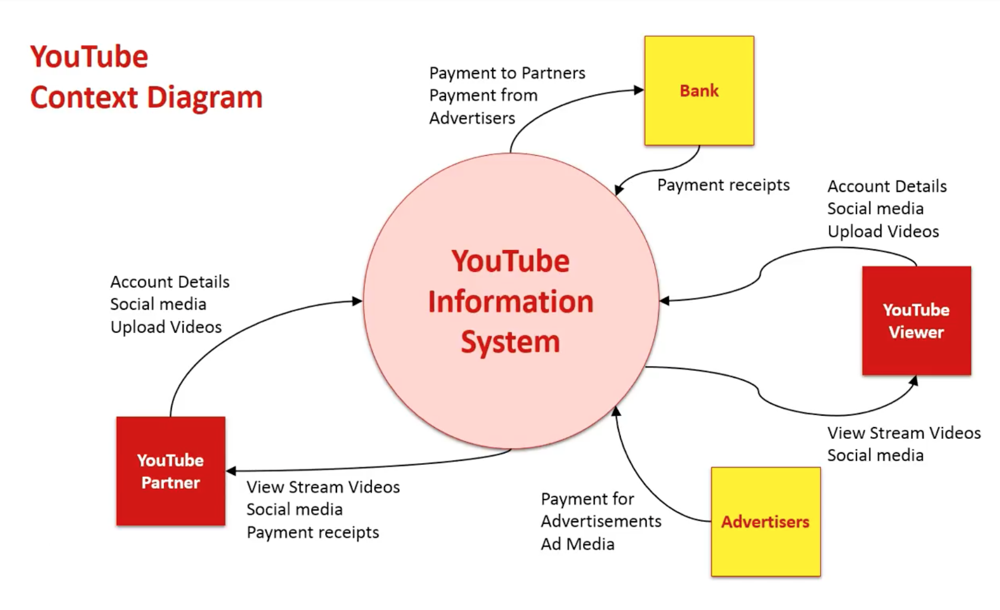
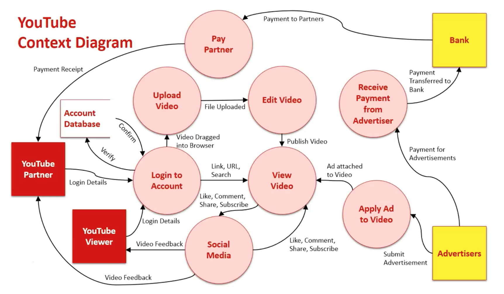
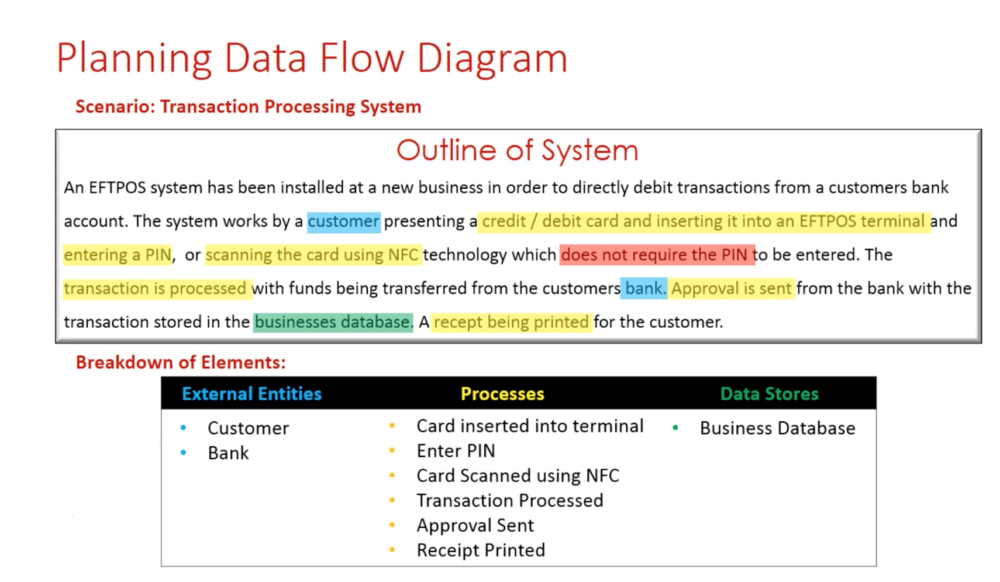
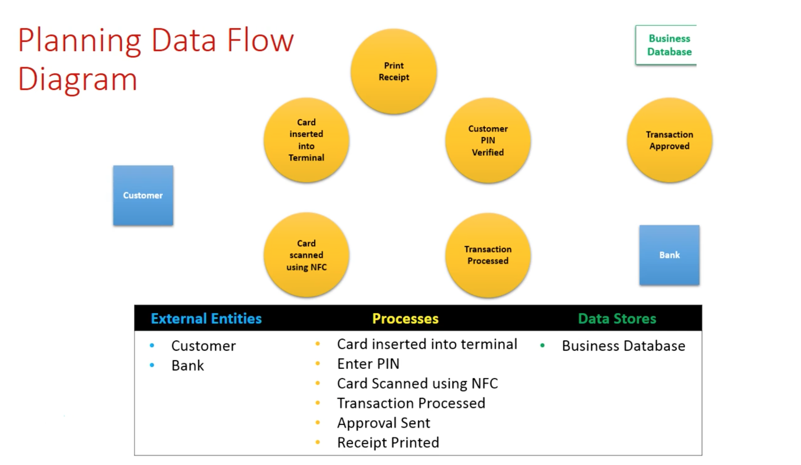

# Serverless Introduction

This list doesn't contain everything about serverless. Mainly this is my personal collection (I went down the rabbit hole). The courses I've done and stuff I've read about serverless. Stuff that I would recommend for everyone to read. It's not just a bunch of links form the web! There will be also many typos and grammar mistakes. Under /apps you can find also some code examples to play around. If you like it and would like to see more similar stuff, hit star ⭐️ and help to spread this collection among other GitHub geeks!

## Some Nice Guys

* Yan Cui - [All my posts on Serverless & AWS Lambda](https://medium.com/theburningmonk-com/all-my-posts-on-serverless-aws-lambda-43c17a147f91) - [Yan's Blog](https://theburningmonk.com/)
* Gojko Adzic - [Blog Articles Archive](https://gojko.net/posts.html)
* Paul Johnston - [My Serverless Blog Posts](https://medium.com/@PaulDJohnston/my-serverless-blog-posts-4f84ee5dced)
* Mike Roberts - [Serverless Architectures](https://martinfowler.com/articles/serverless.html)
* Alexander Simovic [Github Profile](https://github.com/simalexan)
* Martin Fowler - [Seems to be an important guy - Microservices](https://martinfowler.com/)
* Slobodan Stojanović [Founder of ClaudiaJS & motherfuckin' "scotty beam me up"](https://twitter.com/slobodan_)
* Danilo Poccia [Author of http://awslambdainaction.com  from Manning.] (https://twitter.com/danilop)

## Online Courses
* [Production-Ready Serverless](https://www.manning.com/livevideo/production-ready-serverless)
* [Using the Serverless Framework with Node.js on AWS](https://app.pluralsight.com/library/courses/aws-nodejs-serverless-framework-using/table-of-contents)
* [Serverless for Beginners](https://acloud.guru/learn/serverless-for-beginners)
* [AWS Serverless APIs & Apps - A Complete Introduction - No CLI](https://www.udemy.com/aws-serverless-a-complete-introduction/learn/v4/overview)
* [Automating AWS with CloudFormation](https://app.pluralsight.com/library/courses/aws-automating-cloudformation/table-of-contents)

## Presentations & Podcasts
* [GOTO 2017 • Designing for the Serverless Age • Gojko Adzic](https://www.youtube.com/watch?v=w7X4gAQTk2E)
* [GOTO 2017 • Serverless: the Future of Software Architecture • Peter Sbarski](https://www.youtube.com/watch?v=LAWjdZYrUgI&t=32s)
* [Serverless Startup with Yan Cui](https://softwareengineeringdaily.com/2017/08/04/serverless-startup-with-yan-cui/)
* [Cloud Insiders - Serverless](https://podtail.com/podcast/cloud-insiders/serverless/)
* [Serverless Design Patterns (London Dev Community)](https://www.slideshare.net/theburningmonk/serverless-design-patterns)
* [SE-Radio Episode 320: Nate Taggart on Serverless Paradigm](http://www.se-radio.net/2018/03/se-radio-episode-320-nate-taggart-on-serverless-paradigm/)

## Serverless Tutorials

* [Open Source Serverless Tutorial - Severless-Stack.com](https://serverless-stack.com/)
* [aws-serverless-workshops](https://github.com/awslabs/aws-serverless-workshops)
* [Serverless Architectures with AWS Lambda Overview and Best Practices](https://d1.awsstatic.com/whitepapers/serverless-architectures-with-aws-lambda.pdf)
* [500 Pages AWS Lambda Developer Guide](https://docs.aws.amazon.com/lambda/latest/dg/lambda-dg.pdf)
* [Best Practices for Working with AWS Lambda Functions](https://docs.aws.amazon.com/lambda/latest/dg/best-practices.html)
* [AWS Startup Kit Serverless Workload](https://github.com/aws-samples/startup-kit-serverless-workload)
* [Zombie Apocalypse Workshop](https://github.com/aws-samples/aws-lambda-zombie-workshop)
* [aws-serverless-samfarm](https://github.com/awslabs/aws-serverless-samfarm)
* [AWS Well-Architected Framework - General Information about Architecture](http://d0.awsstatic.com/whitepapers/architecture/AWS_Well-Architected_Framework.pdf)

## Serverless Examples
* [AWS Serverless Application Repository](https://aws.amazon.com/ru/blogs/compute/innovation-flywheels-and-the-aws-serverless-application-repository/)

## Tooling
* [AWS SAM Local](https://github.com/awslabs/aws-sam-local)
* [AWS Serverless Application Model (AWS SAM)](https://github.com/awslabs/serverless-application-model)
* [Serverless Framework](https://github.com/serverless/serverless)
* [Serverless Framework Plugins](https://github.com/serverless/serverless#v1-plugins)
* [Seed.run - Deploy, Manage, and Monitor Serverless Applications on AWS](https://seed.run/)
* [Lambda Monitoring](https://www.iopipe.com/)
* [ClaudiaJS - Deploy Node.js microservices to AWS easily](https://github.com/claudiajs)

## Books
* [Lambda in Action](https://www.manning.com/books/aws-lambda-in-action)
* [Serverless Architectures on AWS](https://www.manning.com/books/serverless-architectures-on-aws)
* [Serverless Apps with Node and Claudia.js](https://www.manning.com/books/serverless-apps-with-node-and-claudiajs)

## Medium & Blog Articles
* [Managing multi-environment serverless architecture using AWS — an investigation](https://medium.com/2pax/managing-multi-environment-serverless-architecture-using-aws-an-investigation-6cd6501d261e)
* [A Cloud Guru Medium Blog](https://read.acloud.guru/)

## Benchmarks
* [The right way to distribute messages effectively in serverless applications](https://medium.com/epsagon/the-right-way-to-distribute-messages-effectively-in-serverless-applications-f427e4229e67)

## Chats & Communication
* [ClaudiaJS Chat Gitter](https://gitter.im/claudiajs/claudia)

## My summaries from online courses, books and blog articles

* [Introduction to Lambda & AWS](https://github.com/mittyo/javascript-pocketguide/blob/master/serverless/001_introduction.md)
* [Introducton to Serverless](https://github.com/mittyo/javascript-pocketguide/blob/master/serverless/production-ready-serverless-course/001_introduction.md)
* [Introduction Step-by-Step into Serverless Framework](https://github.com/mittyo/javascript-pocketguide/blob/master/serverless/apps/001_introduction-step-by-step.md)
* [AWS Core Services](https://github.com/mittyo/javascript-pocketguide/blob/master/serverless/002_aws_core.md)
* [AWS API Gateway](https://github.com/mittyo/javascript-pocketguide/blob/master/serverless/004_api-gateway.md)
* [AWS Lambda Introduction](https://github.com/mittyo/javascript-pocketguide/blob/master/serverless/005_lambda.md)
* [AWS DynamoDB Overview](https://github.com/mittyo/javascript-pocketguide/blob/master/serverless/008_dynamoDB.md)
* [Serverless Architecture Best Practices](https://github.com/mittyo/javascript-pocketguide/blob/master/serverless/013_serverless-best-practices.md)
* [YAML Templates](https://github.com/mittyo/javascript-pocketguide/blob/master/serverless/014_yaml-templates.md)
* [Everything you need to know about CloudFormation](https://github.com/mittyo/javascript-pocketguide/blob/master/serverless/015_cloudformation.md)

---
## Topics covered/To cover:

* [x] JavaScript/NodeJS
* [x] Testing
* [x] Compute (Lambda)
* [x] Network communication (API Gateway + GraphQL)
* [x] Severless patterns
* [x] Authentication & Authorization
* [x] Cloudformation
* [x] Messaging Layer (SNS + SQS needs to be covered)
* [ ] Storage Layer
    * [x] Relational Databases
    * [ ] NoSQL Databases (document storage)
    * [ ] Migration from NoSQL to MySQL/Postgres
    * [ ] File storage (S3, AWS KMS)
* [x] Deployments
    * [x] CodeStar
    * [x] CodePipeline
    * [x] CodeDeploy
* [ ] Architecture (how do you start building a system - which topics come first)
    * [ ] Data flow diagram 
    * [ ] Structured analysis and design technique (SADT)
* [ ] Migration from Monolith to Serverless
* [ ] Computer Science 101
    * [ ] Data Structures
    * [ ] Algorithms
    * [ ] Network (Buffers/Streaming/TCP/UDP)
    * [ ] Engineering
* [ ] Design Patterns 
* [ ] Frontend (Vue/React)

---

## Todo 
* [ ] **Deployments & Going Live**
    + [Cloudformation (production deployment / partial deployment)](https://linuxacademy.com/amazon-web-services/training/course/name/aws-cloudformation-deep-dive)
    + [an AWS CodePipeline, AWS CodeBuild, AWS APIGateway & AWS Lambda CI](https://github.com/nicolai86/awesome-codepipeline-ci)
    + CodeDeploy, CodeBuild, CodePipeline
    + CI/CD (github push, automation etc.)
    + Here is an example how to CI/CD on AWS [Check this presentation](https://youtu.be/rPouVcJKWxM?t=2146)
* [ ] **Storage Layer - Databases**
    + [Storage Layer -Databases RDS, NoSQL, Warehousing (when to use aurora, dynamodb or redshift)](https://acloud.guru/learn/aws-dynamodb)
    + [Database Design and Relational Theory](https://www.amazon.com/Database-Design-Relational-Theory-Normal-ebook/dp/B007VRKQBS/ref=mt_kindle?_encoding=UTF8&me=)
    + [Database Design for Mere Mortals](https://www.amazon.com/Database-Design-Mere-Mortals-Hands/dp/0321884493/ref=sr_1_1?ie=UTF8&qid=1524835143&sr=8-1&keywords=database+for+mere+mortals)
    + [Six-Step Relational Database Design](https://www.amazon.com/Six-Step-Relational-Database-DesignTM-development/dp/1481942727)
    + [Domain Driven Design Patterns](https://www.amazon.de/Domain-Driven-Design-Reference-Definitions-Summaries/dp/1457501198/ref=sr_1_1?ie=UTF8&qid=1524835319&sr=8-1&keywords=eric+evans+domain+driven+design)
(https://medium.com/theburningmonk-com/all-my-posts-on-serverless-aws-lambda-43c17a147f91)

* [ ] **Migration from Monolith to Serverless
    + [ ] [How to Migrate Existing Monoliths to Serverless](https://blog.binaris.com/how-to-migrate-existing-monoliths-to-serverless/)
* [ ] **Computer Science Basics**
    + [Systems analysis and design](http://www.w3computing.com/systemsanalysis/)
        + [Data Flow Diagram Overview](https://www.youtube.com/channel/UCm0gX5V8-meiz_1CHtc24cA/search?query=data+flow)
    + [ Base CS - Exploring the basics of computer science, every Monday, for a year.](https://medium.com/basecs/archive/2017)
    + [Introduction to Computer Science and Programming](https://ocw.mit.edu/courses/electrical-engineering-and-computer-science/6-0001-introduction-to-computer-science-and-programming-in-python-fall-2016/index.htm)
    + [Computer Networks and the Internet](https://www.edx.org/course/computer-networks-internet-kironx-fhlcnx)
    + [Algorithms & Data Structure](https://www.coursera.org/learn/algorithms-part1)
* [ ] **Coding & Patterns**
    + Read code of open source projects such as React, Vue.js, Express - code quality of such a projects should be very good (many reviewers and clean code). Also Spectrum was recommended
    + [Design Patterns: Elements of Reusable Object-Oriented Software](https://www.amazon.com/Design-Patterns-Elements-Reusable-Object-Oriented/dp/0201633612)
    + SOLID need to find some good resources
    + [Hexagon](https://claudiajs.com/tutorials/designing-testable-lambdas.html)
    + [Writing portable serverless applications](https://medium.com/datreeio/writing-portable-serverless-applications-252fd8623bce)

* [ ]**Book Collection & Recommendations**
    + [ ] Why do I need to read this book? If I want to understand how to think in terms of underlying technology vs. abstractions (Cloudformation vs. AWS SAM)
    [Code Complete: A Practical Handbook of Software Construction](https://www.amazon.com/Code-Complete-Practical-Handbook-Construction/dp/0735619670)
    + [ ] Why do I need to read this book? I need to learn to think like a real programmer [Clean Code: A Handbook of Agile Software Craftsmanship](https://www.amazon.com/Clean-Code-Handbook-Software-Craftsmanship/dp/0132350882/ref=pd_bxgy_14_img_2?_encoding=UTF8&pd_rd_i=0132350882&pd_rd_r=8GDW312B6CFPXFG1C3NX&pd_rd_w=G2B0p&pd_rd_wg=bh747&psc=1&refRID=8GDW312B6CFPXFG1C3NX&dpID=515iEcDr1GL&preST=_SX218_BO1,204,203,200_QL40_&dpSrc=detail)
    + [ ] Why do I need to read this book? Get some basic understanding about OS [The Unix Programming Environment ](https://www.amazon.com/Unix-Programming-Environment-Prentice-Hall-Software/dp/013937681X)
    + [ ] Why do I need to read this book? see above [The Art of Unix Programming](http://www.catb.org/esr/writings/taoup/html/)

    ========
    Add to architecture examples
    [Context & Data Flow Diagrams Sample 1: YouTube](https://www.youtube.com/watch?v=hiMeEswjWuk&t=45s)

## Context Diagram Example

* Context diagram can be used as a planning tool to build much complex Data Flow Diagrams
* Processes are simply manipulation of data
* Data Flow Diagram can be either High Level (Context Diagram) or Low Level (Level I and Level II)
    
1. In a Context Diagram we always start with 1 circle in the midddle that represents the entire system (information system)
2. External entity: 
    + Youtube Partner: someone who puts content and earn from the content
    + Youtube Viewer: someone who is just watching the videos
    + Advertisers: the companies/people that pay youtube to put their ads on video
    + Bank: the payments and receipts are needed to go through the bank

## Data Flow Diagram

1. External entities:
    + Youtube Partners
    + Youtube Viewers
2. Account database: The external entities needs to log in and will be authenticated
3. The first step is to give access to view video via links, urls or search
    + if they want to upload a video they can go to upload a video, if they click a button the video is uploaded
    + when the video is uploaded we can edit the video
    + once the video has been edited it's ready to be viewed once its published
4. Once the video is online the social media aspect comes into play for both ways the users can comment, like, but they also receiving the feedback from their own videos when they have been uploaded. This feedback returns to these two users.
5. Now we have advertisers they have to pay youtube for advertising and that goes straight to the bank account of youtube. Once the payments made they have to apply the ads to the video, they need to submit advertisements to youtube, and those ads are attached to existing youtube partners movies. 
6. Because the ads are attached to youtube partners movies the bank has to pay those partners. And the payment receipt send to those partners based on the ads and the performance. 

# Planning Data Flow Diagram

[Planning a Data Flow Diagram](https://www.youtube.com/watch?v=VeLkVD0Q_6M)

---

---

¡[Step 3](./images/planning-dataflow-step3.png)

