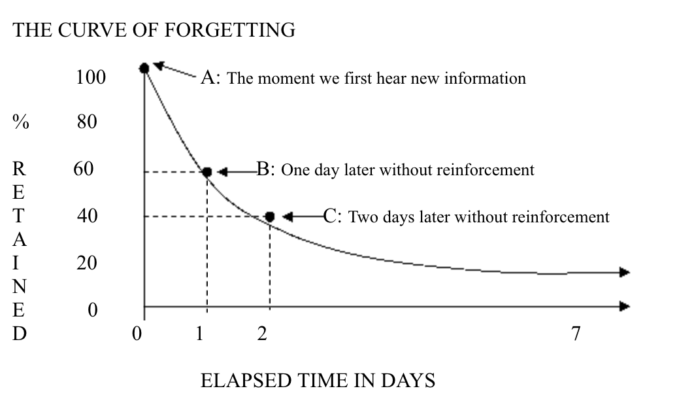

# Enchiridion of Learning

* The idea to learn everything (e.g. all features of JavaScript) asap is the wrong approach. You should concentrate yourself on the pareto rule. In JavaScript 80% of the code is written using only 20% of the JavaScript features. Concentrate yourself on the 20% of JS that is used 80% of the time. Master it! The rest that you need just learn it to know it enough.

* How to find the 20% that you need to learn? Code if free, it's eassy to discover by reading and studying open source code. If you read code of a season develper is the best shortcuts you can take.

* The best way to learn the 20% is the technique called [spaced repetion](https://knowthen.com/spaced-repetition/), build small apps over and over again to repeat the concepts.
1) The brain considers a memory important, when it uses that memory more than once. And the more you use it, the more important the brain considers that memory
2) Each of us suffer from what's called the Forgetting Curve. When we're exposed to new information, our brains will gorget the new information over predictable periods of time.
3) The most efficient way of tricking the brain into remembering something for longer periods of time is to review the new infromation just before it falls out fo memory. That's why it makes not sense just to read as much as possible, but you need to repeat it to get to know it. By reviewing it just before it's forgotten, you're strengthening the memory, but the memory isn't permanent. The strengthened memory still has a forgetting curve, but this time it'll take longer to forget.

> Imagine I just showed you how to tie a knot called a clove hitch.  Then, after I showed you, I handed you the rope and asked you to tie a clove hitch knot.  There’s a good chance, you might not remember enough to tie the knot, even though you just saw it.  So imagine you forgot, then I showed you again, then I asked you to tie the clove hitch again, and this time you were able to tie the knot.  Around 24 hours from now, you’re going to forget how to tie the knot, that’s just how most minds work… so around 23 hours later I hand you a rope and ask you to tie the knot again.  Odd’s are, it would be a struggle for you to remember how to tie the knot, but you’ve got a good chance of remembering because it hasn’t been very long since you last tied the knot.  So let’s say you remembered, and were able to tie the knot.  By remembering it again, you’ve told your brain that this information is important, and you’ve reset the forgetting curve, except this time you won’t forget how to tie the knot in 24 hours, this time you’ll forget in 48 to 72 hours.  So at the 47 hour point, I hand you a rope and ask you to tie the knot again.  Odd’s are, it’s going to be a struggle, but you’ve got a pretty good chance of remembering.

* Every time you force yourself to remember how to tie the clove hitch knot, you’re strengthening your memory, and the amount of time it takes to forget is extended.  Eventually you’ll get to the point where you can just tie a clove hitch knot once every few years, and the memory is essentially fixed in your mind.

* So how can i test my memories, just before I forget them? Use Anki, which is basically a flashcard app that automatically asks you questions just before they would normally fall out of memory. Every morning spent 10 minutes, review the flashcards.

* When creating flashcards use following rules:
1) Associate new information with already known things
2) Write the flashcards in your own words

* Here’s what the graph demonstrates: Assume that we hear ten new terms in class on Monday.  Our immediate recall, Point A of the graph, is 100%--we can repeat the terms and definitions at the point where we first encounter them.

* However, if we do not repeatedly return our attention to these terms and definitions, we will forget about 40% over the first 24 hours (Point B).  If we wait another 24 hours before reviewing the information, we have lost 60% (Point C).   So we can go from a grade of ‘A’ (100%) to ‘D’ (60%), to ‘F’ (40%) in just 48 hours.

# Sources
* [Spaced Repetition](https://knowthen.com/spaced-repetition/)
* [THE CURVE OF FORGETTING](http://ol.scc.spokane.edu/jroth/Courses/English%2094-study%20skills/MASTER%20DOCS%20and%20TESTS/Curve%20of%20Forgetting.htm)
