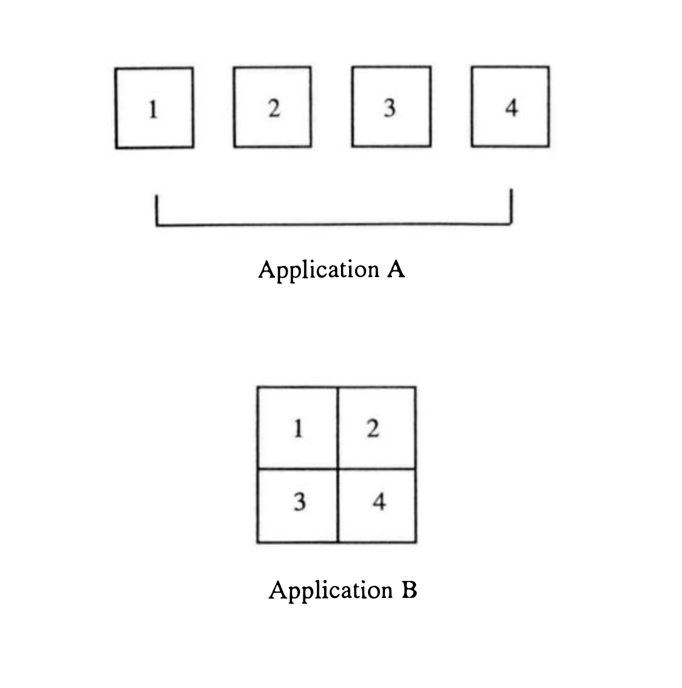
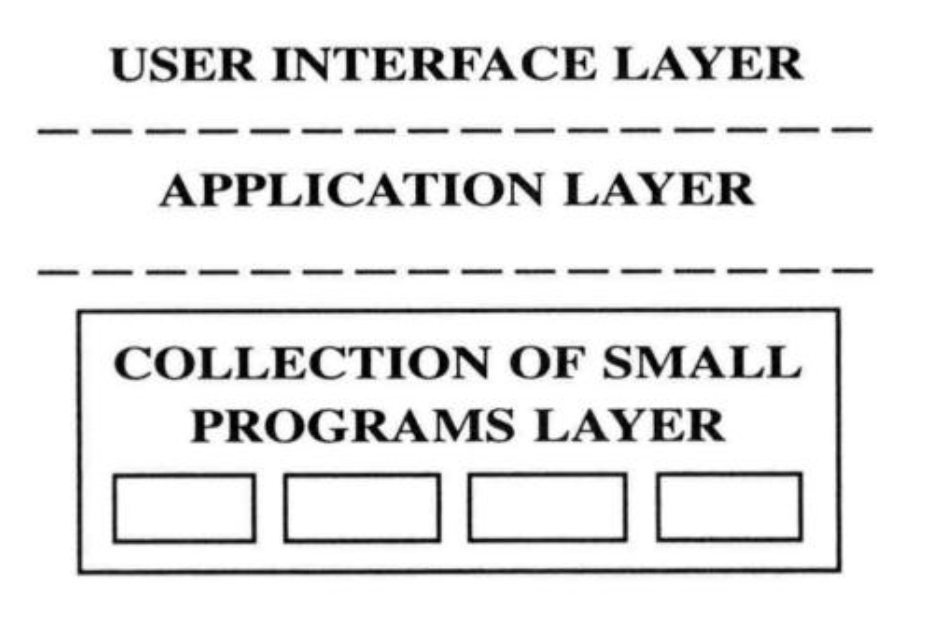

# Enchiridion of Unix

## Steps

1. Short Product Requirement Document
2. User Journey Wireframes (Step-by-Step Video Tutorial)
2. Rapid Prototype (Coding)
3. Prototype Demo 
4. Level 2, 3 - Architecture
5. Product Development

* UNIX became The Enemy, not so much because it was intrinsically evil, but because it threatened the status quo.

* By borrowing ideas from Multics, Thompson embarked upon a course of action that has become a well-worn path (no pun intended) for UNIX developers: good programmers write great software; great programmers "steal" great software.

* The following list will give you an idea of what the UNIX philosophy tenets are:
  1. Small is beatiful: small things have tremendeous advantage over their larger counterparts. Among these is the ability to combine with other small things in unique and useful ways.
  2. Make each program do one thing well: By focusing on a single task, a program can eliminate much extraneous code that often results in excess overhead, unecessary complexity, and lack of flexibility.
  3. Build a prototype as soon as possible: Most people would agree that prototyping is valuable element of any project. But whereas prototyping is only a small part of the design phase under other methodologies, under UNIX it's the principal vehicle for generating an effective design.
  4. Choose protability over efficiency: When UNIX broke new ground as the first protable operating system of any singfinifance, it was big news. Today portability is taken fro granted as a cencessity in any modern software design, an example of tenet that has gained wide acceptance on other system besides UNIX. 
  5. Store numerical data in flat ASCII files: The choice between portability and efficeiency addresses the value of portable code. Portable data is at least as important as - if not more important than - portalbe code. Portable data is the often-neglected part of the portability formula.
  6. Use software leverate to your advantage: Many programmers have only a superficial understanding of the importantce of reusable code modules. Code re-use helps one take advantage of software leverage, a powerful concept that some UNIX developers use to create numerous applications in comparatively short time.
  7. Use shell scripts to increase leverage and portability: Shell scripts are a double-edged sword for enhancing both software leverage and portability in a design. Whenever possible, writing a script instead of a complete C program is the way to go
  8. Avoid captive user interfaces: Some commands have user interfaces known to UNIX developers as "captive" user interfaces. These prevent the user from running other commands while the command is in use, effectively making the user a captive to the system for the duration of the command. Hence the name captive user interface.
  9. Make very program a filter: The fundamental nature of all software programs is that they only modify data, not create it. Therefore, they should be written to perform as filters since they are filters.

* The following list contains ten lesser tenets, ideas which tend to be part of the UNIX world's belief system:
  1. Allow the user to tailor the environment: UNIX users like the ability to control their environemnt-all of it. Many UNIX applications decidely refrain from making decisions about styles of interaction and instead leave the choices to the user.
  2. Use lower case and keep it short: Using lower case characters is a tradition in the UNIX environment that has persisted long after the reason for doing so disappeared. 
  3. Save trees. UNIX users generally frown on using paper listings. There are good reasons for keeping all text on-line and using powerful tools to manipulate it. 
  4. Silcence is goldes: UNIX commands are notoriously silent when it comes to producing detailed error messages.
  5. This parallel: Most tasks can be broken down into a series of smaller subtasks. These subtasks can then be run in parallel to accomplish more in the same amount of time as one large task. 
  6. The sum of the parts is greated than the whole: This tenet stems from the idea that a large application built from collection of smaller programs is more flexible and hence more useful that a single large program. 
  7. Look for the 90 percent solution: Doing 100 percent of anything is difficult. Doing only 90 percent is far more efficient and cost effective. UNIX developers often look for solutions that satisfy 90 percent of the target user base, leaving the 10 percent to fend for itself.
  8. Worse is better: UNIX aficianados believe that a "least common denominator" system is the one most likey to survive. That which is cheap but effective is far more likely to proliferate thatn that which is high quality and expensive.
  9. This hierarchcally: UNIX uses and developers prefer to organize things hierarchically. For example, the UNIX directory structure was among the first tree-structured architectures applices to file systems.
  
## Small is beatiful

* If you're going to write a program, start small and keep it small. Whether you're crafting a simple filter tool, a graphics package, or a gargantuan database, work to reduce it to the tiniest piece of software practicable. Resist the temptation to turn it into a monolith. Strive for simplicity.

* A large portion of the code in any program is devoted to something other than ectually performing its stated task. Here is an example:

* There are some steps that a typical file copy program might perform:

1. Query the user for the name of the source file
2. Check wheterhe the source file exists
3. If the source file doesn’t exit, notify the user
4. Query the user for the name of the destination file
5. Check whether the destination file exists
6. If the destination file exists, ask the user if he wants to replace it
7. Open the source file
8. Inform the user if the source file is empty. If so, exit
9. Open the destination file
10. Copy the data from the source file to destination file
11. Clone the source file
12. Close the destination file

**Note:** Step then does the file copy. Other steps perform functions that, although necessary, have little to do with copying the file. A good UNIX program should provide capabilities similar to step ten and little else. A program strictly following the UNIX philosophy would expect to be given valid source and destination file names at invocation. Where the valid source and destination fle names come from? From another small programs. These other programs perform the functions of obtaining a file name, checking wheter the file exists, and determining whether it conains more than zero bytes of data. 

* UNIX distribution comes with hundreds of small commands and utility programs that by themselves do little. They often perform one or two functions and little else. Combine them, however and you begin to experience real power. The whole becomes greater than the sum of parts.

* Small programs are easy to understand. Their “all business” approach keeps fluff to a minimum, focusing instead of performing one function well. They contain only a few algorithms, most of which directly relate to the job involved. 

* Large programs on the other hand lean toward complecity and present barriers to understanding.

* The wiser companies take stepts to pervent write large programs that are impossilbe to comprehend. They hire individuals who understand that easily maintained software is more valuable. From other books, software engineers are spending almost 80% of their time in maintaining the software.

* Good designers must go out of their way to make their software easy to maintain. They comment their code thoroughly-but not to thoroughly. They keep subroutines short. They pare the code down to what is absolutely necessary. The result usually is small programs that are easier to maintain.

* Since a small program is usually easy to understand, it is likely to be easy to maintain as well. 

* Companies that fail to maintain their software do not remain in business for long.

* Another area in which small programs have an edge in resource consumption has to do with the amount of disk space occupied by the programs themselves. Small programs, since they are performing a limited task, tend to require smaller executable images. The average small program takes up far less disk space than the typical large monolithic program. (good for Lambda)

> No matter how fast they can make the hardware run, software engineers will always find a way to slow it down for the user.

* The writeer of a large complex program operates under the egotistical assumption that the future is not only predictable, it’s not going to differ much from today. Authoers of small programs, on the other hand, implicitly avoid foretelling the future. They only assumtpion they make about tomorrow is that it will be different from today.

## Make Each Program Do One Thing Well

* The best program, like Cousteau’s lake fly, does but one task in its life and does it well. The program is loaded into memory, accomplishes its function, and then gets out of the way to allow the next single-minded program to begin.

* In all fairness, `ls` retains the ability to list the contents of a directory one file per line. Thas is about all it should do, and leave the column work to other commands better suited to formatting tasks. `ls` would then be a much smaller command, i.e., easier to understand, easier to maintain. 

* Since writing an application that does one thing well results in a smaller program. Small programs tend to be unifunctional (Having, or employing a single function). Unifunctional programs tend to be small.

* If you cannot make the program do one thing well, then you probabyl don#t comprehend the problem you’re trying to solve.

## Rapid Prototyping

* Software engineers are parcicularly burdened with a steep learning curve. Software is elusively difficult to write correctly the first time. The software engineering profession consists of constant revision, a job where trial and error are the normal and applications are born out of counless hours of frustraing rework.

* Reality dictates that we will not get it right the first time. It’s better to face this axiom first. Changing a product early in the product cycle costs far less than undertaking major revisions later.

> Software is never finished. It is only released. 

* Most of us are still learning. Even if we’re egotistical enough to think that we know it all, someone will change the requirements on us. How then are we to build software? Build a prototype as soon as possible. When we say “as soons as possible”, we mean AS SOON AS POSSIBLE. Post haste. Spend small amount of time planning the application, and then GET TO IT. 

* You need a consensus of perception before the project can proceed. The prototype moves toward that consensus by providing a concrete representation of the goal.

* Prototyping is a learning process. The sooner it begins, the closer you will be to the released product. The prototype shows you what works and most importantly what doesn’t. 

* Early prototyping reduces riks. You have something concrete that you can point to and say “It’s going to look like this”. 

> for every correct design, there are hundreds of incorrect ones. By knocking out a few of the bad ones early, you begin a process of elimination that invariably brings you closer to a quality finished product. You discover algorithms that do not compute, thimings that keep missing a beat, and user interfaces that cannot interface.

* The goal of all prototyping should be to build something we call the “Third System”. Man has the capability to build only three systems. Each system possesses characteristics that correlate to corresponding periods in life. All systems follow a path beginning at youth, transiting into maturity, and ending in old age.
	1. Man builds the First System with his back agains the wall: Usually he is under pressure to meet a deadline or satisfy other time-critical demands. He has no time to do it “right”. The lack of time to do it right forces hi to focus on the important aspects of the task and to ignore the nonessentials. Man builds the First System alone or, at most, with a small group of people. The First System is a “lean, mean, computing machine”. It achieves high performance at minimal costs. The software gets the job done - and little else.
	2. The Second System is strange beast. Depending on the size of its market, it may capture the hearts and minds of thousands or even millions of users. Yet irocinally, in many ways the Second System is the worst of the three. To reap rewards everyone wants to be associated with a winner. This group of self-proclaimed experts often contains many critics of the First System. The Second System is designed by a committee. The design-by-committee approach involves drawbacks. It is nearly impossible for a group to agree on all salient points. The Second System is fat and slow.
	3. The Third System is built by people who have been “burned” by the Second System. The Third System is born out of rebellion agains the Second System. Often involves a major name change. The Third System combines the best characteristics of the First and Second Systems. In the Third System the perfect balance is struck. Only the features truly needed remain.

* There are some shortcuts, though. The secret is to progress from the First to the Third System as quickyl as possible. The more time spent on building the first two systems, the longer it will take to achieve the Third System’s optimum balance. If you keep the cycles involved in building the First and Second System short and iterative, you will arrive at the Third System faster.

* UNIX developers take an alternate view towards detailed functional and design specifications:
	1. Write a short functional specification
	2. Write the software
	3. Use an iterative test/rewrite process until you get it right
	4. Write detailed documentation, if necessary

* A “short” functional specification here usually means three to four pages or less. The rationale behind this is that: a) no one really knows that is wanted at first, and b) it’s hard to write about something that doesn’t exist. 

> How does the UNIX programmer know if he’s proceeding in the right direction? He doesn’t. Neither does the traditionalst. Eventually the design must be shown to the prospective end user. The difference is, the traditionalist presnts to the user a massive tome containing a boring description of what the system is going to be like. The UNIX programmer shows the user a functional application. 

* The UNIX appraoch provides the user with a functional First System that he can see and touch. He begins to get a feel for how the final produt will operate. If he likes what he sees, fine. If not, it’s far easier to make major changes now instead of later.

* Remember, though, that a characteristic of the First System is that it displays a concept that ignites other’s imaginations. Viewing a “live” impleentation of the First System sets off a creative spark in the user’s mind. He starts to imagine what he might do with the product.

* While the traditionalist’s user wonders how the product will look, the UNIX developer’s user is already thinking of what to do with the working prototype. For the UNIX user, the iterative design process has begun. He and the developers are proceeding towards the Third System.

* Seibel: Another phase of programming is optimization. Some people optimize things from the very beginning. Others like to write it one way and then worry about optimizing it later. What’s your approach? Thompson: I’ll do it as simply as possible the first time and very often that suffices for all time. To build a very complex algorithm for something that’s never run is just stupid. It’s just a waste of time. It’s a bug generator. And it makes it impossible to maintain because you’ve got to have 50 pages of math to tell the next guy what you’re actually doing. From Coders at Work, Ken Thompson

* Seibel: Some people just like bumming code down to a jewel-like perfection, for it’s own sake. Thompson: Well, I do too, but part of that is sacrificing the algorithm for the code. I mean, typically a complex algorithm requires complex code. And I’d much rather have a simple algorithm and simple code than some big horror. And if there’s one thing that characterizes my code, it’s that it’s simple, choppy, and little. Nothing fancy. Anybody can read it. From Coders At Work, Ken Thompson

> Unlike most systems planned in the traditional way, UNIX evolved from prototype. It grew out of a series of design iterations that have transformed it from a limited-use laboratory system into one called upon a tackle the most ardent tasks.

## Portability - Choose Portability over Efficiency

> The notebook PC will soon tank as the most powerful computer ever built. It has only one real advantage: portability

* **Sofware development involves choices, each of which represents a compromise.** Sometimes the devleoper must write a short, simple subroutine because he doesn’t ahve time to include a more sophisticated one. At other times a limited amount of RAM might be a constraint. The programmer always chooses from a set of compromises in attempting to satisfy ofthen conflicting goals.

* Although efficient software is attractive from a purist’s standpoint, the value of running the software on many different machine architectures tips the balance in the other direction. The reason is more financial than technical: in today’s computing environemtn, software that runs on only one architecture sharply limits it potential marketability.

> Next year hardware will run faster. Next year hardware will be cheaper.

* Your software must be portable to take advantage of the new higher-performance machine. in the UNIX environment, this usually translates into writing much software as shell scripts. A shell script consists of multiple executable commands placed in a single file executed indirectly by the UNIX command interpreter. Because of the wide array of small single-purpose commands found in a typical UNIX distribution, all but the lowest level tasks can be constructed easily from shell scripts. A side benefit of shell scripts is that they are far more portalbe than programs written in the C language.

* Don’t spend too much time making a program run faster. If it barely runs fast enough, then accept the fact that it already meets your needs. All the time spent tunign surouitnes and elimintating critical bottlenecks should be done with an eye toward leveraging performance gains on future hardware platforms as well. **Resist the tendency to make the software faster for its own sake.**

* A common mistake that many UNIX programmers make is to rewrite a shell script in C to gain a marginal edge in performance. This is a waste of time better spent obtaining constructive responses from users.

* The most efficient way is rarely portable. Any time a program takes advantage of special hardware capabilities, it becomes at once more efficient and less protable.

* Software tightly coupled to a hardware platform holds its value only as long as that platform remains competitive. Once the platform’s adavantage fades, the software’s worh drops off dramatically. For it to retain its value, it must be ported from one platform to another as newer, faster models become available. 

* Inability too port their software to the latest platforms has killed more software companies than all other reasons combined. One measure of an application’s success is the numbe rof system it runs on. in essence, portable software is more valuable than efficient software. Software conceived with portability in mind reduces the transfer cost associated with moving to a new platform.

* Good programs never die - they are ported to new hardware platforms. Take EMACS-style text editor, for example.

* The intelligent entity, recognizing an idea’s merit, should strive to iplement it on as many platforms as practical to gain the largest possible market share. The most effective way to achieve this end is to write portable software.

* Code moved easily to a new platform is far more valuable than code that takes advantage of special hardware features. We have seen that this axiom can be measured in real terms, i.e., in dollars and cents. To preserve its profit base, a software company should strive for portability in its products, possibly foregoing efficiency in the process. 

* All software consists of instruction and data. By making the instructions portable, you ensure that your code will be ready to run on next year’s machine. 

* The UNIX programmer chooses to make not only the code portable but the data as well. How does one make one’s data portable? Store numberical data in flat ASCII files (A file that contains data made up of ASCII characters. It is essentially raw text just like the words you are reading now. Each byte in the file contains one character that conforms to the standard ASCII code). 

* “Flat ASCII files” means that you tore all numerical data as ASCII set. ASCII text is a common interchange format. By using ASCII, you eliminate the difficulties of converting your data from one binary format to another. Binary format files are verboten.

* Data files should consist of only a stream of bytes separated by line feed characters or “newlines”. 

* While data is kept on whatever kind of storage media, eventually it must go somewhere. Data sitting on a disk diminishes in value. For data to remain alive and valuable, it must move occasionally. Otherwise it should be archived and deleted. **Data that goes nowhere is dead data**

* If you expect to move your data easily, oyu must make it portable. The problem is, if your data is not in a format that is useful to its destination, it must be converted. That conversion process takes time. Every second spent in data conversion eats away at your data’s worth. 

* ASCII text is easily read and edited. This makes it possible for you to examine the data wihout conversion tools. If the data doesn’t look right, you can use a standard text editor to modify it. 

* The real power of ASCII text files becomes apparent when developing programs that use piples under UNIX. The piple is a mechanism for passing one program’s output to another’s input without using a temporary file. Many UNIX programs are little more than a collection of smaller programs joined by a series of pipes.

* As developers prototype a program, the can easily check the data for accuracy at each point along the pipeline. If there is a problem, they can interrrup the flow through the pipeline and figure out whether the data or its manipulator is the problem. This greatly speeds up the develpment process.

* UNIX may well be the friendliest system of all. Users can always look at their data without having to be system gurus skilled at interpreting complex binary file format. 

> Eventually, every application program is ported to a new system or else it becomes extinct. The unrelenting progress of computer manufacturers assures us that what may have been prohibitively expensive today will be dirt cheap tomorrow.

* The payoff in using ASCII text comes when you must port your application to a new architecture. If you had enough foresight to make your program portable, then with ASCII text it becomes a trivial matter to move your data to a new platform as well. 

* The lack of speed is overcome by next year’s machine.

* The computer business is a risky business. You must remain flexible to stay on top. To a software engineer, flexibility translates into protability. If your software does not port to the newest machine, it will die.

* By making your programs and data easy to port, you bild long-lasting, tangible value into your software. It’s that simple. Code and data that opt for efficiency lock themselves into the architecture for which they were designed. Instead of watching the worth of your software invesement shrink to zero with each industry announcement, plan ahead. Design with portability in mind.

## Use Software Leverage to Your Adavantage

* Good programmers write good code; great programmers “borrow” good code. The best way to write lots of software we mean incorporating other people’s modules, programs, and configuration files into your application. 

* Leveraging other people’s code can result in powerful advantages for the individual programmer, too. 

* If you have to write every line of code used in an application, you will appear slow and inefficient. The real job security belongs to the software developer who can cut and paste modules together quickly and efficiently. 

> I recall a lee-than-top-noth software engineer who couldn’t program his way out of a paper bag, as the saying goes. He had a knack, however, for knitting lots of little modules together. He hardly ever wrote any them himself, though. Oddly enough, it wasn’t long before management recognized him as an outstanding software engineer, someone who could delier projects on time and within budget. 

* Avaoid the not-invented-here syndrome. Symptoms of NIH appear in the finest of organizations. When a group refuses to recognize the value of another group’s application,… when one wold prefer to write an application from scratch instead of using one “off the shelf”, … when software written elsewhere isn’t used simply because it was written elsewhere, … NIH is at work

* If you start from scratch and redesign an existing application, you’re engaging in imitation, not creativity. By avoiding NIH, however, you open doors to new and exciting worlds of engineering design. Since less time is spent rewrting existing routines, you can devote more time to developing new capabilities. 

* The most successful companies will be those that “borrow” the software, leaving them the opportunity to create enhancements or “added value” in industry jargon.

> The only way to win will be to add glitter to the wheel, not reinvent it.

* Allow other people to use your code to leverage their own work. First, software is no magic formula. Anyone with a reasonably logical mind can write the stuff. You can be clever or trite, but all software boild down to a series of calculated statement that cause the hardware to perform certain well-defined operations. 

* The most successful software then becomes the one that appears on the most computers. 

* One powerful way to use software leverage to your advantage is to make your machines work harder. Any process you do manually today that your computer can do is a waste of your time. Every time you automate a task you experience the same kind of leverage that my aunt enjoed when she found others to sell Tupperware for her.

## Use Shell Scripts to Increase Leverage and Portability

* If you want to take full advantage of software leverage you need to learn how to use shell scripts effectively. 

```
echo `who | awk `{print $1}`| sort | uniq`| sed `s//, /g`
``` 

* This shell script consists of a single line, it invokes six different executeables: echo, who, awk, sort, uniq, and sed. These commands are run simultaneously in a kind of series-parallel progression. Except for the who command, which starts the sequence, each command receives its data from the previous command in the series and sends its output ot the next command in the series. Several UNIX pipes, denoted by | characters, manage the data transfer. The final command in the sequence, sed, sends its output to the user’s terminal.

* Shell scripts have an intrinsic advantage in that they are interpreted rather than compiled. In C “THINK-EDIT-COMPILE-TEST” in Sheel “THINK-EDIT-TEST”. 

* In the UNIX environemnt, shell scripts generally represent the highest level of portability. Most scripts that work on one UNIX system are likely to work on another with little or no modification. 

* Like any form of compounding, software leverage produces extensive effect for small amount of effort. Shell scripts remain an optimum choice for enhancing software leverage.

* Albert Einstein once said “I have only seen two miracles in my life, nuclear fusion and compound interest” For all of his wonderful theories, these two ideas impressed him most. Evidently he understood that a small amount of something, multiplied repeatedly, can grow to miraculous proportions. 

## Avoid Captive User Interfaces

* Small things don’t interface well with people. While they do not interface well with people, they tend to interface well with each other. Their small size gives them tremendous flexibility. They are readily suited for integration in many situations. Unfortunaltely, as the modules gets smaller, the issues surfaces of interfacing with the user. The more modules there are, the greater the complexity in dealing with them.

* This presents a dilemma for the software designer. He wants maximum flexibility for his application, so he constructs it from a collection of small modules. Yet he is also bound by the requirement that his software be easy to use. People have difficulty dealing with too many small modules. UNIX takes a different approach to solving this conflict. Instead of linking the user and the underlying modules via a mass of spaghetti code, they nibble at the gap in small chunks of layers. 

* A captive user interface (CUI) is a style of interaction with an application that exists outside the scope of the highest-level command interpreter present on the system. Once you invoke an application from the command interpreter, it’s not posssible to communicate with the command interpreter until the application exits. You are, in effect, held captive within the user interface of the application until you take actions that cause it to realse you. 

* Example: Suppose you had two programs, one which lists the contents of your mailbox an other which searches for text strings in files. If the main and search programs used CUI’s , your interaction might look something like this:

```
$ mail
MAIL > dir
MAIL > exit
$ search 
SEARCH > find jack *.txt
SEARCH > exit
``` 

* Example: UNIX-style “noncaptive” interface:

```
sh>scan
sh> grep jack *.txt
```
**Note:** UNIX user invokes all commands at the shell promt or main command interpreter level. Each command completes its taks, and control return to the shell prompt. It is not necessary to exit from each command individually by typing “exit”

* Multiple command interaction is a key to UNIX. 

* CUIs assume taht the user is human. Producres of CUIs base their design on the premise that a person is sitting at the keyboard. They expect the person to enter responses to promts provided by the application. The application then performs calculations or carries out various tasks. The problem, however is that even the fastest human being is slower than the average computer. Because of the limitations we humans impose on computers, any system that must wait for user input can operate only as fast as the person sitting at the keyboard. 

* Typical UNIX commands strive to perform their tasks entirely wihtout human intervention. Most only promt th euser when they are about to take some potentially irreversible action such as repairing a file system or deleting files. As a result, UNIX commands always run at maximum speed. The wakest link, performancewise, in many man-machine interactions is not the machine. 

* CUI ommand persers are often big and ugly to write. A parser readas the user’s input and translates it into a form that the application software can understand. It has to react correctly to everything a user might conceivalby (and inconceivably!) type. This causes the typical command parser to grwo to gargantuan proportions. Sometimes the command parser will require more programming than the application’s main task. 

* Example: Suppose you had a program for formatting a hard disk.

```
$ Formatting will destroy all files on the disk! Begin format? <y | N>
``` 

* The numbe rof potential user response sto a promt like this one is taggering. First, if the user wants to go ahead with the format, he may enter Y, y, Yes, YES or various combinations in between. The same applies for N, n, NO, No. The complexity begins when the user isn’t quite sure what he wants to do. An unsophisticated user might enter `help` or `?`.

* The UNIX programmer deals with the user interace by avoiding it, i.e., the typical UNIX application doesn’t have a command parser. Instead, it expects its operating parameters to be entered on the command line when nvoking the command. This eliminates most of the posibilities described above. This results in significantly smaller applicaiton programs.

* One strenght of UNIX is how its programs interact with each other so effectively. Programs with CUIs, because of their assumption that the user is human, do not interface well with other programs. Software designed for communicationg with other software usually is moch more flexible than software designed to communicate with people. 

* Large programs, like large pieces of furniture, are not very portable. Movers don’t say “hand me that piano” any more than programmers move complex, monolithic applications from one platform to another overnight.

* The more features built into the CUI program, the larger it becomes. The larger it becomes, the greater the difficulty in interfacing it with other programs. 

* Applications are much better if they are made of a collection of small components that communicate well with each other. It doesn’t matter much if they do not interact with human beings well. 

* Programs that interact with each othe rare actually data filters. EAch gathers serveral bytes on its input stream, applies a filtering algorithm to the data, and usually produces serveral bytes on its output stream.

* **The fact that programs filter data is significant. All computers and their programs filter data.** That’s why we call them “data processors”. To process data is to filter it.

## Every program written since the dawn of computing is a filter

* Every program - no matter how simple or complext - accepts data in some form as its input and produces data in some form as its output.

* Take real-time data collection systems, for example. Typical one sample analog-to-digital converters at periodic intervals to gather data for their input streams. They then select appropriate portions of this data and pass it to their output streams to user interfaces, other applications, or files for storage.

* Do graphical user interfaces act as filters too? Absolutely. GUIs normally process mouse button actions or keystrokes as “events”. These events from the data stream fed to the input of application on the screen under control of the window system. The applicatiions, as filters, repsond to these events, effecting changes on the display.

* Programs do not create data - people do. People commonly believe that their applications  create data when applications are really incapable of manufacturing data. Data synthesis requres creativity. It requires an original source of information. A computer has no original source of information.

* When a person uses a word procesor, the text being written comes from that person’s mind. The word processoer functions solely as a tool for gathering ideas and stroring them in format easily housed and manipulated by the computer. It cannot write anything any more than a hammer and a box of nails can build a house.

* Real-time programs that gather information about the world around us do not create data either. The data already exists. By extracting reading from their environents, the progrmas perfomr a process of selection. Only important data pass through the programs’ filters so they can be stored.

> If the world were full of computers without any people, there would be no data

* Computers convert data from one from to another. For example, the actions of a person depressing keys on the keyboard are of no value to a piece of software. However, once these actions are converted to a series of electornic impulses representing binary data, they suddenly take a new life within the machince. Then the software can convert it into a multitude of forms to server any number of purposes.

* The UNIX environemnt: using programs as filters. When a program is invoked under UNIX, it normally has three standard I/O channels open to it knows as `stdin, stdout and stderr`. Hende the name `stdio`. What is connected to the other ends of the I/O channels depends on how the program was invoked. In the default case, `stdin` collects user input when the program is invoked, and stdout sends any programs output to the user’s display screen. 

* **An intersting feature of UNIX `stdio` is that the devices connected to the I/O channles are not “hardwired” to the program. At the time of invocation the user may specify that data will originate from or be sent to places other than the user’s terminal. For example, `stdin` may come from a file, another program via a UNIX pipe, or even a satellite link to a system on the other side of the world. Similarly, if the user wanted to save `stdout`in a file for later perusal, he could idrect the UNIX shell to place the output there. This provides for enourmous flexibility with respect to the source and destination of the data.**

1. Use `stdin` for data input: Programs that obtaion their input from `stdin` assume that their data could come from anywhere. Indeed it could. By avoiding “hard-wiring” the input channel, you make it easy for the user to specify where the input will come from when invoking the program.

2. Use `stdout` for data output: As `stdin`usage allows your program to accept input data from anywhere, the use of `stdout` allows your program’s output to be sent anywhere. “Anywhere” here may mean the user’s terminal, a file, a printer, or even a digital speech synthesizer. 

3. Use `stderr`for out-of-band information: Error messages and other warnings should be sent to the user via stderr. They should never be part of the data stream sent to stdout. One reason for this is that the user may choose to capture error messages in a separate file or perhaps view them on the terminal immediately. Sending error messages on the same I/O channel as `stdout`can cause confusion further down the line. Remember that UNIX commands are seldom used alone. 

* Hard-wiring the I/O implies that you know all possible uses for your program. This is sheer egotism. The best you can do is make the interface to your programs flexible enough to deal with as many eventualities as exist today.

* You never know what people are going to do with your software. Never, ever assme that they will use it solely for the purpose you intended.

* It’s easier to avoid developing programs with captive user interfaces if you keep in mind that all programs are filters. When you assume that the receptacle of a program’s data flow might be another program instead of human being, you eliminate those biases we all hae in trying to make an application user friendly. You stop thinking in terms of menu choices and start looking at the possible places your data may eventually wind up. Try not to focus inward on what your program can do. Look instead at where your program may go.

* When regarding programs as filters, software designers break their applcations down into collection of smaller programs, each of which performas a function of the application. 

## More UNIX Philosophy: Then Lesser Tenets (Grundsätze)

### Use lower case and keep it short

* One thing people first notice about the UNIX system is that everything is done with lower case letters. Instead of operating with the <CAPS LOCK> key on all the time, UNIX users enter everything in lower case.

### Save trees

* Data that doesn’t move is dead data. Paper poses a similar problem for your data. It’s ismply not possible to move paper data as fast as electronic bits stored on a comupter. Therefore, paper data will always be “stale” compared with data keps on a computer. Beware of paper. It is a death certificate for your data.

### Silence is golden

* Too many programmers believe that they’re being helpful by addressing the user in a conversational tone. UNIX is unusually “dry” in that it provides “just the facts, ma’am” nothing more, nothing less. Many UNIX commands ostensibly remain silent if they have received no input data or have no data to produce as output. 

```
$> DIR
DIRECTORY: NO FILES FOUND
$>
```

* Contrast the above responce with that of the UNIX ls command. Whn it doesn’t find any files in a directory, it simply returns to the command prompt see below. There is a more technical reason for that behaviour. Since most UNIX commands act as filters that are often combined using the UNIX pipe mechanism.

```
sh>ls
sh>
```

* For example:

```
ls -l | aws `{print $4}`| sort
```

The `-l` parameter instructs `ls` to produce a longer, comprehensive file listing. The pipe symbol `|`connects the `ls`command’s output to the `awk` command’s input. The `{print $4}` part directs `awk` to print only the fourth field of each line of text produced by `ls` and discard the rest. This filed is passed to the sort command which sorts each field in alphabetical order. Since `ls` produces no output, the pipeline breaks immediately and no further processing by `awk` and `sort` occurs. If, however, `ls` produced “DIRECTORY: NO FILES FOUND” on its output to the pipleline, this would resul tin a strange “FOUND” mesage appearing as the final output from the `sort` command, since “FOUND” is the fourth field in the message. `Ls`may not seem very user friendly because it doesn’t warn explicitly of an empty directory, but its design both informas the user that the directory is empty and makes it possible for `ls` to be used in pipelines. 

> Under UNIX it is important that you say what you mean. Nothing ore, nothing less.

### Think parallel

* The UNIX appraoch is to run multiple processes simultaneously, with each process scheduled to do part of th overall task. That way when any process becomes blocked while waiting for the peripheral devices, serveral other processes can still funciton. this results in enourmous efficiencies. Consequently, UNIX often outperfoms other operating systems on the saem hardware paltform in terms of the total work being done.

* For example, UNIX allows a command to be run in the background by appending `&`to the command line. Commands invoked this way start a process running in parallel to the command interpreter or shell. It is possible to run several tasks simultaneously this way.

### The sum of the parts is greater than the whole

* The UNIX approach to building intergrated applications is to construct them out of a collection of small components. This way you load and use only these functions you need.



* Both Application A and B contain the same functions. In this respect they are equivalent. They work equally well in situations where all four functions are required. Whereas Application B is a lrage singular program, though, Application A is a collection of smaller programs, each of which provides part of Application B’s functions.

* Let’s suppose, that you wanted a new application that required only functions one and two. With Application B, you’re stuck with all of B’s overhead, even if you’re using only half its functions. Application A, on the other hand, makes it easy to build the new application, since you need only “glue” portions one and two together.

* Suppose you wanted an application that contained function two, three and five. Application A gain makes it easy: you create a module having functions five and discard functions one and four. Application B involves a more complex situation that requires the software developer to perform “surgery” on Application B. 

**Note:** Application B doesn’t allow the use of pipes between its functions, while Application A probably relies heavily on them. This eliminates the necessity of having to relink the entire application whenver one function changes. This speeds up development and testing, since programmers who maintain Application A can work on smaller components that are much easier to manage.

* You may be wondering how the user interacts with the components of Application A. One solution is for Application A to incorporate a separate user interace module. Since Application A’s modules are desgiend to be interchangeable, it would then be possible to adapt the application for different kinds of users by changing its user interface module.

### Look for the 90 Percent solution

* Doing 90 percent of anything is always then doing 100 percent. In Federal Express’s case, they do not provide the same level of service out in the hinterlands as they do for an area near a major city.

* The 90 percent solutions one that results from deliberately ignoring those aspects of the problem that are costly, time-consuming, or difficult to implement. You can readily solve most problems in the world if you are given the opportunity to discard the thoughest 10 percent portion of them.

* When UNIX software developers design an application, they strive for the solution that will give them the “biggest bang for their buck”. This means eliminating those functions that few people use and that are costly to implement. They rughlessly cut such function from the product requirements, often with an attitude of “if someone needs this capability badly enough, they can do it themselves”.

* Obviously there are some sitations, such as heart transplants, where a 90 percent solution won’t suffice. These are rare int he computer world, though. Remember that most software is compromise in that it is never finished, only released. If, by definition software can never be finished, therefore one can never develop software that offers a 100 percent implementation By recognizing the 90 percent solution as a reasonable measure of completeness, it becomes easy to write applications that appeal to most of the user population.

* There’s always this sort of S-shaped curve and by the time you get up to 80 or 90 percent completion, you’re starting to get diminishing returns. There are 100 other things you could be doing that are just at the bottom of the curve where you get much better returns. And at some point you have to say, “Enough is enough, let’s stop and go do something where we get a better return.” From Coders at Work

> That is part of the reason for UNIX’s success. While it avoids trying to be everything to everyone, it meets the needs of most. The rest can write their own operating system.

## Do One Thing Well

* An example of typcial UNIX application. The commands can be used within shell scripts and as filters. Theh output of e.g. `scan` can be piped into the UNIX `grep` text search command to quickly locate mail from a specific sender. If the user wanted to look at alisting of only the last five messages `scan | tail -5` does the trick.

```
$ ali - list meail aliases
$ anno - annnotate message
$ burst - explode digests into messages
$ folders - list all folders
$ forw - forward messages
$ mark - mark messages
$ mhmail - send or read mail
$ msgchk - check for messages
$ scan - produce a one-line-per-message scan listing
```

* The program from above offers an excellent example of a specific way to build a complext applications under UNIX. The more general case can be illustrated by the following diagram:



* The CSP (Collection of Small Programs) Layer consists of a set of UNIX commands or shell scripts, each of which carries out one function of the application. As new capabilities are needed, it is an easy matter to create other small programs to provide the desired functions. The Application Layer decides which functions are essential to the user. The functions themselves are carried out by the CSP Layer. The Application Layer operates primarily as a “liaison” (Verbindung) between the CSP Layer and the User Interface Layer. It also provides boundaries around the application. The User Interface Layer is the part that the user sees on the screen when the application is invoked.

* **A well-constructed Application Layer allows the user to choose from a variatety of user interace styles, implying that the User Interface Layer should almost never be “hardwired”. The user should be free to choose whatever user interface suits the particular circumstances**.

### Unix Pipes

* The UNIX pipe meachnism allows the output from one command to be fed directly into other commands’s input without the use of temporary files. A quick example:

```
du -a / | grep part
```

This command is realyl two commands, `du` and `grep`. The `du` comamnd outputs a list of the names of all files on the system. The `grep` command selects only those file names containing the string `part`. The pipe symbol `|` is the “pipeline” that allows the data to pass from the output of `du` to the input of `grep`. Both the `du` and `grep` commands are invoked simultaneously in a style of computing knows as “multitasking”. As data becomes available on teh output of `du`, it is passed directly to `grep`


> Crawford (Founder of Atari Computers) emphasizes that the most important thing a piece of software can do is communicate with a human being, the highest priority a UNIX program has is to communicate with another program. That the UNIX program must eventually interact with a human being is secondary.

# Sources
---
* [The Unix Philosophy](https://www.amazon.com/UNIX-Philosophy-Mike-Gancarz/dp/1555581234)
* [Unix Philosophy and Node.js](http://blog.izs.me/post/48281998870/unix-philosophy-and-nodejs)
