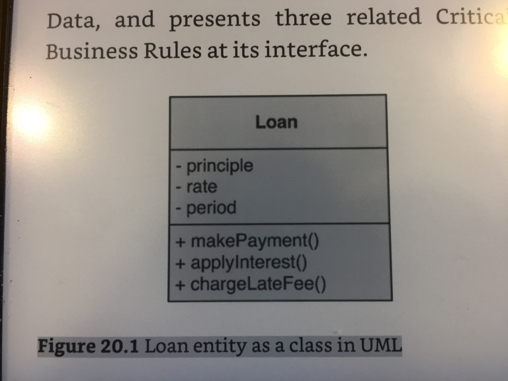
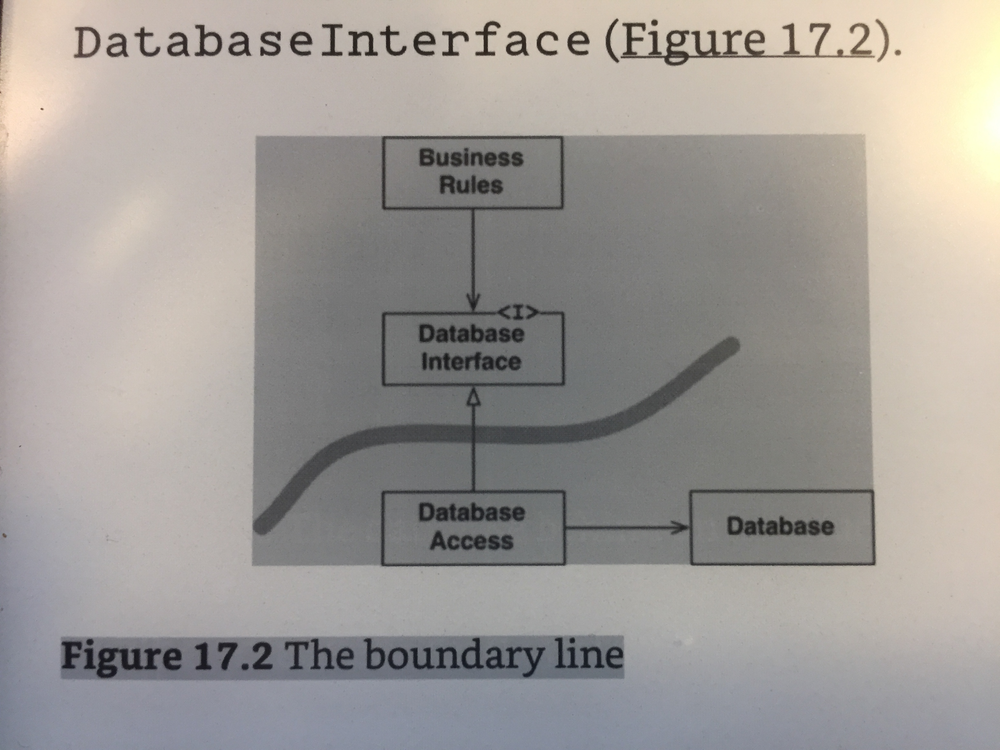
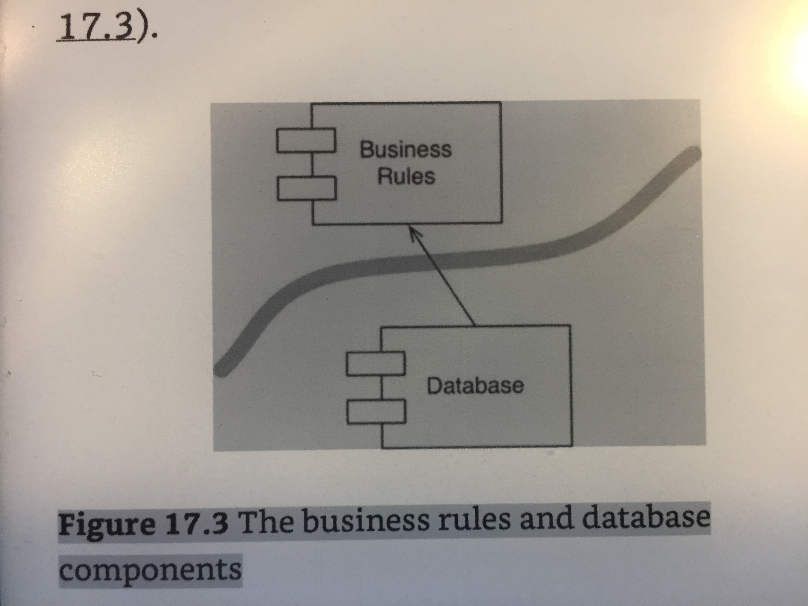
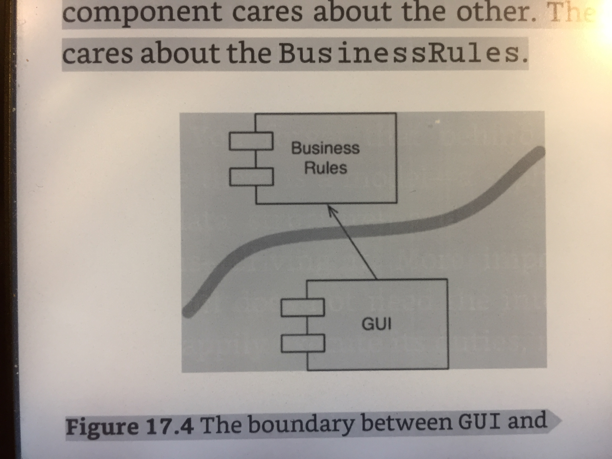
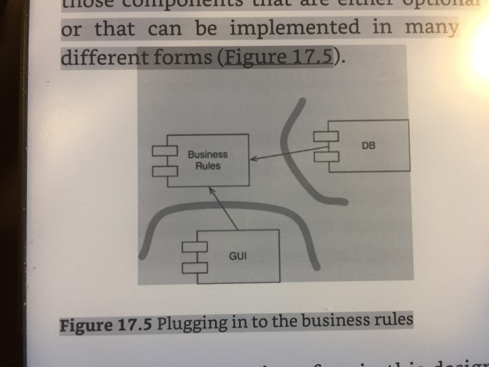
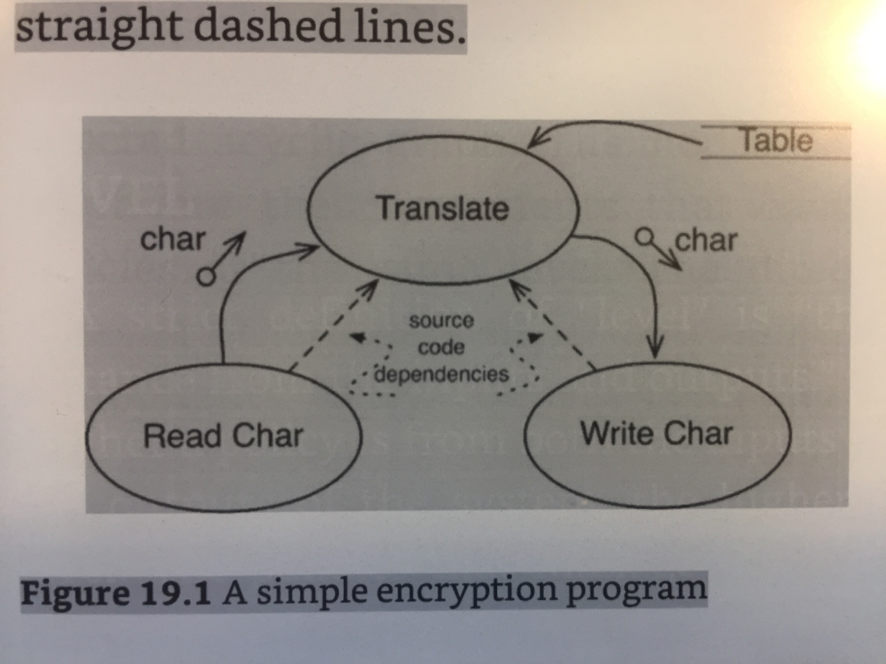
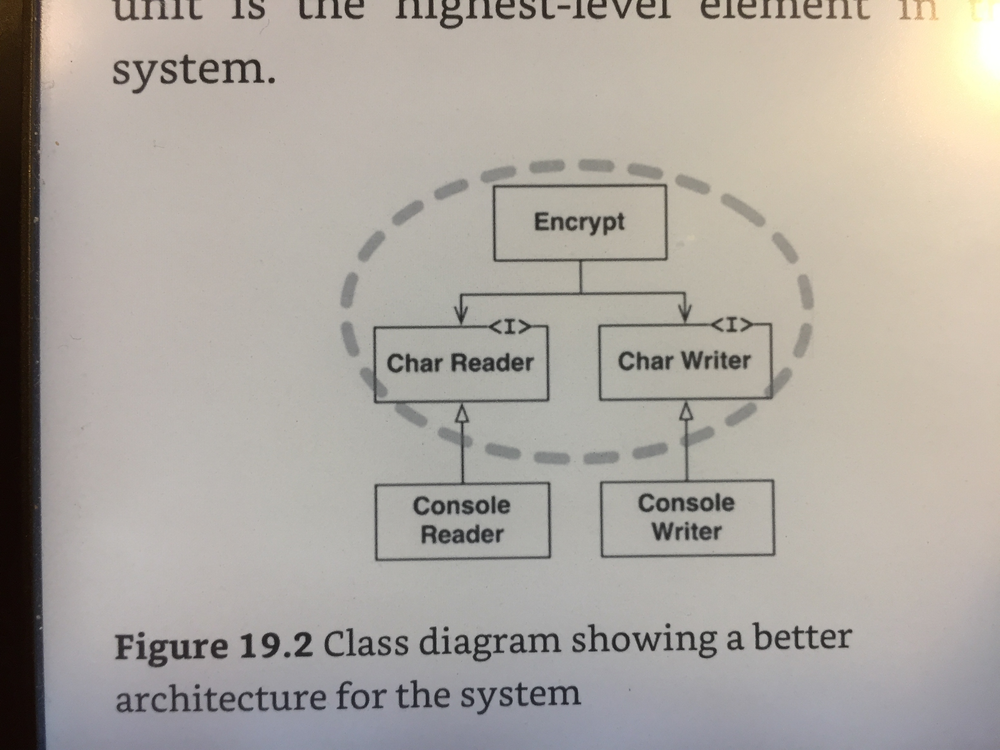
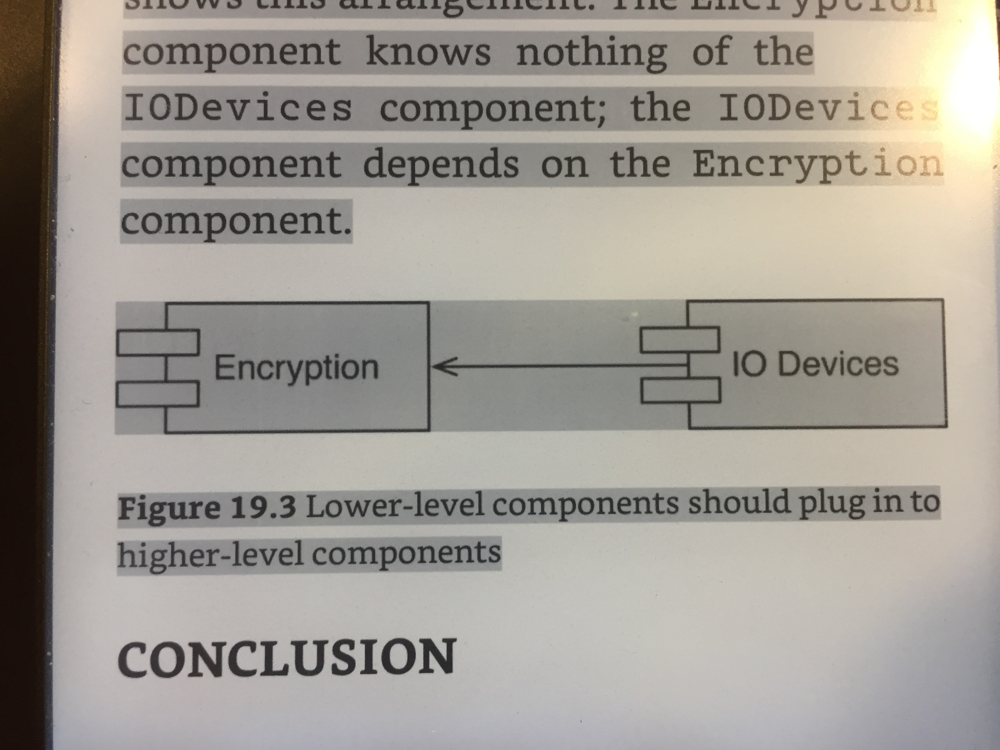

# Echiridion of Architecture

> When you see the right thing, do it — this may look like more work in the short term, but it's the path of least effort in the long run. If you don't know what the right thing is, do the minimum necessary to get the job done, at least until you figure out what the right thing is.

* Unlike buildings, which may be made of bricks, concrete, wood, steel, and glass, software is made of software. Large software constructs are made from smaller software components, which are in turn made of smaller software components still, and so on.

* Large software constructs are made from smaller software components, which are in turn made of smaller software components still, and so on.

* The kinds of changes a system’s development typically experiences should not be the changes that are costly, that are hard to make. A good architecture comes from understanding it more as a journey than as a destination, more as an ongoing process of enquiry than as a frozen artifact.

* The rules of software architecture are the rules of ordering and assembling the building blocks of programs.

* When software is done right, it requires a fraction of the human resources to create and maintain. Changes are simple and rapid. Defects are few and far between. Effort is minimized, and functionality and flexibility are maximized.

* The goal of software architecture is to minimize the human resources required to build and maintain the required system. 

* Developers buy into a familiar lie: “We can clean it up later; we just have to get to market first!” Of course, things never do get cleaned up later, because market pressures never abate.

* The fact is that making messes is always slower than staying clean, no matter which time scale you are using.

* Simple truth of software development: The only way to go fast, is to go well. “Slow and steady wins the race.”

* The first value of software is its behavior. Programmers are hired to make machines behave in a way that makes or saves money for the stakeholders.

* The second value of software has to do with the word “software”—a compound word composed of “soft” and “ware.” The word “ware” means “product”; the word “soft”… Well, that’s where the second value lies. Software was invented to be “soft.” Software was invented to be “soft.” It was intended to be a way to easily change the behavior of machines. If we’d wanted the behavior of machines to be hard to change, we would have called it hardware. To fulfill its purpose, software must be soft—that is, it must be easy to change.

* Just remember: If architecture comes last, then the system will become ever more costly to develop, and eventually change will become practically impossible for part or all of the system.

> In 1938, Alan Turing laid the foundations of what was to become computer programming. He was not the first to conceive of a programmable machine, but he was the first to understand that programs were simply data.

* Paradigms are ways of programming, relatively unrelated to languages. A paradigm tells you which programming structures to use, and when to use them. **The three paradigms included in this overview chapter are structured programming, object-orient programming, and functional programming.** Thus these three paradigms are likely to be the only three we will see. Further evidence that there are no more such paradigms is that they were all discovered within the ten years between 1958 and 1968.

> It was in this primitive environment that Dijkstra made his great discoveries. All programs can be constructed from just three structures: sequence, selection, and iteration.

* Dijkstra once said, “Testing shows the presence, not the absence, of bugs.” In other words, a program can be proven incorrect by a test, but it cannot be proven correct. All that tests can do, after sufficient testing effort, is allow us to deem a program to be correct enough for our purposes.

* Software architects strive to define modules, components, and services that are easily falsifiable (testable).

> Software is not a rapidly advancing technology. The rules of software are the same today as they were in 1946, when Alan Turing wrote the very first code that would execute in an electronic computer. The tools have changed, and the hardware has changed, but the essence of software remains the same.

* The only way to write complex software that won't fall on its face is to hold its global complexity down — to build it out of simple parts connected by well-defined interfaces, so that most problems are local and you can have some hope of upgrading a part without breaking the whole.

> One of my most productive days was throwing away 1000 lines of code.   -- Ken Thompson

* Even more often (at least in the commercial software world) excessive complexity comes from project requirements that are based on the marketing fad of the month rather than the reality of what customers want or software can actually deliver.

* Because debugging often occupies three-quarters or more of development time, work done early to ease debugging can be a very good investment.

* Allowing programs to get large hurts maintainability.

* Most software is fragile and buggy because most programs are too complicated for a human brain to understand all at once. When you can't reason correctly about the guts of a program, you can't be sure it's correct, and you can't fix it if it's broken.

* One very important tactic for being robust under odd inputs is to avoid having special cases in your code. Bugs often lurk in the code for handling special cases, and in the interactions among parts of the code intended to handle different special cases.

* Data is more tractable than program logic. It follows that where you see a choice between complexity in data structures and complexity in code, choose the former. More: in evolving a design, you should actively seek ways to shift complexity from code to data.

* Therefore, write your software to cope with incorrect inputs and its own execution errors as gracefully as possible. But when it cannot, make it fail in a way that makes diagnosis of the problem as easy as possible.

* Well-designed programs cooperate with other programs by making as much sense as they can from ill-formed inputs; they either fail noisily or pass strictly clean and correct data to the next program in the chain.

> The most basic argument for prototyping first is Kernighan & Plauger's; “90% of the functionality delivered now is better than 100% of it delivered never”. Prototyping first may help keep you from investing far too much time for marginal gains. Prototype, then polish. Get it working before you optimize it. Or: Make it work first, then make it work fast. ‘Extreme programming' guru Kent Beck, operating in a different culture, has usefully amplified this to: “Make it run, then make it right, then make it fast”.

* The Magical Number Seven, Plus or Minus Two: Some Limits on Our Capacity for Processing Information. This gives us a good rule of thumb for evaluating the compactness of APIs: Does a programmer have to remember more than seven entry points? Anything larger than this is unlikely to be strictly compact.

* Orthogonality is one of the most important properties that can help make even complex designs compact. In a purely orthogonal design, operations do not have side effects; each action (whether it's an API call, a macro invocation, or a language operation) changes just one thing without affecting others. There is one and only one way to change each property of whatever system you are controlling. Your monitor has orthogonal controls. You can change the brightness independently of the contrast level, and (if the monitor has one) the color balance control will be independent of both.

* Doug McIlroy's advice to “Do one thing well” is usually interpreted as being about simplicity. But it's also, implicitly and at least as importantly, about orthogonality.

* As they point out, orthogonality reduces test and development time, because it's easier to verify code that neither causes side effects nor depends on side effects from other code — there are fewer combinations to test.

* Constants, tables, and metadata should be declared and initialized once and imported elsewhere. Any time you see duplicate code, that's a danger sign. Complexity is a cost; don't pay it twice.

* The 1974 CACM paper that introduced Unix to the world; one of the famous quotes from that paper observes “...constraint has encouraged not only economy, but also a certain elegance of design”. That simplicity came from trying to think not about how much a language or operating system could do, but of how little it could do — not by carrying assumptions but by starting from zero. (what in Zen is called “beginner's mind” or “empty mind”). To design for compactness and orthogonality, start from zero.

* How many global variables does it have? Global variables are modularity poison, an easy way for components to leak information to each other in careless and promiscuous ways.

* Are the individual functions in your modules too large? This is not so much a matter of line count as it is of internal complexity. If you can't informally describe a function's contract with its callers in one line, the function is probably too large. Personally I tend to break up a subprogram when there are too many local variables. Another clue is [too many] levels of indentation. I rarely look at length.   -- Ken Thompson

* Do any of your APIs have more than seven entry points? Do any of your classes have more than seven methods each? Do your data structures have more than seven members? If so break it down.

* Module complexity tends to rise as the square of the number of entry points, too — yet another reason simple APIs are better than complicated ones.

* Components are the units of deployment. They are the smallest entities that can be deployed as part of a system. These dynamically linked files, which can be plugged together at runtime, are the software components of our architectures.

* The solution to this problem of complext software is to partition the development environment into releasable components. The components become units of work that can be the responsibility of a single developer, or a team of developers. When developers get a component working, they release it for use by the other developers. They give it a release number and move it into a directory for other teams to use. They then continue to modify their component in their own private areas. Everyone else uses the released version. Changes made to one component do not need to have an immediate affect on other teams. Each team can decide for itself when to adapt its own components to new releases of the components. Moreover, integration happens in small increments. There is no single point in time when all developers must come together and integrate everything they are doing.

* The architecture of a system has very little bearing on whether that system works. There are many systems out there, with terrible architectures, that work just fine. Their troubles do not lie in their operation; rather, they occur in their deployment, maintenance, and ongoing development.

* The primary purpose of architecture is to support the life cycle of the system. Good architecture makes the system easy to understand, easy to develop, easy to maintain, and easy to deploy. The ultimate goal is to minimize the lifetime cost of the system and to maximize programmer productivity.

* First of all, a software architect is a programmer; and continues to be a programmer. Never fall for the lie that suggests that software architects pull back from code to focus on higher-level issues. They do not! Software architects are the best programmers, and they continue to take programming tasks, while they also guide the rest of the team toward a design that maximizes productivity.

* To be effective, a software system must be deployable. The higher the cost of deployment, the less useful the system is. A goal of a software architecture, then, should be to make a system that can be easily deployed with a single action.

* Of all the aspects of a software system, maintenance is the most costly. The never-ending parade of new features and the inevitable trail of defects and corrections consume vast amounts of human resources.

* The primary cost of maintenance is in spelunking and risk. Spelunking is the cost of digging through the existing software, trying to determine the best place and the best strategy to add a new feature or to repair a defect. While making such changes, the likelihood of creating inadvertent defects is always there, adding to the cost of risk.

* A carefully thought-through architecture vastly mitigates these costs. By separating the system into components, and isolating those components through stable interfaces, it is possible to illuminate the pathways for future features and greatly reduce the risk of inadvertent breakage.

* The way you keep software soft is to leave as many options open as possible, for as long as possible. What are the options that we need to leave open? They are the details that don’t matter.

* All software systems can be decomposed into two major elements: policy and details. The policy element embodies all the business rules and procedures. The policy is where the true value of the system lives. 

* The details are those things that are necessary to enable humans, other systems, and programmers to communicate with the policy, but that do not impact the behavior of the policy at all. They include IO devices, databases, web systems, servers, frameworks, communication protocols, and so forth.

* The goal of the architect is to create a shape for the system that recognizes policy as the most essential element of the system while making the details irrelevant to that policy. This allows decisions about those details to be delayed and deferred.

* Good architects carefully separate details from policy, and then decouple the policy from the details so thoroughly that the policy has no knowledge of the details and does not depend on the details in any way.

* Good architects design the policy so that decisions about the details can be delayed and deferred for as long as possible.

* Any organization that designs a system will produce a design whose structure is a copy of the organization’s communication structure.

* By properly partitioning the system into well-isolated, independently developable components. Those components can then be allocated to teams that can work independently of each other.

* The database, the query language, and even the schema are technical details that have nothing to do with the business rules or the UI. They will change at rates, and for reasons, that are independent of other aspects of the system. Consequently, the architecture should separate them from the rest of the system so that they can be independently changed.

* We are dividing the system in to horizontal layers, we are also dividing the system into thin vertical use cases that cut through those layers. To achieve this decoupling, we separate the UI of the add-order use case from the UI of the delete-order use case. We do the same with the business rules, and with the database. We keep the use cases separate down the vertical height of the system.

* If you decouple the elements of the system that change for different reasons, then you can continue to add new use cases without interfering with old ones.

* If the UI and the database have been separated from the business rules, then they can run in different servers.

* To run in separate servers, the separated components cannot depend on being together in the same address space of a processor. They must be independent services, which communicate over a network of some kind. Many architects call such components “services” or “micro-services,”.

* When components are strongly decoupled, the interference between teams is mitigated. If the business rules don’t know about the UI, then a team that focuses on the UI cannot much affect a team that focuses on the business rules.

> If the use cases themselves are decoupled from one another, then a team that focuses on the addOrder use case is not likely to interfere with a team that focuses on the deleteOrder use case.

* Duplication is generally a bad thing in software. We don’t like duplicated code.

> As the development, deployment, and operational issues increase, I carefully choose which deployable units to turn into services, and gradually shift the system in that direction.

* The goal of an architect is to minimize the human resources required to build and maintain the required system. What it is that saps this kind of people-power? Coupling—and especially coupling to premature decisions. Which kinds of decisions are premature? Decisions that have nothing to do with the business requirements—the use cases—of the system. These include decisions about frameworks, databases, web servers, utility libraries, dependency injection, and the like.

* Another early decision was to avoid thinking about a database. We had MySQL in the back of our minds, but we purposely delayed that decision by employing a design that made the decision irrelevant. That design was simply to put an interface between all data accesses and the data repository itself. We put the data access methods into an interface named WikiPage. Those methods provided all the functionality we needed to find, fetch, and save pages. Of course, we didn’t implement those methods at first; we simply stubbed them out while we worked on features that didn’t involve fetching and saving the data. The fact that we did not have a database running for 18 months of development meant that, for 18 months, we did not have schema issues, query issues, database server issues, password issues, connection time issues, and all the other nasty issues that raise their ugly heads when you fire up a database.

* You draw lines between things that matter and things that don’t. The GUI doesn’t matter to the business rules, so there should be a line between them. The database doesn’t matter to the GUI, so there should be a line between them. The database doesn’t matter to the business rules, so there should be a line between them.

* **The database is a tool that the business rules can use indirectly. The business rules don’t need to know about the schema, or the query language, or any of the other details about the database. All the business rules need to know is that there is a set of functions that can be used to fetch or save data. This allows us to put the database behind an interface.**

* Enterprise Business Rules/Entities: An Entity is an object within our computer system that embodies a small set of critical business rules operating on Critical Business Data. The entity object either contains the Critical Business Data or has very easy access to that data. The interface of the Entity consists of the vunstions that implement the Critical Business Rules on the data. For example, Figure 20.1 shows what our Loan entity might look like as a class in UML. It has three pieces of Critical Business Data, and presents three related Critical Business Rules at its interface.

* Application Business Rules/Use cases: A use case is a description of the way that an automated system is used. It specifies the iput to be provided by the user, the output to be returned to the user, and the processing steps involved in producing that output. A use case describes application-specific business rules as opposed to the Cirtical Business Rules within the Entities. Use case example: Gather contact info for new loan:
	* Input: Name, Address, Birthdaate, DL, SSN etc.
	* Output: Same info for readback + credit score
		1. Accept and validate name
		2. Validate address, birthday
		3. Get credit score
		4. If credit score < 500 activate Denial
		5. Else create customer
	* Some other examples of use cases: 
		* Edit an article
		* Add new contact
		* Assign badge to a user
		* Invite an user
	

* Figure 17.3 The business rules and database components Note the direction of the arrow. The Database knows about the BusinessRules. The BusinessRules do not know about the Database. This implies that the DatabaseInterface classes live in the BusinessRules component, while the DatabaseAccess classes live in the Database component. The direction of this line is important. It shows that the Database does not matter to the BusinessRules, but the Database cannot exist without the BusinessRules. If that seems strange to you, just remember this point: The Database component contains the code that translates the calls made by the BusinessRules into the query language of the database. The Database component could be replaced with many different implementations—the BusinessRules don’t care. The database could be implemented with Oracle, or MySQL, or Couch, or Datomic, or even flat files. The business rules don’t care at all. And that means that the database decision can be deferred and you can focus on getting the business rules written and tested before you have to make the database decision.

* The arrows show which component knows about the other and, therefore, which component cares about the other. The GUI cares about the BusinessRules. Figure 17.4 The boundary between GUI and BusinessRules components Having drawn this boundary and this arrow, we can now see that the GUI could be replaced with any other kind of interface—and the BusinessRules would not care.

* The core business rules are kept separate from, and independent of, those components that are either optional or that can be implemented in many different forms (Figure 17.5). Figure 17.5 Plugging in to the business rules. GUIs change at different times and at different rates than business rules, so there should be a boundary between them. Business rules change at different times and for different reasons than dependency injection frameworks, so there should be a boundary between them. This is simply the Single Responsibility Principle again. The SRP tells us where to draw our boundaries.

* To draw boundary lines in a software architecture, you first partition the system into components. Some of those components are core business rules; others are plugins that contain necessary functions that are not directly related to the core business. Then you arrange the code in those components such that the arrows between them point in one direction—toward the core business.

> A computer program is a detailed description of the policy by which inputs are transformed into outputs.

* In most nontrivial systems, that policy can be broken down into many different smaller statements of policy. Some of those statements will describe how particular business rules are to be calculated. Others will describe how certain reports are to be formatted. Still others will describe how input data are to be validated.

* In a good architecture, the direction of those dependencies is based on the level of the components that they connect. In every case, low-level components are designed so that they depend on high-level components.

* A strict definition of “level” is “the distance from the inputs and outputs.” The farther a policy is from both the inputs and the outputs of the system, the higher its level. The policies that manage input and output are the lowest-level policies in the system.

* The data flows are shown as curved solid arrows. The properly designed source code dependencies are shown as straight dashed lines. Figure 19.1 A simple encryption program The Translate component is the highest-level component in this system because it is the component that is farthest from the inputs and outputs.

* Policies are grouped into components based on the way that they change. Policies that change for the same reasons and at the same times are grouped together by the SRP and CCP. Higher-level policies—those that are farthest from the inputs and outputs—tend to change less frequently, and for more important reasons, than lower-level policies.

* Trivial but urgent changes at the lowest levels of the system have little or no impact on the higher, more important, levels.

* For example, even in the trivial example of the encryption program, it is far more likely that the IO devices will change than that the encryption algorithm will change. If the encryption algorithm does change, it will likely be for a more substantive reason than a change to one of the IO devices.

* Another way to look at this issue is to note that lower-level components should be plugins to the higher-level components. The component diagram in Figure 19.3 shows this arrangement. The Encryption component knows nothing of the IODevices component; the IODevices component depends on the Encryption component. Figure 19.3 Lower-level components should plug in to higher-level components

> Strictly speaking, business rules are rules or procedures that make or save the business money. Very strictly speaking, these rules would make or save the business money, irrespective of whether they were implemented on a computer.

* An Entity is an object within our computer system that embodies a small set of critical business rules operating on Critical Business Data.

* Figure 20.1 Loan entity as a class in UML When we create this kind of class, we are gathering together the software that implements a concept that is critical to the business, and separating it from every other concern in the automated system we are building. This class stands alone as a representative of the business. It is unsullied with concerns about databases, user interfaces, or third-party frameworks.

* Critical Business Rules usually require some data to work with. For example, our loan requires a loan balance, an interest rate, and a payment schedule. We shall call this data Critical Business Data. This is the data that would exist even if the system were not automated. That an automated system is used. It specifies the input to be provided by the user, the output to be returned to the user, and the processing steps involved in producing that output.

* Business rules are the reason a software system exists. They are the core functionality. They carry the code that makes, or saves, money. They are the family jewels.

* The business rules should remain pristine, unsullied by baser concerns such as the user interface or database used. Ideally, the code that represents the business rules should be the heart of the system, with lesser concerns being plugged in to them. The business rules should be the most independent and reusable code in the system.

* So what does the architecture of your application scream? When you look at the top-level directory structure, and the source files in the highest-level package, do they scream “Health Care System,” or “Accounting System,” or “Inventory Management System”? Or do they scream “Rails,” or “Spring/Hibernate,” or “ASP”?

* Software architectures are structures that support the use cases of the system. Just as the plans for a house or a library scream about the use cases of those buildings, so should the architecture of a software application scream about the use cases of the application.

* A good software architecture allows decisions about frameworks, databases, web servers, and other environmental issues and tools to be deferred and delayed.

* The decision that your application will be delivered over the web is one that you should defer. Your system architecture should be as ignorant as possible about how it will be delivered. You should be able to deliver it as a console app, or a web app, or a thick client app, or even a web service app, without undue complication or change to the fundamental architecture.

* If your system architecture is all about the use cases, and if you have kept your frameworks at arm’s length, then you should be able to unit-test all those use cases without any of the frameworks in place.

* If you are building a health care system, then when new programmers look at the source repository, their first impression should be, “Oh, this is a heath care system.”

* Testable. The business rules can be tested without the UI, database, web server, or any other external element.

* Independent of the UI. The UI can change easily, without changing the rest of the system. A web UI could be replaced with a console UI, for example, without changing the business rules.

* Independent of the database. You can swap out Oracle or SQL Server for Mongo, BigTable, CouchDB, or something else. Your business rules are not bound to the database.

* Independent of any external agency. In fact, your business rules don’t know anything at all about the interfaces to the outside world.

* The software in the interface adapters layer is a set of adapters that convert data from the format most convenient for the use cases and entities, to the format most convenient for some external agency such as the database or the web.

* No code inward of this circle should know anything at all about the database. If the database is a SQL database, then all SQL should be restricted to this layer—and in particular to the parts of this layer that have to do with the database.

* The outermost layer of the model in Figure 22.1 is generally composed of frameworks and tools such as the database and the web framework. Generally you don’t write much code in this layer, other than glue code that communicates to the next circle inward.

* The frameworks and drivers layer is where all the details go. The web is a detail. The database is a detail. We keep these things on the outside where they can do little harm.

* The Dependency Rule always applies. Source code dependencies always point inward.

* Typically the data that crosses the boundaries consists of simple data structures. You can use basic structs or simple data transfer objects if you like. Or the data can simply be arguments in function calls. Or you can pack it into a hashmap, or construct it into an object. The important thing is that isolated, simple data structures are passed across the boundaries.

* When we pass data across a boundary, it is always in the form that is most convenient for the inner circle.

* Tests, by their very nature, follow the Dependency Rule; they are very detailed and concrete; and they always depend inward toward the code being tested. In fact, you can think of the tests as the outermost circle in the architecture. Nothing within the system depends on the tests, and the tests always depend inward on the components of the system.

* Changes to common system components can cause hundreds, or even thousands, of tests to break. This is known as the Fragile Tests Problem.

* The solution is to design for testability. The first rule of software design—whether for testability or for any other reason—is always the same: Don’t depend on volatile things. GUIs are volatile. Test suites that operate the system through the GUI must be fragile. Therefore design the system, and the tests, so that business rules can be tested without using the GUI.

* Tests are not outside the system; rather, they are parts of the system that must be well designed if they are to provide the desired benefits of stability and regression.

* From an architectural point of view, the database is a non-entity—it is a detail that does not rise to the level of an architectural element.

* Many data access frameworks allow database rows and tables to be passed around the system as objects. Allowing this is an architectural error. It couples the use cases, business rules, and in some cases even the UI to the relational structure of the data.

* Isn’t performance an architectural concern? Of course it is—but when it comes to data storage, it’s a concern that can be entirely encapsulated and separated from the business rules.

* I certainly would have lobbied very hard to isolate the business rules from the GUI, because you never know what the marketing geniuses will do next.

* The web is a GUI. So the web is a detail. And, as an architect, you want to put details like that behind boundaries that keep them separate from your core business logic. Think about it this way: The WEB is an IO device.

* You can use the framework—just don’t couple to it. Keep it at arm’s length. Treat the framework as a detail that belongs in one of the outer circles of the architecture. Don’t let it into the inner circles. Don’t let frameworks into your core code. Instead, integrate them into components that plug in to your core code, following the Dependency Rule.

* Dependency Rule. All dependencies cross the boundary lines in one direction, and they always point toward the components containing the higher-level policy.

* Be aware of the potential trade-off. It’s what I call the “Périphérique anti-pattern of ports and adapters.” The city of Paris, France, has a ring road called the Boulevard Périphérique, which allows you to circumnavigate Paris without entering the complexities of the city. Having all of your infrastructure code in a single source code tree means that it’s potentially possible for infrastructure code in one area of your application (e.g., a web controller) to directly call code in another area of your application (e.g., a database repository), without navigating through the domain. This is especially true if you’ve forgotten to apply appropriate access modifiers to that code.

* Use descriptive names for globals, short names for locals. Global variables, by defi- nition, can crop up anywhere in a program, so they need names long enough and descriptive enough to remind the reader of their meaning.

* By contrast, shorter names suffice for local variables; within a function. The use of i and j for loop indices, p and q for pointers, and s and t for strings is so frequent that there is little profit and perhaps some loss in longer names.

* In computing, the term has come to signify a kind of independence or decoupling. Two or more things are orthogonal if changes in one do not affect any of the others. In a well-designed system, the database code will be orthogonal to the user interface: you can change the interface without affecting the database, and swap databases without changing the interface.

* There is an easy test for orthogonal design. Once you have your components mapped out, ask yourself: IfI dramaticallychange the requirementsbehind a particular function, how many modules are affected?In an orthogonal system, the answer should be "one."

* Layers, each providing a level of abstraction. This layered approach is a powerful way to design orthogonal systems. Because each layer uses only the abstractions provided by the layers below it, you have great flexibility in changing underlying implementations without affecting code.

* Keep your code decoupled. Write shy code—modules that don't reveal anything unnecessary to other modules and that don't rely on other modules' implementations.

* Avoid global data. Every time your code references global data, it ties itself into the other components that share that data. Even globals that you intend only to read can lead to trouble (for example, if you suddenly need to change your code to be multithreaded). In general, your code is easier to understand and maintain if you explicitly pass any required context into your modules.

* An orthogonally designed and implemented system is easier to test. Because the interactions between the system's components are formalized and limited, more of the system testing can be performed at the individual module level.

* While many people try to keep their code flexible, you also need to think about maintaining flexibility in the areas of architecture, deployment, and vendor integration.

* A small body of code has low inertia—it is easy and quick to change. You'll be able to gather feedback on your application and generate a new, more accurate version faster and at less cost

* What sorts of things might you choose to investigate with a prototype? Anything that carries risk. Anything that hasn't been tried before, or that is absolutely critical to the final system. Anything unproven, experimental, or doubtful. Anything you aren't comfortable with. You can prototype: Architecture • • New functionality in an existing system • • Structure or contents of external data • • Third-party tools or components • • Performance issues • • User interface design

* You may want to implement prototypes using a very high-level language—higher than the rest of the project (maybe a language such as Perl, Python, or Tcl). A high-level scripting language lets you defer many details (including specifying data types) and still produce a functional (albeit incomplete or slow) piece of code.

> You Can't Write Perfect Software Did that hurt? It shouldn't. Accept it as an axiom of life. Embrace it. Celebrate it. Because perfect software doesn't exist. No one in the brief history of computing has ever written a piece of perfect software.

* However, the basic principle stays the same—when your code discovers that something that was supposed to be impossible just happened, your program is no longer viable. Anything it does from this point forward becomes suspect, so terminate it as soon as possible. A dead program normally does a lot less damage than a crippled one.

* Fortunately, if the programming language supports exceptions, you can rewrite this code in a far neater way: retcode = OK; try { socket.read(name); process(name); socket.read(address); processAddress(address); socket.read(telNo); // etc, etc... } catch (IOException e) { retcode = BAD_READ; Logger.log("Error reading individual: " + e.getMessage()); } return retcode; The normal flow of control is now clear, with all the error handling moved off to a single place.

* Good way to stay flexible is to write lesscode. Changing code leaves you open to the possibility of introducing new bugs. Metaprogramming will explain how to move details out of the code completely, where they can be changed more safely and easily.

* Metadata describe configuration options for an application: tuning parameters, user preferences, the installation directory, and so on. What exactly is metadata? Strictly speaking, metadata is data about data. The most common example is probably a database schema or data dictionary. A schema contains data that describes fields (columns) in terms of names, storage lengths, and other attributes. You should be able to access and manipulate this information just as you would any other data in the database.

* We use the term in its broadest sense. Metadata is any data that describes the application—how it should run, what resources it should use, and so on. Typically, metadata is accessed and used at runtime, not at compile time. You use metadata all the time—at least your programs do.

* As mentioned in The power of plain Text, we recommend representing configuration metadata in plain text—it makes life that much easier. But when should a program read this configuration? Many programs will scan such things only at startup, which is unfortunate.

* We feel that this is a good principle to apply to coding as well. Organize your code into cells (modules) and limit the interaction between them. If one module then gets compromised and has to be replaced, the other modules should be able to carry on.

* Systems with many unnecessary dependencies are very hard (and expensive) to maintain, and tend to be highly unstable. In order to keep the dependencies to a minimum, we'll use the Law ofDemeter to design our methods and functions.

* Once you separate a program into different modules based on responsibility, you have a new problem. At runtime, how do the objects talk to each other? How do you manage the logical dependencies between them? That is, how do you synchronize changes in state (or updates to data values) in these different objects? It needs to be done in a clean, flexible manner—we don't want them to know too much about each other. We want each module to be like the man in the song and just hear what it wants to hear. We'll start off with the concept of an event. An event is simply a special message that says "something interesting just happened" (interesting, of course, lies in the eye of the beholder). We can use events to signal changes in one object that some other object may be interested in.

* Objects should be able to register to receive only the events they need, and should never be sent events they don't need. We don't want to spam our objects! Instead, we can use a publish/subscribeprotocol

* For code you write that others will call, the basic principles of good modularization and of hiding implementation behind small, well-documented interfaces can all help. A well-specified contract (see Design by Contract) can help eliminate misunderstandings.

* Rely only on reliable things. Don't depend on accidents or assumptions. If you can't tell the difference in particular circumstances, assume the worst.

* Prioritize your effort. Spend time on the important aspects; more than likely, these are the hard parts. If you don't have fundamentals or infrastructure correct, brilliant bells and whistles will be irrelevant.

* Also be wary of premature optimization.It's always a good idea to make sure an algorithm really is a bottleneck before investing your precious time trying to improve it.

* A program evolves, it will become necessary to rethink earlier decisions and rework portions of the code. This process is perfectly natural. Code needs to evolve; it's not a static thing. Rewriting, reworking, and re-architecting code is collectively known as refactoring.

* Because the code doesn't quite fit anymore, or you notice two things that should really be merged, or anything else at all strikes you as being "wrong," don't hesitate to change it There's no time like the present. Any number of things may cause code to qualify for refactoring: a) Duplication, b) Nonorthogonal design

* At its heart, refactoring is redesign. Anything that you or others on your team designed can be redesigned in light of new facts, deeper understandings, changing requirements, and so on. But if you proceed to rip up vast quantities of code with wild abandon, you may find yourself in a worse position than when you started. Clearly, refactoring is an activity that needs to be undertaken slowly, deliberately, and carefully.

* Martin Fowler offers the following simple tips on how to refactor without doing more harm than good (see the box on in [FS97]): 1. 1. Don't try to refactor and add functionality at the same time. 2. 2. Make sure you have good tests before you begin refactoring. Run the tests as often as possible.

* So next time you see a piece of code that isn't quite as it should be, fix both it and everything that depends on it. Manage the pain: if it hurts now, but is going to hurt even more later, you might as well get it over with. Remember the lessons of Software Entropy, don't live with broken windows.

## References & Tutorials
---

* [The Art of UNIX Programming (The Addison-Wesley Professional Computng Series)](https://www.amazon.com/UNIX-Programming-Addison-Wesley-Professional-Computng/dp/0131429019)
* [Clean Architecture: A Craftsman's Guide to Software Structure and Design (Robert C. Martin Series) ](https://www.amazon.com/Clean-Architecture-Craftsmans-Software-Structure/dp/0134494164)
* [The Pragmatic Programmer: From Journeyman to Master](https://www.amazon.com/Pragmatic-Programmer-Journeyman-Master/dp/020161622X)
