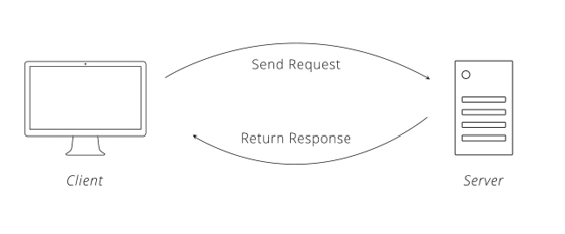
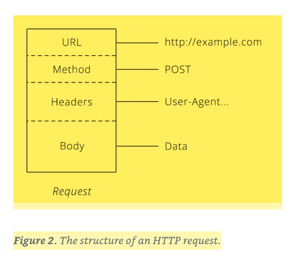
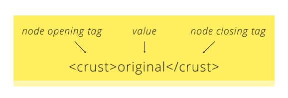
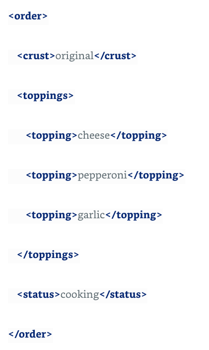
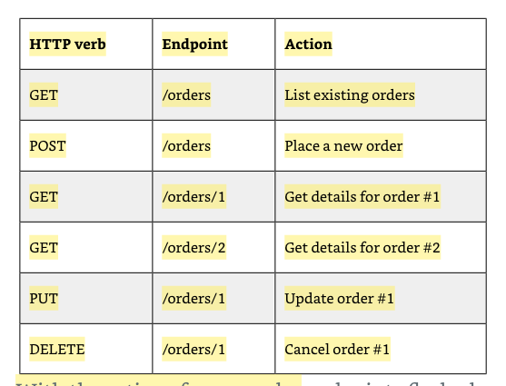

# An Introduction to APIs

[Source](https://www.amazon.com/Introduction-APIs-Brian-Cooksey-ebook/dp/B01MYOBVUA)

* An API is the tool that makes a website's data digestible for a computer. Through it, a computer can view and edit data, just like a person can by loading pages and submitting forms.

* When two systems (websites, desktops, smartphones) link up through an API, we say they are "integrated." In an integration, you have two sides, each with a special name. One side we have already talked about: the server.

* The other side is the "client." This is a separate program that knows what data is available through the API and can manipulate it, typically at the request of a user.

* Technically, an API is just a set of rules (interface) that the two sides agree to follow. The company publishing the API then implements their side by writing a program and putting it on a server. In practice, lumping the interface in with the implementation is an easier way to think about it.

* Computers have a similar etiquette, though it goes by the term "protocol." A computer protocol is an accepted set of rules that govern how two computers can speak to each other. Compared to our standards, however, a computer protocol is extremely rigid.

* For two computers to communicate effectively, the server has to know exactly how the client will arrange its messages.

* With the ubiquity of HTTP on the web, many companies choose to adopt it as the protocol underlying their APIs. One benefit of using a familiar protocol is that it lowers the learning curve for developers, which encourages usage of the API.

* Communication in HTTP centers around a concept called the Request-Response Cycle. The client sends the server a request to do something. The server, in turn, sends the client a response saying whether or not the server could do what the client asked.

* To make a valid request, the client needs to include four things: 1) URL (Uniform Resource Locator) 1 2) Method 3) List of Headers 4) Body

* APIs extend this idea a bit further to include nouns like customers, products, and tweets. In doing so, URLs become an easy way for the client to tell the server which thing it wants to interact with. Of course, APIs also do not call them "things", but give them the technical name "resources."

* The request method tells the server what kind of action the client wants the server to take.

* Headers provide meta-information about a request. They are a simple list of items like the time the client sent the request and the size of the request body.

* The request body contains the data the client wants to send the server.

* A unique trait about the body is that the client has complete control over this part of the request. Unlike the method, URL, or headers, where the HTTP protocol requires a rigid structure, the body allows the client to send anything it needs.

* Figure 2. The structure of an HTTP request.

* After the server receives a request from the client, it attempts to fulfill the request and send the client back a response. HTTP responses have a very similar structure to requests. The main difference is that instead of a method and a URL, the response includes a status code. Beyond that, the response headers and body follow the same format as requests.

* [Status codes](https://en.wikipedia.org/wiki/List_of_HTTP_status_codes) are three-digit numbers that each have a unique meaning. When used correctly in an API, this little number can communicate a lot of info to the client.

* After a response is delivered to the client, the Request-Response Cycle is completed and that round of communication over.

* The server will not send the client any more data until it receives a new request.

Figure 4. The structure of an HTTP response.

* Some APIs require a particular header, while others require specific information inside the request body.

* One computer has to put the data in a format that the other will understand. Generally, this means some kind of text format. The most common formats found in modern APIs are JSON (JavaScript Object Notation) and XML (Extensible Markup Language).

* JSON is a very simple format that has two pieces: keys and values. Keys represent an attribute about the object being described. A pizza order can be an object. It has attributes (keys), such as crust type, toppings, and order status. These attributes have corresponding values (thick crust, pepperoni, and out-for-delivery).

* XML always starts with a root node, which in our pizza example is "order." Inside the order are more "child" nodes. The name of each node tells us the attribute of the order (like they key in JSON) and the data inside is the actual detail (like the value in JSON)

Figure 2. XML node and value.

* There is a header for saying what format the data is in: Content-Type. When the client sends the Content-Type header in a request, it is telling the server that the data in the body of the request is formatted a particular way. If the client wants to send the server JSON data, it will set the Content-Type to "application/json."

* Upon receiving the request and seeing that Content-Type, the server will first check if it understands that format, and, if so, it will know how to read the data.

* Likewise, when the server sends the client a response, it will also set the Content-Type to tell the client how to read the body of the response.

* Second HTTP header comes to the rescue. The client can set the Accept header to tell the server what data formats it is able to accept. If the client can only speak JSON, it can set the Accept header to "application/json." The server will then send back its response in JSON. If the server doesn't support the format the client requests, it can send back an error.

* With these two headers, Content-Type and Accept, the client and server can work with the data formats they understand and need to work properly.

**Note:** Associative array: a nested object

* There are several techniques APIs use to authenticate a client. These are called authentication schemes.

* Basic Auth only requires a username and password. The client takes these two credentials, smooshes them together to form a single value 1, and passes that along in the request in an HTTP header called Authorization.

* When the server receives the request, it looks at the Authorization header and compares it to the credentials it has stored. If the username and password match one of the users in the server's list, the server fulfills the client's request as that user. If there is no match, the server returns a special status code (401) to let the client know that authentication failed and the request is denied.

* API Key authentication is a technique that overcomes the weakness of using shared credentials by requiring the API to be accessed with a unique key.

* When the client authenticates with the API key, the server knows to allow the client access to data, but now has the option to limit administrative functions, like changing passwords or deleting accounts. Sometimes, keys are used simply so the user does not have to give out their password. The flexibility is there with API Key authentication to limit control as well as protect user passwords.

* Over time, however, a few common approaches have emerged. One is to have the client put the key in the Authorization header, in lieu of a username and password. Another is to add the key onto the URL (http://example.com?api_key=my_secret_key).

* Enter OAuth. Automating the key exchange is one of the main problems OAuth solves. It provides a standard way for the client to get a key from the server by walking the user through a simple set of steps. From the user's perspective, all OAuth requires is entering credentials. Behind the scenes, the client and server are chattering back and forth to get the client a valid key.

1) The user kicks off the process by letting the client know they want it to connect to the server. Usually, this is by clicking a button.

2) The client sends the user over to the server's website, along with a URL that the server will send the user back to once the user authenticates, called the callback URL.

3) With their normal username and password, the user authenticates with the server. The server is now certain that one of its own users is requesting that the client be given access to the user's account and related data.

4) The server sends the user back to the client (to the Callback URL from Step 2). Hidden in the response is a unique authorization code for the client.

5) The client takes the authorization code it receives and makes another request to the server. This request includes the client's secret key. When the server sees a valid authorization code and a trusted client secret key, it is certain that the client is who it claims to be and that it is acting on behalf of a real user. The server responds back with an access token.

6) At this point, the client is free to access the server on the user's behalf. The access token from Step 6 is essentially another password into the user's account on the server. The client includes the access token with every request so it can authenticate directly with the server.

* An element of OAuth 2 that deserves special attention is the concept limiting access, known formally as authorization. Back in Step 2, when the user clicks the button to allow the client access, buried in the fine print are the exact permissions the client is asking for. Those permissions, called scope, are another important feature of OAuth 2. They provide a way for the client to request limited access to the user's data,

**Note:** The purpose of an API is to make it easy for computers to work with the company's data.

* Recall that resources are the nouns of APIs (customers and pizzas). These are the things we want the world to be able to interact with through our API.

* Picking resources can be a difficult first task.

* The next step is assigning URLs to the resource. There are lots of possibilities, but luckily REST conventions give some guidance. In a typical REST API, a resource will have two URL patterns assigned to it. The first is the plural of the resource name, like /orders. The second is the plural of the resource name plus a unique identifier to specify a single resource, like /orders/<order_id>,

* These are called endpoints simply because they go at the end of the URL, as in http://example.com/<endpoint_goes_here>.

* Now that we picked our resource and assigned it URLs, we need to decide what actions the client can perform. Following REST conventions, we say that the plural endpoint (/orders) is for listing existing orders and creating new ones. The plural with a unique identifier endpoint (/orders/<order_id>), is for retrieving, updating, or cancelling a specific order. The client tells the server which action to perform by passing the appropriate HTTP verb (GET, POST, PUT or DELETE) in the request.

* HTTP verb Endpoint Action GET /orders List existing orders POST /orders Place a new order GET /orders/1 Get details for order #1 GET /orders/2 Get details for order #2 PUT /orders/1 Update order #1 DELETE /orders/1 Cancel order #1 With the actions for our order

* URLs have another component that we have not mentioned yet, the query string. Query means search and string means text. The query string is a bit of text that goes onto the end of a URL to pass things along to the API. For example, everything after the question mark is the query string in http://example.com/orders?key=value.

* REST APIs use the query string to define details of a search. These details are called query parameters. The API dictates what parameters it will accept, and the exact names of those parameters need to be used for them to effect the search.

* Query String: A portion of the URL that is used to pass data to the server

* Query Parameters: A key-value pair found in the query string (topping=cheese)

* When the client is the only one who can make requests, the simplest solution to keep it up-to-date with the server is for the client to simply ask the server for updates. This can be accomplished by repeatedly requesting the same resource, a technique known as polling. There is one big flaw with this solution. It is terribly inefficient. Most of the requests the client makes are wasted because nothing has changed.

* Long polling uses the same idea of the client repeatedly asking the server for updates, but with a twist: the server does not respond immediately. Instead, the server waits until something changes, then responds with the update.

* This technique is pretty clever. It obeys the rule of the client making the initial request while leveraging the fact that there is no rule against the server being slow to respond.

* As long as both the client and the server agree that the server will hold on to the client's request, and the client is able to keep its connection to the server open, it will work.

* Webhooks, a technique where the client both makes requests and listens for them, allowing the server to easily push updates to it. Webhooks, a technique where the client both makes requests and listens for them, allowing the server to easily push updates to it.

* Building on the idea of webhooks, there have been a variety of solutions that aim to make the setup process dynamic and not require a person to manually enter a Callback URL on the server. You might hear names like HTTP Subscriptions Specification, Restful Webhooks, REST Hooks, and PubSubHubbub. What all of these solutions try to do is define a subscription process, where the client can tell the server what events it is interested in and what Callback URL to send updates to.

* There will likely be a place for polling and long polling for the foreseeable future. Not all clients can also act as servers. Smartphones are a great example where technical constraints rule out webhooks as a possibility.

**Note:** A library is code that the API owner publishes that already implements the client side of their API. Sometimes the library will be individually available for download or it will be bundled in an SDK (Software Development Kit). Using a library saves you time because instead of reading the API documentation and forming raw HTTP requests, you can simply copy and paste a few lines of code and already have a working client.
