# Contact and Data Flow Diagrams

## Rules

* Processes are not allowed to talk to each other
    + Exception: in cases e.g. SNS queue sending notification, they can talk to each other
    + Exception: Processes that are broken into steps are allowed to talk to each other (e.g. verify shipping, assemble shipment, assemble customer orders)

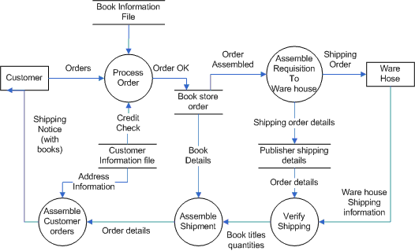

* Data stores are not to talk to each other

* You have to have an even number of lines (up/down)

* The interfaces (e.g. users, bank, warehouse etc.) will become tables

* Avoid repetitive features such as login, signup etc., features that are not business processes should be excluded from DFD

* If you have more than 2 lines up/down from the interface, usually it means the process needs to be decomposed in two (if 4 lines) or more separate processes (DFD Level 2, 3, 4, 5)
    + You need to decompose your DFD till the process has one 1 line up and 1 line down. So it supposed to be primitive process or function
    + In case of serverless break it down into separate functions

*  DFD should always describe a process as a full (request/response), you need to describe everything in DFD 1 and break everything down in further levels.
    + You start with Context Diagram, you break it down into another layer DFD 1, you break DFD 1 into another layer DFD 2 and so on. If you have e.g. in DFD 1 - 5 Processes you divide it into 5 separate diagrams in the second layer.

* The data flow should never intersect, but if it needed to be intersected you need to create a bridge, so it's clear where input/output goes.

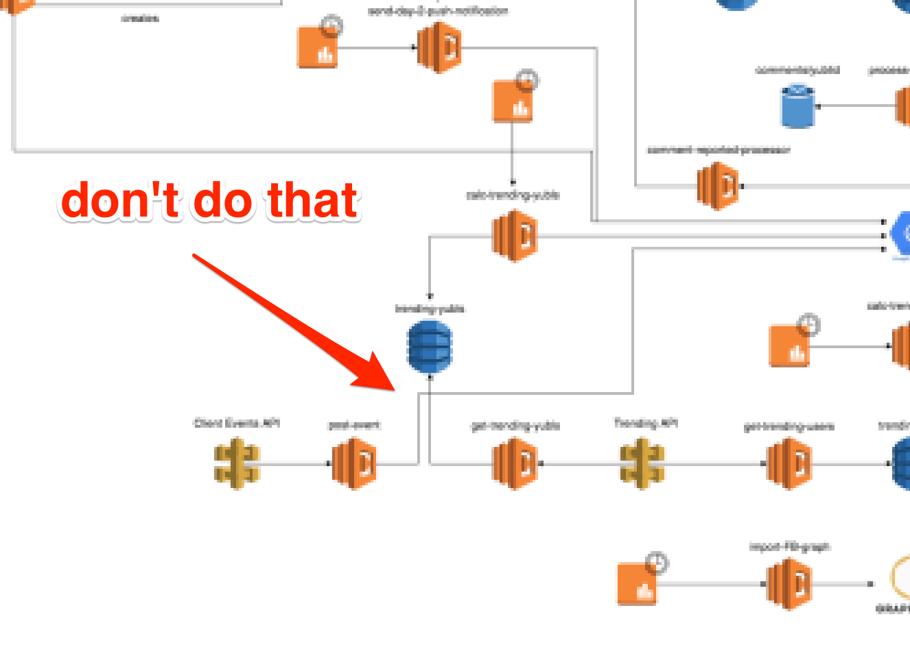

---

* Each process should have at least one input and an output.
* Each data store should have at least one data flow in and one data flow out.
* All processes in a DFD go to another process or a data store.
* Data stored in a system must go through a process. (never data store to data store communication)

[Source DFD](https://www.lucidchart.com/pages/data-flow-diagram)

---

1. All data flows must flow to or from a process

All flows of data must be either coming from or going to a process. External entities can not flow directly to each other. A data flow can not link a data store to an external entity. Data can not move between data stores without first being processed.

2. A Process must have at least one input flow and one output flow.

When a process has input flow but no output flow, it is called a “black hole”. When a process has output flows but no input flows, it is called a “miracle”.

3. The inputs to a process must be sufficient to produce output flows.

A “grey hole” is when the outputs of a process are greater then the sum of its inputs. For example, if a customers name and address is an input, their bank details can not be an output, as the process doesn’t have enough information to produce it.

4. Processes must transform data.

When naming data flows, adjectives should be used which show how processing has changed the data flow.

5. Data Flows can not cross each other

The flows of data can not cross each other. To overcome this problem, data stores and entities can be duplicated. However, processes can not be deplicated. Data flows must be unidirectional.

6. Entities must be labelled in lower case.

[Source - Data Flow Rules](https://eternalsunshineoftheismind.wordpress.com/2013/02/25/rules-for-creating-data-flow-diagrams/)

---

1. Naming conventions:
    * Processes: strong verbs
        - Process: any process that changes the data, producing an output. It might perform computations, or sort data based on logic, or direct the data flow based on business rules. A short label is used to describe the process, such as “Submit payment.”
    * dataflows: nouns
        - Data flow: the route that data takes between the external entities, processes and data stores. It portrays the interface between the other components and is shown with arrows, typically labeled with a short data name, like “Billing details.”
    * datastores: nouns
        - Data store: files or repositories that hold information for later use, such as a database table or a membership form. Each data store receives a simple label, such as “Orders.”
    * external entities: nouns
        - External entity: an outside system that sends or receives data, communicating with the system being diagrammed. They are the sources and destinations of information entering or leaving the system. They might be an outside organization or person, a computer system or a business system. They are also known as terminators, sources and sinks or actors. They are typically drawn on the edges of the diagram.

2. No more than 7 - 9 processes in each DFD.

3. Dataflows must begin, end, or both begin & end with a process.

4. Numbering: The system under study in the context diagram is given number `0'. The processes in the top level DFD are labelled consecutively by natural numbers beginning with 1. When a process is exploded in a lower level DFD, the processes in such lower level DFD are consecutively numbered following the label of such parent process ending with a period or full-stop (for example 1.2, 1.2.3, etc.).

5. External entities: Lower level DFDs can not introduce new external entities. The context diagram must therefore show all external entities with which the system under study interacts. In order not to clutter higher level DFDs, detailed interactions of processes with external entities are often shown in lower level DFDs but not in the higher level ones. In this case, there will be some dataflows at lower level DFDs that do not appear in the higher level DFDs.

[Guidelines for Drawing Dataflow Diagrams](https://www.albany.edu/acc/courses/acc681.fall00/681book/node31.html)

---

## Examples of DFD

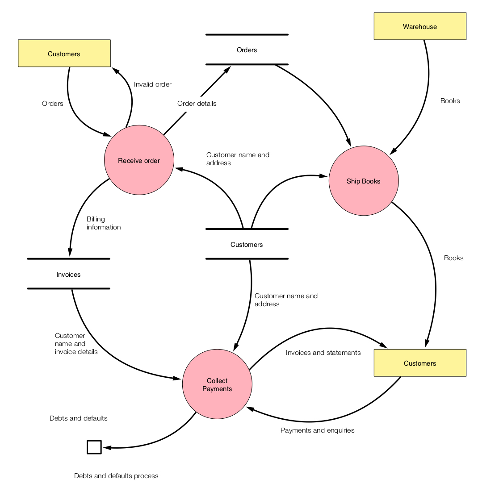

---

[Context Diagrams Overview](https://www.youtube.com/watch?v=fWNrc6GNK14&index=3&list=PLyH7UFQzuDWcV5HmE8ucXVqb1YpfcPOwk)

## Context Diagrams

A diagram used to give an overview of an entire system. In a context diagram there is only once cirlce/ process that represents the entie system. The purpose of this diagram is to display the expecting inputs and outputs from the system to and from varioous external entities. Though this display a system analyst can model what expected data is going to go into the system, then after it has been processed by the system what information will be returning to the external entities.

* There is one external entity
* There is one single process / system in the context diagram
* The flow line represents what data goes into the system
* Another flow line usually returning to the external entity of the process information that they are receiving from the system

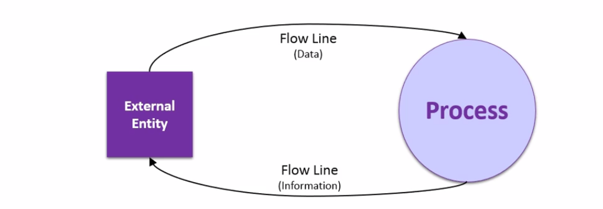

### Shapes used in Context Diagrams

* External Entity: An eelement that inputs data into an information system and or retrieves data from the information system (receiving/sending).

* Process: When an action takes place on data, turning it into information. In the case of a Context Diagram there is only 1 Process that represents the entire System.

* Flow Line: Illustrate the movevemtn of data from one entity / process to another. A data Flow line is supported by text stating what data is being sent / retrieved

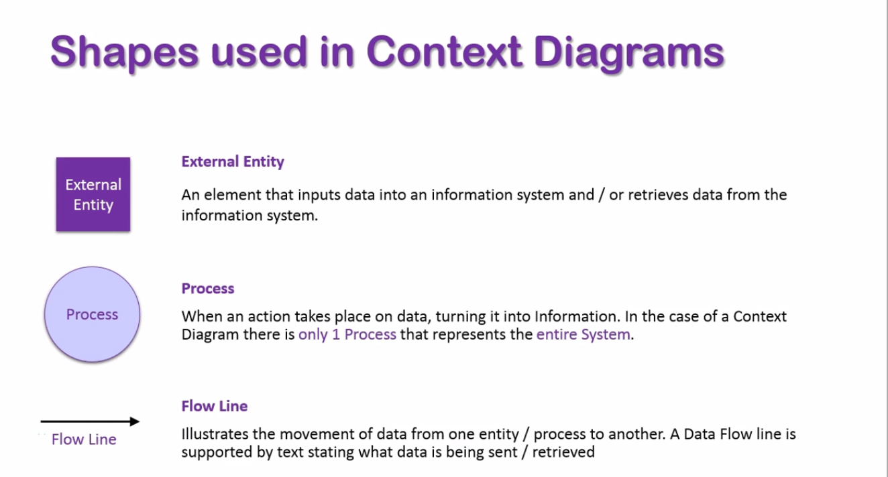

### Context Diagram Example

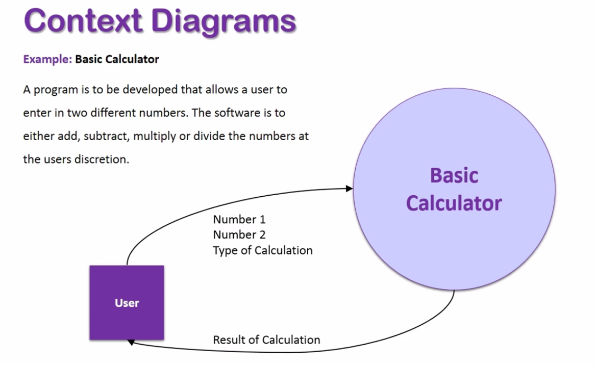

---

## Data Flow Diagram (DFD)
Data flow diagrams are also used to model information systems. They provide greater detail than a context diagram as they display each process involved within the information system as an individual circle, meaning the end result will contain multiple circles / processes. A DFD also has a shape for data sotres to represent where data is sent and retrieved from, such as a specific database. Data sotres are represented as a three sided rectangle shape.

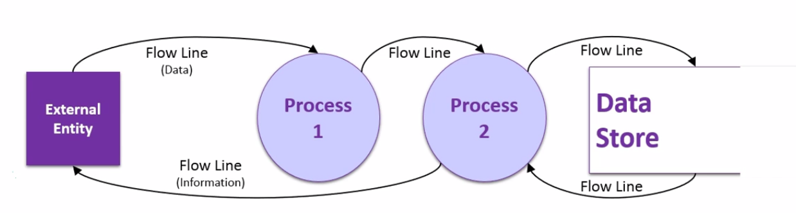

### Shapes used in Data Flow diagrams

* External Entity: An element that inputs data into an information system and or retrieves data from the information system (person, user, individual or something external to the system)

* Process: When an action takes place on data, potentially one of the information processes. A DFD contains multiple processes, each manipulating the data in their own way.

* Flow line: Illustrates the movement of data from one entity / process to another. A Data Flow line is supported by text stating what data is being sent / retrieved. (line itself is labeled with the data the information being sent / received)

* Data Store: A location where data is saved to or retrieved from, such as a database

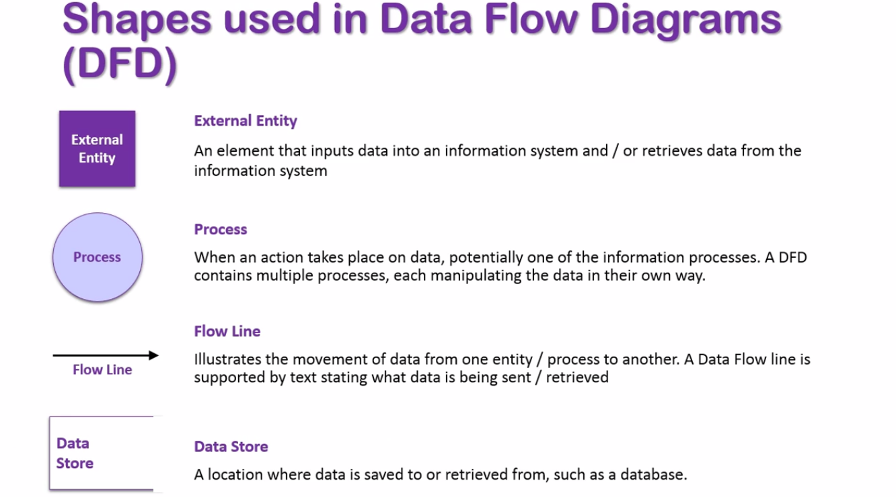

### Data Flow Diagram Example

1. Here is our user that is putting number 1 and number 2 into the system, the system first records these numbers as variables
2. Once the numbers have been recored they have been stored in the memory of the calculator
3. The next step we want to say which calculation the user wants to use, one again this needs to be recorded in the memory. Now we have the numbers and the calculation stored in the memory
4. Now we have this information, number 1, number 2 and calculation type can be used in another process called perform calculation
5. The system now needs to show result to the user, display result and they essentially view the result.

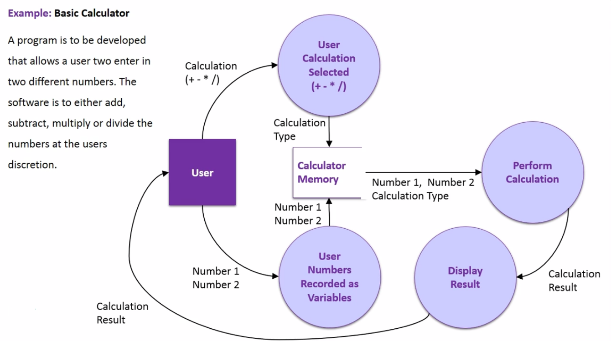

---

## Examples Context & Data Flow Diagrams
## Context Diagram Example

* Context diagram can be used as a planning tool to build much complex Data Flow Diagrams
* Processes are simply manipulation of data
* Data Flow Diagram can be either High Level (Context Diagram) or Low Level (Level I and Level II)
    
1. In a Context Diagram we always start with 1 circle in the midddle that represents the entire system (information system)
2. External entity: 
    + Youtube Partner: someone who puts content and earn from the content
    + Youtube Viewer: someone who is just watching the videos
    + Advertisers: the companies/people that pay youtube to put their ads on video
    + Bank: the payments and receipts are needed to go through the bank

## Data Flow Diagram

1. External entities:
    + Youtube Partners
    + Youtube Viewers
2. Account database: The external entities needs to log in and will be authenticated
3. The first step is to give access to view video via links, urls or search
    + if they want to upload a video they can go to upload a video, if they click a button the video is uploaded
    + when the video is uploaded we can edit the video
    + once the video has been edited it's ready to be viewed once its published
4. Once the video is online the social media aspect comes into play for both ways the users can comment, like, but they also receiving the feedback from their own videos when they have been uploaded. This feedback returns to these two users.
5. Now we have advertisers they have to pay youtube for advertising and that goes straight to the bank account of youtube. Once the payments made they have to apply the ads to the video, they need to submit advertisements to youtube, and those ads are attached to existing youtube partners movies. 
6. Because the ads are attached to youtube partners movies the bank has to pay those partners. And the payment receipt send to those partners based on the ads and the performance. 

# Planning Data Flow Diagram

[Planning a Data Flow Diagram](https://www.youtube.com/watch?v=VeLkVD0Q_6M)

---

---

## Data Flow Diagram Example - Accessign User Email via Email Server

[Source - Data Flow Diagram: Email](https://www.youtube.com/watch?v=ZFIynt3K3U0)

1. External Entity: User
2. Log in to Email Account (Server) with Login and Password
3. From there the Email Server will check it against User Database and create an entry if the details are correct
4. Here the users given two options: compose email or view email
    + If they choose to compose an email, they can compose it and click send to send the message
        5. And that will go to another external entity: Recepient
            + There will be also an confirmation that this email has been sent
    + If user will choose view email option
        5. He/she can delete an email
        6. Can also click reply and reply to an email that leads him to the compose email process
        7. Or he can forward an email using the message and the attachments are kept in tact

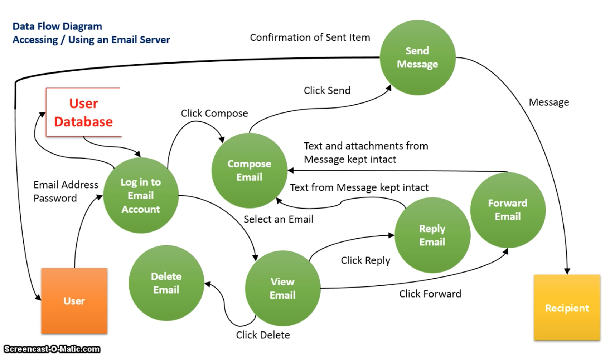

## Data Flow Diagram Rules

## DFD levels and layers

* DFD Level 0 is also called a Context Diagram. It’s a basic overview of the whole system or process being analyzed or modeled. It’s designed to be an at-a-glance view, showing the system as a single high-level process, with its relationship to external entities. It should be easily understood by a wide audience, including stakeholders, business analysts, data analysts and developers. 

* DFD Level 1 provides a more detailed breakout of pieces of the Context Level Diagram. You will highlight the main functions carried out by the system, as you break down the high-level process of the Context Diagram into its subprocesses. 

* DFD Level 2 then goes one step deeper into parts of Level 1. It may require more text to reach the necessary level of detail about the system’s functioning. 

**Note:** Progression to Levels 3, 4 and beyond is possible, but going beyond Level 3 is uncommon. Doing so can create complexity that makes it difficult to communicate, compare or model effectively.

## Context & Data Flow Diagram Uber Example

[Source - Context & Data Flow Diagrams Sample 2: Uber](https://www.youtube.com/watch?v=X-O6s5sah4o)

1. We always start with the big circle in the middle - The information system (Uber)
2. External Entity: Uber Customer
    + Data flow: Setup an account, Payment info, Destination, Pickup Location, Type Car (needs to go into the system first)
    + Data flow: Confirmation is sent to the customer from the system, Driver Location, Rate Driver (improves the system), Transaction Receipt
3. External Entity: Uber Driver
    + Data flow: Account details, Type of Car, Current Location, Payment, Accept / Descline
    + Data flow: They get the information from the customer form the system (Pickup location, Destination, Payment Receipt)
4. External Entity: Bank
    + Data flow: Payments to Drivers, Payments to Customers
    + Data flow: Payment receipts

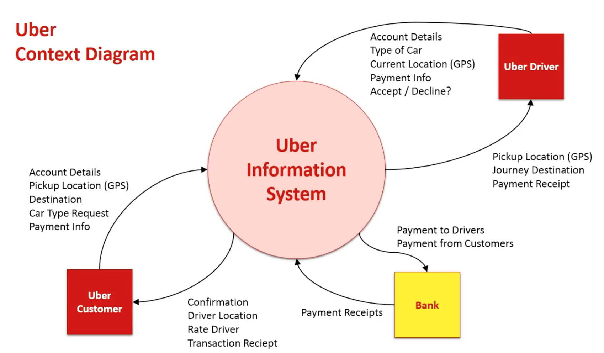

---

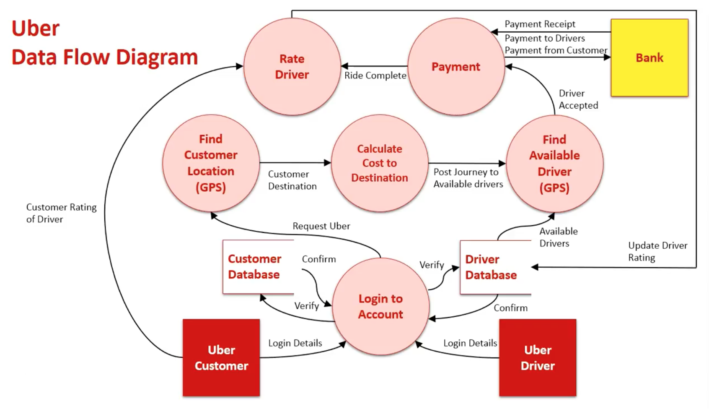

---

# AWS Data Flow Diagram (AWS Architecture)

* You can create DFD with draw.io with all aws resources
* You can find more examples of [AWS Architecture](https://aws.amazon.com/architecture/)

[Yubl’s road to Serverless — Part 1, Overview](https://hackernoon.com/yubls-road-to-serverless-part-1-overview-ca348370acde)

* A diagram is worth a thousand words. Architecture diagrams are a great way to communicate about your design, deployment and topology. Here you will find official collection of AWS icons, tools and resources that will help you build great AWS Architecture diagrams. [Source](https://aws.amazon.com/architecture/icons/)

## Advantages Of AWS Architecture Diagrams
* Easier to presenta a specific design describing the use of AWS or ACS
* Universally recognized set of objects
* Efficient and easy to digest
* Professional looking
* Time saver for complex presentations
[Source](http://tentouchapps.com/grafio/solutions-area/aws-architecture/)