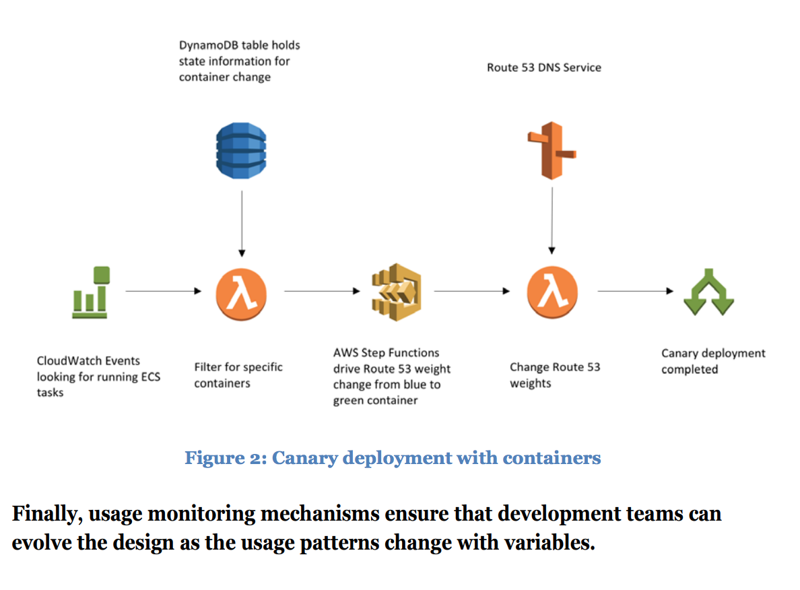

# Running Containerized Microservices on AWS

[Source](https://d1.awsstatic.com/whitepapers/DevOps/running-containerized-microservices-on-aws.pdf)

- Your Highlight on Location 21-22 | Added on Thursday, July 12, 2018 6:00:00 AM

Microservices are an architectural and organizational approach to software development in which software is composed of small, independent services that communicate over well-defined APIs.

- Your Highlight on Location 25-28 | Added on Thursday, July 12, 2018 6:00:54 AM

As proposed by Martin Fowler,1 the characteristics of a microservices architecture include the following: • Componentization via services • Organized around business capabilities • Products not projects • Smart endpoints and dump pipes • Decentralized governance • Decentralized data management • Infrastructure automation • Design for failure • Evolutionary design

- Your Highlight on Location 39-42 | Added on Thursday, July 12, 2018 6:03:01 AM

These small components are divided so that each of them does one thing, and does it well, while cooperating to deliver a full-featured application. An analogy can be drawn to the Walkman portable audio cassette players that were popular in the 1980s: batteries bring power, audio tapes are the medium, headphones deliver output, while the main tape player takes input through key presses. Using them together plays music.

- Your Highlight on Location 43-45 | Added on Thursday, July 12, 2018 6:03:26 AM

Using the Walkman analogy, if the headphones are worn out, we can replace them without replacing the tape player. If an order management service in our store-keeping application is falling behind and performing too slowly, we can swap it for a more performant, more streamlined component.

- Your Highlight on Location 71-72 | Added on Thursday, July 12, 2018 6:07:33 AM

Before microservices, system architecture would be organized around technological capabilities such as user interface, database, and server-side logic.

- Your Highlight on Location 89-92 | Added on Thursday, July 12, 2018 6:08:15 AM

"Organizations which design systems ... are constrained to produce designs which are copies of the communication structures of these organizations." —  M. Conway3

- Your Highlight on Location 106-107 | Added on Thursday, July 12, 2018 6:08:43 AM

With this approach, the stack can be polyglot, meaning that developers are free to use the programming languages that are optimal for their component.

- Your Highlight on Location 116-122 | Added on Thursday, July 12, 2018 6:11:21 AM

To achieve a microservices architecture that is organized around business capabilities, use popular design patterns: • Command – This pattern helps encapsulate a request as an object, thereby letting you parameterize clients with different requests, queue or log requests, and support undoable operations. • Adapter – This pattern helps match the impedance of an old component to a new system. • Singleton –This pattern is for an application that needs one, and only one, instance of an object. • Chain of responsibility – This pattern helps avoid coupling the sender of a request to its receiver by giving more than one object a chance to handle the request. • Composite – This pattern helps an application manipulate a hierarchical collection of "primitive" and "composite" objects. A service could be a composite of other smaller functions.

- Your Highlight on Location 152-152 | Added on Thursday, July 12, 2018 6:15:14 AM

there are two primary forms of communication between services:

- Your Highlight on Location 153-155 | Added on Thursday, July 12, 2018 6:15:34 AM

Request/Response – One service explicitly invokes another service by making a request to either store data in it or retrieve data from it. For example, when a new user creates an account, the user service makes a request to the billing service to pass off the billing address from the user’s profile so that that billing service can store it.

- Your Highlight on Location 155-157 | Added on Thursday, July 12, 2018 6:15:59 AM

Publish/Subscribe – Event-based architecture where one service implicitly invokes another service that was watching for an event. For example, when a new user creates an account, the user service publishes this new user signup event and the email service that was watching for it is triggered to email the user asking them to verify their email.

- Your Highlight on Location 159-162 | Added on Thursday, July 12, 2018 6:16:50 AM

It is much better to use a message broker such as Kafka, or Amazon Simple Notification Service (Amazon SNS) and Amazon Simple Queue Service (Amazon SQS). Microservices architectures favor these tools because they enable a decentralized approach in which the endpoints that produce and consume messages are smart, but the pipe between the endpoints is dumb. In other words, concentrate the logic in the containers and refrain from leveraging (and coupling to) sophisticated buses and messaging services.

- Your Highlight on Location 162-165 | Added on Thursday, July 12, 2018 6:17:37 AM

The core benefit of building smart endpoints and dumb pipes is the ability to decentralize the architecture, particularly when it comes to how endpoints are maintained, updated, and extended. One goal of microservices is to enable parallel work on different edges of the architecture that will not conflict with each other. Building dumb pipes enables each microservice to encapsulate its own logic for formatting its outgoing responses or supplementing its incoming requests.

- Your Highlight on Location 166-168 | Added on Thursday, July 12, 2018 6:17:52 AM

Port Binding – Services bind to a port to watch for incoming requests and send requests to the port of another service. The pipe in between is just a dumb network protocol such as HTTP.

- Your Highlight on Location 200-201 | Added on Thursday, July 12, 2018 6:22:29 AM

A service-based approach mandates that each service get its own data storage and doesn’t share that data directly with anybody else.

- Your Highlight on Location 245-246 | Added on Thursday, July 12, 2018 6:28:54 AM

A microservice should do one thing and do it well. This implies that when you build a full application, there will potentially be a large number of services.

- Your Highlight on Location 248-249 | Added on Thursday, July 12, 2018 6:29:24 AM

Ultimately, the goal is to allow developers to push code updates and have the updated application sent to multiple environments in minutes.

- Your Highlight on Location 266-266 | Added on Thursday, July 12, 2018 6:30:03 AM

“Everything fails all the time.” – Werner Vogels

- Your Highlight on Location 281-284 | Added on Thursday, July 12, 2018 6:34:13 AM

Similarly, as microservices interact with each other over the network more than they do locally and synchronously, connections need to be monitored and managed. Latency and timeouts should be assumed and gracefully handled. More generally, microservices need to apply the same error retries and exponential backoff as advised with applications running in a networked environment.

- Your Highlight on Location 294-295 | Added on Thursday, July 12, 2018 6:35:55 AM

Containers offer an abstraction from operating system management. You can treat container instances as immutable servers.

- Your Highlight on Location 294-296 | Added on Thursday, July 12, 2018 6:36:09 AM

Containers offer an abstraction from operating system management. You can treat container instances as immutable servers. Containers will behave identically on a developer’s laptop or on a fleet of virtual machines in the cloud.

- Your Highlight on Location 320-320 | Added on Thursday, July 12, 2018 6:39:16 AM

Using deployment techniques such as a canary release,9 a new feature can be tested in an accelerated fashion against its target audience.

- Your Highlight on Location 345-346 | Added on Thursday, July 12, 2018 6:44:09 AM

Figure 2: Canary deployment

- Your Highlight on Location 345-346 | Added on Thursday, July 12, 2018 6:44:14 AM

Figure 2: Canary deployment with containers

