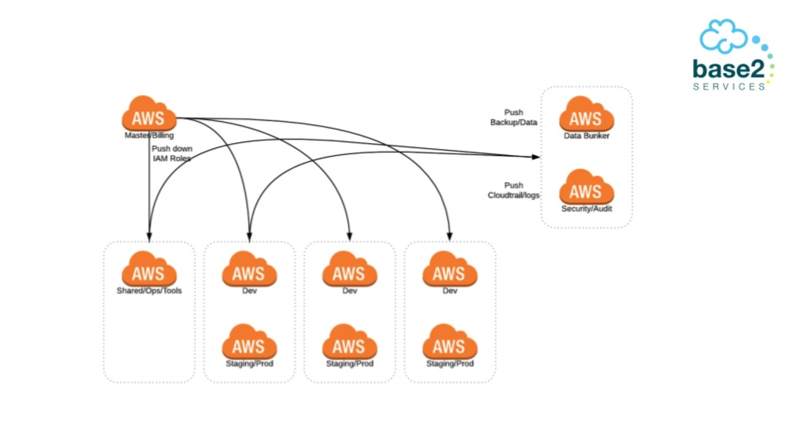

# Notes from the AWS User Group Meeting on 16.10.18

* Use the **5ish Account Structure**
1) Master/Billing (push down IAM roles)
2) Shared/Ops/Tools
3) Dev/Prod (no one should have access to the prod account) only CFN should be able to spin up the resources
4) Data Bunker (push Backup data from Shared/Ops/Tools and Dev/Prod Account)
5) Security/Audit (push CloudWatch/Logs)

[Source](https://www.slideshare.net/aaronpwalker/meetup-aws-berlin-october-2018-account-management-and-aws-organizations)

## Remarks from other AWS Workshop
* Use AWS Organizations to manage your account: AWS Organizations offers policy-based management for multiple AWS accounts. With Organizations, you can create groups of accounts, automate account creation, apply and manage policies for those groups. Organizations enables you to centrally manage policies across multiple accounts, without requiring custom scripts and manual processes.

* In a production account you will only have 1 user. And this user is the user of cloudformation that provisions your resources. There should be no reason to log into your production account. If you need to log in you will have certain roles that can be assumed. You need always create different account that can assume the role to see specific things e.g. billing details. You just create bunch of accounts for different things like finance, security etc. [More Information here](https://aws.amazon.com/answers/account-management/aws-multi-account-security-strategy/)

* You need a specific user that can deploy the cloudformation the resources and this user will have only the access key and this will be used by the user (cloudformation). 
[Source](https://github.com/tarasowski/serverless-pocketguide/blob/master/security/003_account-security-workshop.md)

