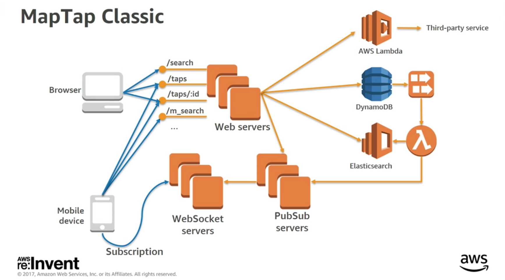
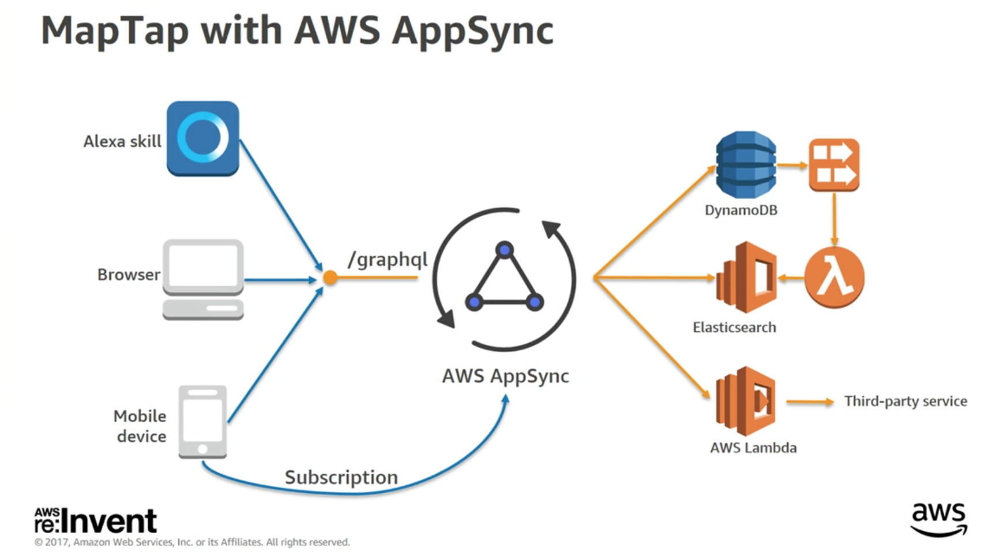

# AppSync + GraphQL

[AWS AppSync Deep Dive (MBL402)](https://www.youtube.com/watch?v=mQBtbHKSdAQ)

If you want to build an app, you need plenty of things to manage:

1. Authentication & Authorization: identity management > Cognito & IAM
2. App needs to run on different devices or platforms
3. You want to run business logic in the cloud (scalable, highly available backend) > Serverless Stack
4. Data that needs to be managed, 
    + synchronisation (like a game app sync scoreboard), 
    + the user state needs to be synchronised, 
    + offile data 
    + data in realtime and sending it to clients from the server (like chats)

Classic way how we are solving this problems right now we are building a RestAPI. You have bunch of endpoints and you make PUT or POST calls. For mobile use cases people are setting up separate Rest endpoints. 
    + Trivial setup 
    + Standart HTTP calls

There are some problems here:
    + You cannot simulate relationship
    + Lists with reduced informations
    + Query support
    + Ordering and pagination
    + Notifications (if the data changes tell the client that something has changed and it can be problematic)

**Is there a better way?**

## Yes, there is! GraphQL

* A query language for APis (It's protocol that clients can use to extract data from the server)
* A runtime for fullfilling queries with existing data (you can add GraphQL on top of your exisiting system)
* A strongly typed contact between client and server applications (consistent language)

In GraphQL there are 3 base operation types. A query language for APIs.

* Queries read data
* Mutations write data
* Subscriptions are pushed data in realtime: It basically listen to all mutations and if a mutation happens it gets updated automatically in realtime

### How does GraphQL work

1. The first step is always to define a data model. SDL (schema definition language)
2. After you define your schema you can start makes queries (everything is strict type and prevents from errors)
3. We can only get information what we need. In GraphQL whatever you request is what you'll get

There are still many problems in managing infrastructure for GraphQL. That's why Amazon has built this service AppSync.

## What is AppSync

* Managed and serverless GraphQL service
* Connect to resources in your AWS account
* Built-in offline support
* Conflict resolution in the cloud (client always win, or server always win who is the source of truth)
* Enterprise level security features (Cognito User Pools, IAM, API keys)
* Simple and scalable realtime synchronization 

## How does AppSync work?

1. Define your schema (data model, queries, subscriptions, invitations)
2. Connect your data sources (at launch we support Labda, DynamoDb, Elastic Search)
3. Client tooling to connect to AWS service and implement it in your application

## Building data-driven apps with AWS AppSync Example/Case Study

What do we need for that?

1. Robust, scalable storage capable of handling millions of events a day (DynamoDb)
2. Geospatial search (ElasticSearch)
3. Realtime update for both mobile and web (GraphQL subscriptions come in)
4. Mobile and web clients (React/React Native)

**Note:** With GraphQL you have only one endpoint and you can get all the information

In AppSync you have:

1. The schema (queries, types and everything else)
2. The data sources (like Lambda or DynamoDb)
3. A resolver: a resolver is a function that is attached to a field and that gets data. It goes and gets data to return for that field in the GraphQL execution. You need to choose the data source because resolver is dependent where the data lives, this particular instance is e.g. a database table
    + Translates the data from GraphQL to the data source (request)
    + Once the function executes and the data comes back from the resolver it gets translated into GraphQL (reponse)

**Note:** Amazon uses Apache Velocity template engine for translating requests back and forth. What is Velocity? Velocity is a Java-based template engine. It permits anyone to use a simple yet powerful template language to reference objects defined in Java code.

## Without AppSync

## With AppSync

We have here the clients they all talk to the same GraphQL endpoint, what AppSync does it takes the GraphQL request converts it to whatever the downstream data sources you are trying to query. It simplifies your stack!

## AWS AppSync Benefits

* Clients receive the data they ask for. Nothing more, nothing less
* Get many resources for many data sources with a single request
* Self-documenting APIs with introspection (Introspection is the examination of one's own conscious thoughts and feelings)
* A strong type system
* More powerful developers tools 
* Simpler API evolution 

