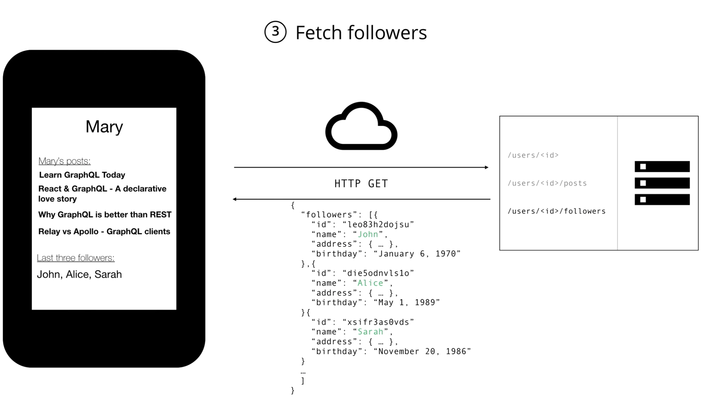
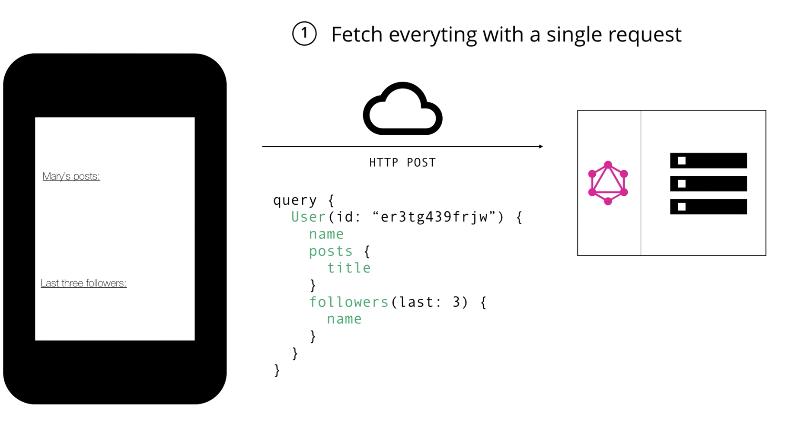
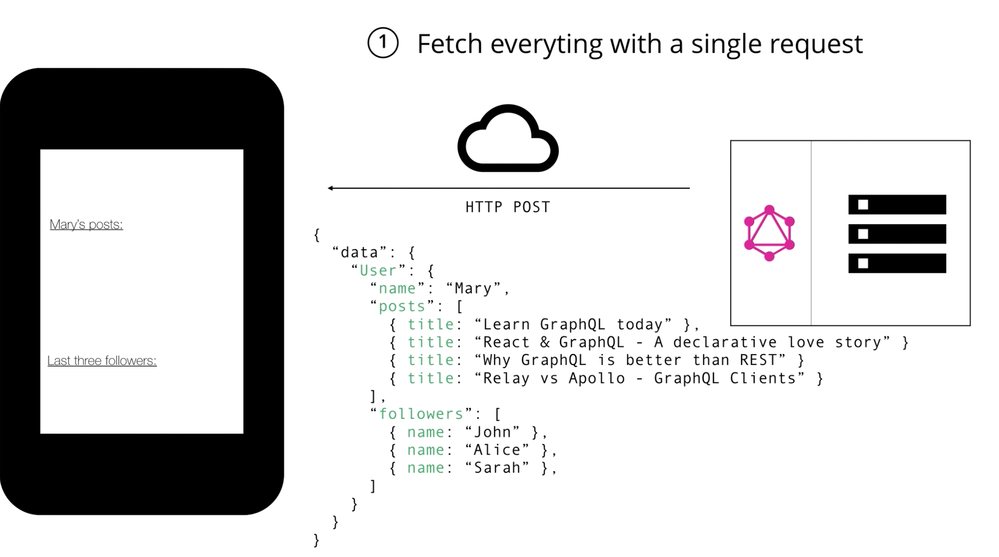

# GraphQL Basics

[How to GraphQL](https://www.howtographql.com/basics/0-introduction/)

What is GraphQL?

* new API standard that provides more efficient and flexible alternative for REST
* developed by Facebook
* declarative data fetching where a client can specify which data it exactly needs from an API
* GraphQL server exposes only a single endpoint and responds with the data the client asks for

## Why we need something better than REST?

* Increased mobile usage creates need to efficient data loading (why fb developed GraphQL)
* Variety of different frontend frameworks and platforms on the client-side (it makes difficult to build 1 API that covers all the requirements of all different clients)
* Fast development speed & expectations for rapid feature development

**Note:** GraphQL can be used anywhere where a client communicates with an API.

## GraphQL is the better REST

GraphQL was developed to cope with the need for more flexibility and efficiency in client-server communication. 

If you want to get name, posts and followers, you need to make 3 http get request (REST). These requests return bunch of unreleated data, it makes it slow, heavy and consume a lot of unrelated data.


With GraphQL you are just making 1 request to a single API endpoint where you describe which data is needed. 



When the server receives that query it will resolve and package it up into a json object that will just returned to the client. 



* With GraphQL there is no Over and underfetching
    + Overfetching: downloading unnecassary data
    + Underfetching: An endpoint doesn't return enough of the right information; need to send multiple requests (n+1-request problem)

**Note:** A common patterns in REST APIs to structure endpoints according to views in your application. The major problem with this approach it doesn't allow for rapid iterations on the UI. With every change that is made on the UI there is a high risk that now there is more or less data is requered. It leads to adjusting the backend and it kills the productivy and slows down the ability to incorporate user feedback into a product. Changes on the client side can be made without extra work on the server. This enables faster feedback cycles and product iterations.

**Some other benefits:**
* GraphQL uses the concept of a resolver functions to collect the data that's requested by the client. Performance of those resolvers provide curtial insights about those bottlenecks in your system

* GraphQL uses strong type system to define capabilities of an API. All types that are exposed in an API are written down in a schema using the GraphQL schema definition language (DSL). This schema also serves as a contract between client and server to define how client can access the data. Once the schema is defined the teams on frontend and backend can work completely independet from each other. Frontend teams can easily test their applications by mocking a required data structures. Once the server is ready the switch can be made for the client apps to load data from the actual API. 

## Fundamental Language Constructs of GraphQL

### Getting Data with Queries

### The Schema Definition Language (SDL):

GraphQL has its own type system that is used to define a schema of an API. The syntax for writing schemas is called the schema defintion language (SDL).

Defining simple types:

```js
type Person {
    name: String!
    age: Int!
}

type Post {
    title: String!
}
``` 

The person type has two fields: name and age. The exclamation point following the type means that this field is required!!!

Adding a relationship between types: (in GraphQL it's simply called a relation). Let's add a relation between posts an person, that says that one person can be the author of many posts.

```js
type Post {
    title: String!
    author: Person!
}
``` 

We first add the `author` field to the post type. Now every post that is created needs to be associated with the person who is the author. 

```js
type Person {
    name: String!
    age: Init!
    posts: [Post!]!
}
``` 
Now we need to add the `post` field to the person type to express that a person can write multiple posts. The syntax to specify that something is a list in the SDL, it's similar to many programming languages it uses []. Notice that we just defined the 1-to-many relationship between the person and the post types.

### Fetching Data with Queries

When working with REST data is loaded from specific endpoints. Each endpoint has a clearly defined structure of the information that it returns. This means that with REST the data requierements are effectivly encoded in the URL that it connects to. The approach in GraphQL is radically different. 

Instead of having multiple endpoints that return a fixed data structures, GraphQL API typically only expose a single endpoint, this works because the structure of the data that is returned is not fixed. Instead it's flexible and client can decide what data is actually needed.

It means the client needs to send more information to the server about what data it needs. This information is called a `Query`. 

```js
{
    allPersons { // root query
        name // payload
    }
}
``` 
The `allPersons` is called the root query, everything that follows the root query is called the payload. In this case the payload is `name`. This particual query will return a list of all the persons that are stored in the database. 

```json
{
    "allPersons": [
        { "name": "Johny" },
        { "name": "Malice" },
        { "name": "Bobby" }
    ]
}
``` 

**Note:** That each person has only the name in the response, the age is not returned by the server. That's because the name was the only field that was specified in the Queries `payload`. If the client also needed to persons age, it needs slightly adjust the query and include the new field in the payload. 

```js
{
    allPersons {
        name
        age
    }
}
``` 

```json
{
    "allPersons": [
        { "name": "Johny", "age": 23 },
        { "name": "Malice", "age": 25  },
        { "name": "Bobby", "age": 30 }
    ]
}

``` 

In a GraphQL query each field can have zero or more arguments if this is specified in the GraphQL schema. For example the `allPersons` field can have `allPersons(last: 2)` parameter to return only a specific number of persons. Here is what our corresponding query would look like. Now the server will return only the last 2 persons that have been stored in the database.

```js
{
    allPersons(last: 2) { // with paramters (last: 2) return only the last 2 entries from the database
        name
        age
    }
}
``` 

```json
{
    "allPersons": [
        { "name": "Johny", "age": 23 },
        { "name": "Malice", "age": 25  },
    ]
}
``` 

One of the major strengths of the GraphQL is that allows for naturally quering nested information for example if you want to load all posts that each person has written as additional information, you can simply the follow the structure of your types to request this information.

```js
{
    allPersons {
        name
        posts {
            title
        }
    }
}
```

The server will now resolve the query and include a list of posts that are associated with each person that is being returned. 

### Writing Data with Mutations

3 kinds of mutations

* creating new data
* updating existing data
* deleting existing data

Mutations follow the same syntactical structure as queries but they always need to start with a mutation keyword. 

```js
mutation {
    createPerson(name: "Bob", age: 36) { // root field of a mutation
        name // payload
        age // payload
    }
}
```
The mutation also has a root field. The root field is called `createPerson` in this case the root field takes two arguments that specifies new persons name and age. We also able to specify a payload for a mutation in which we can for different properties for the new person object. In this case we are asking for the name and the age. Not very helpful here since we know them because we pass them into mutation. 

**Note:** This payload gives us the ability to query information when sending mutations. It allows us to retrieve new information from the service in a single round-trip. The server response for the above mutation will look as follows

```json
{
    "createPerson": {
        "name": "Bob",
        "age": 36
    }
}
``` 
Exactly as with queries the server response with mutations is shaped according to the request. One pattern that you often will find is that GraphQL will have unique ids that are generated by the server. Extending our person type from before we can add an id like this

```js
mutation {
    createPerson(name: 'Bob', age: 36) {
        id
    }
}
```

Now when a person is created you can directly ask for an id in the payload of the mutation. Since this informaiton wasn't available on the client beforehand. 

### Realtime Updates with Subscriptions

For this use case a GraphQL offers a concept of subscriptions. When a client subsribes to an event it will initiate and hold a steady connection to the server. In this example the client subscribes in order to be informed new users being created. Whenever that particular event actually happens the server pushes the corresponding data to the client. 

```js
subscription {
    newPerson {
        name
        age
    }
}
``` 
In the example above it's a name and age. Unline queries or mutations that follow a typical reponse/request cycle, subscriptions represent a stream of data sent over to the client. For each of new entries the server will push the corresponsing data to the subscribed client. 

### Writing GraphQL Schema

* defines capabilities of the API by specifying how a client and fetch and update data
* represents contract between client and server
* collection of GraphQL types with special root types

#### Root Types

```js
type Query {
    ...
}
type Mutation {
    ...
}
type Subscription {
    ...
}
``` 
Each schema will have some root types that define an entry point for the API. These root types are the `Query, Mutation, Subscription` 

### The Query Type

```js
{
    allPersons {
        name
    }
}

type Query {
    allPersons(last: Int): [Person!]!
}
``` 

First to enable the `allPersons` query we need to use a corresponding field to the query type. We also adding the last parameter that we'll use at some point to limit the number of users we want to retrieve. The type of `allPersons` is the list of persons since this is what the query will return. 

### Mutation Type

```js
mutation {
    createPerson(name: "Bob", age: 36) {
        id
    }
}

type Mutation {
    createPerson(name: String!, age: String!): Person!
}
```

Here were are creting `createPerson` fild to the mutation type, since that was the root field that was used when we were sending the mutation. It takes the name and age arguments. the return type of the `createPerson` mutation is a single `Person` object. Logically this is the one that was created by the mutation.

### The Subscription Type

```js
subscription {
    newPerson {
        name
        age
    }
}
type Subscription {
    newPerson: Person!
}
``` 

The root field that we use to subscribe is called `newPerson`. This field needs to be added to our subscription type in our schema. 

### Full Schema

Here we see the full schema that's based on the capabilities of the API, it based on the model of the person and the post types. And we also define the 3 root types. 

```js
type Query {
    allPersons(last: Int): [Person!]!
    allPosts(last: Int): [Post!]!
}
type Mutation {
    createPerson(name: String!, age: Int!): Person!
    updatePerson(id: ID!, name: String!, age: String!): Person!
    deletePerson(id: ID!): Person!
    createPost(title: String!): Post!
    updatePost(id: ID!, title: String!): Post!
    deletePost(id: ID!): Post!
}
type Subscription {
    newPerson: Person!
    updatedPerson: Person!
    deletedPerson: Person!
    newPost: Post!
    updated: Post!
    deleted: Post!
}
type Person {
    id: ID!
    name: String!
    age: Int!
    posts: [Post!]!
}
type Post {
    id: ID!
    title: String!
    author: Person!
}
```

## Architecture Use Cases for GraphQL

GraphQL is only a specification, it's just a long document how the GraphQL server has to behave. If you want to use GraphQL you can do that by going and building a server by yourself. You can do it in any programming language of your choice. You can find the whole document and description of GraphQL [here](http://facebook.github.io/graphql/October2016/)

But you also use services like Graphcool that provides powerful GraphQL service out of the box. In our case we are going to use AppSync for that. 

### Architectural Use Cases for GraphQL

1. GraphQL server with a connected database:
    + often used for greenfield projects (In many disciplines a greenfield project is one that lacks constraints imposed by prior work.)
    + uses single web server that implements GraphQL
    + server resolves queries and constructs response with data that it fetches from the database. When a query arrives at the GraphQL server the server reads the payload and fetches the required information from the database this is called resolving the query, it then constructs the response object as described in the specs and returns it to the client. 

2. GraphQL server to integrate existing systems (thin layer on top of legacy systems, that integrates this system through a single GraphQL API)
    + compelling for companies with legacy infrastructures and many different APIs, that have grown over the years. One big problems with these legacy systems is to build products that needs acccess to multiple systems. 
    + GraphQL can be used to unify existing systems and hide complexety of data fetching logic. This way new client apps can be developed that simply talk to GraphQL server that simply fetches the data from different APIs (existing systems) and packaging it up into GraphQL response format. 
    + The server doesn't care about the what the data sources are (databases, web services, 3rd party APIs)


3. A hybrid approach with a connected database and intrgration of existing system


**Note:** GraphQL is transport layer agnostic, this means it can potentially be used with any available network protocol. It's defenetly possible to implement GraphQL server based on TCP, websocket or any other transport. It also doesn't care about the database or the format it's used to store the data. You could use a sequal DB like Aurora or NOSQL like DynamoDb. 

## Resolver Function

GraphQL is able to cope with all these different environments is the concept of a resolver function. 

* GraphQL queries/mutations consists of set of fields (payload)
* GraphQL server has one resolver function per field (that's called a resolver)
* the purpose of a resolver function is to fetch a data for it's corresponding field


## GraphQL Client

* GraphQL is great for frontend developers as data fetching complexity can be pushed to the server-side
* Client doesn't care where data is coming from
* Opportunity to build new abstractions on the frontend

**Imperative data fetching**
When fetching data from a REST API most apps are going through the following steps: 
    1. Construct and send HTTP request
    2. receive and parse the server response
    3. store data locally (in memory or persistent)
    4. data can be displayd in the UI

**Declarative data fetching**

1. Describe it's data requirements
2. Display the information in the UI

**Note:** Everything that is between should be handled by GraphQL client. All the lower networking tasks and storing the data should be abstracted away. This is what exactly Apollo / Relay are doing, they provide the abstraction that you need to be able to focus on the important parts of your application, rather than having to deal with repetitive implementation of infrastructure and data fetching logic. 