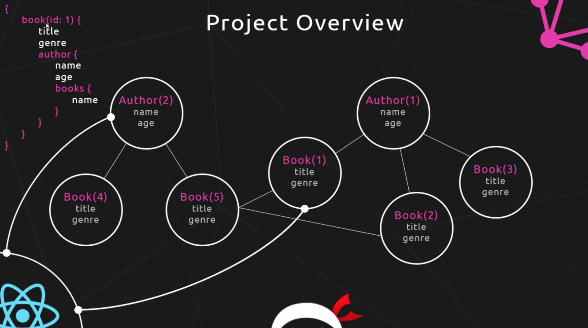

# GraphQL Tutorial NodeJS + React

* [Youtube Video Playlist](https://www.youtube.com/watch?v=Y0lDGjwRYKw&list=PL4cUxeGkcC9iK6Qhn-QLcXCXPQUov1U7f)
* [Github Code from the Lessons](https://github.com/iamshaunjp/graphql-playlist)

This is why it's called a Graph


**Note:** The GraphQL schema is needed to describe the relationship between the types on the graph, how it's structured and how it can walk between those types. The ultimate goal in creating a GraphQL server is to allows queries to jump into our Graph at different points to retrieve data. Schema defines types, second is to define relationship between types, defining root queries (how we describe the user can initially jump into the Graph and grab data)

### The Architecture
* In this example we are going to create a GraphQL server using Express + NodeJs. This is where we are going to describe how our graph looks, different books, authors and relationship between this graphs. We also will define entry points for the requests (what information can be retrieved from it). 
* MongoDB on mLab for storing the data
* On the frontend we'll use React and Apollo that acts as a glue and makes it possible to use GraphQL. 

**Note:** For doing dummy requests without having a frontend we can use a tool Graphiql (something similar like a Postman, but only for GraphQL).

### Resolve Function

```js
const BookType = new GraphQLObjectType({
    name: 'Book',
    fields: () => ({
            
        id: {type: GraphQLString},
        name: {type: GraphQLString},
        genre: {type: GraphQLString}
    
    })
})

const RootQuery = new GraphQLObjectType({
    name: 'RootQueryType',
    fields: {
        book: {
            type: Booktype,
            args: {id: {type: GraphQLString}},
            resolve(parent, args) { 
            }
        }
    }
})
``` 

This is our function where we write code to get data we need from our database or any other source. 


