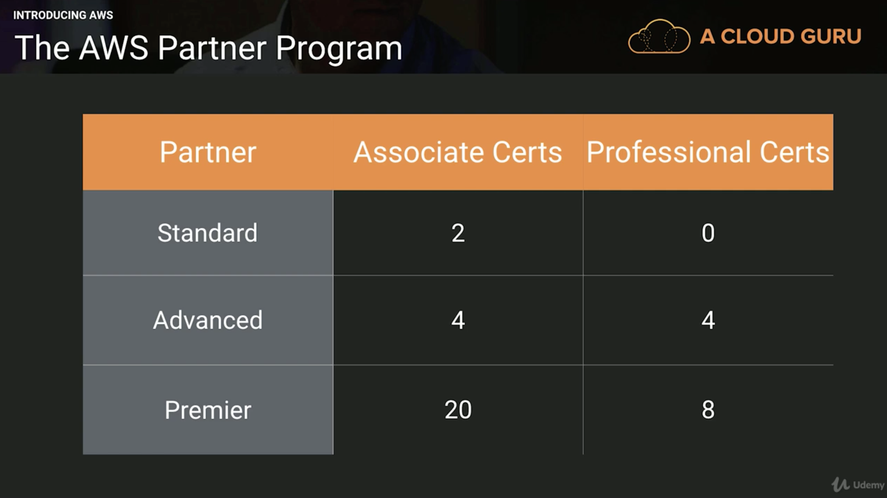
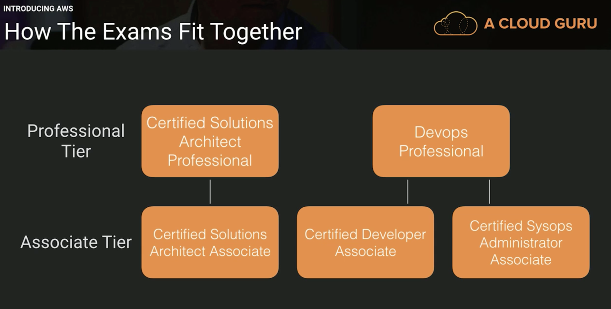
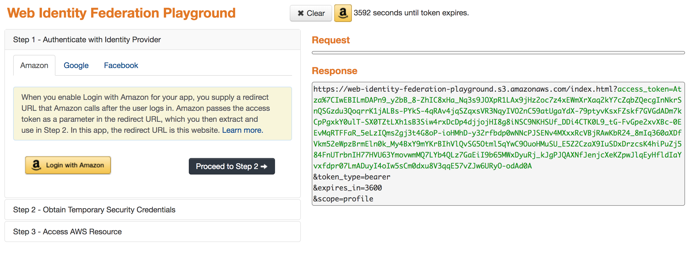
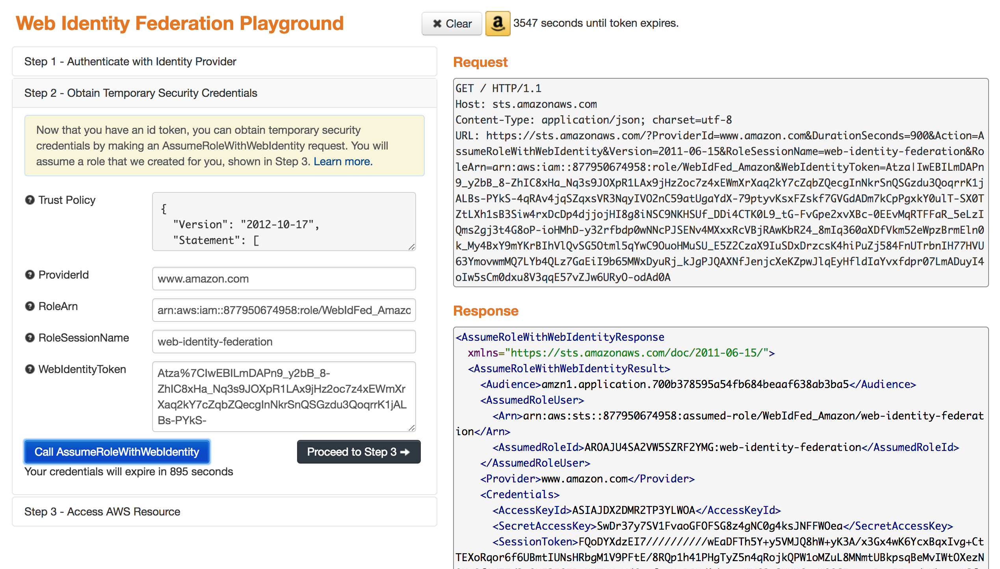
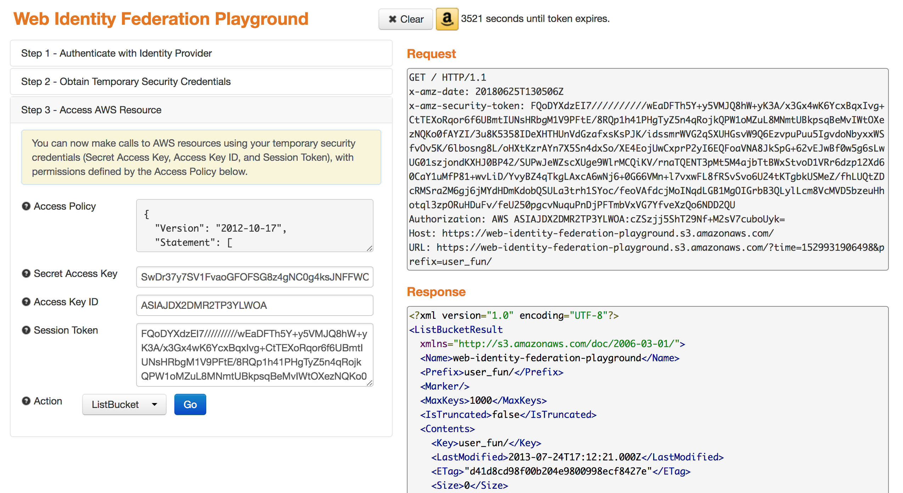
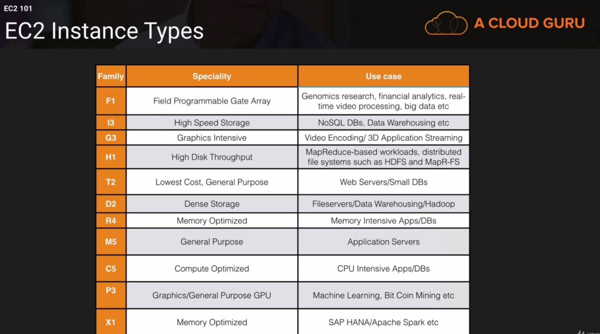
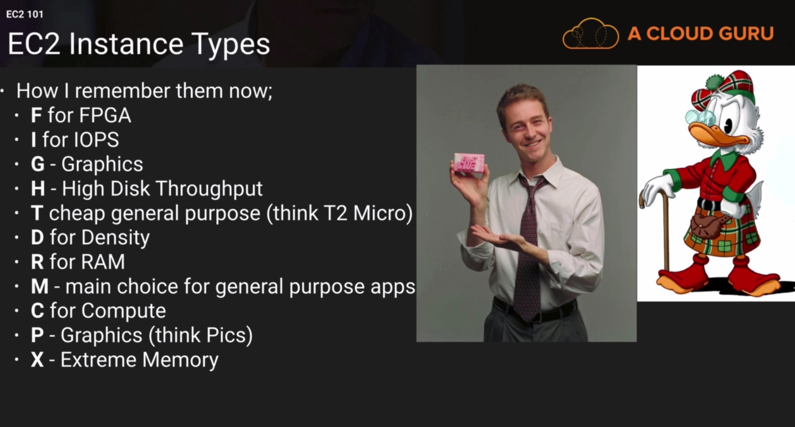
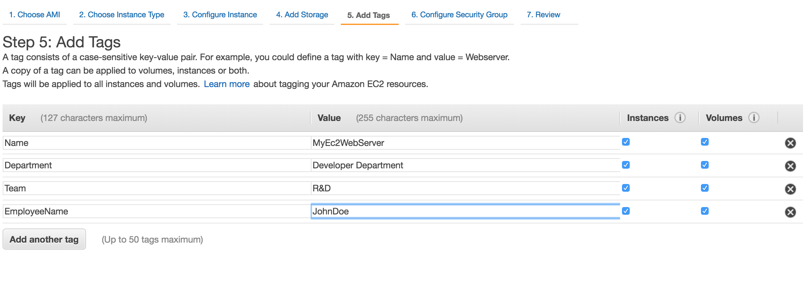
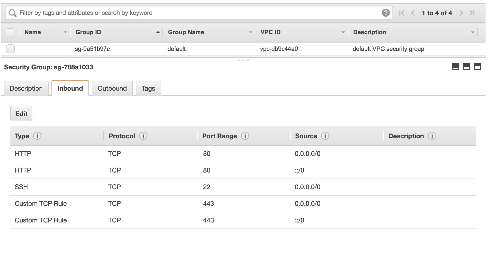
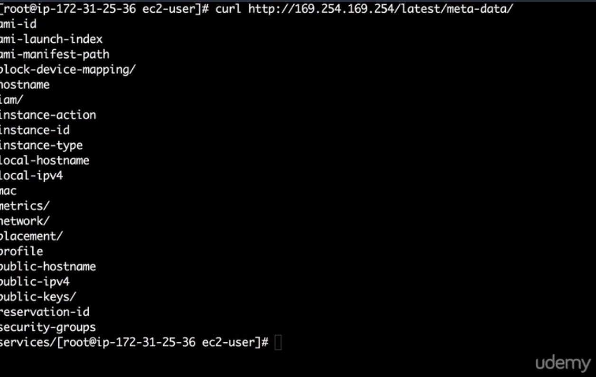

# AWS Certified Developer - Associate 2018

[Source](https://www.udemy.com/aws-certified-developer-associate/)

Why do companies pay more for certified specialists? In order to become an AWS partner to offer consulting or services, companies needs to employ certified employees. The table below shows the amount of certified people that a company needs to be partner of AWS.



Note: If you want to find a job fast, get all 5 certificates and apply at companies that are AWS partners. Here is the [full list](https://aws.amazon.com/partners/find/results/?facets=office+%3A+%27Berlin%27&size=10&start=0&sort=Relevance&view=Grid) of all partners in Berlin.




### From easiest to hardest
* Developer Associate
* Solutions Architect Associate
* SysOps Administrator Associate
* Security Specialty (not online yet)
* Devops Pro
* Solutions Architect Professional


**Note:** JavaScript is for Browser SDK and Node.js is for backend SDK.

* In exam you'll be asked how to make architectural design

* [Exam Blueprint](https://d1.awsstatic.com/training-and-certification/docs-dev-associate/AWS_Certified_Developer_Associate_Updated_June_2018_Exam_Guide_v1.3.pdf)

* How to Build Your Own Amazon Echo with a Raspberry Pi [You can do it](https://lifehacker.com/how-to-build-your-own-amazon-echo-with-a-raspberry-pi-1787726931)

* Invention requires two things: "The ability to try a lot of experiments and 2. not having to live with colleteral damage of failed experiments" by Andy Jassy CEO of AWS

* AWS revenue in 2017 was around $17,6B. This market is huge in comparison Goolge did $109B in revenue.


### AWS 10,000 Foot Overview 


#### Part 1 - AWS Global Infrastructure

* AWS Global infrastructure - services spread all over the world

* 16 Regions and 44 Avaliability Zone
    + A region is just a geographical area like a London, North Verginia, Tokio
    + Each region consists of two or more availability zones. An availability zone is just a data center. So Availability Zones are in the region. The AVz can survive natural disaster. An AZ's is a place where you can put your resources
    + E.g. in Frankfurt (Region) there are 3 availability zones, means there are 3 data centers where you can put your resources

* AWS edge locations are endpoints for AWS which are used for caching content. Typically these are CloudFront, Amazon's Content Delivery Network.
    + There are many more edge locations than regions

* Region is a physical location in the world which consists of two or more Availability Zones (AZ's)
* An AZ is one or more descrete datacenters, each with redundant power, networking and connectivity, housed in separate facilities.
* Edge Locations are endpoints for AWS which are used for caching content. Typically this consists of CloudFront, Amazon's Conttent Delivery Network (CDN)

#### Part 2

**Compute**
* EC2 - Elastic Compute Cloud -> virtual machines inside AWS platforms
* EC2 Conainter Services - run and manage docker at scale
* Elastic Beanstalk - who don't understand EC2 it does automatically everything for the developers
* Lambda - nothing to manage, no virtual machines
* Lightsail - Amazon's VPS (virtual private service), it will provision with the server and ip (nothing to manage)
* Batch - used for batch computing if you want to do batch computing in the cloud

**Storage**
* S3 (Simple Storage Service) - object based storage
* EFS (Elastic File System) - network attached storage
* Glacier - for data archival if you want to archive data
* Snowball - a way to bring large amount of data into AWS datacenter, to bring physically to a disk - you can send them a physical device
* Storage Gateway - virual machines that you install in your data center or your headoffice and it will replicate information to s3

**Databases**
* RDS - relational database service (MySql, Aurora, Postgress)
* DynamoDb - NoSQL (non-relational database)
* Elasticcache - a way of caching commonly queried things from your database service e.g. if you have queries that are often used you can pull them of the elastic cache and not from your database, it will free up your database
* Redshift - for datawarehousing e.g. working with calculations and big data (lot of joins)

**Migration**
* AWS Migration Hub - tracking service allows you to track your apps as you migrate them to AWS
* Application Deiscovery Service - automated set of tool of apps and dependecies
* Database Migratin Service - Easy way to migrate from on-premise into AWS
* Sever Migration Service - helps you to migrate your physical into AWS cloud
* Snowball - used for migration large amount of data to AWS

**Content Delivery/Network**
* VPC (Virtual Private Cloud) - it's a virtual datacenter you can configure firewalls, address ranges, network SLA's, root tables

**Note:** In order to pass any associate exam you need to understand VPC

* CloudFront (Content Delivery Network) - if you have users in Australia and your media files are stored in London, CloudFront goes and stores the data at the nearest location to the users
* Route53 - is a DNS service a DNS service is e.g. like an old school telephone book and you want to lookup for Ms. Smith, you would look up the name and it will give you the telephone number for him, DNS works in a similar way. If you lookup acloud.guru it's going to resolve with IPv4 and IPv6 address
* API Gateway - to create API for other services to talk to
* Direct Connect - a way to run a dedicated line from your corporate headoffice or from y datacenter directly to Amazon and it will directly connect into your VPC 

**Developer Tools**
* CodeStar - a way of getting a group of developers working easily, project management for your code (CI/CD service)
* CodeCommit - store your code (source control service)
* CodeBuild - will compile the code and run tests against it and will produce software packages to deploy it
* CodeDeploy - automation for your deployment
* CodePipeline - continious delivery service
* X-Ray - debug and analyse serverless applications
* Cloud9 - IDE environement (integrated development environment)

#### Part 3

**Management Tools**
* CloudWatch - cloud monitoring service
* CloudFormaiton - infrastructure as a code (solutions architect) - you can reuse your code
* CloudTrail - everytime you click inside your AWS management console e.g. create a new bucket, new users - log changes to the AWS environment -> turned on by default **turn on this service**
* AWS Config - monitors your entire configuration of your AWS environment and has a time snapshot, you can visualize your AWS environment
* OpsWorks - uses shift and puppet for automating your environments
* Service Catalog - manage a catalog of IT services (vp images, databases, multi-tier architecture) - for governance or complience
* System Manager - used for patch maintance, for grouping the resources by departments or apps
* Trusted Advisor - will give you advice across multiple disciplines around security, it will tell you how to save money across AWS, like an accountant
* Managed Services - if you don't have to worry about your EC2, this service will help you out

**Media Services**
* Elastic Transcode - it takes the video from your mac and resizes it to look good on other devives e.g. iphone
* MediaConvert - transcoding service for broadcast
* MediaLive - broadcast video processing service, video streams to TV's
* MediaPackage - prepares video for deliver over the internet
* MediaStore - storage optimized for video
* MediaTailor - allows to do trageted ads into video streams

**Machine Learning**
* SageMaker - for deep learning is around neural networks (more intelligent)
* Comprehend - does sentiment analysis around your product
* DeepLens - artificially aware camera, the camera can figure out what is now filming (go out and detect somebody is coming to your frontdoor if you recognise or not - physical hardware)
* Lex - what powers the Alexa service, communicate with the customers AI chats with your customers
* Machine Learning - analyse the dataset and give you some results. Amazon uses it for recommended products
* Polly - takes text and turns it into speech (sounds like a real humans)
* Rekognition - for image and video recognition
* Amazon Translate - machine translation service like Google Translate
* Transcribe - automatic speech recognition and it allows to turn speech into text

**Note:** Combine transcribe, translate and polly to create content in different languages. You can create an app for your mobile device and you just ask Alexa to order food in french language.

**Analytics**
* Athena - allows to run SQL in your S3 bucket, you can design a sequal query
* EMR - elastic map reduce - used for processing large amount of data for big data solutions
* CloudSearch (better Algolia) / ElasticSearch Service 
* Kinesis - for big data and solutions architect - ingesting large amount of data into AWS e.g. social media feeds or tweets, or hashtag
* Kinesis Video Streams
* QuickSight - business intelligence tool, great BI tool, very cheap and is fantastic for BI
* Data Pipeline - way of moving the data between different AWS services
* Glue - used of ETL (extract, transform, load) for migration of large amount of data

#### Part 4

**Security & Identity & Complience**
* IAM - identity access management (inside out to know)
* Cognito - federated identity servive - device authentication for your apps - temporary access to the AWS resources to authenticated or not-authenticated services.
* GuardDuty - for malicious activity at AWS account
* Inspector - is an agent that you install on your EC instances or virtual machines and run tests to check if they are secure (monthly, weekly) and will generate a report for you
* Macie - will scan an S3 bucket and look for PII (names, addresses, credit card details)
* Certificate Manager - SSL certificates for free
* CloudHSM - hardware security models to store your keys, but you can also store other encryption keys
* Directory Service - a way of integration your microsoft services to aws
* WAF - web app firewall and stops all bad actions from users
* Shield - DDOS mitigation service and you get it default from Route53, CloudFront
* Artifact - audit and compience, you can download there your compliance reports

**Mobile Services**
* Mobile Hub - management console, you use mobile SDK to connect to your AWS backend
* Pinpoint - trageted push notification to drive mobile engagement
* AWS AppSync - GraphQL API service
* Device Farm - a way of testing your apps on real devices
* Mobile Analytics - analytics service for mobile devices

**AR/VR**
* Sumerian - you can build your own world

**Application Integration**
* Step Functions - manage your Lambda functions (state machine)
* Amazon MQ - like RabbitMQ
* SNS - a notification service
* SQS - decoupling your infrastructure (uploads an immage -> SQS -> EC2 instances that are polling that queue -> do something if it -> once done it will be removed from a queue)
* SWF - simple workflow service -> can have human beeings as a component

**Customer Engagement**
* Connect - like a call center in the cloud
* SES - Simple Email Service - great way to send large amount of emails

**Business Productivity**
* Alexa for Business - use it to dial in into a meeting room, reorder an ink for a printer
* Chime - like Google Hangouts or zoom meeting or whatever for video conferencing calls
* Work docs - like a Dropbox for AWS
* WorkMail - like Office365 AWS service

**Desktop & AppStreaming**
* Workspaces - is a VDI solution running linux, windows,mac and streaming down to your device. Like desktop environments in your cloud but you are using your actual device
* AppStream 2.0 - streaming the actual application the app is running in the cloud and you stream it to your device like Citrix

**Internet of Things**
* iOT - managing huge amounts of data
* iOT Device Management - the same
* Amazon FreeRTOS - operating system for your micro-controllers
* Greengrass - AWS Greengrass is software that extends AWS cloud capabilities to local devices, making it possible for them to collect and analyze data closer to the source of information, while also securely communicating with each other on local networks

**Game development**
* GameLift - helps you to create games

### Don't Freak Out

* Solutions Architect Exam Topics (very broad range):
    + Global infrastructure
    + Databases
    + Storage
    + Compute
    + Migration
    + Network & Content Delivery
    + Management Tools
    + Analytics
    + Security & Identity & Complience
    + Application Integration
    + Desktop & App Streaming

* Developer Associate Exam Topics:
    + Global infrastructure
    + Databases
    + Storage (DynamoDb very deep)
    + Compute
    + Network & Content Delivery
    + Management Tools
    + Analytics
    + Security & Identity & Complience
    + Application Integration

**Note:** If you pass the solutions architect you can just go over to developer exam over.

* SysOps Associate Exam Topics (the hardest of all associate exams):
    + Global infrastructure
    + Databases
    + Storage 
    + Compute
    + Network & Content Delivery
    + Management Tools (deep dive into CloudWatch + CloudTrail)
    + Security & Identity & Complience
    + Application Integration

**Note:** You need to understand VPC inside out. It's a make or break of every exam @ AWS

> "Everything changed and nothing stands still" Heraclitus

### Identity Access Management 101

* Centralized control of your AWS account
* Shared access to your aws account
* Granular Permissions
* Identity Federation (including Active Directory, Facebook, Linkedin etc.)
* Multifactor Authentication
* Provide temporary access for users/devices and services where necessary
* Setup your own password retation policy
* PCIDES compliance support

**Critical Terms**
* Users - End Users (think people)
* Groups - a collection of users under one set of permissions
* Roles - you create roles and can then assign them to AWS resources (EC2 instance can have a role to access S3 and can write files directly to S3 w/o username or password)
* Policies - a document that defines one (or more permissions) you attach them to users, groups or roles

**Note** Not all regions have the same services, you need to pick a region that is closest to you.

* Create Account Alias for loging into your AWS account. We need to set DNS entry (which is actually like an address book for IP addresses and IP addresses are connected to servers and servers have open ports that we can access)

* The access key ID and Secret access key can be only used when you programatically interacting with AWS, you can't use them to login into the console the same applies to pssword and user you cannot use it to programatically connect to AWS.

* Permissions === Policies

* IAM roles are a secury way to grant permissions to entities that you trust. Examples of entitties include the following:
    + IAM user in another account (to write to s3 or spin up instances)
    + Application code runnin gon an EC2 instance that needs to perform actions on AWS resources
    + An AWS service that needs to act on resources in your account to provide its features
    + users from a corporate directory who use identity federation with SAML

* IAM roles issue keys that are valid for short durations, making them a more secure way to grant access. Means you  don't need to generate password/usernames to accesst the resources.

* Don't provide god mode (FullAdministratorAccess) to any role!!!

#### Security Token Service (STS)
* Grants users limited and temporary access to AWS resources. Users can come frm three sources:
    + Federation (typically Active Directory)
        + Uses Security Assertion Markup Language (SAML)
        + Grants temporary access based off the users Active Directory credentials. Does not need to be a user in IAM
        + Single sign on allows users to log in to AWS console without assigning IAM credentials
    + Federation with Mobile Apps
        + Facebook/Amazon/Google to login
    + Cross Account Access
        + Let's users from one AWs accont access resources in another

* Federation: combining or joining a list of users in one domain (such as IAM) with a list of users in another domain (such as Active Directory, Facebook etc.)

* Identify Broker: a service that allow you to take an identity from point A and join it (federate it) to point B (from one identity store to another)

* Identity Store - Services like Active Directory, Facebook, Google etc.

* Identities - a user of a service like Facebook etc.

A following scenario can be used:

1. Employee enters their username and password at Active Directory
2. The application call an Identity Broker. The broker captures the username and password
3. The Identity Broker uses the organization's LDAP directory to alidate the employee's identity
4. The Identity Broker calls the new GetFederationToken function using IAM credentials. The call mus tinclude an IAM policy and a duration (1 to 36 hours), alogn with a policy tha specified the permissions to be gratned to the temporary security credentials
5. The Security Toekn Service confirms that the policy of the IAM user mainng the call to GetFederationToken gives permission to create a new tokens and then return four values to the applcation: An access key, a secret access key a toekn and a duration (the token's lifetime)
6. The Identity Broker returns the temporary security credentials to the reporting application.
7. The data storage application uses the temporary security credentials (including the token) to make requests to Amazon S3
8. Amazon S3 uses IAM to verfiy that the credentials allow the requested operation on the given s3 bucket and key
9. IAM provides S3 with the go-ahead to perform the requested operation

**In the Exam - Workflow**
1. Develop an Identity Broker (you need to develop it inhouse) to communicate with LDAP and AWS STS
2. Identity Broker always authenticates with LDAP first, THEN with AWS STS
3. Application then gets temporary access to AWS resources

**In the Exam - Scenario 2**
1. Develop an Identity Broker to communicate with LDAP and AWS STS.
2. Identity Broker always authenticates with LDAP first, gets an IAM Role associate with a user 
3. Application then authenticates with STS and assumes that IAM Role
4. Application uses that IAM role to interact with S3

**Note:** Well, there are LDAP servers and the LDAP protocol. Combined, it's a data store, or a database. It's not relational, but it's just a place to store data, and it's optimized to be efficient at reads more than writes. It doesn't support transactions. Now, it happens to be very popular for storing credentials, but that's by no means its only purpose, and not its original purpose. [Source](https://stackoverflow.com/questions/239385/what-is-ldap-used-for)

* Important Question: Can you authenticate with Active Directory. And the answer is yes with SAML
* Important Question: You always authenticate agains an Active Directory first and then you get the temporary security credentials. 

* You can authenticate your applications using Linkedin/Facebook/Amazon etc. [Web Identity Federation with Mobile Application](https://docs.aws.amazon.com/IAM/latest/UserGuide/id_roles_providers_oidc_manual.html)
- [Checkout Playground](https://web-identity-federation-playground.s3.amazonaws.com/index.html)

* You go to facebook, you login and verify your identity, we receive an accessToken, using this accessToken, we are going to AWS and obtain the temporary security credentials, call the AssumeRoleWithWebIdentity, get access to AWS resources. 





* IAM is universal. It does not apply to regions at this time
* The "root account" has a complete access by default
* New users have no permissions when first created
* Access Key ID & Secret Access for programmatic and Password for the Console
* SAM stands for security Assertion Markup Language

**Note:** The user always assumes a role, it doesn't get it or something else `AssumeRoleWithSaml API`

### EC2 101 - EC2 is a virtual machine in the cloud
* Virual machine in the cloud

* Amazon Elastic Compute Cloud (Amazon EC2) - (just virtual machines in the cloud - previously you need to buy the machines, install them in a data center etc.) is a web service that provides resizable compute capacity in the cloud. Amazon EC2 reduces the time required to obtain and boot new server instances to minutes, allowing you to quickly scale capacity, both up and down, a syour computing requirements change.

* Amazon EC2 changes the economics of computing by allowing you to pay only for capacity that you actually use (no over-provisioning anymore). Amazon EC2 provides developers the tools to build failure resilient applications and isolate themselves from common failure scenario.

#### EC2 Options

* On Demand - allows you to pay a fixed rate by the hour (Windows instances) (or by the second - Linux) with no commitment.
    + Perfect for user that want the low costs and flexibility of Amazon EC2 without any up-front payment or long-term commitment
    + Applications with short term, spiky, or unpredicatable workloads that cannot be interrupted
    + Application being developed or tested on Amazon EC2 for the first time

* Resered - provides you with a capacity reservation, and offer a significant discount on the hourly charge for an instance. 1 Year or 3 Year Terms
    + Applications with steady state or predictable usage
    + Applications that require reserved capacity
    + You can use up-front payments to reduce their total computing costs even further
    + Standard Reserved Instances (up to 75% off on-demand)
    + Convertible Reserved Instances (up to 54% off on-demand) from CPU to memory instance
    + Scheduled Reserved Instances - only during specific times e.g. on fridays

* Spot Instances - enables you to bid whatever price you want for instance capacity, proiding for even greater savings if your applicaitons have flexible start and end times (like a stock market)
    + Application that have flexible start and end times
    + Application that are only feasible at very low compute prices (chemical, pharmacetical companies) use them to save a lot of money
    + Users with an urgent need for large amount of computing capacity

* Dedicated Hosts - Physical EC2 server dedicated for your use. Dedicated Hosts can help you reduce costs by allowing you ttu use your existing server-bound software licences
    + Useful for regulatory requirements that may not support multi-tenant virtualization
    + Great ofr licencing which does not support multi-tenancy or cloud deployments
    + Can be purchased on demand

### EC2 Instance Types



**Note:** Remember the letters and not the numbers!



### What is EBS?
* Virual disk in the cloud

* Amazon EBS allows you to create storage volumes and attach them to Amazon EC2 instances. Once attached, you can create a file system on top of these volumes, run a database, or use them in any other way you would use a block device. Amazon EBS volumes are placed in a specific Availability Zone, where they are automatically replicated to proctect you from the failure of a single component. 

* EBS is just a disk in the cloud that you attach to your EC2 instances. 

* The EBS volume attached to your EC2 where linux or windows is installed is called `root device volume` and then you can have other volumes on top of it. Like windows typically installed on C drive but then you can have additional disks and have a D, F, E drive etc.

#### EBS Volume Types

**SSD**
* General Purpose SSD (GP2) - normal performance
    + General purpose, balances both price and performance
    + Ratio of 3 IOPS per GB with up to 10,000 IOPS and the ability to burst up to 3000 IOPS for exended periods of time for volumes at 3334 GiB and above

**Note:** Input/output operations per second (IOPS, pronounced eye-ops) is an input/output performance measurement used to characterize computer storage devices like hard disk drives (HDD), solid state drives (SSD), and storage area networks (SAN).

* Provisioned IOPS SSD (IO1) - for very high performance applications
    + Designed for I/O intensive applications such as large relational or NoSQL databases
    + Use if you need more than 10,000 IOPS

**Magnetic**
* Throughput Optimized HDD (ST1) - cannot be a root volume / boot volume
    + Big data
    + Data warehouses
    + Log processing
    + Cannot be a boot volume

* Cold HDD (SC1)
    + Lowest Cost Storage for infrequent accessed workloads
    + File Serer
    + Cannot be a boot volume

* Magnetic (Standard) - legacy, old generation
    + Lowest cost per gigabyte of all EBS volume types that is bootable. Magnetic volumes are ideal for workloads where data is accessed infrequently, and application where the lowest storage costs is important.

**Note:** If a spot instance is terminated by Amazon EC2, you will not be charged for a partial hour of usage. However, if you terminate the instance yourself, you will be charged for the complete hour in which the instance ran.

How to remember every instance type?


### Launch EC2 Lab

* AMI - Amazon Machines Images are snapshots of virtual machines on Amazon
    + comes with AWS CLI, Nodejs, Python, Ruby etc.

* If you are e.g. in London you cannot see all EC2 instace types there, just only the available instance types for London

* If you want to launch a dedicated host you need to choose tenancy `Mietvertrag`.

* When you create a new AWS account each region has it's own default VPC. VPC is just a virtual data center, where the resources are hosted.

* Subnets is basically in which availability zone you want to put your EC2 instance. Is just an address block range. A subnet is equal to a specific availability zone. One subnet === One availability zone

**Note:** A computer network, or data network, is a digital telecommunications network which allows nodes to share resources. In computer networks, computing devices exchange data with each other using connections (data links) between nodes These data links are established over cable media such as wires or optic cables, or wireless media such as WiFi. [Source](https://en.wikipedia.org/wiki/Computer_network)

* What happens to storage if you terminate EC2 instance? By default it's going to be deleted. Because `delete on termination` is just pre-defined. Volume is where you going to go boot Linux or Windows from.

* GiB - GibiByte, GigaByte, GB

* You tag resources in order to control your costs



* Security Group: A security group is a set of firewall rules that control the traffic for your instance.

* System Status Check: Verifying your instance is reachable, checking the underlying hyperviser
* Instance Status Check: checking that you can get traffic to operating system (you can reboot)

Note: A hypervisor or virtual machine monitor (VMM) is computer software, firmware or hardware that creates and runs virtual machines. 

* Basic Monitoring Check: it's pinging our machine every 5 minutes to get the data

**Key Points for the Exam**
* Termination Protection is turned off by default, you must turn it on
* On an EBS-backed instance, the default action is for the root EBS volume to be deleted when the instance is terminated
* EBS Root Volumes (where you boot your Linux/Windows) of your DEFAULT AMI cannot be encrypted. You can also use a third party tool (such as bit locker etc.) to encrypt the root volume, or this can be done when creating AMI's in the AWS console or using the API
* Additional volumes can e encrypted

### Security Groups

* A security group is a firewall and it's controlling traffic to your instances. When you first launch an EC2 instance you'll be associated with one or more security groups. You can have 1 EC2 instance with many different security groups

* A security group is the defense line against hackers e.g. lock down SSH behind my IP address

* `chkconfig httpd on` command for always restarting the apache server if the machine reboots

* `yum install httpd -y` to install the apache server

* `sudo su` to change to super user

* Any rules that you apply to your security group applies immediately. E.g. if you change or delete some rules, it will be applied asap.

* If you fixing a security group or add some rules it will be applied again immediately!!!



* Security groups are stateful, if you add a rule that rule automatically will be allowed for outbound that means if you have a rule assigned to inbound it will automatically assigned to the outbound. What comes in is also comes out, it means they are stateful.

* Everything is blocked by default but you cannot deny traffic. You simply allow traffic!

* RDP - Port Range 3389
* MySQL/Aurora - Port Range 3306

* All inbound traffic is blocked by default (you need first to allow traffic)
* All outbaound traffic is automatically allowed by default
* Change to security groups take effect immediately
* You can have any numer of EC2 instances within a security group
* You can have multiple security groups attached to EC2 Instances
* Security Groups are **STATEFUL** (network access coltrol lists are **STATELESS**)
    + If you create an inbound rule allowing traffic in, that traffic is automatically allowed back out again.

* You cannot block specific IP addresses using Security Groups, instead use Network Access Control Lists
* You can specify allow rules, but not deny rules (by default nothing is allowed)

**Exam questions**
* You have in one availability zone an EC2 instance and EBS volume in another. Will be you able to mount that EBS to EC2. The answer is no, because the harddrive is closed to the motherboard as possible. You have your EC2 instance and EBS in the same availability zone.

* You know the `root device` volume based on the snapshot under Volumes.

* If we want to create a new EC2 instance in an other availability zone. We just go to the `root volume`  and create a snapshot. Then you go over to snapshots and click on actions and click on create another volume (e.g. we can change the volume type) and we can change the availability zone and attach it to a new EC2 instance. In order to move the EBS volumes from one AV to another you need to create a snapshot.

* If you copy the snapshot you can move it to another region in the world. Create a snapshot, copy the snapshot to the new region. You can create an image of that snapshot and boot it from EC2 instance.

* Snapshots are used for backups and Images are used to create new EC2 volumes of it.

* You can create an image from an EC2 instance and based on that image launch a new EC2 instance e.g. in a new region. We can also copy AMI and migrate to a new region as well.

* You need to termina all the volumes that are not `root device` volumes, so go and terminate them manually.

**Exam tips**
* Volumes exist on EBS:
    + Virual Hard Disk === Volume
    + Root device volume === where the OS is installed
* Snapshots exist on S3 (you cannot see the bucket, but are stord on S3)
* Snapshots are point in time copies of Volumes
* Snapshots are incremental - this means that only the blocks that have changed since your last snapshot are moved to S3 (you only recording the changes)
* To create a snapshot for Amazon EBS volumes that server as root devices, you shold stop the instance before taking the snapshot.
* AMI === Amazon Machine Image
* You can crate AMI's from both Volumes and Snapshots (and you can mount it to another AZ's or Regions)
* You can change EBS volume sizes on the fly, including chanching the size and storage type (best practice to stop the machine)
* Volumes will ALWAYS be in the same availability zone as the EC2 instance (because hard drives needs to be close to the motherboard) - you cannot EC2 and EBS in different availability zones because of the latency
* To move an EC2 volume from one AZ/Region to another, take a snap or an image of it, then copy it to the new AZ/Region
* Snapshots of encrypted volumes are encrypted automatically
* Volumes rstored from encrypted snapshots are encrypted automatically
* You can share snapshots, but only if they are unecnrypted
    + These snapshots can be shared with other AWS accounts or made public

**Note:** Before you got into the exam repeat this lab again. Lab Name: Upgrading EBS Volume Types. There will be 5 questions in the exam!

### EFS ElasticFile System (still not in the exam)

* Amazon Elastic File System (Amazon EFS) is a file storage service for Amazon Elastic Compute Cloud (Amazon EC2) instances. Amazon EFS is easy to use and provides a simple interface that allows you to create and configure file systems quickly and easily. With Amazon EFS, storage capacity is elastic, growing and shrinking automatically as you add and remove files, so your applications have the storage they need, when they need it.

**Note:** In computing, a file system or filesystem controls how data is stored and retrieved. ... File systems can be used on numerous different types of storage devices that use different kinds of media. The most common storage device in use today is a hard disk drive.

* EFS allows you to mount the volume to two different EC2 instances
* Support the Network File System version 4 (NFSv4) protocol
* You only pay for the storage you use (no pre-provisioning required)
* Can scale up to the petabytes
* Can support thousands of concurrent NFS connections
* Data is stored across multiple AZ's within a region
* EFS block based storage and not object based storage
* Read After Wrtie Consistency


**Object Based Storage**

* Object storage (also referred to as object-based storage) is a general term that refers to the way in which we organize and work with units of storage, called objects. Every object contains three things:
    + The data itself. The data can be anything you want to store, from a family photo to a 400,000-page manual for assembling an aircraft.
    + An expandable amount of metadata. The metadata is defined by whoever creates the object storage; it contains contextual information about what the data is, what it should be used for, its confidentiality, or anything else that is relevant to the way in which the data is used.
    + A globally unique identifier. The identifier is an address given to the object in order for the object to be found over a distributed system. This way, it’s possible to find the data without having to know the physical location of the data


* With block storage, files are split into evenly sized blocks of data, each with its own address but with no additional information (metadata) to provide more context for what that block of data is. 

* Object storage, by contrast, doesn’t split files up into raw blocks of data. Instead, entire clumps of data are stored in, yes, an object that contains the data, metadata, and the unique identifier.

* However, object storage generally doesn’t provide you with the ability to incrementally edit one part of a file (as block storage does). Objects have to be manipulated as a whole unit, requiring the entire object to be accessed, updated, then re-written in their entirety. That can have performance implications.

* Another key difference is that block storage can be directly accessed by the operating system as a mounted drive volume, while object storage cannot do so without significant degradation to performance. 

[Source](https://www.druva.com/blog/object-storage-versus-block-storage-understanding-technology-differences/)

**Note:** Mounting a filesystem simply means making the particular filesystem accessible at a certain point in the Linux directory tree. When mounting a filesystem it does not matter if the filesystem is a hard disk partition, CD-ROM, floppy, or USB storage device.

* By using EFS we can have one file system that is accessed by different EC2 instances, they could be in different Availability Zones in one Region.

* You can have your code in one container in one EFS system and mount it across multiple different EC2 volumes.


### AWS Command Line CLI

* You can install CLI on your instances, your laptop etc.
* Checkout AWS CLI you can destroy instances from the CLI
* Never store the credentials on your EC2 instances or other AWS resources
* IAM roles are global, available across all regions
* You can attach roles to your EC2 instances

**Note:** The command to ssh into your EC2 instance: `ssh ec2-user@54.205.40.189 -i MyEC2KeyPair.pem`

#### CLI Cmmands Developer Associate Exam

* These 3 specific commands you need to know for the developer associate exam:
    + `aws ec2 describe-instances` - all active and terminated instances 
    + `aws ec2 describe-images` - the images that are available to us we can provision instances from. **It can take couple of minutes just sit and wait**
    + `aws ec2 run-instances` - the command to create/launch new instances (start-instances are used to start or stop instances, don't be confused with run-instances)
    + `aws ec2 run-instances --image-id ami-14c5486b --count 1 --instance-type t2.micro --key-name MyEC2KeyPair --security-group-ids sg-788a1033 --subnet-id subnet-2de5e249` [Source](https://docs.aws.amazon.com/cli/latest/reference/ec2/run-instances.html)
    + `aws ec2 terminate-instances --instance-ids i-023290640cc601c12` - if you want to terminate the instances 

### S3 CLI & Regions

* You can attach the role to your EC2 instance (it was new in 2017 or so). You can do it via the CLI or the console.

### Bash Scripting

* You can run a bash script with different commands when you start your EC2 to bootstrap your stack.
* You always start bash scripts with a shebang
* If the command doesn't work just add `--region XXX``
* When you create your bash scripts manually you can troubleshoot and make shure everything is working
* Use `sudo su` to get priviliges

```sh
#!/usr/bin/env bash
yum update -y
yum install httpd -y
service httpd start
chkconfig httpd on
aws s3 cp s3://claudia-udemy-bucket/index.html /var/www/html
```
* What we are doing here above:
    + update all the packages and dependencies 
    + install apache web server
    + start apache web server
    + if the machines reboots restart apache again
    + copy website file from s3 to the directory that is open to the public


```sh
#!/bin/bash
yum update -y
yum install httpd24 php56 git -y
service httpd start
chkconfig httpd on
cd /var/www/html
echo "<?php phpinfo();?>" > test.php
git clone https://github.com/acloudguru/s3
``` 

* You can install an SDK on the EC2 instance and this instance can interact with the AWS resource such as creating new S3 buckets, create new tables in DynamoDb etc.

* You can do the same with Node.js [See here](https://aws.amazon.com/sdk-for-node-js/)
    + Install `npm install aws-sdk`
    + `const AWS = require('aws-sdk)`

### EC2 Instance Metadata

[Read this article - Very important for the exam](https://docs.aws.amazon.com/AWSEC2/latest/UserGuide/ec2-instance-metadata.html)

* Instance metadata is data about your instance that you can use to configure or manage the running instance. 

* Although you can only access instance metadata and user data from within the instance itself, the data is not protected by cryptographic methods. Anyone who can access the instance can view its metadata. 

**Remember for the exam - you use meta data not user data!**
* `curl http://169.254.169.254/latest/meta-data/` - you'll get all the meta data from inside the instance. You need first to ssh into machine, than change to `sudo su` and use the curl command

* `curl http://169.254.169.254/latest/meta-data/public-ipv4`- this is how you can access the public ip. 



**Note:** Metadata is data that describes other data. Meta is a prefix that in most information technology usages means "an underlying definition or description." Metadata summarizes basic information about data, which can make finding and working with particular instances of data easier.

### Elastic Load Balancers

* Load Balancer spread your traffic across different EC2 instances
* Application Load Balancer: they work with the application layer http/https
* Classic Load Balancer: does it's rooting decisions usually at a TCP layer (layer4 balancer)
* Load Balancer Listener Configuration: Basically it says it listen to a specific port to a specific protocol 

**Note:** To discover the availability of your EC2 instances, a load balancer periodically sends pings, attempts connections, or sends requests to test the EC2 instances. These tests are called health checks. The status of the instances that are healthy at the time of the health check is InService. The status of any instances that are unhealthy at the time of the health check is OutOfService. The load balancer performs health checks on all registered instances, whether the instance is in a healthy state (inService) or an unhealthy state (OutofService). The load balancer routes requests only to the healthy instances. When the load balancer determines that an instance is unhealthy, it stops routing requests to that instance. The load balancer resumes routing requests to the instance when it has been restored to a healthy state.

* People go above their free-tier account because they forgot to switch off Elastic Load Balancer and they cost you money!

* DNS resolution: it does convert the DNS e.g of our Load Balancer to the Public IP address of our instance. You don't get the IP address of your ELB (Elastic Load Balancer), you always use the IP address of your EC2 instance


**Note:** One subnet equals one availability zone (remember)

* Instances monitored by ELB are reported as; inService, or OutofService
* Health Checks check the instance health by talking to it `healthcheck.html`
* Have their own DNS name. You are never given an IP address
* Read the ELB FAQ for Classic Load Balancers [here](https://aws.amazon.com/elasticloadbalancing/faqs/)

### SDK's Exam Tips

* Know the available SDK's
    + Android, iOS, JavaScript (Browser)
    + Java
    + .Net
    + PHP
    + Python
    + Ruby
    + Go
    + C++
* SDK's Default Regions
    + Some have default regions (Java)
    + Some do not (Node.js)
    + If you don't set a default region it will always go back to `us-east-1`

### Lambda

**from 2006 to 2018**
1. Data Center
2. IAAS (EC2) - infrastructure as a service - physical machines you need to manage linux, windows, you have to reinstall stuff and patch security updates
3. PAAS (Elastic Beanstalk) - platform as a service - you upload the code and Amazon provision everything for you. But you still managing operation systems
4. Containers (ECS) - isolated, you still have to deploy them into a server, you still have to monitor them and scale them according to the load
5. Serverless (Lambda) - you don't need to worry managing your infrastructure, you just manage your code

#### What is Lambda

* All the stuff below is encapsulated into Lambda
    * Data Centers
    * Hardware
    * Assembly Code/Protocols
    * High Level Languages
    * Operating Systems
    * Application Layer/AWS APIs

* AWS Lambda is a compute service where you can upload your code and create a Lambda function. AWS Lambda takes care of provisioning and managing the servers that you use to run the code. You don't have to worry about operating systems, patching, scaling etc. You can use Lambda in the following ways:
    + As an event-driven compute service whre AWS Lambda runs your code in response to events. These everynt could be changes to data in an Amazon S3 bucket or an Amazon DynamoDb table.
    + As a compute service to run your code in response to HTTP request using Amazon API Gateway or API calls made using AWS SDKs. 

* If there are many users trying to do something like uploading an image, there will be different lambda instances that will be triggered (stateless) and it scales out (adding more and more instances) automatically. Lambda scales out automatically, one function if 1M users try to request the one function, automatically 1M functions will be deployed and that automatically will be returned to the user.

* In order to pass the exam you need to remember different types that trigger the Lambda function:
    
