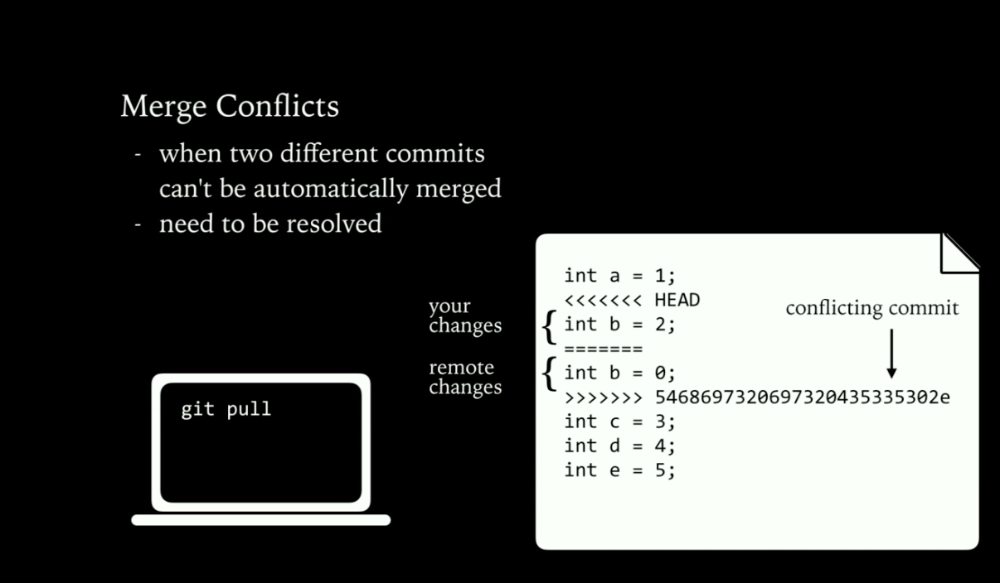
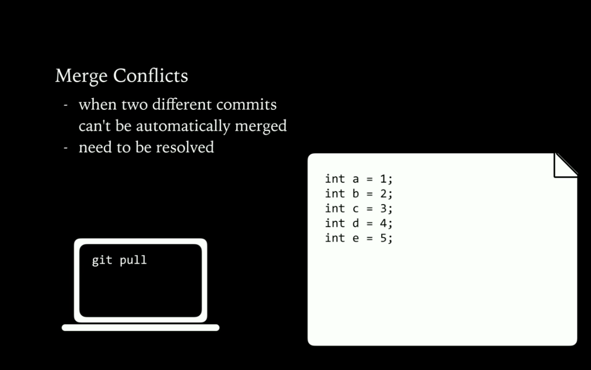

# Github Introduction

[Source - An Introduction to Git and GitHub by Brian Yu](https://www.youtube.com/watch?v=MJUJ4wbFm_A)

## Basic Git Commands

* `git clone <url>` - makes a copy of a repository, stores it on your computer, a fork creates your own copy of someone else repository
* `git add <filename>` - adds a file to the staging area, tells git to include the file in the next revision to the repository, git add * adds all changed files

**Note:** Staging is a step before the commit process in git. That is, a commit in git is performed in two steps: staging and actual commit. As long as a changeset is in the staging area, git allows you to edit it as you like (replace staged files with other versions of staged files, remove changes from staging, etc.).

* `git diff` - shows all the changed that are not added to the staging area
* `git commit -m "message"` - once I have added all the files I want to save, now I need to save the files
    + saves changes to **local repository** as a new version (a 'commit')
    + records a message
    + `git commit -am "message"` adds and commits in same step
    + it saves the new version but also remembers the old version, such as if I want go back to the old version
* `git status` - to gain some insights what's happening to the current repository
    + current status of my repository
* `git push`- sends commited changes to **remote repository**, more explicitly could write `git push origin master`
* `git pull` - retrieves changes from remote repository

## Merge Conflicts
* When two different commits can't be automatically merged
* need to be resolved



* To resolve the conflict you can delete all the unecessary stuff and commit the new version as in example below



## Rollback Your Changes
* `git log` - shows the history of commits and messages
* `git reset` - I made a change, but want to go back to the previous version of the code
    + `git reset --hard <commit hash>` reverts back to the previous commit
    + `git reset --hard origin/master` reverts code back to remote repository version

## Branching

Branching allows you in a single repository to have different versions of code that are going on simultaneously. You can develop stuff in parallel and do all the things that you can do on the master branch. And only if you are ready you can merge it back into the master branch, so you have 1 working version.

* Branch is a version of the repository
* Each branch has its own history and current version of the code

* `git branch` is the command you would use to create a new branch
    + shows all branches of code
    + create a branch with `git branch <branch_name>` (it will be the copy of master)
    + switch to (checkout) a new branch with `git checkout <branch_name>`
    + `git branch -r`- are the remote branches on e.g. Github in most cases this is going to be `origin/...` 

* `git merge` is the command we would use to merge two different branches together
    + `git merge <branch_name>` merges the branch <branch_name> with current branch.

* `git branch -D <branch_name>` you can delete the branch if you don't need it anymore
    + `git push origin --delete {the_remote_branch}` - To remove a remote branch from the server:


## Pull Requests

If you made a change to repository in a separate branch or in a fork (your version of someone else's repository). Sometimes you want to do a request to merge it into the original version. This is where you would submit a `pull request`

---
# Github Introduction

[GitHub Training & Guides](https://www.youtube.com/watch?v=noZnOSpcjYY&list=PLg7s6cbtAD15G8lNyoaYDuKZSKyJrgwB-)

Git stores everything on your laptop e.g. if you don't have any internet connection you can store your code, versions etc. If you get back that internet connection you can send the data back to the remote server. You can start with a repository on your local machine, if you need to collaborate with some one else you can host it on e.g. Github.com

* [Install Git on your Machine](https://git-scm.com/book/en/v2/Getting-Started-Installing-Git)

* `git init <projectname>` - it will create a new folder right there in our file system and will initiate a new project we want to work on, also it will have a `.git` folder that contain some setup simple files. This is where everything gets saved as we work on our project. The good part about `.git` folder is that everyone on the git/github tools writes to it and saves all the changes.

* `git remote add origin https://github.com/githubstudent/project1` - when you want to interact with a different people e.g. you can use github.com or someone else laptop, you can set that up by creating a different address inside your config file. This offers the possibility to setup where the data needs to be sent to or to get data from. By doing so you let Git know that there is thisa address where you can send information to or get the information back.
    + `git remote set-url origin https://....` - if you want to change the remote URL
    + `git remote rm origin` - if you want to delete the remote url
    + `git remote -v` - to get all remote urls listed

**Note:** Your primary work still happens on your laptop, but if you need to collaborate with others and share that code with them, you need to use `git push` or `git pull` commands

* `cat .git/config` - use this command inside the folder to see the content of a file.

```cli
[remote "origin"]
        url = https://github.com/tarasowski/github-school.git
        fetch = +refs/heads/*:refs/remotes/origin/*
``` 
The cat (short for “concatenate“) command is one of the most frequently used command in Linux/Unix like operating systems. cat command allows us to create single or multiple files, view contents of file, concatenate files and redirect output in terminal or files.


* `git config --global user.name`, `git config --global user.email` - checkout if your name and email is set correctly so your contribution will get attributed correctly.

* `git config --global core.autocrlf true`, `git config --global core.autocrlf true` - normalization of files from different platforms. 

* `git config --global color.ui auto` - setting up the colors like red/green/blue etc. 

Note: The whole point of using source control system is to keep track of changes. In git these are called `commits`. 

* `git status` - is going to tell you what files needs to be commited. It will show you the files that have been changed or maybe new files added since the last commit.

* `git add -A` - to take this changed and to make them ready to be commited use this command. It puts the files in a special tunk called the staging area. You can see that they have been moved to the staging are by using the status command. 

**Note:** Every time you `commit` a change it needs to go through a staging area. It's a key part of Git architecture. The staging are gives you a lot of flexibility to decide what changes become a part of what commit. (A stage or staging environment is an environment for testing that exactly resembles the production environment. In other words, it's a complete but independent copy of the production environment, including the database.)

* `git commit -m "message"` or `git commit -am "message"`- the second command adds and commits the files at the same time. 

**Note:** If we do commit, we get the message and at the end of the message we are getting something like (77%). This is called the similarity index, how similar the content was.

* `git diff` - if you want to examine how content has changed, there are 3 main ways to do that with `diff` (what changes to have made to your files that you haven't staged yet)
    1. `git diff` - you will get an overview about your working tree (just your files) differs from your staging area
    2. `git diff --staged` - suppose you have already staged those files and you want to know how your things in the staging area are different from your most recent commit in history. Just you have staged your files you can change them again, the status command will tell you that the file is changed and has unstaged changes at the same time.
    3. `git diff HEAD` - compares your working tree with the HEAD (HEAD = the most recent commit in the history). You can use it to compare two branches within one another or two prior commits in the history to get an idea what changes have been placed in the past.
        + The reporting is a little bit verbose, when I change only one word, git tells me that I have changed the entire line. If you want to see exactly what has changed you can add `git diff --color-words` or `git diff --word-diff` and you'll get an overview about the exact changes.

* `git log` - you can see the commit ref (unique identifier) for each commit `903Jd0349543....` that git generates each time you make a commit to your repository. 
    + `git log --oneline` - will show the quick summary what our commits are, the commit message and commit identifier (ref).
    + `git log --stat` - we can see not only the commit message/commit ref abut also the files that were commited.
    + `git log --patch` - that will show you the `diff` between each of the subsequent commits. 
    + `git log --oneline --patch` - chain the command together
    + `git log --graph --all --decorate --oneline` - one line summary for each commit, is going to show all of the commits and provide lables to branches
    + `git log --stat -M --follow -- <fileDirectory/filename>` - shows all the commits for that file
    + `git log --oneline --decorate --graph --all -10`- shows the commits with merges

* `git rm <filename>` - if you want to delete a single file you can use this command, it removes the files from the file system and stages the fact that the file has been deleted. When you commit that file it's gone from future commits.
    + `git add -u .` - if you want to delete a lot of files. If you do delete the files form your finder (not from the CLI), you can use this command to add the changes to the staging. This command will go through a working tree, check the files it saw before and that are now not available anymore and it will stage them as new deletions. `.` in the command means for the current directory!
    + `git rm --cached <filename>` - if you want to remove a file without deleting it from your file system (you want to track git not to track this file anymore, but leave it there in the working tree). It stages the deletion.

* `git mv <filename>` - in git removing and renaming is the same thing. If you want to move a file from one directory to another directory, just `git mv header.jpg source/header.jpg` `git mv <filename> <targetDirectory/filename>`
    + `git add -A .` - if finds all of the new files where they have been moved to and deletes all of the old files and interprets this as moves have taken place. `.` tells git start with the current working directory and recurs all the way down as far as you can go! 

**Note:** if you want to open a folder that you are inside the terminal you can simply use `open .` command to open the folder in the finder

* `.gitignore` - allows us to avoid staging or commiting files to our git repository 
    + `touch .gitignore`
    + `git add .gitignore`
    +  `git commit -m "Preparing to ignore temporary files"`
    + `.gitignore` file can contain:
        - filenames `.sass-cache`
        - wildcards `*.logs`
        - directories `temp/`
    + `git ls-files --others --ignored --exclude-standard`- to see all the files that are ignored

* `git branch <branchName>` - start working on new features by creating a new branch
    + `git branch -D <branchName>` - delete the branch
    + `git checkout <branchName>`- change to a new branch in order e.g. to delete old one

* `git checkout <commit hash>`- you can checkout how the files were looking at any specific commit. It's called `detaching the HEAD`. This isn't the place where we want to make any commits, this just of way of checking how our working tree looked like at some specific time. Once you are finished just be sure to go to the recent commit version (HEAD) e.g. `git checkout <branchName>`

* `git checkout --<fileName` - to edit or throw aways files we don't want to use anymore. If we want to throw away those changes, we would run this command. What it does for us is writes that files content from the last commit. 

* `git checkout -b <branchName>` - if you want to create a branch and checkout all in one step just run this command. It will create the branch and checkout all in one step.

* `git merge <branchName` - bringing branches together. By merging we are brining the history of two or more branches together and showing the working tree with the cumulated efforts across all the commits across those branches. 
    1. `git checkout master` - change to master branch
    2. `git branch` - identify the commits we want to bring in
    3. `git merge <branchName>`- put a branch name that we want to merge to `master`
    4. `git log -2` - show the last two entries

* `git merge --abort` - if there is a conflict and you don't want to resolve it yet, use this command to clean up your working directory and staging area as well. 


### Remote & Network

* `git branch -r`- are the remote branches on e.g. Github in most cases this is going to be `origin/...` 

* `git fetch origin` - goes to github.com grab that information and bring it down and put it inside our remote tracking branches

* `git pull`- it brings the information down and do the merge to the local version of it's branch name itself. If we e.g. `git checkout feature1` and do `git pull origin` it pulls all the information that origin (Github) knows about feature one and do the merge into feature1

* `git push origin` - if we want to send something from our local computer to github.com and it saves any information up to github.com

* `git reset` - when you have changes in the staging area, we can use the command
    + `git reset HEAD` - that allows to take out this changes out of the staging, put them back into the working directory with the mixed options
    + `git reset --soft Head~5`- bring the last 5 commits all togher into the most recent one 
    + `git reset --hard HEAD~3`- is when you want to throw commits and don't want to share them with others. You can use this command to throw the last 3 commits away. 


