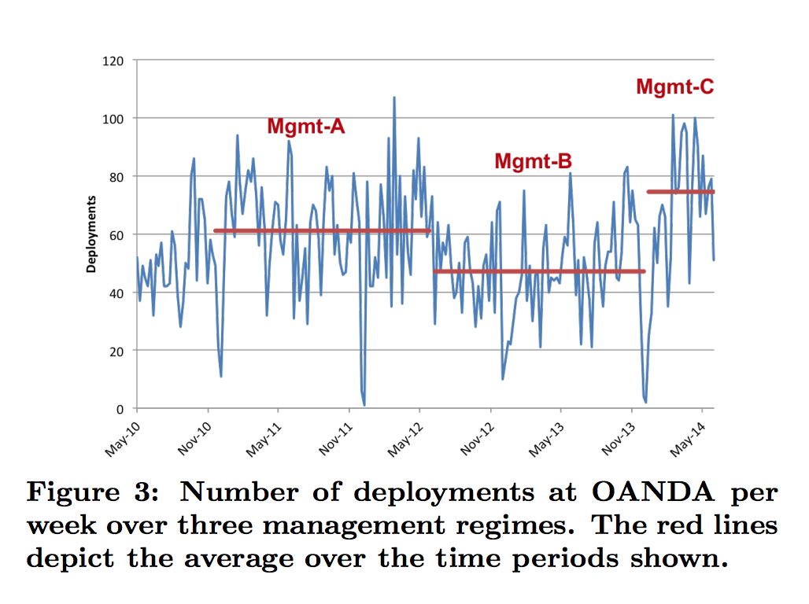

# Continuous Deployment of Software at Facebook (Showcase)

## Continuous Deployment at Facebook and OANDA

* [Continuous Deployment at Facebook and OANDA](https://research.fb.com/wp-content/uploads/2017/01/paper_icse-savor-2016.pdf)

### 1. INTRODUCTION
* Continuous Deployment: Continuous deployment is the software engineering practice of deploying many small incremental software updates into production, leading to a continuous stream of 10s, 100s, or even 1,000s of deployments per day.

* Continuous Integration: Continuous Integration (CI) is a development practice that requires developers to integrate code into a shared repository several times a day. Each check-in is then verified by an automated build, allowing teams to detect problems early.

* Continuous Delivery: Continuous Delivery is the ability to get changes of all types—including new features, configuration changes, bug fixes and experiments—into production, or into the hands of users, safely and quickly in a sustainable way.

* To the best of our knowledge, this is the first study to show it is possible to scale the size of an engineering team by 20X and the size of the code base by 50X without negatively impacting developer productivity or software quality.

* Continuous deployment is the process of deploying software into production as quickly and iteratively as permitted by agile software development. Key elements of continuous deployment are:
    1. software updates are kept as small and isolated as reasonably feasible;
    2. they are released for deployment immediately after development and testing completes;
    3. the decision to deploy is largely left up to the developers (without the use of separate testing teams); and
    4. deployment is fully automated.

**Note:** This practice leads to a continuous stream of software deployments, with organizations deploying 10s, 100s, or even 1,000s of software updates a day.

* At Etsy, another early adopter which reported over 11,000 software deployments in 2011 [2], newly hired software developers are assigned a simple bug to find and fix on their first day of work, and are expected to deploy their fix to production servers within a day or two — without supervision and without a separate testing team.

### 2. CONTINUOUS DEPLOYMENT

* Software is developed iteratively with cycles as short as a day. 
* The process of updating software on PCs, smartphones, tablets, and now cars, has largely been automated and can occur as frequently as daily, since the updates are downloaded over the Internet. In these cases, software is deployed continuously to a beta or demo site, and a cut is taken periodically (e.g., every two weeks for iOS) to deploy to production. 
* Continuous deployment process:
    1. First, software is updated in relatively small increments that are independently deployable;
    2. Second, software updates are the responsibility of the software developers who created them.
* A continuous deployment process includes the following key practices:
    1. **Testing.** Software changes are unit- and subsystemtested by the developers incrementally and iteratively, as they are being implemented. **A separate testing group** is not generally used. Developers begin integration testing to test the entire system with the updated software. For this, developers may use virtual machine environments that can be instantiated at a push of a button, with the target system as similar to the production environment as possible. 
    2. **Code review.** Code reviews are prevalent in continuous deployment processes. Because developers are fully responsible for the entire lifecycle of the software.
    3. **Release engineering.** Once the developer determines the software is functionally correct and will perform as expected, she identifies the update as ready to deploy. This identification might occur by committing the update to a specific code repository.
    4. **Deployment.** Software is deployed in stages. Initially software updates are deployed onto a beta or a demo system. Only after the new software has been running without issue on the beta or demo site for a period of time, are they pushed to the final production site. Beta/demo sites have real users and are considered production sites. Generally, the release of deployed software occurs in stages:
        + **blue-green deployments:** A deployment strategy where a defective change to a production environment (blue) can be quickly switched to the latest stable production build (green). The change may initially be made available to, for example, 1% of the client base in a specific geographical location, thus limiting exposure (and with it, reputational risk), and only when confidence increases that the software is running properly is the fraction gradually increased, until it ultimately reaches 100%. When problems are detected, the fraction is quickly reduced to 0%.
        + **dark launches:** A deployment strategy where changes are released during o↵ peak hours; or where code is installed on all servers, but configured so that users do not see their e↵ects because their user interface components are switched o↵. Such launches can be used to test scalability and performance [14] and can be used to break a larger release into smaller ones.
        + **staging/baking:** A stage in the deployment pipeline where a new version of software is tested in conditions similar to a production environment. An example of this is called shadow testing where production traffic is cloned and sent to a set of shadow machines that execute newer code than production.

**Note:** There are deployment tools that can also roll-back any previous deployment, which may be necessary when a serious error is detected after deployment. Automating the roll-back minimizes the time from when a critical error is identified to when it is removed, and ensures that the rollback is executed smoothly.

* Each Facebook developer releases an average of 3.5 software updates into production per week. Each update involves an average of 92 lines of code (median of 33) that were added or modified.

### 4. QUANTITATIVE ANALYSIS

* Each Facebook developer releases an average of 3.5 software updates into production per week. Each update involves an average of 92 lines of code (median of 33) that were added or modified.
* Each OANDA developer releases on average 1 update per week with each update involving 273 lines of code on average (median of 57) that were added or modified. 

#### 4.3 Human Factors

*  As an example, OANDA had a number of executive changes in the past four years with most other factors relatively constant. It started with management team (Mgmt-A) having an engineering background and supporting continuous deployment. In mid 2012, management was replaced with executives having a business background (Mgmt-B). Their inclinations were more towards more traditional software engineering processes. At the end of 2013, executive management was replaced again (MgmtC). This team had a Silicon Valley background and was well
versed with and supportive of continuous deployment. Figure 3 shows the e↵ects of management on productivity levels. For example, the average number of deployments dropped by 23% after Mgmt-B took control, despite other
factors such as the engineering team remaining largely unchanged. Perhaps most surprising is how quickly productivity changes occurred after new management was introduced.

#### 5. LESSONS LEARNED

* To thrive in an continuous deployment environment, developers need to be: (i) generalists with the ability to understand many aspects of the system; (ii) good at firefighting and systems debugging; (iii) bottom-up capable, willing and able to be responsible (and accountable) for making sound deployment decisions, taking quality, security, performance, and scalability into account; and (iv) able to work in an organization that some see as disorganized and perhaps chaotic;

> Being a generalist is particularly important when working on complex software, such as backend systems. Generalists require a broader set of skills and a mindset to be able to reason with systems that they haven’t developed and don’t have intimate knowledge of.

* As with other agile methodologies, organizations embracing continuous deployment tend to have a strong bottom-up culture with developers making many key decisions. Organizations are flatter, as managers can have an increased number of direct reports. However, a di↵erent type of manager is needed because they play a di↵erent role: they influence rather than operate within a chain of command. We find that in this environment, it is critical that managers be respected by the developers. Being technologically excellent makes this easier. As a
result, management roles are often filled by promoting from within.

* A testing group dilutes this accountability, especially during times of system failures – opinions often disagree in whether the failure was due to a system test escape or **poor development practices because not everything is testable**. In our experience, diluting responsibility of ownership increases the time to resolution of system failures.

---

## Continuous Deployment of Mobile Software at Facebook

* [Mobile Software @ Facebook - Source ](https://research.fb.com/wp-content/uploads/2017/02/fse-rossi.pdf)

* Additionally, the data we present shows that dog-fooding and obtaining feedback from alpha and beta customers is critical to maintaining release quality.

* Continuous deployment is the software engineering practice of deploying many small incremental software updates into production as soon as the updates are ready.

* At Facebook each deployed software update involved, on average, 92 Lines of Code (LoC) that were added or modified, and each developer pushed 3.5 software updates into production per week on average.

* In particular, they were responsible for testing their own code, as there was (by design!) no separate testing team. The only requirement was peer code reviews on all code before it was pushed. However, there was considerable automated support for testing and quality control. As soon as a developer believed her software was ready, she would release the code and deploy it into production.

* Codes is deployed into production and the rist is managed through including blue-green deployments [7], feature flags, and dark launches [8].

* Developers push their mobile software updates into a Master branch at the same frequency as with cloud
software and in similarly-sized increments. The developers do this whenever they believe their software is ready for deployment. Then, periodically, a Release branch is cut from the Master branch — once a week for Android and once every two weeks for iOS. The code in that branch is tested extensively, fixed where necessary, and then deployed to the general public.

**Note:** The stabilization, soak, review, and deployment with the Release branch takes two week, while new software updates are continuously being pushed to the master branch during the same two weeks until the next Release branch is cut from the Master branch.

#### Development Workflow @ Facebook
* The developer forks a local revision control system branch from the Master branch. Updates to the software are made to the local branch with frequent commits. After proper testing and when the developer believes her software update is ready for deployment, she pushes the updates into the Master branch. As we show in §5, each developer pushes such updates into the Master branch 3-5 times a week. (In this paper, we use the term push exclusively to refer to the pushing of the local development branch up into the Master branch;)

**Note:** A fork is a copy of a repository. Forking a repository allows you to freely experiment with changes without affecting the original project.

* Feature Toggle - A notable coding practice encouraged at FB is the use of a mechanism called Gatekeeper, that allows one to dynamically control the availability of features on the mobile device. In effect, this mechanism provides the ability to dynamically turn on or off a mobile-side feature from the server side, even on devices in client hands. Hence, if a newly deployed feature misbehaves, it can be turned off. This mechanism can also be used to incrementally turn on new features in a targeted way, say by targeting the OS, the specific OS version, the hardware device type, the specific hardware device model, the country, locale, etc. 

* For Android, FB also releases Alpha and Beta versions of the app. Alpha (dev) is shipped from the Master branch once a day. It is made available through the Google Play Store to a small fraction of external users consisting of several 10,000 users. Beta (staging) is shipped from the Release branch once a day and made available to a larger fraction of external users (around 3 million).

#### Testing: Tests and when they are run

* **Pre-Push Testing.** A developer will frequently run unit tests on her PC/laptop while developing code. Given the size of the apps and the limited power of the development PCs and laptops, more extensive unit tests will be run on servers in simulation environments. The developer can also manually invoke any of the other tests listed in the table, with static analysis and some integration testing being the most common ones invoked. Finally, a subtle point, while there is no separate testing team, a code review is required before any code can be pushed to the Master branch.

* **On Push.** When the developer believes her changes are complete and work correctly, she initiates a push of her changes to the Master branch. Before the actual push occurs, a number of tests are run automatically to determine whether the push should be blocked. These include standard unit tests as well as a number of smoke tests that verify that heavily used features and their key flows work correctly. Moreover, a test is run to ensure a build with the changes works correctly. However, since a full build is time and resource intensive, the build test here only tests dependencies a few levels deep.

**Note:** The changes are pushed onto the Master branch if all tests pass. The merging process may identify conflicts, in which case the developer is alerted so she can address them.

> Continuous testing on Master and Release branch. All of the tests are run continuously (every few hours) on
both the Master and the Release branch. The most important of these are the full build tests, integration regression tests, and performance tests in the mobile device lab. As mentioned in §2, alpha versions are built from the Master branch (twice a day for iOS and once a day for Android) and beta versions are built from the Release branch three times a day. Release of the alpha version of software is blocked if a certain percentage of tests fails.

* **Manual Testing.** A contracted manual testing team (of about 100) is used to test the mobile apps. They do various smoke tests and edge-case tests to ensure the apps behave as expected. The testing team is primarily used to test new features for which automated tests have not yet been created. Finally, they are responsible for UI testing after language translations have been added to assess the quality of the look and feel.