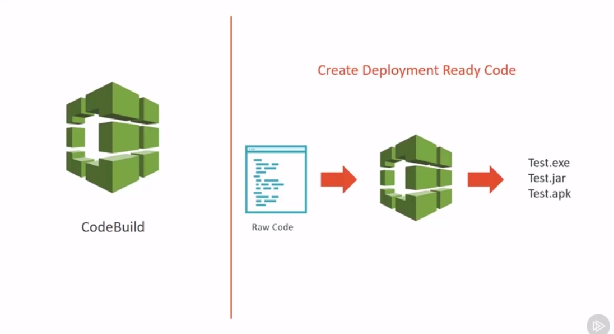
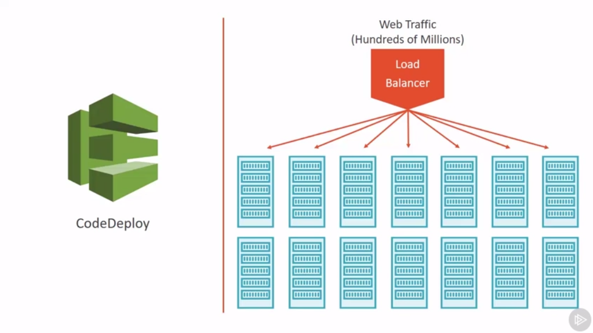

# Getting Started with AWS Developer Tools

[Source - Pluralsight Course](https://app.pluralsight.com/library/courses/aws-developer-tools-getting-started/table-of-contents)

## CodeCommit: 

* Fully-maanged source control service
* Powered by Git
* Backed by AWS Technology 
* **Purpose:** Commit and store your projects (code)
---

## CodeBuild:

* Fully managed build service
* Compile source code, run tests
* Produce software package
* Usually this word build comes from the compiled languages where you have to build/compile your code
* In case of JS/Python, you can run your package, run on node instance and see if it passes a set of unit tests. **If any of this things fail, the build itself will fail!**
* **Purpose:** Create deployment ready code. CodeBuild runs tests and puts the code into it's final deployment form. So we just need to download and install.    

---

## CodeDeploy:

* Automated deployment service
* Deploys to multiple instances at once
* Scalable deployment service

**Note:** This service helps to deploy to many machines at the same time. Imagine a case where you have 10M per day traffic to your website. Usually in front of it there is a load balancer that distributes the traffic among many different machines. So if you need to deploy a new version of code, CodeDeploy would do it automatically to all of your machines behind the load balancer.

## CodePipeline:

* Continuous integration and delivery service
* Your code goes from commit to production in the most reliable way
* Configurable workflow (pick and choose the tools you need)
* **Purpose:** Creating of automated code delivery for your software needs. It connects each individual tool and brings them together. It creates full workflow or pipeline.

### Development Workflow:

* Code Storage and Management
* Package creation and testing
* Deployment

**Note:** If we would restrict ourselves to use only AWS services such as CodeCommit, CodeBuild, CodeDeploy. We can combine these services all together. But if we want to use other 3rd party services for our development workflow, for that reason we can use CodePipeline.

