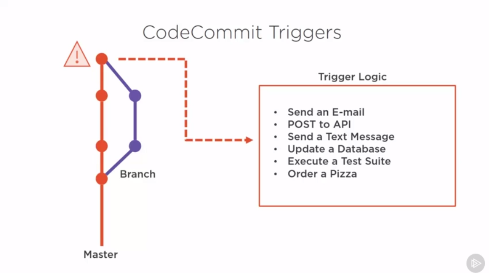
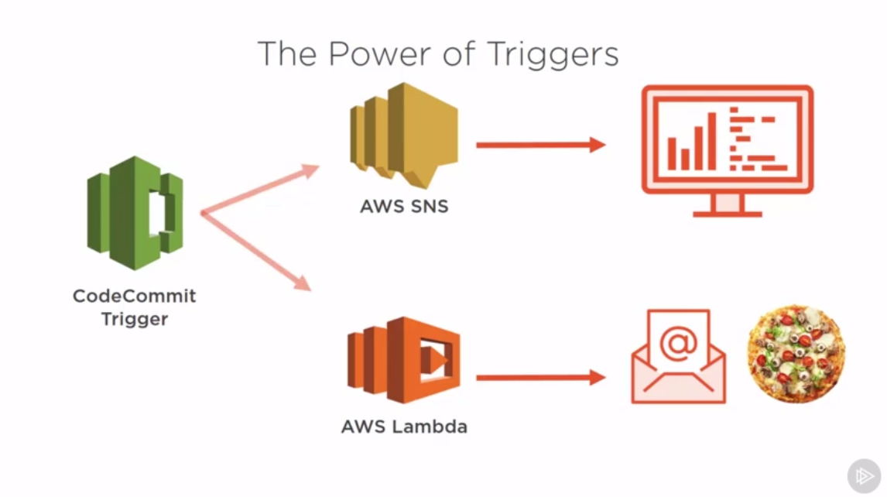
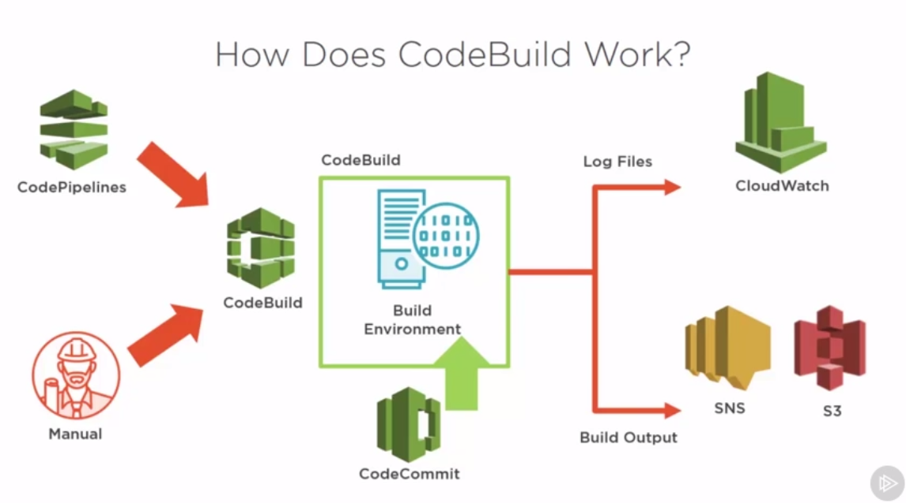
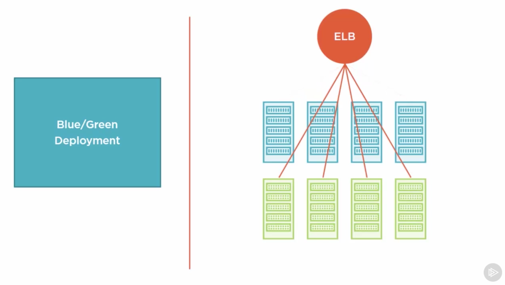

# Getting Started with AWS Developer Tools

[Source - Pluralsight Course](https://app.pluralsight.com/library/courses/aws-developer-tools-getting-started/table-of-contents)

## CodeCommit: 

* Fully-maanged source control service
* Powered by Git
* Backed by AWS Technology 
* **Purpose:** Commit and store your projects (code)

---

## CodeBuild:

* Fully managed build service
* Compile source code, run tests
* Produce software package
* Usually this word build comes from the compiled languages where you have to build/compile your code
* In case of JS/Python, you can run your package, run on node instance and see if it passes a set of unit tests. **If any of this things fail, the build itself will fail!**
* **Purpose:** Create deployment ready code. CodeBuild runs tests and puts the code into it's final deployment form. So we just need to download and install.    

### CodeBuild in Action

* CodeBuild needs to be trigerred by something, it has to be started. That can be made with CodePipelines everytime a new commit is pushed or it can be run manually, if you click a button.

* What happens when the CodeBuild is triggered?
    1. CodeBuild builds a virtual instance of our environment (virtual clone of our production environment)
    2. Takes the code from CodeCommit and copies it locally
    3. It executes the buildscript and build our application and tests. During this process it streams the log files to CloudWatch
    4. **Once the entire build is finished it published the build artifact to s3**. A finished build can also send out SNS message as a trigger. 

**Note:** After running CodeBuild you can find your artifacts in s3 bucket. But also you can specify exactly the files that should be artifacts in `buildspec.yaml`

* Within the CodeBuild we have the concept of `Build Project`,this tells CodeBuild how to run a particular build. It's like a checklist what CodeBuild needs to do it performs the build function. You configure here:
    + Source code location
    + Build environment to use
    + Build commands to run
    + Build output location

* `buildspec.yaml` is the most important file for CodeBuild. It contains the list of command to run during the build process. This is the way to tell what to do.

* Build phases in CodeBuild are optional:
    + Install: runs during build environment installation
    + Pre_Build: after installation, before build, good spot for dependencies
    + Build: compile application, run tests (here we would run mocha tests to make sure no bugs are pushed to our production executable)
    + Post_Build: runs after build is complete, here you can show any specific information like 20 out of 20 tests passed. 

* Artifacts: this is the section of the file where you tell your Codebuild what files it should take and produce as your build output e.g. if this would be an Android application we would only take the compiled apk file not all the java files that build it. Here you can tell if you need a single or all files `- **/*` tells that it should output all files as an output

**Note:** CodeBuilds automatically fails if anything returns without a 0 command exit code.(With bash commands the return code 0 usually means that everything executed successfully without errors.) So if single test failes an exit code of 1 would be returned and the build would fail.

---

## CodeDeploy:

* Automated deployment service
* Deploys to multiple instances at once
* Scalable deployment service

**Note:** This service helps to deploy to many machines at the same time. Imagine a case where you have 10M per day traffic to your website. Usually in front of it there is a load balancer that distributes the traffic among many different machines. So if you need to deploy a new version of code, CodeDeploy would do it automatically to all of your machines behind the load balancer.

### Code Benefits

* Automation
    + You can automate deployment to many servers at the same time and the tool does the job for you e.g. updating based on the criteria (e.g. one by one automated)
    + Can deploy in many different way:
        + You can deploy based on rules, e.g. 1 server, half of the servers or all servers at the same time with just a click of a button
    + Can be configured to `push forward` or `rollback` on a bad deploy

* Scalability
    + AWS Scaling Technology
    + Deploying to 1 server just as easy as deploying to hundreds
    + If you want to delete a server form your server fleet, you can simply click a button and delete this server from your code deploy settings

* Reliability
    + AWS has the highest uptime than any cloud service today (Quote from Course)
    + The appspec file: A central source of truth for deployment configuration (ver similar to `buildspec.yaml`) you write down every command that must be executed in order to properly deploy the application 
    + Deployment Status and Rollback (done automatically by CodeDeploy)

* Flexibility
    + Deploy to AWS Service (EC2) or on-premise
    + The `appspec.yml` allows you to control every step of your deployment
    + Integrations with various Partner Products e.g. Atlassian etc.

### When not to use CodeDeploy

If you need to deploy to 1 instance, you don't need to use CodeDeploy (Single Deployment) e.g. windows apps, Android apps, iOS apps

### Choosing a Deployment Type

* Blue/Green Deployment: The blue environment is the environment that is actully running and hooked up to ELB. When we kick-off a deployment our system creates a new green environment, it actually spins-up a new server cluster with all the newly updated code. Once the cluster is entirely replicated ELB switches to point to the green cluster routing all the traffic at once to the newly updated code, finally it terminates the blue or the old version, all that is left is the latest release
    + No downtime during deployments
    + Creates a duplicate cluster
    + All traffic moved at once
    + `Blue` cluster ready for rollback

* In-Place Deployment: Is a rolling deploment. ELB (Elastic Load Balancing) distributes load to our production servers gives equal load to each server. When we do a deploy, CodeDeploy picks a group of servers to go offline updates them and then brings them back online with the updated code. 
    + Downtime during deployment
    + Keeps cluster size the same
    + Partial traffic movement (to newly updated code)
    + Rollback 1-by-1 (can be problematic - very slow in big number of instances)

## CodePipeline:

* Continuous integration and delivery service
* Your code goes from commit to production in the most reliable way
* Configurable workflow (pick and choose the tools you need)
* **Purpose:** Creating of automated code delivery for your software needs. It connects each individual tool and brings them together. It creates full workflow or pipeline.

**Note:** You need to use CodePipeline in order to enable continuous integration and delivery, all the developer tools that exists needs to be connected by with CodePipeline. The developer tools exits independently so you can use them also w/o CodePipeline.

### Development Workflow:

* Code Storage and Management
* Package creation and testing
* Deployment

**Note:** If we would restrict ourselves to use only AWS services such as CodeCommit, CodeBuild, CodeDeploy. We can combine these services all together. But if we want to use other 3rd party services for our development workflow, for that reason we can use CodePipeline.

### Extending Your Pipeline

Stages:
* Approval: is used to validate the deployments manually. 
* Source: how and where your code is stored and managed (repo/branch)
* Build: where you select a tool to compile your code
* Test: where you can select a CodeBuild style scripting to tests on your code or choose 3rd party test providers, that setup different tests and run it for you
* Deploy: where you setup how to deploy your code
* Invoke: in this stage you can trigger an AWS Lambda function (e.g. send an email or order a pizza when you code hits production)

