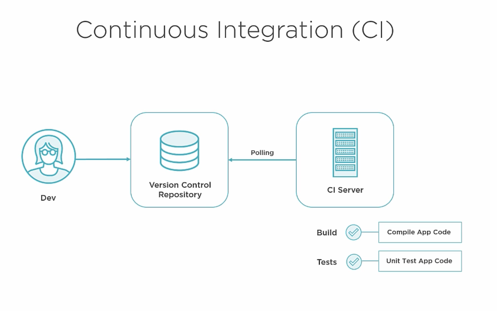
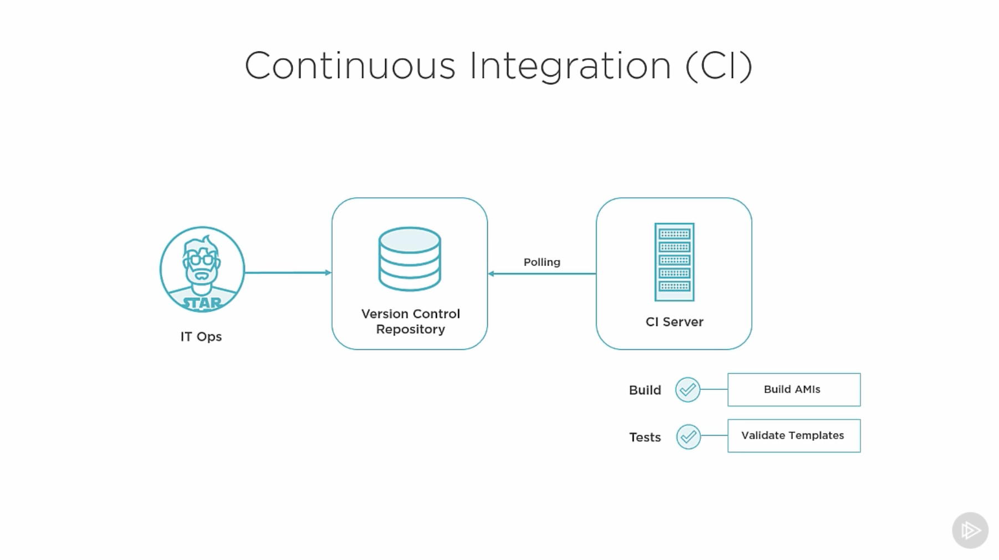
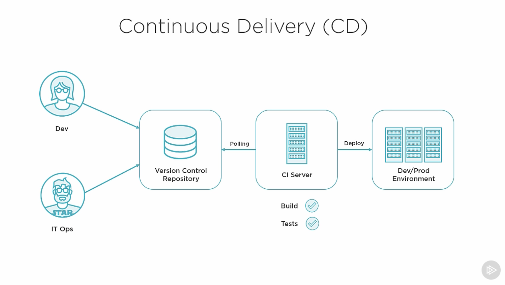
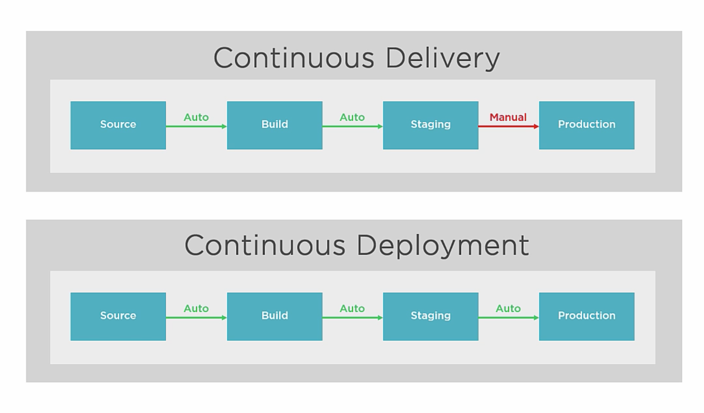
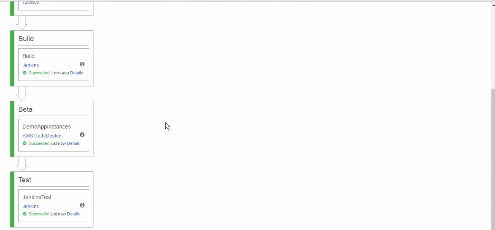
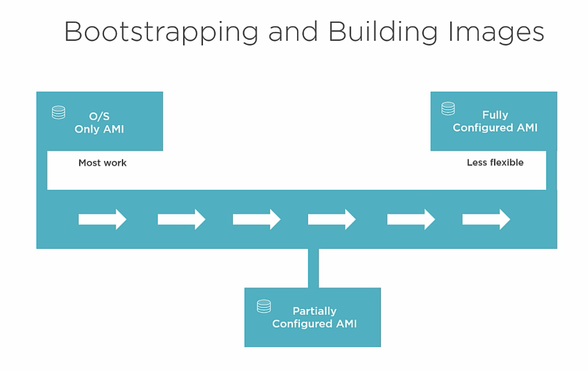
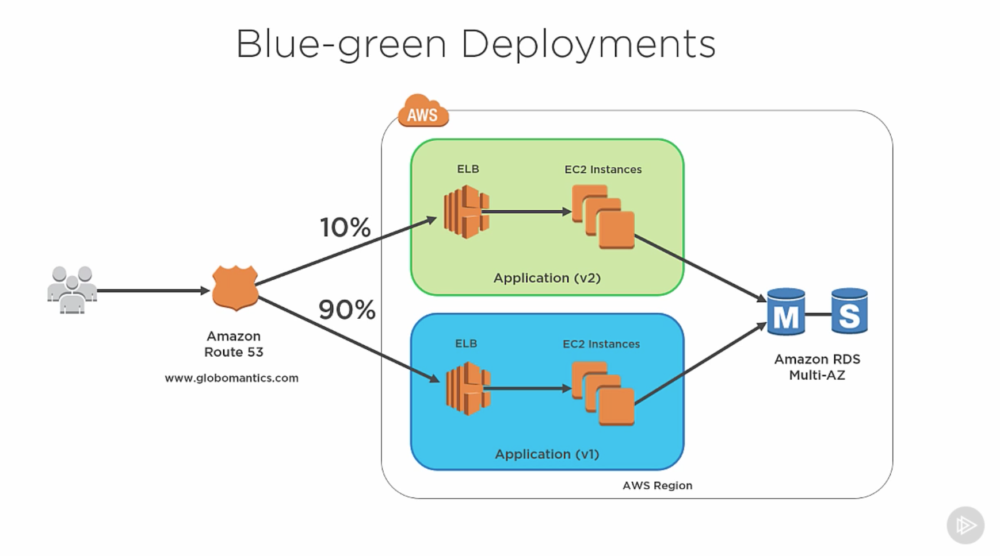
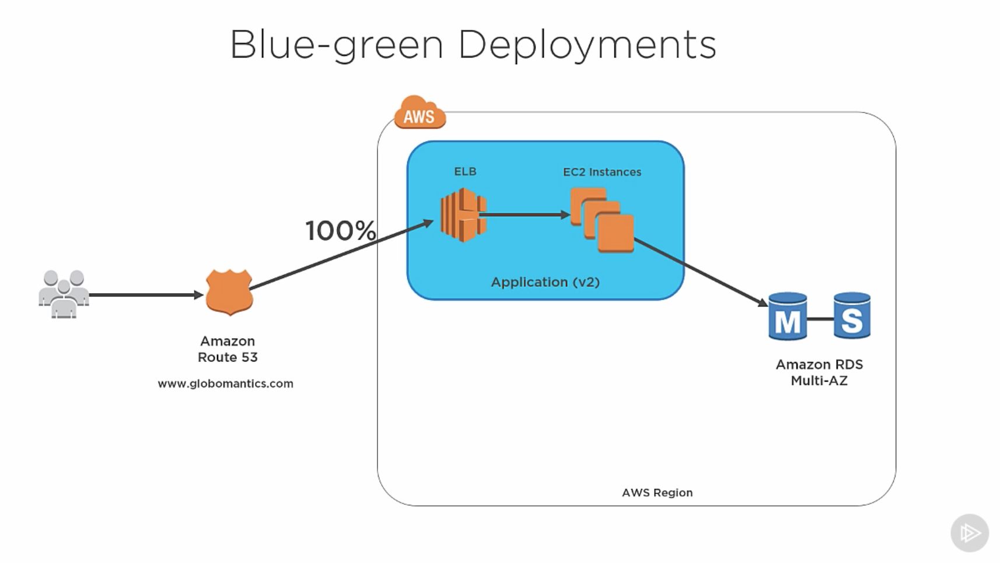

# AWS Certified DevOps Engineer: Continuous Delivery and Automation

[Source](https://app.pluralsight.com/library/courses/continuous-delivery-automation-aws-certified-devops-engineer/table-of-contents)

## Implementing CI / CD

### DevOps Definition

* Automation of software development process it goes from a developer who is writing code to all the way into production. 
    + Cultural change, paradigm shift, collaboration
    + Improvement in software delivery
    + Eliminating silos between devs and IT Ops (set up virtual machines for testing code, running the servers and doing all the stuff that dev usually don't care about)

* Increases the speed of development

* Agile + CI could be implemented via DevOps. The goals is automate everything and in case of bugs to rollout quickly

* One big part is the infrastructure as a code, like writing an application you create your infrastructure instead of manually managing it. 
    + It get stored in the repository
    + You can run automated tests agains infrastructure as code
    + You have versions for your infrastructure

### Continious Integration (CI)

You have a team of developers that write code and they commit that code to a central version control repositry and from there the new changes are integrated into a working codebase for the application. 

**Note:** Everytime a developer makes a change, the code goes through a build process, perhaps some unit tests will run through that code and the developer gets immediate feedback about that change. By getting this fast feedback the developer can fix any mistakes that were made during the development process. 

* If developer commits a code to the master, we want to start a build phase (a system can verfy that a code runs successfully) and on top of that we want to run some unit tests to make sure that the application works right. 

* Using the platform like AWS allows other people like IT Ops, DBAs and other people involved in running infrastructure to use the same techniques that the developers are using. In case if we want to use CloudFormation to build and launch our infrastructure:
    1. IT Ops writes all the infrastructure as code in a json/yaml template 
    2. All the code written can be versioned an commited to VCR (version control repositry)
    3. CI Server runs a build and runs different tests. Now when it comes to infrastructure as code we don't have anything that compiles, but we can build some custom Amazon Machine Images (AMIs) that are preconfigured for our servers it can increase the launch time of servers
        + When it comes to testing you can use json templates that get's validated by Cloudformation
        + You can run infrastructure tests after you launched the instances to make sure your application listening and running on expected ports and returns the right http responses

### Continious Delivery (CD)

It builds on top of the process of CI and is intended to automate the entire release of the application all the way up to production.

1. Code goes into version control
2. CI server runs bulds and tests (unit tests)
3. Deploy the application to a new or existing environment (these workflows are called production lines or pipelines - CI/CD pipeline)

**Note:** You can have as many stages as you need in this pipeline, if you want some stages after test run of code that runs load tests on the infrastructure. **The key is that at each stage everything must work before it moves to the next stage**

#### Here is the difference between Delivery / Deployment

The main difference lies in a human intervention. In continious delivery a person needs to approve the change before code goes into production. In continious deployment everything goes automatically.

### CI / CD Summary

* Automate everything
* Define infrastructure as code (no manual provisioning of infra)
* Store application and infrastructure code in version control
* Unify the application and infrastructure (treaded as 1 thing)
* Perform end-to-end automated testing for infrastructure and configurations

## Infrastructure as Code

Is the key element for IT and Operation stuff. The benefits of IAC (infrastructure as code)

* Repeatability (produces always the same resources) to avoid human mistakes
    + You can use this code to build your entire environment
    + You can use this code for disaster recoveries
    + You can use this code for building stages etc. 

* Agility roll forward and roll back easily
    + If deployment fails you can see all the logs and what has been changed, who changed etc. 
    + It allows teams to iterate and make changes daily. We reducing the time of provisioning the infrastructure from days or weeks to hours or minutes

* Auditing & Security paper trail and permissions
    + It's easy to see what's happening on the platform level, who is calling the API etc.
    + Here you can be explicit which team member e.g. has the ability to provision infrastructure, this gives the organisation that everything will stay stable

### Automation and Configuration Management

* Provisioning infrastructure:
    + Cloudformation (primary tool)
    + OpsWork
    + Beanstalk

* Declarative approach to automation: the desired state of your servers is part of your projects and version control, along with infrastructure code and application templates
    + More flexible since it's loosely coupled to the implementation details
    + It simply declares the state of the system (human readable)

**Note:** In computer science, declarative programming is a programming paradigm—a style of building the structure and elements of computer programs—that expresses the logic of a computation without describing its control flow.

* Configuration management tools:
    + These tools support this declarative approach to automation:
        + Chef
        + Puppet
        + SaltStack
        + Ansible
        + DSC
    
**Note:** When you want to automate your cloudenvironment you can create cloudformation templates and on the operation system you can apply declarative configuration to your servers that configure the settings.

## Understanding Application Lifecycle Management

0. CodePipeline
1. CodeCommit
2. CodeBuild
3. CodeDeploy
    * Go to github repo: https://github.com/mikepfeiffer/aws-codedeploy-linux
    * `appspec.yaml`gives CodeDeploy the information to deploy the application
    * Instead of writing the scripts to manage the servers, you can use apps such as Chef, Puppet to do it for you

### CodePipeline

1. Commit (fetch resource): commit to Git repo
2. Build (jenkins or CodeBuild): compile files + unit test
3. Pre-alpha (deploy to pre-alpha): create a cloudformation stack
4. Test (run integration testing - acceptance tests): run testing with real endpoints 
5. Alpha (deploy to master): create a cloudformation stack
6. Create Release Branch (from master): once in a week or 2 weeks
7. Beta (from release branch deploy to beta stage): wider testing with beta customers (dog food)
6. Production (deploy from release branch to production): deployment to real customers

## Bootstrapping and Building Images

When you do your deployment you want the online instaces to come as quick as possible. This is especially true when you are using auto-scaling groups. 

In order to increase the bootstrap / startup time we can use different options:

1. We can use AMI that we can use with a O/S
2. We can use fully configured AMI
3. You can create partially configured AMI, but you can use some leightweight bootstrapping when the instance comes online

## Blue-Green Deployment

When it comes time to deploy your application you create an identical copy of your production environment and you can flip the switch to route all of your traffic to the new environment. If it doesn't work you just go back to your working deployment.

* Blue: is the production environment running our code
* Green: is the completely new environment running a copy of our new code

**Note:** If there is problem with the new environment, we just simply need to update the DNS configuration and send all 100% of the traffic to the blue environment. But if everything works well we send more traffic to the green environment (canary deployments). Since we are using auto-scale instances on ec2 in the example above, the ec2 instances gets scaled based on the demand. If everything works well, we send 100% of the traffic to the green environment and since blue is no longer is being used we can simply delete these resources out of our AWS account.

* DNS record TTL: set a low time to live on DNS record to prevent client cache issues
* Database schema: ensure that DB schema or code changes are backward compatible (e.g. a new version of the app might need to change db schema)

## Automating Infrastructure with CloudFormation

You write declarative templates that take care of provisioning resources that you need on AWS. Useful when you deploying environments with multiple instances / resources. CloudFormation treats every template as a single stack. The service knows the correct order in which to provision the resources, so you simply need declare the resources that you need. 

* CloudFormation templates are written in JSON/YAML

* You can version your templates in your source control, so you can compare the changes between templates and easily understand the changes from one commit to another

* Resource relationships: if you need the order in which the resources should be provisioned you can do it within the template on the resource level

* CloudFormation gives you feedback on the status of your stack

* Reusability is one of the biggest benefits of CloudFormation. You can easily model your entire production environment with the CloudFormation template and you can repeatably build that environment with a single click or an API call. This is perfect for CD because you can spin up dev or qa environments that are identical to your production environment. It's also great for Blue-Green Deployments because you can rollout all of your infrastructure for your application in a matter of minutes. 

* Interactive templates: you can provide launch URLs to other people in your organisation so they can click a link it takes them straing into CloudFormation console and you can include input parameters that will be rendered on the screen, when a user is launching the template. 

* Automated: you can fully automate the stack creating process. Since the templates are written in JSON there are ways to do unit testing agains CloudFormation templates, also you can use the validation API to make sure that a JSON is correctly formatted before you even launch the stack. 

## Understanding JSON

[JSON Viewer, Editor, Formatter](https://www.cleancss.com/json-editor/)

* JSON objects are made up of:
    + key/value pairs
    + lists
    + arrays

## Creating CloudFormation Basic Template

* Cloudformation offers the so called `native parameter type` such as `"Type": "AWS::EC2::KeyPair::KeyName"`. By using them you will get all available parameters during the setup process of the stack in the AWS console. [Read more](https://aws.amazon.com/blogs/devops/using-the-new-cloudformation-parameter-types/)
    + You can also use a key/value pair e.g. `"Default": "virginia",` under parameters and you'll get this key/value pair set as default

* Cloudformation has the ability to limit the parameters by `"AllowedValues": []`, so you have already predefined allowed values for settings you want to provide in the template

