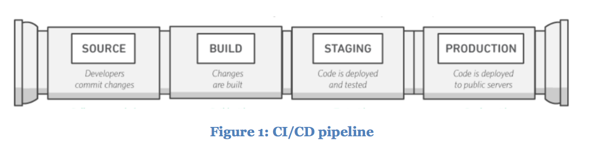
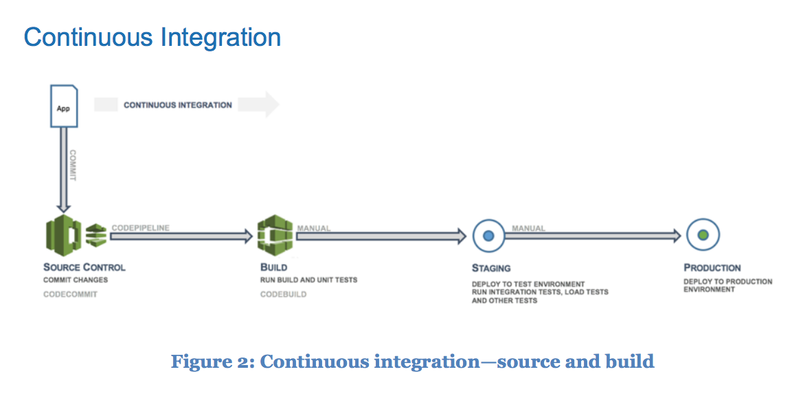
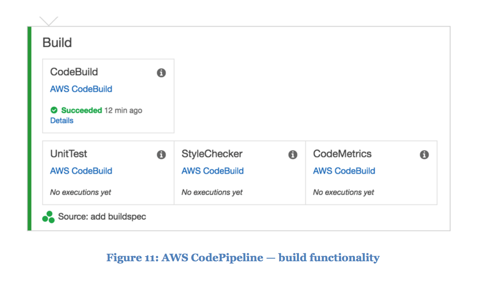

# Practicing Continuous Integration and Continuous Delivery on AWS

[Source](https://d0.awsstatic.com/whitepapers/DevOps/practicing-continuous-integration-continuous-delivery-on-AWS.pdf)

[Downloaded Version](./documents/practicing-continuous-integration-continuous-delivery-on-AWS.pdf)

* DevOps is the combination of cultural philosophies, practices, and tools that increases an organization’s ability to deliver applications and services at high velocity.

* Continuous integration (CI) is a software development practice where developers regularly merge their code changes into a central repository, after which automated builds and tests are run.

* Continuous integration focuses on smaller commits and smaller code changes to integrate. A developer commits code at regular intervals, at minimum once a day.

* Continuous delivery (CD) is a software development practice where code changes are automatically built, tested, and prepared for production release. It expands on continuous integration by deploying all code changes to a testing environment, a production environment, or both after the build stage has been completed.

* With continuous deployment, revisions are deployed to a production environment automatically without explicit approval from a developer, making the entire software release process automated.

* One misconception about continuous delivery is that it means every change committed is applied to production immediately after passing automated tests. However, the point of continuous delivery is not to apply every change to production immediately, but to ensure that every change is ready to go to production.

* Before deploying a change to production, you can implement a decision process to ensure that the production deployment is authorized and audited. This decision can be made by a person and then executed by the tooling.

* Using continuous delivery the decision to go live becomes a business decision, not a technical one. The technical validation happens on every commit.

Figure 1: CI/CD pipeline

* These stages are suggestions. You can adapt the stages based on your business need. Some stages can be repeated for multiple types of testing, security, and performance.

* The presence of a CI/CD pipeline will have a large impact on maturing the capabilities of your organization. The organization should start with small steps and not try to build a fully mature pipeline, with multiple environments, many testing phases, and automation in all stages at the start.

Figure 2: Continuous integration—source and build

* The first phase in the CI/CD journey is to develop maturity in continuous integration. You should make sure that all of the developers regularly commit their code to a central repository (such as one hosted in CodeCommit or GitHub) and merge all changes to a release branch for the application.

* You should also encourage developers to create unit tests as early as possible for their applications and to run these tests before pushing the code to the central repository.

* When the code is pushed to a branch in a source code repository, a workflow engine monitoring that branch will send a command to a builder tool to build the code and run the unit tests in a controlled environment.

* Continuous delivery (CD) is the next phase and entails deploying the application code in a staging environment, which is a replica of the production stack, and running more functional tests.

* After the staging environment is built using infrastructure as code (IaC), a production environment can be built very quickly in the same way.

* In a fully mature CI/CD environment, the path to the production environment is fully automated, which allows code to be deployed with high confidence.

* In the build stage, the build tools will take as input any change to the source code repository, build the software, and run the following types of tests:

* Unit Testing – Tests a specific section of code to ensure the code does what it is expected to do.

* Static Code Analysis – This test is performed without actually executing the application after the build and unit testing. This analysis can help to find coding errors and security holes, and it also can ensure conformance to coding guidelines.

* Staging In the staging phase, full environments are created that mirror the eventual production environment. The following tests are performed:

* Integration Testing – Verifies the interfaces between components against software design.

* Component Testing – Tests message passing between various components and their outcomes. A key goal of this testing could be idempotency in component testing. Tests can include extremely large data volumes, or edge situations and abnormal inputs.

* System Testing – Tests the system end-to-end and verifies if the software satisfies the business requirement. This might include testing the UI, API, backend logic, and end state.

* Performance Testing – Determines the responsiveness and stability of a system as it performs under a particular workload. Performance testing also is used to investigate, measure, validate, or verify other quality attributes of the system, such as scalability, reliability, and resource usage.

* Compliance Testing – Checks whether the code change complies with the requirements of a nonfunctional specification and/or regulations.

* User Acceptance Testing – Validates the end-to-end business flow.

* Typically, customers employ alpha and beta testing methodologies at this stage.

* Production Finally, after passing the previous tests, the staging phase is repeated in a production environment. In this phase, a final Canary test can be completed by deploying the new code only on a small subset of servers or even one server, or one Region before deploying code to the entire production environment.

* With AWS CodeBuild, you don’t need to provision, manage, or scale your own build servers. AWS CodeBuild scales continuously and processes multiple builds concurrently so your builds are not left waiting in a queue.

* For example, in the build stage below, three actions (unit testing, code style checks, and code metrics collection) run in parallel.

Figure 11: AWS CodePipeline — build functionality

* After your team successfully automates the deployment of the application, deployment stages can be expanded with various tests. For example: Figure 12: AWS CodePipeline—code tests in deployment stages

* Deploying Infrastructure Code Changes in a CI/CD Pipeline AWS CodePipeline lets you select AWS CloudFormation as a deployment action in any stage of your pipeline. You can then choose the specific action you would like AWS CloudFormation to perform, such as creating or deleting stacks and creating or executing change sets.

* If a serviceoriented or microservice architecture is used, each team could have its own code repository.

* This pattern leverages the cloud capability that new server resources are created with simple API calls.

* The database schema before and after a change is applied should be seen as different versions of the database. You could use tools such as Liquibase and Flyway to manage the versions.

