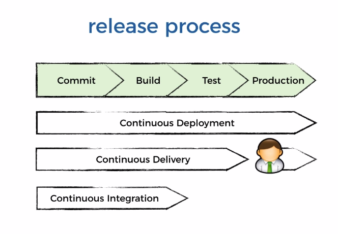

# Production Ready Serverless

[Source](https://livevideo.manning.com/course/38?continue=true)

* Continuous Integration: CI is a development practice that requires developers to integrate code into a shared repository several times a day. Each checkin-in is then verified by an automated build, allowing teams to detect problems early.
* **Integrtion testing**: integration of our code with system we can't change.
* **Continuous Integration**: integration of our change code with other code changes in the shared repository.

* Continuous Deployment (if everything is automated)
  1. Code review -> **leads to commiting code into the shared repository**
  2. Commit -> **triggers code build**
  3. Build (if we talk about Java or webpack with Node.js) - linting, test coverage -> **create deployment artifacts**
  4. Test (integration / functional tests, end-to-end) -> **produces ye/no and a person needs manually approve it**
  5. Production (blue/green OR canary deployment, feature flags)



* **Important:** The pipelines should be fast, so you don't stuck in a queue and building & testing process becomes really fast.

build.sh // for using it during the code build
```sh
#!/bin/bash
set -e
set -o pipefail

instruction()
{
  echo "usage: ./build.sh deploy <env>"
  echo ""
  echo "env: eg. int, staging, prod, ..."
  echo ""
  echo "for example: ./deploy.sh int"
}

if [ $# -eq 0 ]; then
  instruction
  exit 1
elif [ "$1" = "int-test" ] && [ $# -eq 1 ]; then
  npm install

  npm run integration-test
elif [ "$1" = "acceptance-test" ] && [ $# -eq 1 ]; then
  npm install

  npm run acceptance-test
elif [ "$1" = "deploy" ] && [ $# -eq 2 ]; then
  STAGE=$2

  npm install
  'node_modules/.bin/sls' deploy -s $STAGE
else
  instruction
  exit 1
fi
```
buildspec.yaml // for Code Build
```yaml
version: 0.2
  phases:
    build:
      commands:
        - chmod +x build.sh
        - ./build.sh init-test
        - ./build.sh deploy dev
        - ./build.sh acceptance-test
```
