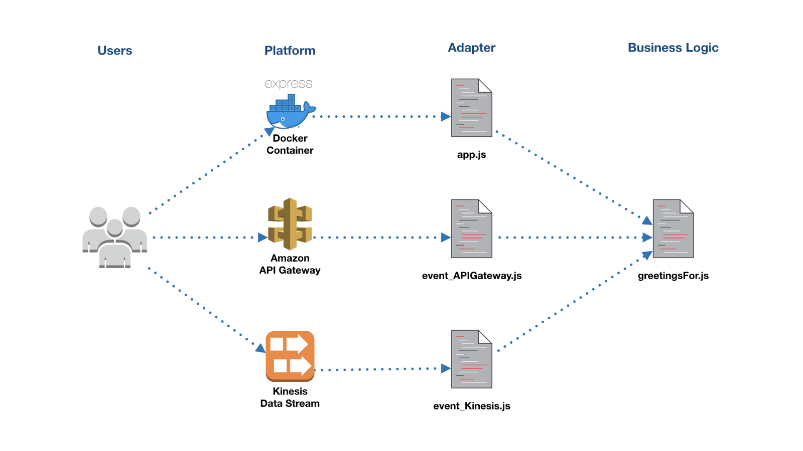

# Adapters Design Pattern for Lambda

Generally this pattern can be used for a) writing testable code, b) porting the application to other context environments. You can find detailed explanation in the following post [Writing portable serverless applications](https://medium.com/@danilop/writing-portable-serverless-applications-252fd8623bce). This is the summary or writeup of my thoughts about the pattern and how to extend it.

## Why to use Adapters?

“In software engineering, the adapter pattern is a software design pattern that allows the interface of an existing class to be used from another interface. It is often used to make existing classes work with others without modifying their source code.” [Source](https://en.wikipedia.org/wiki/Adapter_pattern)

In this case we can use different providers to run our Lambdas.

## Examples of Adapters

```js
"use strict";

console.log('Loading function');

// Your business logic
function greetingsFor(name) {
    console.log('name: ', name);
    if ((name == undefined) || (name == '')) {
        name = 'World';
    }
    const greetings = 'Hello ' + name + '!';
    console.log('greetings: ', greetings);
    return greetings;
}

// Event wrapper for Amazon API Gateway
exports.handler = async (event, context) => {

    function buildResponse(message) {
        const responseCode = 200;
        const responseBody = {
            message: message
        };
        const response = {
            statusCode: responseCode,
            headers: {
              'x-custom-header' : 'my custom header value'
            },
            body: JSON.stringify(responseBody)
        };
        console.log('response: ' + JSON.stringify(response))
        return response;
    }

    console.log('request: ' + JSON.stringify(event));

    let name; // default value is undefined
    if (event.queryStringParameters != null) {
        name = event.queryStringParameters.name;
    }
    
    return buildResponse(greetingsFor(name));
};

// If not running on AWS Lambda, use Express
if (!(process.env.LAMBDA_TASK_ROOT && process.env.AWS_EXECUTION_ENV)) {
    const express = require('express')
    const app = express()
    
    app.get('/', function (req, res) {
      res.send(greetingsFor(req.query.name));
    })
    
    app.listen(process.env.PORT || 3000)
}
``` 

We divide the business logic from the event wrappers. The event wrapper is the adapter in this case. The first even wrapper is for API Gateway and the second is for Express.js. You can add a Dockerfile and run it in the container or everywhere you like. The second adapter checks the execution context if we are not in Lambda execution context, just run Express. Here is a list of environment variables you can use to make such checks: [Environment Variables Available to Lambda Functions](https://docs.aws.amazon.com/lambda/latest/dg/current-supported-versions.html)

The best logic would be splitting the logic, adapters and ports into different interfaces. 

* `greetings.js` for the business logic
* `eventGateway.js` that contains the handler function for AWS Lambda and require `greetings.js` as a Node module
* `app.js` that provides a web interface using Node.js Express and framework and importing `greetings.js` 



If you need more ways to to use the business logic, you can simply add more adapters to it. We can use other services such as `eventKinesis.js` or `eventSNS.js` and so on.
