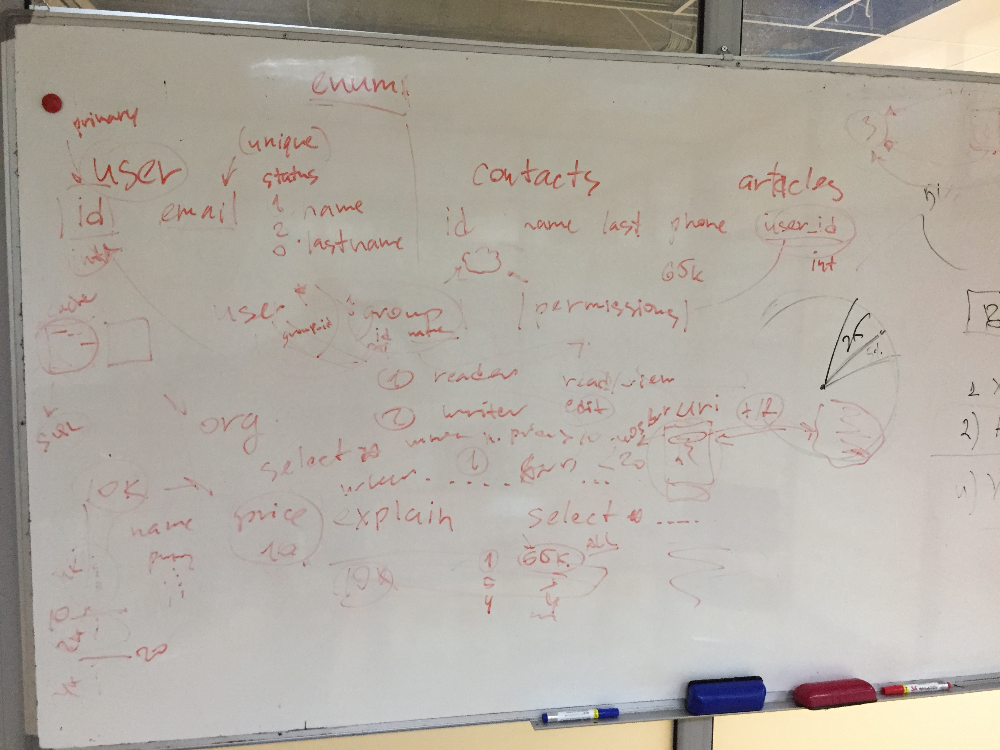

# Getting Started with Databases

[Source - 8 Lectures](https://www.youtube.com/watch?v=4Z9KEBexzcM&list=PL1LIXLIF50uXWJ9alDSXClzNCMynac38g)

## Purpose of a Database

* The purpose of a database is:
    - to store data (repository for storing data)
    - to provide an organized structure where this data can be placed
    - to provide a mechanism for querying, creating, modifying and deleting data (machanism for interacting with data - CRUD)
    - STORE, ORGANIZE, CRUD

* Database can store information and relationships that are more complicated than a simple list (e.g. customers and orders, employees and departments). A relational database allows us to represent these relations.

* Database solves a problem with a redundancy (to much waste of space), data anomalies (deletion problems (we may loose some important knowledge through deleting some rows), update problems (if you have to update all fields and not just one attribute, insertion problems (we insert one attribute and all the data across attributes is missing)), data integrity (to have all data be correct across the whole database)

* Relational databases are designed to address many of the information complexity issues that arise in business e.g. a product can be assembled from many different components. There are these natural complexities arise in the business. 

### Relational Database

* A relational database stores information in tables. Each informatial theme (business concept) is stored in its own table.
* **In essense, a relational database will break-up a LIST into several parts.**
    - One part for each theme in the list. For example, a project light might be divided into a CUSTOMER table, a PROJECT table, and a PROJECT MANAGER table.
* In our relational database examples (see above), we broke apart our list into serveral tables. Somehow the table must be joined back together.
* In a relational database, tables are `joined`(we join the tables together) together using mathed pairs of data values
    - If a PROJECT has a CUSTOMER, the Customer_ID can be sotred as a column in the PROJECT table. Whenever we need information about a customer, we can use the Customer_ID to look up the customer information in the CUSTOMER TABLE
* A relational database minimizes data redundancy, allows to model complex relationships among topics, and allows for partial data (null values)

**Note:** SQL (structured query language) is the primary tool for CRUD operations. SQL was designed simple to use and simple to understand. **With SQL we can restore a LIST view of the data again, since database simply breaks the LIST into different tables and assigns relationships**

### Database System

It's important to remember that database system is not just a database itself. The four componenets of a database system are:

1. Users (people or other apps)
    - Use a database apps to keep track of information
    - Use different user interface forms to enter, read, delete, and query data
    - Producte reports

2. Database Applications (website, client, mobile app, desktop)
    - A database application is a set of one or more commputer programs or websites that server as an intermediary between the user and the DBMS
    - These application are not allowed to talk to database directly, they must go to DBMS to talk to the database.

3. Database Management System (Gatekeeper - all the information that flow in/out from a database must travel through DBMS - is a critical mechanism to mantain the quality of our data in the database, we don't allo our users or applications to directly access the data in the database)

4. Database (store data in separate tables)
    - A database is a self-describing collection of related records. A database doesn't only contain it's own data but it has also a defintion of it's own structure.
        - Self-describing:
            + The database itself contains the defintions of its structure
            + Metadata: are data which describe other data e.g. en employee table conaints attribute called `employeeId`is an integer and that is knows as metadata. So the information that    `employeeId`is an integer
            + Indexes and other overhead data (tables to improve performance)
            + Application metadata (user preferences)
            + User data

    - **Tables within a relational database are related to each other in some way**
    


### Database Management System (DBMS)

Is a special kind of software program not only to create databases but also process and manage these databases. DBMS itself is not the database!!!

* A database management system (DBMS) servers as an **intermediary** between database applications and the database
* The DBMS manages and controls database activities
* The DBMS creates, processes and administers the database it controls

#### Functions of a DBMS
* Create a new database
* Crate a new tables (and establish relationships between tables)
* Create supporting structures
* Read database data
* Modify database data (insert, update, delete)
* Maintain database structures
* Enfore rules
* Control concurrency
* Provide security
* Perform data backup and recovery

* Referntial Integrity Constraints
    + A DBMS can enforce many constraints (Einschränkungen)..
    + **Referntiel integrity constraints** ensure that the values of a column in one table are valid based on the values in another table
        - For example, if a 5 was entered as a CustomerID in the PROJECTS table, a Customer having a CustomerID value of 5 MUST exist in the CUSTOMER TABLE. If the CustomeriD 5 doesn't exist it won't allows u to enter it as CustomerId in the PROJECTS table. This is how we maintain DATA INTEGRITY.

## Types of Database Systems

* Personal database systems typically (not support big businesses - MS ACCESS):
    + Support one application
    + Have only a few tables
    + Are simple in design
    + Invovle only one computer
    * Support one user at a time

* Enterprise-Level database systems typically (Oracle, SQL Server, MySQL):
    + Support several users simultaneously
    + Support more than one application
    + Involve multiple computers
    + Are complex in design
    + Have many tables
    + Have many databases (database for website, but also for a dashboard)
    + Support thousands of users 
    + Spread across many physical servers, geographically distributed
    + **Support more than 1 database: within the same DBMS we can have operational database, and we also can create datawarehouse. They can all be managed by the same DBMS.**


# The Relational Model

### Entity

* Entity is something of importance to user or organization that needs to be represented in a database
    + An employee, a department, a project can be an employee (single business concept)

### Relation

* A relation is a two-dimensional table that has specific characteristics
* The table dimensions, like a matrix, sonsist of rows and columns

**Note:** A relation is a specific type of table that is in order for a table to qualify as a relation, the table must have certain characteristics. Certain Characteristics must be met in order for a table to qualify a relation.

#### Characteristics of a Relation

* Rows contain data about instances of an entity (e.g. a single employee)
* Columns contain data about attributes the entity (e.g. employee name, id)
* Cells of the table hold a single value
* All values in a column are of the same kind (data type)
* Each column has a unique name
* The order of the columns is unimportant
* Te order of the rows is uneimportant
* No two rows can be identical (if we take all rows together entirely, they cannot be identical with other rows in the table - that's why we need a primary key or composite key, they make the specific row unique) - When all values of row a considered together, there must be something unique about the row, not two rows can be identical to each other!!!


> an RDBMS is called a relational database system because the data is stored in tables. [Source](https://www.xaprb.com/blog/2012/03/13/what-makes-relational-databases-relational/)


There are two problem here. In the first row the cell doesn't hold a single value. And there are two rows that are identical.

**Important:** All relations are tables, but not all tables are relations


### Keys
* A key is one (or more) columns of a relation (table) whose values are used to identify a row
    + Unique Key
        - Data value is unique for each row (e.g. within an id column)
        - Consequently, they key will uniquely identify a row
    + Nonunique Key
        - Data value may be shared among several rows
        - Consequently, the key will identify a set of rows


---


#### A Composite Key
* A composite key is a key that is composed of two or more attributes/columns (in order to get uniques)
* For a key to be unique, it must often become a composite key


#### A Candidate Key
* A candidate key is called "candidate" because it has the potential to become the primary key
* A candidate key is a unique 

**Note:** Like in a presedential election where a candiate can become a president.

#### A Primary Key
* A primary key (the main identifier for a relation and is a unique key) is a candiate key chosen to be the main key for the relation
* If you know the value of the primary key, you will be able to uniquely identify a single row within the table.


#### A Surrogate Key
* Surrogate key is a unique, numeric value that is added to a relation to server as the primary key. 
* Surrogate key values have no meaning to users and are usually hidden on forms, queries, and reports
* A surrogate key is often used in place of composite primary key

**Note:** Surrogate Key is intentially added as a database designer for a purpose of serving of serving as primary key. Often used when we don't have a column within a table that naturally server as a unique identifier as a primary key


---


#### A Foreign Key - Relationships Between Tables
* A table may be related to other tables
    + For example
        - An Employee works in a Department
        - A Manager controls a Project
* To establish relationships, we need to implement a foreign key
* A foreign key is a primary key from one table that is placed into another table for the purpose of linking the records of the table together
* Referential integrity states that every value of a foreign key must match a value of an existing primary key (RDBMS forces it)


#### Null Values
* A Null value means that no data exists
    + You can thin of a null value as an empty cell in the table
* This is different from a zeor, space, character, empty string, or tab character
* A Null is often ambiguous. It could mean...
    + The column value is not appropriate for the specific row
    + The column value has not been decided
    + The column value is unknown or missing

# Topic 02: Dependencies & Data Normalization

#### Functional Dependency
* A relationship between attributes in which one attribute (or group of attributes) determines the value of another attribute in the same table
* Illustration...
    + The price of one delicious Girl Scout cookie can determine the price of a box of 12 cookies. (CookiePrice, Qty) -----> BoxPrice
* Determinant are the atributes that we use as the starting point (the variable on the left side of the equation) is called a determinant (CookiePrice, Qty), because we can use these value to determine the values of other attributes in the table such as `BoxPrice``
* By definition...
    + A candidate key (will eventually selected and promoted to the primary key) of a relation will functionally determine all other non-key attributes in the row
* Likewise, by definition...
    + A primary key of a relation will functionally determine all other non-key attributes in the row


If we know the `EmployeeId` by definition we should find another attributes that are associated with that employee. In this case we have two additional attributes `(EmpLastName, EmpPhone)`. Therefore `EmployeeId` is the determinant since we can use it to find other attributes that are associated with this particular employee.

### Data Normalization

* A process of analyzing a relation to ensure that it is `well formed`
    + not susceptible for 3 types of data anomalies: 
        - deletion anomalies
        - update anomalies
        - insertion anomalies
* Normalization involves decomposing relations with anomalities to produce smaller, well-structured relations
* More specifically, if a relation is normalized (well-formed), rows can be inserted, deleted, or modified without creating anomalies.

Data normalization process is that we are attempting to create relations in which we can insert new data, delete existing data, or modify existing data without creation one of these anamolies


#### Data Normalization Process Design Principles
* Relational design principles for normalized relations:
    * To be a well-formated relation, every determinant must be a candidate key
    * Any relation that is not well-formed should be broken into two or more well-formed relations!
* TIP: As a general rule, a well-formed relation will not encompass more than one business concept (An employee, a department, a project can be a single busines concept). If you have non-key attributes that contain more than one business concept, then it's not a well formed relation. We need to break it down...


----

----

The objective is to arrive at the 3rd normal form. In order to arrive at the 3rd normal form, we'll need to get our tables into 1st normal form, and then into a 2nd normal form. For the vast majority of most business cases, the 3rd normal form is enough.


##### First Normal Form
* Table contains no multivalued attributes
    * Every attribute value is atomic (we are not storing one or more value in each of the table)
    * All relations are by definition in 1st Normal Form
    * If a table meets a defintion of a relation, it's automatically in the 1st normal form


---

Each cell within a table contains a single value, the values are atomic


##### Second Normal Form
* 1NF PLUS every non-key attribute is fully funcionally dependent on the ENTIRE primary key (the values of the primary key must be able to fully functually determine the values of all other non-key attributes within table)
    + Every non-key attribute must be defined by the entire key, not by only part of the key
    + No pratial dependecies 


**Note:** `Product_Description, Product_Finish, Unit_Price` are partially dependent on `Product_ID`. I don't need to know the `Order_ID` to know the attributes of the product, I can simply use `Product_ID` this is called a partial dependency. 

> In order to move from a lower Normal Form into higher Normal Form we need to break the relation apart into smaller relations. By breaking our original relation into these 3 relations we have removed all the partial dependencies, that is if I look at the non-key attributes in any of these 3 relations, I'll find that all of those non-key attributes are fully functionally dependent on the entire primary key. Look e.g. at the `Product` relation, if I know the `Product_ID` I also know the `Product_Description, Product_Finish, Unit_Price`


**Note:** But we still have another problem in our `Order` relation we have the so-called transitive dependency. In order for our relational design to be in 3rd Normal Form we need to eliminate this transitive dependency. 

#### Third Normal Form
* 2NF PLUS no transitive dependencies (functional dependencies on non-primary-key attributes)
    + Such dependencies are called transitive, because the primary key is a determinant for another attribute, which in turns is a determinant for a third.
* Solution: Non-key determinant with transitive dependencies goes into a new table; non-key determinant becomes primary key in the new table and remains as a foreign key in the old table.


**Remember:** Each relation should contain attributes that are related to one and only one business concept and business theme!!!!


# Topic 03: SQL

* SQL is not a programming language, but rather is a data sub-language
* SQL is comprised of
    + A data defintion language (DDL)
        - Used to define and manage databse structures
            + Create database objects
    + A data manipulation language (DML)
        - Data defintion and updating
        - Data retrieval (Queries)
            + Provides with CRUD
    + A data control language (DCL)
        - For creating user account, managing permissions, etc.
            + Permissions and security etc.

### SQL for Data Definition
* The SQL data definition statements include
    * CREATE
        - To create database objects (create new table)
    * ALTER
        - To modify the structure and/or characteristics of existing database objects (modify the structure of a table)
    * DROP
        - To delete existing database objects (delete the table or view)

A database object in a relational database is a data structure used to either store or reference data. The most common object that people interact with is the table. Other objects are indexes, stored procedures, sequences, views and many more.

```sql
CREATE TABLE Employee (
    empId       Integer     NOT NULL,
    empName     Char(25)    NOT NULL,
    CONSTRAINT  empPk       PRIMARY KEY(empId)
); 
```
**Note:** The SQL statement ends with a semicolon, it's a good partice always to end the statement with a semicolon. Also in the statement in parenthesis we see a comma, the comma tells the database that we are finished with defining an attribute.

Within SQL key is such as primary key are considered to be CONSTRAINTS. In the case above we define a primary key for our Employee table and we are naming that constraint `empPk`. Important point that is within a database, every constraint must have a unique name. We are telling the database, that each value in the `empId` attribute/column must be unique. 

### Composite Primary Key
If we want to create a composite primary key we can use something like this

```sql
CREATE TABLE Skill (
    empId       Integer         NOT NULL,
    skillId     Integer         NOT NULL,
    skillLevel  Integer         NULL,
    CONSTRAINT  empSkillPk      PRIMARY KEY(empId, skillId)
);
``` 

### Foreign Key
If we want to create a foreign key constraints

```sql
CREATE TABLE EmployeeSkill (
    empId       Integer         NOT NULL,
    skillId     Integer         NOT NULL,
    skillLevel  Integer         NULL,
    CONSTRAINT  empSkillPk      PRIMARY KEY(empId, skillId),
    CONSTRAINT  empFk           FOREIGN KEY(empId)      REFERENCES Employee(empId),
    CONSTRAINT  skillFk         FOREIGN KEY(skillId)    REFERENCES Skill(skillId)
);
``` 
 


### Cascading Deletes & Cascading Update

```sql
CREATE TABLE EmployeeSkill (
    empId       Integer         NOT NULL,
    skillId     Integer         NOT NULL,
    skillLevel  Integer         NULL,
    CONSTRAINT empSkillPK       PRIMARY KEY(empId, skillId),
    CONSTRAINT empFk            FOREIGN KEY(empId)      REFERENCES Employee(empId) ON DELETE CASCADE,
    CONSTRAINT skillFk          FOREIGN KEY(skillId)    REFERENCES Skill(skillId) ON UPDATE CASCADE
)
``` 

`ON DELETE CASCADE` tells the database that we want to establish a cascading delete relationship between this table and the Employee table. It's used to help us to maintain the integrity and the quality of our data in the database. If e.g the employee under `empId` = 1 leaves the organization, the cascading delte will follow the relationship line to the EmployeeSkill label, if it finds any of the records it will delete them automatically.


`ON UPDATE CASCADE` very similar to cascading delte, the purpose of this command is to maintain the quality of the data and integrity in the database. It's needed to maintain the link between both tables.


### ALTER
* Adding primary key constraints to an existing table
    - The SQL ALTER statement

Let's imagine we create our `Employee`table but we forgot to establish our primary key. In this case we can use the `ALTER` statement in order to add a primary key to the table

```sql
ALTER TABLE Employee 
    ADD CONSTRAINT empPk PRIMARY KEY(empId);
``` 

If we want to add a composite key to an existing table.

```sql
ALTER TABLE EmployeeSkill
    ADD CONSTRAINT empSkillPk
        PRIMARY KEY(empId, skillId);
``` 

If we want to add a foreign key constraint. In this case we are telling the database that we want to link the `deptId`attribute in this table to the `deptId` attribute in the `Department` table.

```sql
ALTER TABLE Employee
    ADD CONSTRAINT empFk FOREIGN KEY(deptId)
        REFERENCES Department(deptId);
``` 

## Modifying Data Using SQL
* INSERT INTO
    + Will add a new row into a table
* UPDATE
    + Will update the rows in a table which meatch the specified criteria
* DELETE FROM
    + Will delete the rows in a table which match specified criteria

#### INSERT INTO
* To add a row to an existing table, use the INSERT INTO statement
* Non-numeric data must be enclosed in single quotes (')

```sql
INSERT INTO Employee (empId, salaryCode, lastName)
    VALUES(62, 11, 'Halpert');
``` 

#### UPDATE
* To change the data values in an existing row (or a set of rows) use the UPDATE statement

```sql
UPDATE  Employee
SET     phone = '657-278-1234'
WHERE   empId = 29; /* change phone number for the row 29 */

UPDATE  Employee
SET     deptId = 4
WHERE   empName LIKE 'Da%'; /*  for every employee where the name begins with Da (% is a wildcard statement) */

UPDATE  Employee
SET     deptId = 3; /* change the departmentId for every employee in the table to value 3 */

``` 
`SET` the name of the arribute that we want to change followed by the new value for that attribute.
`WHERE` which specifies which row or rows we want to change

**Note:** The shortest statement will cause the most chane in the database. If we would have a 1M records in the Employee table, the `SET   deptId = 3` would make 1M changes to that database. It will set the depratment Id to 3 for every employee

#### DELETE FROM

```sql
DELETE FROM Employee
WHERE  empId = 29; /* delete from employee table row 29 */

DELETE FROM Employee
WHERE empName LIKE 'Da%'; /* delete all of the rows with the Employee table where the name of the employee begins with Da */

DELETE FROM Employee; /* delete all rows from Employee */

```

#### SQL for Data Retrieval: Queries
* SELECT is the best known SQL statement
* SELECT will retrieve information from the database that matches the specified criteriea using SELECT/FROM/WHERE framework

```sql
SELECT  empName
FROM    Employee
WHERE   empId = 33; /* from row 33 */

SELECT  empName
FROM    Employee; /* every row from the table */

``` 
Minute: 29:58




## Database Lesson #4 of 8 - Data Modeling and the ER Model

[Source](https://www.youtube.com/watch?v=IfaqkiHpIjo)

### The Stages of Database Development

1. Requirement Analysis Stage: understand the problem for the solution
    + Source of requirements:
        + User Interviews
        + Forms
        + Reports
        + Queries
        + Use Cases
        + Business Rules
        + Observation
        + JAD Sessions (managers, developers, customers, potential users)
2. Compoment Design Phase: we create a data models is  graphical representations of database system
    + After the requirements have been gathered, they are transformed into an Entity Relationship (E-R) Data Model. E-R Models consist of 
    1. Entities (tables)
    2. Attributes a) Indentifiers (Keys), b) Non-key attribues (columns)
    3. Relationships (between entities)

####Entity
-  An entity class is a description of the structure and form of the occurences of the entity. Similar to a recipe or architectural blueprints (class = is the table itself )

- An entity instance is a specific occurence of an entity class (instance = is a row in the table)
    + If this a generic recipe we can have basic instructions, put that in the oven cook and back the cake and we add glasure. The basic recipe gives us a guideline how to produce a cake. **The cake is that created is a unique individual item**. While the specific individual real-world cake is equal to an instance of an entity.
    + The same applies to architectural blueprints. We have basic template how to design a house, and homeowner wants to make some specific decisions what types of colors they want to have in a kitchen. All of those individual characteristics make that the resulting real-world house a unique specific item. In our analogy the architectural **blueprints are similar to an entity class and the house it the entity instance.**

- If we have an employee entity that is an employee entity class. We may define attributes that we want to track for all employees such as an employee id, name, department, when we add a new row of data to that table and we specify values to those attributes `employee_id: 1, name: "Dan", department: "marketing"`. We are describing a real-world entity, the new row of data is an instance of an employee. 


**Note:** By filling the values of the attributes we are defining a specific instance of the entity class. We are defining an employee or real-world project. Each attribute is as part of an entity as well as value properties such as Int, varchar(50) max length, additional propeties for each attribute such as attribute is allowed to store `null` values. 
 
#### Attributes
- Entities have attributes that together describe the entity
    + Examples for a project entity
        - projectName
        - startDate
        - projectType
        - projectDescription
- Each attribute has a data type and other properties
    
Attributes can be classified as:

- Identifiers (Keys)
    - Entity instances have identifiers (keys)
        + Keys are a type of attribute
    - A key will identify a specific instance in the entity class
        + socialSecurityNumber
        + studenId
        + employeeId
        + department Id
    - Uniqueness
        + Keys may be unique or non-unique
        + If the key is unique, the data value for the key must be unique among all instances of the entity
    - Composite
        + A composite key consists of two or more attribues
            + flight number & flight date
        


#### Relationships
- Entities can be connected to each other in relationships (a department can have many different employees, a customer can have many different orders)
- The **degree** of the relationship defines the number of entity classes that participate in the relationship
    + Degree 1 is unary relationship (entity is related to itself - recursive relationship - an entity that is related to itself)
    + Degree 2 is a binary relationship (one entity is related to another entity - the most common types of relationships in entity relationship modeling)
    + Degree 3 is a ternary relationship (3 entities envolved into relationship)


**Desc:** A person can be married to another person from the `Person` class.


**Desc:** An employee may park in the parking space OR a parking space can be assigned to an employee. 


**Desc:** We have 3 entities, the intersection of these 3 entities is `Prescription`. So, when a doctor writes a prescription which involves a patient and a specific drug, these 3 entities together are envovled into ternary relationship.

#### Examples of Relationships
- 1:1 (one-to-one)
    + A single entity instance in one entity class is related to a single entity instance in another entity class
        - An employee may have no more than one locker
        - A locker may only be used by one employee
- 1:N (one-to-many)
    + A signel entity instance in one entity class is related to many entity instances in another entity class
        - An employee works in one department
        - A department can have many employees
- N:M (coceptual many-to-many)
    + Many entity instances in one entity class are related to many entity instances in another entity class
        - A supplier may supply several items
        - A particular item may be supplied by several suppliers
**Important:** In realworld we cannot implement many to many relationships directly with two entities. We must always have a third entity a third table, which acts as a lookup table and provides us with the ability to link many instances of one entity with many instances of another.


## Maximum Cardinality
- Relationships are named and classified by their cardinalities, which is a word that means count (as in the number of items in a set)
- Each of the three types of binary relationships shows previously has a different maximum cardinality
- Maximum cardinality is the maximum number of entity instances that can participate in a relationshp instance
    + one, many, or some other positive fixed number
- Minimum cardinality is the minimum number of entity instances that MUST participate in a relationship instance (the relationship might be optional or mandatory)
- These values typically assume a value of zero (optional) or one (mandatory)    

**Desc:** The maximuma and minimum cardinalities respectivly allow us to specify the max. number of instances of one entity allowed to participate in a relationship and the minimum number of instances that must participate in relationship.


**The first symbol is the minimum cardinality and the second symbol is the maximum cardinality!**

#### There are only 4 specific types that may exists in an Entity-Relationship Model. See in the example above!
1. One and Only One
2. One to Many
3. Zero to One
4. Zero to Many

**Note:** Everything that we have described above we can call `HAS-A` relationships. The term is used because each entity instance has a relationship to a second entity instance e.g. en employee has a locker or locker has an employee.

### Strong and Weak Entities
- A weak entity is an entity whose instances cannot exist in the database whitout the existence of an instance of another entity
- An entity that is not a weak entity is called a strong entity
    + Instances of a strong entity can exist in the databae independently


We can add customers to the database without having any relationships to other entities. But orders cannot exist without existing customers. In this example a customer is a strong entity, where order is a weak entity. 

##### There are two weak entity types:
- An **ID-Dependent** (also known as identifying relationships) weak entity is a weak entity that coonot exist without its parent entity. In this way database will enforce the constrain that ids cannot exist without being associated with an instance of the parent entity. 
    + This requirement is enforced by using a composite key for the weak entity
        - The first part of the key is the key for the strong entity
        - The second part of the key is the key for the weak entity itself

**Note:** An identifying relationship can be seen graphically by the use of a solid relationship line connecting a strong entity with the weak entity


- The relationship between a strong and weak entity is termed a **non-identifying relationship** if the weak entity is non-ID-dependent
    + Represented by a dashed line
    + Also used between strong entities

- All ID-dependent entities are weak entities, but there are other entities that are wek but not ID-dependent
- A non-ID-dependent weak entity many have a sginel or composite key, but the key of th parent entity will be a foreign key within the weak entity. 


### Different Type of Relatinship between Entities

- Subtype Entities:
    + A subtype entity is a special case of another entity (which is called its supertype)
    + An attribute of the supertype may be used to indicate which of the subtypes is appropriate for a given instance - This attribute is called a discriminator
    + Subtypes can be exclusive or inclusive:
        + If exclusive, the supertype relates to at most one subtype: it means that each instance of a supertype can be related at most 1 of the subtypes. A `vehicle` can be a car or a track or motorcycle, but it cannot simultaniously be a car, truck a motorcycle.
        + If inclusive, the supertype can relate to one or more subtypes: The supertype can be related one or more subtypes as an example consider a university, where we have a supertype `person` and we might have a subtype which we call `student` and another subtype which we call `employee`. In inclusive relationship a given person could simultaniouly be a stundent and an employee of an university. 
    + The identifiers of a supertype and all of its subtypes is the same attribute
    + The relationships that connect supertypes and subtypes can be **IS-A** relationships if a subtype is the same entity as the supertype. (if the subtype is a specific case of the supertype then we call it a IS-A RELATIONSHIP - a car is a vehicle, a truck is a vehicle - each of these individual subtypes have individual characteristics which make them unique, but all three can be broadly classified as a types of vehicles)
        + **REMEMBER:** An instance of the subtype inherits all of the properties of its supertype


 

**Desc:** We have a super type `vehicle` and a subtypes can be car, truck or motorcycle. There maybe unique attributes about subtypes that we want to track in additional to set of attributes we want to track to every `vehicle`regardless of specific type of `vehicle`. 


**Desc:** `isGradStudent` the value can be true or false. The value tells us which of the relationships path follow in order to get information about that specific student. Also note that each of the stubtypes undergrad and grad contains attributs that apply to that specific type of student. Remember when the subtype is a specific type of supertype, then the subtype inherits all the attributs of the supertype. We use `StudentID` in order to link supertype to the subtypes.

We are using here the circular symbol


### Recursive Relationships

- It's possbile for an entity to have a (unary) relationship to itself - this is called a recursive relationship
- Recursion can be used to implement heirarchical relationships

In the example we need to remember that the mamagerId is the employeeId it just have a different key here in order to allows a specific type of relationship between employees. This types of relationships can be very useful for tracking e.g. customer referrals, another great use is to implement hierarchies


Another example shows we have here an `employeeId: 1` we have the value of `managerId: null` it tells us that the employee 1 has no manager e.g. it's the CEO of the company. 

In the next layer of the hierarchy we see employees with a managerId 1, they all are direct reports of the CEO. In the next layer we see employees 5, 6 and they are all managed by the employee 3. 


3. Implementation of database design: as a real world functioning database


