# Getting Started with Databases

[Source - 8 Lectures](https://www.youtube.com/watch?v=4Z9KEBexzcM&list=PL1LIXLIF50uXWJ9alDSXClzNCMynac38g)

## Purpose of a Database

* The purpose of a database is:
    - to store data (repository for storing data)
    - to provide an organized structure where this data can be placed
    - to provide a mechanism for querying, creating, modifying and deleting data (machanism for interacting with data - CRUD)
    - STORE, ORGANIZE, CRUD

* Database can store information and relationships that are more complicated than a simple list (e.g. customers and orders, employees and departments). A relational database allows us to represent these relations.

* Database solves a problem with a redundancy (to much waste of space), data anomalies (deletion problems (we may loose some important knowledge through deleting some rows), update problems (if you have to update all fields and not just one attribute, insertion problems (we insert one attribute and all the data across attributes is missing)), data integrity (to have all data be correct across the whole database)

* Relational databases are designed to address many of the information complexity issues that arise in business e.g. a product can be assembled from many different components. There are these natural complexities arise in the business. 

### Relational Database

* A relational database stores information in tables. Each informatial theme (business concept) is stored in its own table.
* **In essense, a relational database will break-up a LIST into several parts.**
    - One part for each theme in the list. For example, a project light might be divided into a CUSTOMER table, a PROJECT table, and a PROJECT MANAGER table.
* In our relational database examples (see above), we broke apart our list into serveral tables. Somehow the table must be joined back together.
* In a relational database, tables are `joined`(we join the tables together) together using mathed pairs of data values
    - If a PROJECT has a CUSTOMER, the Customer_ID can be sotred as a column in the PROJECT table. Whenever we need information about a customer, we can use the Customer_ID to look up the customer information in the CUSTOMER TABLE
* A relational database minimizes data redundancy, allows to model complex relationships among topics, and allows for partial data (null values)

**Note:** SQL (structured query language) is the primary tool for CRUD operations. SQL was designed simple to use and simple to understand. **With SQL we can restore a LIST view of the data again, since database simply breaks the LIST into different tables and assigns relationships**

### Database System

It's important to remember that database system is not just a database itself. The four componenets of a database system are:

1. Users (people or other apps)
    - Use a database apps to keep track of information
    - Use different user interface forms to enter, read, delete, and query data
    - Producte reports

2. Database Applications (website, client, mobile app, desktop)
    - A database application is a set of one or more commputer programs or websites that server as an intermediary between the user and the DBMS
    - These application are not allowed to talk to database directly, they must go to DBMS to talk to the database.

3. Database Management System (Gatekeeper - all the information that flow in/out from a database must travel through DBMS - is a critical mechanism to mantain the quality of our data in the database, we don't allo our users or applications to directly access the data in the database)

4. Database (store data in separate tables)
    - A database is a self-describing collection of related records. A database doesn't only contain it's own data but it has also a defintion of it's own structure.
        - Self-describing:
            + The database itself contains the defintions of its structure
            + Metadata: are data which describe other data e.g. en employee table conaints attribute called `employeeId`is an integer and that is knows as metadata. So the information that    `employeeId`is an integer
            + Indexes and other overhead data (tables to improve performance)
            + Application metadata (user preferences)
            + User data

    - **Tables within a relational database are related to each other in some way**
    


### Database Management System (DBMS)

Is a special kind of software program not only to create databases but also process and manage these databases. DBMS itself is not the database!!!

* A database management system (DBMS) servers as an **intermediary** between database applications and the database
* The DBMS manages and controls database activities
* The DBMS creates, processes and administers the database it controls

#### Functions of a DBMS
* Create a new database
* Crate a new tables (and establish relationships between tables)
* Create supporting structures
* Read database data
* Modify database data (insert, update, delete)
* Maintain database structures
* Enfore rules
* Control concurrency
* Provide security
* Perform data backup and recovery

* Referential Integrity Constraints
    + A DBMS can enforce many constraints (Einschränkungen)..
    + **Referntial integrity constraints** ensure that the values of a column in one table are valid based on the values in another table (Referential integrity is a property of data stating references within it are valid. In the context of relational databases, it requires every value of one attribute (column) of a relation (table) to exist as a value of another attribute (column) in a different (or the same) relation (table).)
        - For example, if a 5 was entered as a CustomerID in the PROJECTS table, a Customer having a CustomerID value of 5 MUST exist in the CUSTOMER TABLE. If the CustomeriD 5 doesn't exist it won't allows u to enter it as CustomerId in the PROJECTS table. This is how we maintain DATA INTEGRITY.

## Types of Database Systems

* Personal database systems typically (not support big businesses - MS ACCESS):
    + Support one application
    + Have only a few tables
    + Are simple in design
    + Involve only one computer
    * Support one user at a time

* Enterprise-Level database systems typically (Oracle, SQL Server, MySQL):
    + Support several users simultaneously
    + Support more than one application
    + Involve multiple computers
    + Are complex in design
    + Have many tables
    + Have many databases (database for website, but also for a dashboard)
    + Support thousands of users 
    + Spread across many physical servers, geographically distributed
    + **Support more than 1 database: within the same DBMS we can have operational database, and we also can create datawarehouse. They can all be managed by the same DBMS.**


# The Relational Model

### Entity

* Entity is something of importance to user or organization that needs to be represented in a database
    + An employee, a department, a project can be an employee (single business concept)

### Relation

* A relation is a two-dimensional table that has specific characteristics
* The table dimensions, like a matrix, consist of rows and columns

**Note:** A relation is a specific type of table that is in order for a table to qualify as a relation, the table must have certain characteristics. Certain Characteristics must be met in order for a table to qualify a relation.

#### Characteristics of a Relation

* Rows contain data about instances of an entity (e.g. a single employee)
* Columns contain data about attributes the entity (e.g. employee name, id)
* Cells of the table hold a single value
* All values in a column are of the same kind (data type)
* Each column has a unique name
* The order of the columns is unimportant
* The order of the rows is unimportant
* No two rows can be identical (if we take all rows together entirely, they cannot be identical with other rows in the table - that's why we need a primary key or composite key, they make the specific row unique) - When all values of row a considered together, there must be something unique about the row, not two rows can be identical to each other!!!


> an RDBMS is called a relational database system because the data is stored in tables. [Source](https://www.xaprb.com/blog/2012/03/13/what-makes-relational-databases-relational/)


There are two problem here. In the first row the cell doesn't hold a single value. And there are two rows that are identical.

**Important:** All relations are tables, but not all tables are relations


### Keys
* A key is one (or more) columns of a relation (table) whose values are used to identify a row
    + Unique Key
        - Data value is unique for each row (e.g. within an id column)
        - Consequently, they key will uniquely identify a row
    + Nonunique Key
        - Data value may be shared among several rows
        - Consequently, the key will identify a set of rows


---


#### A Composite Key
* A composite key is a key that is composed of two or more attributes/columns (in order to get uniques)
* For a key to be unique, it must often become a composite key


#### A Candidate Key
* A candidate key is called "candidate" because it has the potential to become the primary key
* A candidate key is a unique 

**Note:** Like in a presidential election where a candiate can become a president.

#### A Primary Key
* A primary key (the main identifier for a relation and is a unique key) is a candiate key chosen to be the main key for the relation
* If you know the value of the primary key, you will be able to uniquely identify a single row within the table.


#### A Surrogate Key
* Surrogate key is a unique, numeric value that is added to a relation to server as the primary key. 
* Surrogate key values have no meaning to users and are usually hidden on forms, queries, and reports
* A surrogate key is often used in place of composite primary key

**Note:** Surrogate Key is intentially added as a database designer for a purpose of serving as primary key. Often used when we don't have a column within a table that naturally serve as a unique identifier as a primary key.


---


#### A Foreign Key - Relationships Between Tables
* A table may be related to other tables
    + For example
        - An Employee works in a Department
        - A Manager controls a Project
* To establish relationships, we need to implement a foreign key
* A foreign key is a primary key from one table that is placed into another table for the purpose of linking the records of the table together
* Referential integrity states that every value of a foreign key must match a value of an existing primary key (RDBMS forces it)


#### Null Values
* A Null value means that no data exists (missing or unkonwn value)
    + You can think of a null value as an empty cell in the table
* This is different from a zero, space, character, empty string, or tab character
* A Null is often ambiguous. It could mean...
    + The column value is not appropriate for the specific row
    + The column value has not been decided
    + The column value is unknown or missing

# Topic 02: Dependencies & Data Normalization

#### Functional Dependency
* A relationship between attributes in which one attribute (or group of attributes) determines the value of another attribute in the same table
* Illustration...
    + The price of one delicious Girl Scout cookie can determine the price of a box of 12 cookies. (CookiePrice, Qty) -----> BoxPrice
* Determinant are the atributes that we use as the starting point (the variable on the left side of the equation) is called a determinant (CookiePrice, Qty), because we can use these value to determine the values of other attributes in the table such as `BoxPrice``
* By definition...
    + A candidate key (will eventually selected and promoted to the primary key) of a relation will functionally determine all other non-key attributes in the row
* Likewise, by definition...
    + A primary key of a relation will functionally determine all other non-key attributes in the row


If we know the `EmployeeId` by definition we should find another attributes that are associated with that employee. In this case we have two additional attributes `(EmpLastName, EmpPhone)`. Therefore `EmployeeId` is the determinant since we can use it to find other attributes that are associated with this particular employee.

### Data Normalization

* A process of analyzing a relation to ensure that it is `well formed`
    + not susceptible for 3 types of data anomalies: 
        - deletion anomalies
        - update anomalies
        - insertion anomalies
* Normalization involves decomposing relations with anomalities to produce smaller, well-structured relations
* More specifically, if a relation is normalized (well-formed), rows can be inserted, deleted, or modified without creating anomalies.

Data normalization process is that we are attempting to create relations in which we can insert new data, delete existing data, or modify existing data without creation one of these anamolies


#### Data Normalization Process Design Principles
* Relational design principles for normalized relations:
    * To be a well-formated relation, every determinant must be a candidate key
    * Any relation that is not well-formed should be broken into two or more well-formed relations!
* TIP: As a general rule, a well-formed relation will not encompass more than one business concept (An employee, a department, a project can be a single busines concept). If you have non-key attributes that contain more than one business concept, then it's not a well formed relation. We need to break it down...


----

----

The objective is to arrive at the 3rd normal form. In order to arrive at the 3rd normal form, we'll need to get our tables into 1st normal form, and then into a 2nd normal form. For the vast majority of most business cases, the 3rd normal form is enough.


##### First Normal Form
* Table contains no multivalued attributes
    * Every attribute value is atomic (we are not storing one or more value in each of the table)
    * All relations are by definition in 1st Normal Form
    * If a table meets a defintion of a relation, it's automatically in the 1st normal form


---

Each cell within a table contains a single value, the values are atomic


##### Second Normal Form
* 1NF PLUS every non-key attribute is fully funcionally dependent on the ENTIRE primary key (the values of the primary key must be able to fully functually determine the values of all other non-key attributes within table)
    + Every non-key attribute must be defined by the entire key, not by only part of the key
    + No pratial dependecies 


**Note:** `Product_Description, Product_Finish, Unit_Price` are partially dependent on `Product_ID`. I don't need to know the `Order_ID` to know the attributes of the product, I can simply use `Product_ID` this is called a partial dependency. 

> In order to move from a lower Normal Form into higher Normal Form we need to break the relation apart into smaller relations. By breaking our original relation into these 3 relations we have removed all the partial dependencies, that is if I look at the non-key attributes in any of these 3 relations, I'll find that all of those non-key attributes are fully functionally dependent on the entire primary key. Look e.g. at the `Product` relation, if I know the `Product_ID` I also know the `Product_Description, Product_Finish, Unit_Price`

### Partial Functional Dependency Example:
Assume you have a table called, “OrderLines” that describes order lines, and the primary key is a composite primary key consisting of OrderID + ProductID, and you have ProductName and ProductCost stored in this table. ProductName and ProductCost are partial functional dependencies because they are functionally dependent on ProductID, but not OrderID. They need to be removed from the OrderLines table and placed in a parent table called Products with a primary key of ProductID. [Source](https://www.quora.com/What-is-the-difference-between-partial-and-transitive-dependency-in-database-management)


**Note:** But we still have another problem in our `Order` relation we have the so-called transitive dependency. In order for our relational design to be in 3rd Normal Form we need to eliminate this transitive dependency. 

#### Third Normal Form
* 2NF PLUS no transitive dependencies (functional dependencies on non-primary-key attributes)
    + Such dependencies are called transitive, because the primary key is a determinant for another attribute, which in turns is a determinant for a third.
* Solution: Non-key determinant with transitive dependencies goes into a new table; non-key determinant becomes primary key in the new table and remains as a foreign key in the old table.


**Remember:** Each relation should contain attributes that are related to one and only one business concept and business theme!!!!


# Topic 03: SQL

* SQL is not a programming language, but rather is a data sub-language
* SQL is comprised of
    + A data defintion language (DDL)
        - Used to define and manage database structures
            + Create database objects
    + A data manipulation language (DML)
        - Data defintion and updating
        - Data retrieval (Queries)
            + Provides with CRUD
    + A data control language (DCL)
        - For creating user account, managing permissions, etc.
            + Permissions and security etc.

### SQL for Data Definition
* The SQL data definition statements include
    * CREATE
        - To create database objects (create new table)
    * ALTER
        - To modify the structure and/or characteristics of existing database objects (modify the structure of a table)
    * DROP
        - To delete existing database objects (delete the table or view)

A database object in a relational database is a data structure used to either store or reference data. The most common object that people interact with is the table. Other objects are indexes, stored procedures, sequences, views and many more.

```sql
CREATE TABLE Employee (
    empId       Integer     NOT NULL,
    empName     Char(25)    NOT NULL,
    CONSTRAINT  empPk       PRIMARY KEY(empId)
); 
```
**Note:** The SQL statement ends with a semicolon, it's a good partice always to end the statement with a semicolon. Also in the statement in parenthesis we see a comma, the comma tells the database that we are finished with defining an attribute.

Within SQL key is such as primary key are considered to be CONSTRAINTS. In the case above we define a primary key for our Employee table and we are naming that constraint `empPk`. Important point that is within a database, every constraint must have a unique name. We are telling the database, that each value in the `empId` attribute/column must be unique. 

#### Why to have a constraint name?
1. If a query (insert, update, delete) violates a constraint, SQL will generate an error message that will contain the constraint name. If the constraint name is clear and descriptive, the error message will be easier to understand; if the constraint name is a random guid-based name, it's a lot less clear. 
2. If a constraint needs to be modified in the future (yes, it happens), it's very hard to do if you don't know what it's named. (ALTER TABLE MyTable drop CONSTRAINT um...) And if you create more than one instance of the database "from scratch" and use system-generated default names, no two names will ever match.


### Composite Primary Key
If we want to create a composite primary key we can use something like this

```sql
CREATE TABLE Skill (
    empId       Integer         NOT NULL,
    skillId     Integer         NOT NULL,
    skillLevel  Integer         NULL,
    CONSTRAINT  empSkillPk      PRIMARY KEY(empId, skillId)
);
``` 

### Foreign Key
If we want to create a foreign key constraints

```sql
CREATE TABLE EmployeeSkill (
    empId       Integer         NOT NULL,
    skillId     Integer         NOT NULL,
    skillLevel  Integer         NULL,
    CONSTRAINT  empSkillPk      PRIMARY KEY(empId, skillId),
    CONSTRAINT  empFk           FOREIGN KEY(empId)      REFERENCES Employee(empId),
    CONSTRAINT  skillFk         FOREIGN KEY(skillId)    REFERENCES Skill(skillId)
);
``` 
 


### Cascading Deletes & Cascading Update

```sql
CREATE TABLE EmployeeSkill (
    empId       Integer         NOT NULL,
    skillId     Integer         NOT NULL,
    skillLevel  Integer         NULL,
    CONSTRAINT empSkillPK       PRIMARY KEY(empId, skillId),
    CONSTRAINT empFk            FOREIGN KEY(empId)      REFERENCES Employee(empId) ON DELETE CASCADE,
    CONSTRAINT skillFk          FOREIGN KEY(skillId)    REFERENCES Skill(skillId) ON UPDATE CASCADE
)
``` 

`ON DELETE CASCADE` tells the database that we want to establish a cascading delete relationship between this table and the Employee table. It's used to help us to maintain the integrity and the quality of our data in the database. If e.g the employee under `empId` = 1 leaves the organization, the cascading delete will follow the relationship line to the EmployeeSkill label, if it finds any of the records it will delete them automatically.


`ON UPDATE CASCADE` very similar to cascading delete, the purpose of this command is to maintain the quality of the data and integrity in the database. It's needed to maintain the link between both tables.


### ALTER
* Adding primary key constraints to an existing table
    - The SQL ALTER statement

Let's imagine we create our `Employee`table but we forgot to establish our primary key. In this case we can use the `ALTER` statement in order to add a primary key to the table

```sql
ALTER TABLE Employee 
    ADD CONSTRAINT empPk PRIMARY KEY(empId);
``` 

If we want to add a composite key to an existing table.

```sql
ALTER TABLE EmployeeSkill
    ADD CONSTRAINT empSkillPk
        PRIMARY KEY(empId, skillId);
``` 

If we want to add a foreign key constraint. In this case we are telling the database that we want to link the `deptId`attribute in this table to the `deptId` attribute in the `Department` table.

```sql
ALTER TABLE Employee
    ADD CONSTRAINT empFk FOREIGN KEY(deptId)
        REFERENCES Department(deptId);
``` 

## Modifying Data Using SQL
* INSERT INTO
    + Will add a new row into a table
* UPDATE
    + Will update the rows in a table which meatch the specified criteria
* DELETE FROM
    + Will delete the rows in a table which match specified criteria

#### INSERT INTO
* To add a row to an existing table, use the INSERT INTO statement
* Non-numeric data must be enclosed in single quotes (')

```sql
INSERT INTO Employee (empId, salaryCode, lastName)
    VALUES(62, 11, 'Halpert');
``` 

#### UPDATE
* To change the data values in an existing row (or a set of rows) use the UPDATE statement

```sql
UPDATE  Employee
SET     phone = '657-278-1234'
WHERE   empId = 29; /* change phone number for the row 29 */

UPDATE  Employee
SET     deptId = 4
WHERE   empName LIKE 'Da%'; /*  for every employee where the name begins with Da (% is a wildcard statement) */

UPDATE  Employee
SET     deptId = 3; /* change the departmentId for every employee in the table to value 3 */

``` 
`SET` the name of the arribute that we want to change followed by the new value for that attribute.
`WHERE` which specifies which row or rows we want to change

**Note:** The shortest statement will cause the most change in the database. If we would have a 1M records in the Employee table, the `SET   deptId = 3` would make 1M changes to that database. It will set the depratment Id to 3 for every employee

#### DELETE FROM

```sql
DELETE FROM Employee
WHERE  empId = 29; /* delete from employee table row 29 */

DELETE FROM Employee
WHERE empName LIKE 'Da%'; /* delete all of the rows with the Employee table where the name of the employee begins with Da */

DELETE FROM Employee; /* delete all rows from Employee */

```

#### SQL for Data Retrieval: Queries
* SELECT is the best known SQL statement
* SELECT will retrieve information from the database that matches the specified criteriea using SELECT/FROM/WHERE framework

```sql
SELECT  empName
FROM    Employee
WHERE   empId = 33; /* from row 33 */

SELECT  empName
FROM    Employee; /* every row from the table */

``` 

The results of the query are a relation that is as long as they are some data to be retrieved the result will be a two-dimensional table of data, it may contains just a single row or single column or it may contain may rows or many columns. 

* A query pulls information from one or more relations and creates (temporary) a new relation
* This allows us to:
    + Create a new relation
    + Feed information to another query (as a subquery)
    + The result may not be in 3NF (especially when performing a join)

* To show values for two or more specific columns, use a comma-separated list of column names

```sql
SELECT empName, empId
FROM Employee;
``` 

* To show all of the column values for the rows that match the specified criteria, use an asterisk (*)

```sql
SELECT * 
FROM Employee;
``` 

* The DISTINCT keyword may be added to the SELECT statement to suppress the display of duplicate rows (e.g. if a row has columns with duplicate values)

```sql
SELECT DISTINCT deptId
FROM Employee;
``` 

* The WHERE clause specifies the matching or filtering criteria for the records (rows) that are to be displayed. 

```sql
SELECT empName
FROM Employee
WHERE deptId = 15;
``` 

* WHERE clause comparisons may include
    + Equals `=`
    + Not Equals `<>` or `!=`
    + Greater then `>`
    + Less than `<`
    + Greater than or Equal to `>=`
    + Less than or Equal to `<=`
* We can also create compound additons, we can create filters based on more than one criterion
    + AND representing an intersection of the data sets
    + OR representing a union of the data sets
    + Concepts such as intersection and union are derived from relational algebra (venn diagrams)

```sql
SELECT empName
FROM Employee
WHERE deptId < 7 OR deptId > 15;

SELECT empName
FROM Employee
WHERE deptId = 9 AND salaryCode <= 3;

``` 
* The WHERE clause may include the IN keyword to specify that a particular column value must match one of the values in a list (this is much more convinient instead of using OR operators)

```sql
SELECT empName
FROM Employee
WHERE deptId IN (4, 8, 9); /* is in the department 4, 8 or 9*/

SELECT empName
FROM Employee
WHERE deptId NOT IN (4, 8, 9); /* where the Employee is not in department id*/
``` 

Compared to:
```sql
WHERE deptId = 4 OR deptId = 8 OR deptId = 9;
``` 

* SQL provides a BETWEEN keyword that allows a user to specify a minimum and maximum value on one line (BETWEEN is inclusive!!!)

```sql
SELECT empName
FROM Employee
WHERE salaryCode BETWEEN 10 AND 45;
```

Compared to:
```sql
WHERE salaryCode >= 10 AND salaryCode <= 45;
```

* The SQL LIKE keyword allows for searches on partial values
* LIKE can be paired with wildcards to find rows that partially match a string value
    + The multiple character wildcard is a percent sign (%)
    + The single character wildcard is an underscore (_)

```sql
SELECT empId
FROM Employee
WHERE empName LIKE 'Da%'; /* the name that begins with Da*/

SELECT empId
FROM Employee
WHERE phone LIKE '657-278-_ _ _ _'; /* show all phone numbers that contain exactly 4 unkonwn characters */
```
* Query results may be sorted using the ORDER BY clause (ascending vs. descending sorts)

```sql
SELECT *
FROM Employee
ORDER BY empName ASC; /* or DESC which stands for descending */
``` 

* SQL provides several built-in functions
    + COUNT - Counts the number of rows that match the specified criteria
    + MIN - Finds the minimum value for a specific column for those rows matching the criteria
    + MAX - Finds the maximum value for a specific column for those rows matching the criteria
    + SUM - Calculates the sum (total) for a specific column for those rows matching the criteria
    + AVG - Calculates the numerical average (mean) of a specific column for those rows matching the criteria
    * STDEV - Calculates the standard devisation of the values in a numeric column whose rows match the criteria

```sql
SELECT COUNT(*)
FROM Employee; /* the number of records in the empoyee table */

SELECT  MIN(hours) AS minimumHours, /* it will look at the hours column and determine the min/max/avg*/
        MAX(hours) AS maximumHours,
        AVG(hours) AS averageHours
FROM Project
WHERE ProjID > 7;
``` 

* Categorized results can be retreived using the GROUP BY clause. It allows us to combine results into categorized output.

```sql
SELECT  deptId,
        COUNT(*) AS numberOfEmployees /* we want to get the deptId and the the number of employees that work in each department*/
FROM Employee
GROUP BY deptId;
``` 


**Note:** In the example above we are using an alias `AS` to refer to the result of the count operation. We are telling the database that the result of the count function to be called `numberOfEmployees`

* The HAVING clause may optionally be used with a GROUP BY in order to restrict which categories are diplayed (HAVING serves the same function as WHERE for a GROUP BY statement)

```sql
SELECT salespersonId, salespersonLastName, SUM(saleAmount) AS totalSales
FROM Sales
GROUP BY salespersonId, salespersonLastName
HAVING SUM(saleAmount) >= 10000; /* shows only the sales people which have saleAmount >= 10000 */
```

### Retrieving Information form Multiple Tables
* Subqueries
    + As stated earlier, the result of a query is a relation. The results from one query may therefore be used as input for another query. This is called a subquery. There are two different types of subqueries:
        + Noncorrelated subqueries
        + Correlated subqueries

* In a noncorrelated subquery, the inner query (a query within parenthesis) only needs to run once in order for the database engine to solve the problem

```sql
SELECT empName
FROM Employee
WHERE deptId IN (SELECT deptId
                FROM Department
                WHERE deptName LIKE 'Account%');
```

* In a correlated subquery, the inner query needs to be run repeatedly in order for the database engine to solve the problem. (The inner query needs a value from the outer query in order to run)

```sql
SELECT empName
FROM Employee e /* e is an alias for the Employee table, it allows to refer in outer query just by using e */
WHERE empSalary > (SELECT AVG(empSalary)
                    FROM Employee
                    WHERE deptId = e.deptId);
``` 
* Joins: another way of combining data from multiple tables is by using a join (allows us to merge data from different tables into a single result set). All database joins can be divided into:
    + Outer join
        + Left Outer Join
        + Full Outer Join
        + Right Outer Join
    + Inner join


```sql
SELECT empName, deptName
FROM Employee AS E, Department AS D
WHERE E.deptId = D.deptID; /* this is an INNER JOIN example */
``` 


* The JOIN...ON syntax can be also be used to perform a join. It has the advantage of moving the JOIN syntax into the FROM clause. By doing so we can use the `WHERE` clause for other filtering purposes.

```sql
SELECT empName, deptName
FROM Employee e INNER JOIN Department d
     ON e.deptId = d.deptId
WHERE d.deptName NOT LIKE 'Account%';
``` 
* The OUTER JOIN syntax can be used to obtain data that exists in one table without matching data in the other table. 

```sql
SELECT empName, deptName
FROM Employee e LEFT OUTER JOIN Department d
     ON e.deptId = d.deptId,
``` 

**Note:** `LEFT OUTER JOIN` is being used to tell the database from which table all of the results should appear regardless of wether there is a matching value in the other table. See in the example below the last empName doesn't have the department, but it's still appears on the new table. In the `FROM` statement we have two tables listed Employee and Department. The Employee table is named on the **Left side of the join statement**, so to the database that's the `Left table` where the Department is the `Right Table`. So if we do `LEFT OUTER JOIN` we say give me a list of all the employees regardless they have a matching department, but if they have a matching department include the depratment as well. 


**Note:** A `RIGHT OUTER JOIN`does include all the results whether there is an employee assigned to those department. If an Employee is assigned to the department this information will be included into results if not, if there is a department that has currently no employees in it, it will appear in the table as well. It will just have an empty or null value in the results where the employee name will be


* The unmatched data from either table are included in results if a FULL OUTER JOIN is used. It will include all of the records from the left and the right table regardless if the match exists, but if the match exits it will extract the results.

```sql
SELECT empNanem, deptName
FROM Employee e
    FULL OUTER JOIN Department d
    ON e.deptId = d.deptId;
```


**Note:** It will include all results regardless of the matching

### Deleting Database Objects: DROP
* To remove unwanted database objects from the database, use the SQL DROP statement
* Warning... The DROP statement will permanently remove the object and all of its associated data!

```sql
DROP TABLE Employee; /* remove the entire table itself */
```
* To change the contraints on existing tables, you may need to remove the existing constraing before new constrains can be added

```sql
ALTER TABLE Employee DROP CONSTRAINT empFk; /* we want to remove Employee foreign key from the table */
``` 

* The `CHECK` constraint can be used to create restirciton on the values that are allowed to appear in a column

```sql
ALTER TABLE Project
ADD CONSTRAINT projectCheckDates
CHECK (startDate < endDate); /* if not true the db will not allow to add the data */
```
* SQL Views ia virtual table created by a DBMS-stored SELECT statement which can combine access to data in multiple tables and even in other views

```sql
CREATE VIEW SalesDepartment AS
SELECT *
FROM Employee
WHERE deptId = (SELECT deptId FROM Department WHERE deptName = 'Sales');
```
* You can run a query agains a view in the same way that you run a query agains a table

```sql
SELECT empName FROM SalesDepartment;
```


## Database Lesson #4 of 8 - Data Modeling and the ER Model

[Source](https://www.youtube.com/watch?v=IfaqkiHpIjo)

### The Stages of Database Development

1. Requirement Analysis Stage: understand the problem for the solution
    + Source of requirements:
        + User Interviews
        + Forms
        + Reports
        + Queries
        + Use Cases
        + Business Rules
        + Observation
        + JAD Sessions (managers, developers, customers, potential users)
2. Compoment Design Phase: we create a data models is  graphical representations of database system
    + After the requirements have been gathered, they are transformed into an Entity Relationship (E-R) Data Model. E-R Models consist of 
    1. Entities (tables)
    2. Attributes a) Indentifiers (Keys), b) Non-key attribues (columns)
    3. Relationships (between entities)

#### Entity
-  An entity class is a description of the structure and form of the occurences of the entity. Similar to a recipe or architectural blueprints (class = is the table itself )

- An entity instance is a specific occurence of an entity class (instance = is a row in the table)
    + If this a generic recipe we can have basic instructions, put that in the oven cook and back the cake and we add glasure. The basic recipe gives us a guideline how to produce a cake. **The cake is that created is a unique individual item**. While the specific individual real-world cake is equal to an instance of an entity.
    + The same applies to architectural blueprints. We have basic template how to design a house, and homeowner wants to make some specific decisions what types of colors they want to have in a kitchen. All of those individual characteristics make that the resulting real-world house a unique specific item. In our analogy the architectural **blueprints are similar to an entity class and the house it the entity instance.**

- If we have an employee entity that is an employee entity class. We may define attributes that we want to track for all employees such as an employee id, name, department, when we add a new row of data to that table and we specify values to those attributes `employee_id: 1, name: "Dan", department: "marketing"`. We are describing a real-world entity, the new row of data is an instance of an employee. 


**Note:** By filling the values of the attributes we are defining a specific instance of the entity class. We are defining an employee or real-world project. Each attribute is as part of an entity as well as value properties such as Int, varchar(50) max length, additional propeties for each attribute such as attribute is allowed to store `null` values. 
 
#### Attributes
- Entities have attributes that together describe the entity
    + Examples for a project entity
        - projectName
        - startDate
        - projectType
        - projectDescription
- Each attribute has a data type and other properties
    
Attributes can be classified as:

- Identifiers (Keys)
    - Entity instances have identifiers (keys)
        + Keys are a type of attribute
    - A key will identify a specific instance in the entity class
        + socialSecurityNumber
        + studenId
        + employeeId
        + department Id
    - Uniqueness
        + Keys may be unique or non-unique
        + If the key is unique, the data value for the key must be unique among all instances of the entity
    - Composite
        + A composite key consists of two or more attribues
            + flight number & flight date
        


#### Relationships
- Entities can be connected to each other in relationships (a department can have many different employees, a customer can have many different orders)
- The **degree** of the relationship defines the number of entity classes that participate in the relationship
    + Degree 1 is unary relationship (entity is related to itself - recursive relationship - an entity that is related to itself)
    + Degree 2 is a binary relationship (one entity is related to another entity - the most common types of relationships in entity relationship modeling)
    + Degree 3 is a ternary relationship (3 entities envolved into relationship)


**Desc:** A person can be married to another person from the `Person` class.


**Desc:** An employee may park in the parking space OR a parking space can be assigned to an employee. 


**Desc:** We have 3 entities, the intersection of these 3 entities is `Prescription`. So, when a doctor writes a prescription which involves a patient and a specific drug, these 3 entities together are envovled into ternary relationship.

#### Examples of Relationships
- 1:1 (one-to-one)
    + A single entity instance in one entity class is related to a single entity instance in another entity class
        - An employee may have no more than one locker
        - A locker may only be used by one employee
- 1:N (one-to-many)
    + A single entity instance in one entity class is related to many entity instances in another entity class
        - An employee works in one department
        - A department can have many employees
- N:M (coceptual many-to-many)
    + Many entity instances in one entity class are related to many entity instances in another entity class
        - A supplier may supply several items
        - A particular item may be supplied by several suppliers
**Important:** In realworld we cannot implement many to many relationships directly with two entities. We must always have a third entity a third table, which acts as a lookup table and provides us with the ability to link many instances of one entity with many instances of another.


## Maximum Cardinality
- Relationships are named and classified by their cardinalities, which is a word that means count (as in the number of items in a set)
- Each of the three types of binary relationships shows previously has a different maximum cardinality
- Maximum cardinality is the maximum number of entity instances that can participate in a relationshp instance
    + one, many, or some other positive fixed number
- Minimum cardinality is the minimum number of entity instances that MUST participate in a relationship instance (the relationship might be optional or mandatory)
- These values typically assume a value of zero (optional) or one (mandatory)    

**Desc:** The maximum and minimum cardinalities respectivly allow us to specify the max. number of instances of one entity allowed to participate in a relationship and the minimum number of instances that must participate in relationship.


**The first symbol is the minimum cardinality and the second symbol is the maximum cardinality!**

#### There are only 4 specific types that may exists in an Entity-Relationship Model. See in the example above!
1. One and Only One
2. One to Many
3. Zero to One
4. Zero to Many

**Note:** Everything that we have described above we can call `HAS-A` relationships. The term is used because each entity instance has a relationship to a second entity instance e.g. en employee has a locker or locker has an employee.

### Strong and Weak Entities
- A weak entity is an entity whose instances cannot exist in the database whitout the existence of an instance of another entity
- An entity that is not a weak entity is called a strong entity
    + Instances of a strong entity can exist in the databae independently


We can add customers to the database without having any relationships to other entities. But orders cannot exist without existing customers. In this example a customer is a strong entity, where order is a weak entity. 

##### There are two weak entity types:
- An **ID-Dependent** (also known as identifying relationships) weak entity is a weak entity that cannot exist without its parent entity. In this way database will enforce the constrain that ids cannot exist without being associated with an instance of the parent entity. 
    + This requirement is enforced by using a composite key for the weak entity
        - The first part of the key is the key for the strong entity
        - The second part of the key is the key for the weak entity itself

**Note:** An identifying relationship can be seen graphically by the use of a solid relationship line connecting a strong entity with the weak entity


- The relationship between a strong and weak entity is termed a **non-identifying relationship** if the weak entity is non-ID-dependent
    + Represented by a dashed line
    + Also used between strong entities

- All ID-dependent entities are weak entities, but there are other entities that are weak but not ID-dependent
- A non-ID-dependent weak entity many have a single or composite key, but the key of the parent entity will be a foreign key within the weak entity. 


### Different Type of Relationship between Entities

- Subtype Entities:
    + A subtype entity is a special case of another entity (which is called its supertype)
    + An attribute of the supertype may be used to indicate which of the subtypes is appropriate for a given instance - This attribute is called a discriminator
    + Subtypes can be exclusive or inclusive:
        + If exclusive, the supertype relates to at most one subtype: it means that each instance of a supertype can be related at most 1 of the subtypes. A `vehicle` can be a car or a track or motorcycle, but it cannot simultaniously be a car, truck a motorcycle.
        + If inclusive, the supertype can relate to one or more subtypes: The supertype can be related one or more subtypes as an example consider a university, where we have a supertype `person` and we might have a subtype which we call `student` and another subtype which we call `employee`. In inclusive relationship a given person could simultaniouly be a stundent and an employee of an university. 
    + The identifiers of a supertype and all of its subtypes is the same attribute
    + The relationships that connect supertypes and subtypes can be **IS-A** relationships if a subtype is the same entity as the supertype. (if the subtype is a specific case of the supertype then we call it a IS-A RELATIONSHIP - a car is a vehicle, a truck is a vehicle - each of these individual subtypes have individual characteristics which make them unique, but all three can be broadly classified as a types of vehicles)
        + **REMEMBER:** An instance of the subtype inherits all of the properties of its supertype


 

**Desc:** We have a super type `vehicle` and a subtypes can be car, truck or motorcycle. There maybe unique attributes about subtypes that we want to track in additional to set of attributes we want to track to every `vehicle`regardless of specific type of `vehicle`. 


**Desc:** `isGradStudent` the value can be true or false. The value tells us which of the relationships path follow in order to get information about that specific student. Also note that each of the stubtypes undergrad and grad contains attributes that apply to that specific type of student. Remember when the subtype is a specific type of supertype, then the subtype inherits all the attributs of the supertype. We use `StudentID` in order to link supertype to the subtypes.

We are using here the circular symbol


### Recursive Relationships

- It's possbile for an entity to have a (unary) relationship to itself - this is called a recursive relationship
- Recursion can be used to implement heirarchical relationships

In the example we need to remember that the managerId is the employeeId it just have a different key here in order to allows a specific type of relationship between employees. This types of relationships can be very useful for tracking e.g. customer referrals, another great use is to implement hierarchies


Another example shows we have here an `employeeId: 1` we have the value of `managerId: null` it tells us that the employee 1 has no manager e.g. it's the CEO of the company. 

In the next layer of the hierarchy we see employees with a managerId 1, they all are direct reports of the CEO. In the next layer we see employees 5, 6 and they are all managed by the employee 3. 


3. Implementation of database design: as a real world functioning database


# Database Lesson #5 of 8 - Database Design

## Transitioning from a Data model to a Database
* Create a table for each entity
    +  A table has a descriptive name and a set of attributes that together describe the entity
* Specify a primary key
* Specify column properties
    + Data type
    + Null status
    + Default values (if any)
    + Data constraints (if any)
* The relation is then analyzed using the normalization rules
* As normalization issues arise, the initial design may need to be modified

### Normalization Review: Modification Anomalies
* Tables that are not normalized are susceptible (anfällig) to experiencing modification anomalies
    + Insertion problems: Difficulties inserting data into a relation
    + Update problems: Difficulties modifying data in a relation
    + Deletion problems: Difficulties deleting data from a relation

**Note:** Most modification problems are solved by breaking an existing table into two or more tables through a process known as normalization.

### Normalization Review: Defintions
* Functional Dependency
    + The relationship (within a relation) that describes how the value of one attribute may be used to find the value of another attribute
* Determinant
    + An attribute that can be used to find the value of another attribute in the relation
* Candidate key
    + The value of the candidate key can be used to find the value of every other non-key attribute in the table
    + A simple candidate key consists of only one attribute
    + A composite candidate key consists of more than one attribute

### Normalization Review: Normalized Relations
* For our purpose, a relation is considered normalized when every derminant is a candiate key
    + Technically, this is Beyce-Codd Normal Form (BCNF)
        + Somiteimes called 3.5NF
        + Slightly more stringent than 3NF
* A database in 3NF (or above) is generally not susceptible to modification anomalies


### Denormalizaiton
* Normalizing relations (or breaking them apart into many component relations) may significantly increase complexity of the data structure
* The question is one of balance:
    + Trading complexity for modification problems and speed
        + Joining many tables together takes time, and therefore slows the query process (join operaton takes computational cycles and time to join the tables together and that extra effort slows down the query performance)
* There are many situations in which denormalized relations are preferrred
* The reasons for denormalization:
    + Simplicity of design
    + Speed of querying (increase in query performance by denormalizing the tables)
* The tradeoff we are introducing the possiblity of modification anomalies into our database
* Denormalization Benefits
    + Simplicity
    + Improved query performance
* Denormalization Costs
    + Modification anomalies
        - state example (Los Angeles, CA, los anageles, ca, Los Anageles, California)
    + Redundant data
    + More storage space is required


### Representing Relationships: 1:1 Relationships
* The maximum cardinality determines how a relationship is represented
* 1:1 relationship
    + The key from one relation is placed in the other as a foreign key
    + If both sides of the relationship are optional (if mimimum cardinality on both sides is ZERO), it does not matter which table receives the foreign key
    + If only one side of the relationship is optional (if one side of the relationship has a minimum cardinality of ZERO, while the other side of the relationship has a minimum cardinality of ONE), the optional side receives the foreign key


**Note:** The minimum cardinality is ZERO on both sides. Therefore the foreign key can be placed either in the Employee or Locker tables. In the second example we have 1to1 binary relationship a patient has only one and one bed and bed can have zero or only one patient, you have to put the foreign key on in the table of the optional side. 


```sql
SELECT * 
FROM Locker L, Employee E
WHERE L.lockerId = E.lockerId; /* join by looking for matching values between those two table */

SELECT *
FROM Locker L, Employee E
WHERE L.epmloyeeId = E.employeeId;
```

### Representing Relationships: 1:N Relationships
* Like a 1:1 relationship, a 1:N relationship is implemented by placing the primary key from one table into another table as a foreign key
* However, in a 1:N the foreign key always goes into the **many side (N)** of the relationship
    + The 1 side is called the parent
    * The N side is called the child


```sql
SELECT *
FROM Team T, Player P
WHERE T.teamId = P.teamId; /* A sequal query to join two tables together */
``` 

### Representing Relationships: N:M Relationships
* To implement a N:M relationship, a new table is created.
    + This table is called an intersection table or an associative entity
* An intersection table typically has a composite key comprised of the keys from each of the tables to which it is connected
    + A surrogate key may also be used, but this has important implications...


**Note:** The example above cannot be implemented in a real-world database. Instead we need to introduce a lookup table see in the example below


**Note:** The attributes involved in the primary key in the example above are serving two purposes: 1) they are part of the primary key for our intersection table (lookup table) and 2) when considered individually they are serving a foreign key links back to the parent table.

```sql
SELECT *
FROM Student S, Class C, Student_Class SC
WHERE S.SID = SC.SID AND SC.ClassNumber = C.ClassNumber;
``` 


### Surrogate Keys and Associateive Entities
* When an associative entity uses a composite primary key composed of the primary keys of its parent tables, each possible matched pair of values can apper only one in the associative entity
* When an associative entity uses a surrogate key, however, each possible matched pair of values can appear many times in the associative entity. 


### Representing Relatinships: Recursive Relationships
* A recursive relationship occurs when a table is related to itself
* Recursive relationships adhere to the same rules as binary relationships
    + 1:1 and 1:N recursive relationships are implemented using foreign keys
    + N:M recursive relationships are implemented by creating an intersection table


**Note:** 
1. Example: Each person in the table is sponsored by zero to one other people
2. Example: One to many recursive relationship this is a referral relationship. Each customer might refer many other customers to us, but each customer is refered by a max. one other customer. This is 1:N recursive relationship
3. Example: N:M in which a doctor might treat many other doctors, while each doctor might be treated by many other doctors as well. This is conceptually a N:M recurisive relationship

## 1:N Example

The most common type of relationship is called a one-to-many relationship. Here, one instance of an entity can relate, or be attached to, many instances of another entity. In our sample schema, the Auto entity can have only one auto manufacturer. However, an auto manufacturer can produce many automobiles. Therefore, we say that the relationship from Auto Manufacturer to Auto is a one-to-many relationship. [Source](http://www.joinfu.com/2005/12/managing-many-to-many-relationships-in-mysql-part-1/)

## N:M Example

A many to many relationship is realized between two entities when either entity may be associated with more than one instance of the other entity. For example, imagine the relationship between an Auto (as in car) entity and an AutoFeature entity representing any of the myriad options a car may come with. In this case, we know that any particular automobile can have many features. Likewise we know that a specific automobile feature, say power windows, may be in any number of automobiles. [Source](http://www.joinfu.com/2005/12/managing-many-to-many-relationships-in-mysql-part-1/)

* An associative entity is a term used in relational and entity-relationship theory. A relational database requires the implementation of a base relation (or base table) to resolve many-to-many relationships. A base relation representing this kind of entity is called, informally, an **"associative table"**. 

* An associative (or junction) table maps two or more tables together by referencing the primary keys of each data table. In effect, it contains a number of foreign keys, each in a many-to-one relationship from the junction table to the individual table. The PK of the junction table is typically composed of the FK columns themselves. [Read more](https://en.wikipedia.org/wiki/Associative_entity)

#### An associative entity (using Chen Notation)


---


---


---

What exactly is a many-to-many relationship? When your user tries to explain to you how a pair of business objects are related he might say "many of these can be related to many of those, and many of those can be related to many of these." **The solution is to create a new table which will act as the 'many' in two 'one-to-many' relationships, with each of the original tables acting as the 'one'. This is shown in the following diagram, with the new table identified as 'X'.**


> Table 'X' is sometimes referred to as a 'link', 'intersection' or 'xref' (cross-reference) table [Source](https://www.tonymarston.net/php-mysql/many-to-many.html)


# Database Lessons #6 of 8 - Database Administration

* A signle database can server many types of requests simultaniously.
* Three of the most critical database administration functions are:
    1. Concurrency control: 
        + People or applicaitons may try to update ht esame information at the same time.
        + Interdependency: Changes requested by one user many impact others (use the same information)
        + Concurrency control ensures that one user's actions do not adversely impact another user's actions. **The objective of currency control of the database is to ensure that the actions of the users who maybe tries to access the same data at the same time are not going to impact each other.**
        + At the core of concurrency is accessibility: In one extreme, data become inaccessible once a user "touches the data" everything is blocked until he/she finished to read/write data.
        + In the other extereme, data are always readable: The data are even readable when they are locked for update.
    2. Security
    3. Backup and Recovery
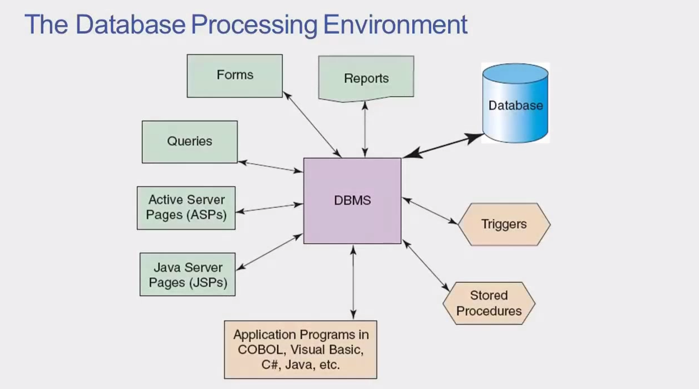

## The cocept of database transaction - Atomic Operations

* A database transaction typically involves several operations
* These operations are **atomic** and are sometimes called **logical units of work (LUW)**
* Before a transaction is committed to the database, all LUW must be successfully completed
    + If one or more LUW is unsuccessful, a **rollback** is performed and no changes are saved to the database

> A transaction is a series of operations that needs to be performed against a database (series of SQL commands)

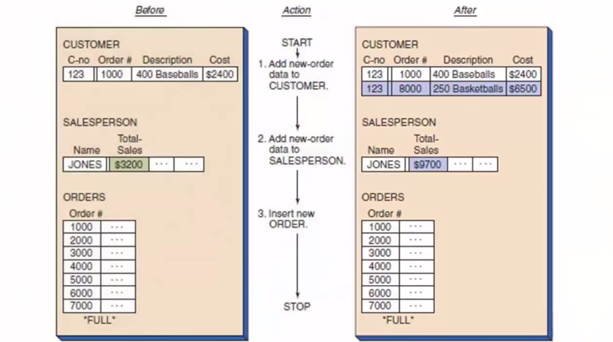

**Note:** In the example above at the 3rd step an error occurs `FULL` perhaps the database is running out of space and therefore not able to add any additional orders to the database. Now if we stop at this point, we have introduced several anamolies to our database, if we have to stop without undoing the changes we have made, than these anomalies will cause problems for this organisation. If all steps are treated as atomic, any changes that have been made will be undone if the error occurs during the exection of the transaction.

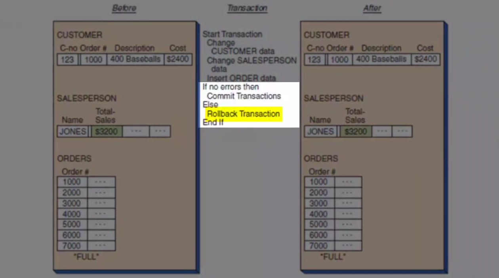

## Concurent Processing Example

Both of the users are trying to access a database table at the same time. User A makes a request to read `item 100`, while at the same time User B makes a request to read `item 200`. User A makes a request to change the value associated with `item 100`, and at the same point in time User B makes a request to change `item 200`. There results of User A and B needs to be written in the table both simultaneously. 

**Note:** Despite the fact that those user request are arriving simultaniously the database server must process them in a sequential fashion (see the example below - this order is chosen by **RDBMS**)

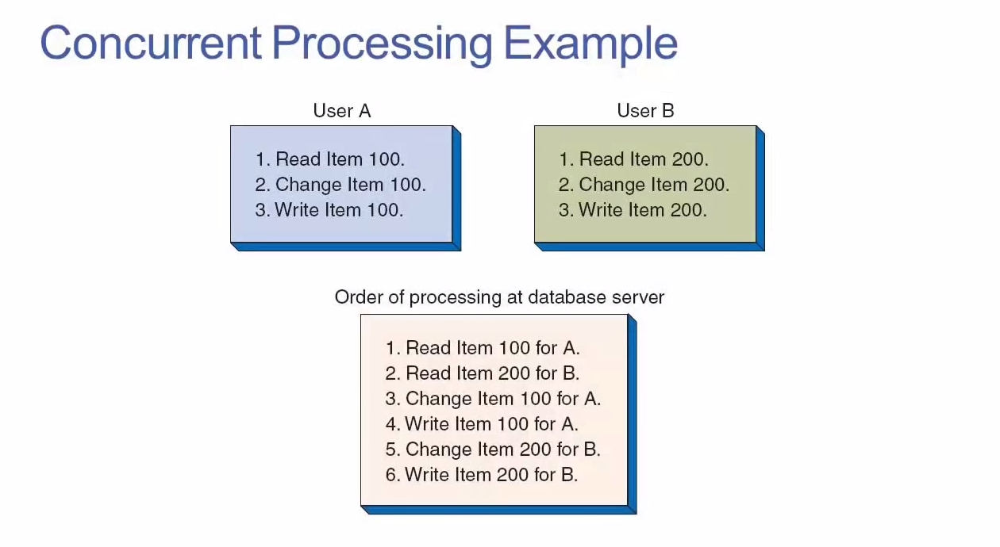

### Lost Update Problem

* If two or more users are attempting to update the same datum at the same time, it is possible for one update to overwrite the other update. 

**Notice:** In this example the item count should be 2 (left, since the User a has sold 5 and the User B has sold 3). But since the operations are happening concurrently, there is no lock or anything else the data will be overwritten and we'll get 7 as the total sum and not 2 as it should be.

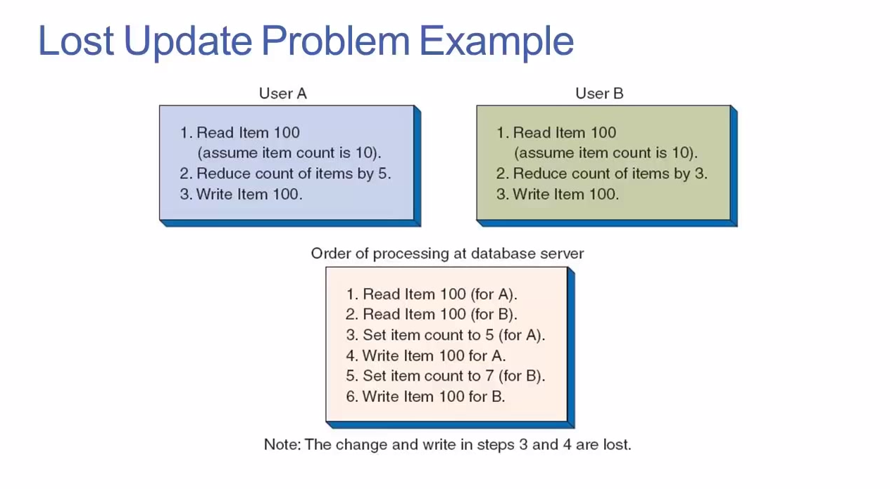

## Concurrency Issues (during an execution of a transaction)
* Dirty reads
    + The transaction reads a modified record that has not yet been committed to the database. Will read a record from another user those changes has not been comitted to the database (a database is informed to made a change but the db has not yet made that change)
* Incosistent reads
    + The transaction re-reas a data set and finds that the data have changed. 
* Phantom reads
    + The transaction re-reads a data set and finds that a new record has been added

## Resource Locking
* To avoid concurency issues (LOST UPDATE PROBLEM), **resource locking** is used to disallow transactions from reading, updating, and/or writing to a data set that is in use. 
* When resource locking is in place the data that is being used by a user, is temprorarilty locked until the the transaction is finished. There are two main locks:
    + Implicit locks: are issued automatically by the DBMS bases on an activity
    + Explicit locks are issed by users requiesting exclusive rights to specified data
        + Table locks
        + Row locks
        + Column locks
        + Cell locks

**Note:** Any users that are trying to attempt the data when they are locked, they will be simply put in the `wait state` added to the queue and their requests will be proceeded after the unlock. 

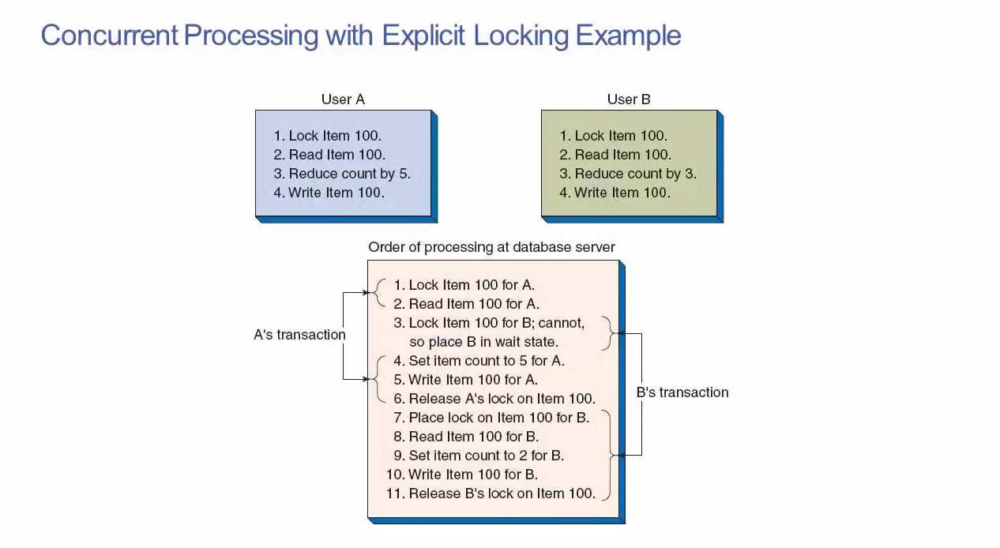

## Serializable Transactions (philosophical orientation)
* When two or more transactions are processed concurrently, the restult in the database should be logically consistent with the results that would have been achieved had the transactions been processed in an arbitrary serial fashion. 
* A schema for processing concurrent transactions in this way is said to be serializable. 

**Example:**
A + B = C
B + A = C

## Deadlock
Using a locking strategy can introduce certain new problems:

* As  a transaction begins to lock resources, it may have to wait for a particular resource to be released by another transaction. One transaction locks a resource that another transaction needs to complete it's task
* On accasion, two transactions may indefinitely wait on each noather to release resources
    + This condition is known as deadlock

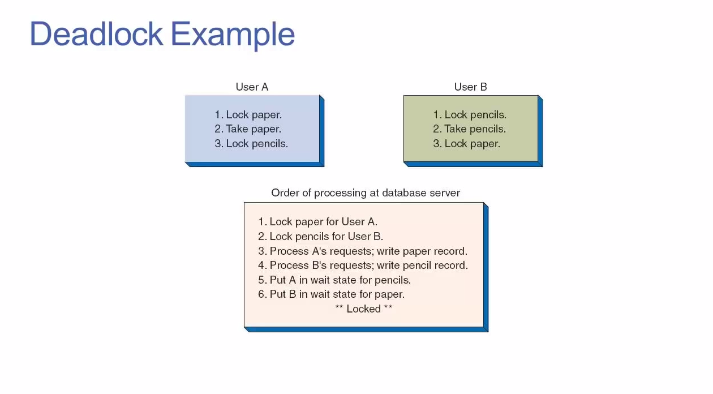

A in wait state for pencils to be released. B in wait state for paper to be released. These two transactions would then wait for each other indefinetely!!!

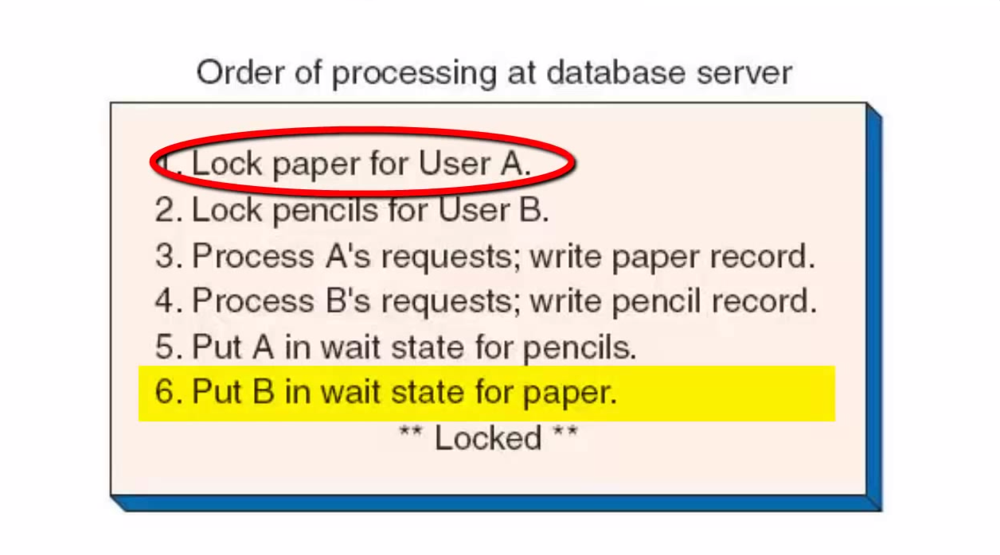

**Note:** DBMS must incorporate mechanism to avoid the deadlock situation.

## Optimistic Locking versus Pessimistic Locking

* Optimistic Locking (changes will succeed and no currcurrency control problems will arise - Many SELECts, Few INSERTs, UPDATE or DELETES - not that many updates to the data, most of the requests are reads)
    + Read data
    + Process transaction (initiate updates)
    + Issue update (update is recored)
    + Lock for conflict (lock and the writing start to happen)
    + If no conflict occured (check the database if conflicts/error occured)
        - THEN commit transaction (changes will become permament)
    + ELSE rollback and repeat transaction (we undo all of the steps and try to repeat it again)

* Pessimistic Locking (we assume a concurrency control problem may arise - many INSERTS, UPDATEs, or DELETEs - data is frequently updated)
    + Lock required resources
    + Read data
    + Process transaction (making updates or modificatinons to the database)
    + Commit changes (we add the changes)
    + Release locks

**Note:** We don't need to check if conflict occurs we simply commit the changes directly. Ther reason for that is that all the required resources are locked prior any updates or modifications are made. If Pessimistic strategy is used it's much more likely that other users will put into the `wait state` they have to wait inline to access the resources in the database to complete their transaction and it will slow the overall transaction of the database.

## Consistent Transactions

* Consistent transactions are often referred to by the acronym ACID:
    + Atomic
    + Consistent
    + Isolated
    + Durable

### ACID: Atomic
* An atomic transaction is one in which all of the database actions occur or none of them does.
* A transaction consists of a series of steps. Each step must be successful for the transaction to be saved
* This ensures that the trnasaction completes everything it intended to do before saving the changes

**Note:** It helps to avoid data anomalies!

### ACID: Consistent
* A transaction is **consistent** if no other transactions are permitted on the records until the current transaction finishes it tasks. (other transactions are disallowed when the transaction is on the way)
* This ensures that the transaction integrity has statement level consistency among all records. The consistency can be achieved through **database locks.**

### ACID: Isolation

* Within multisuer database environemnts, different transactions may be operating on the same data at the same time
* As such, the sequencing of uncommitted updates, rollbacks, and commits continuously changes the data content
* The ANSI SQL standard defins four isolation levels that specify which of the concurrency control problems are allowed to occur:
    1. READ UNCOMMITTED (least restrictive)
    2. READ COMMITED
    3. REPEATABLE READ
    4. SERIALIZABLE (most restrictive - users have to wait long periods of time)

### ACID: Durable

* A durable transaction is one in which all committed changes are permanent

**Note:** In a general sense, a commit is the updating of a record in a database. In the context of a database transaction, a commit refers to the saving of data permanently after a set of tentative changes. A commit ends a transaction within a relational database and allows all other users to see the changes.

## Cursors
* A cursor is a pointer into a set of rows that is the result set (the rows that we get returned after SQL operation) from a SQL SELECT statement
* Result sets can be very large, so applications and websites often cannot work with the entire result set as a single unit
* Cursors allow a result set to be processed one row at a time

```sql
DECLARE CURSOR LargePurchases AS SELECT *
FROM Sale
WHERE purchasePrice >= 10000;
``` 

* There are two major types of cursors:
    1. Forward-only cursors (non-scrollable)
        + Rows fetched serially from the start to the end of the cursor (iterate one row of the time - from first to the last rows each row till the end of the result set)
        + Rows are not retrieved from the database until they are fetched
            * The effects of any INSERT, UPDATE, or DELETE statements that affect rows in the result set are visible as the rows are fetched from the cursor
        + The cursor cannot be scrolled backward
            * Changes made to a row in the database after the row has been fetched are not visible through the cursor
    2. Scrollable cursors
        + The cursor can scroll both forward and backward through the result set as needed to examine rows (for application programm or data-driven website to examine the rows)

            * **Static cursors (snapshot cursor)**: 
                + The complete result set is retrieved and stored in a temprorary table when the cursor is opened. The data in the result set always appear as they did at the moment when the cursor was opened.
                + Any changes made to the underlying data (e.g. via INSERT, UPDATE, or DELETE statements) are not visible through the cursor (because we are not looking into the real data anymore, the static cursor uses the data from the temporary table)
                + Static cursors consume comparatively few system resources while scrolling

            * **Keyset cursors**:
                + The keys for the rows (e.g. primary keys) in the result set are retrieved and stored in a temporary table when the cursor is opened
                + When the cursor scrolls to a row, the key is used to fetch the current data values for that row from the database
                    * Updates made to a row after the cursor was opened are therefore visible through the cursor
                    * Rows in the result set that have been deleted after the cursor was opened can also be identified through the cursor
                    * **New rows using the INSERT statement are not visible to the cursor. The reason for this is that the key values are fetched and stored at the point in time when the cursor is opened, therefore any new rows their primary key values are not going to be included into my temporary table**

            * **Dynamic cursors**:
                + All changes made to the rows in the result set are visible when scrolling through the cursor
                    * All UPDATE, INSERT, and DELETE statements amde by all users are visible
                + The data values, rows, and order of rows in the result set can change on each fetch
                + Opposite of a static cursor
                + Dynamic cursors consume a comparatively large quantity of system resources while scrolling

## Database Security

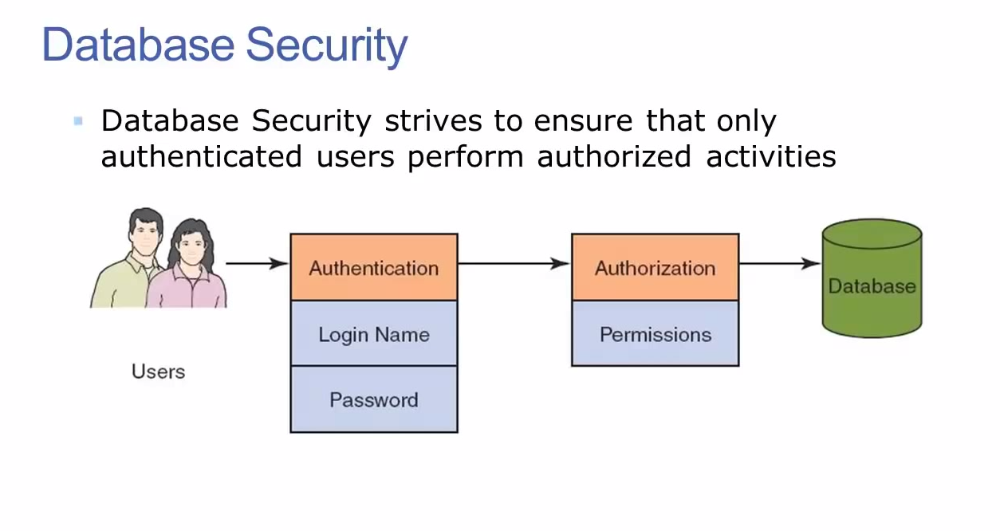

* Processing rights define:
    + Who is permitted to perfomr certain actions
    + When certain actions are allowed to be performed
* Teh individuals performing these activities have full responsibility for the implications of their actions
* Individuals are authenticated via a username and a password
* Database users are known both as an individual and as a member of one or more roles
    + Access and data rights/privileges may be granted to an individual and/or a role
* Permissions grant, deny or revoke a user's ability to interact with specific database objects (such as tables)
* Users possess the compilation of permissions granted to the individual and all the roles for which they are members
    + A user receives the union of all of the permissions granted, denied, or revoked by their indiviaul permissons and role permissions
    + if a conflict exists between individual and role permissions, then:
        - A "deny" persmission at any level always takes precendence
        - Aside from "denies", role permissions take precedence over individual permissions


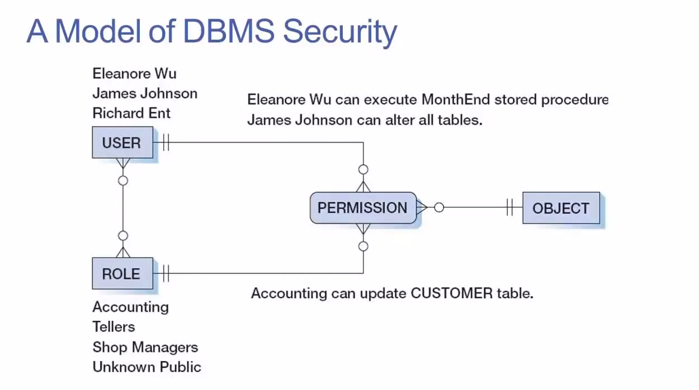

* SQL Server Database roles can be either fixed or flexible:
    + Flexible roles are custom roles that are defined by the database administrator
    + Fixed roles are predefined roles to which database users can be assigned

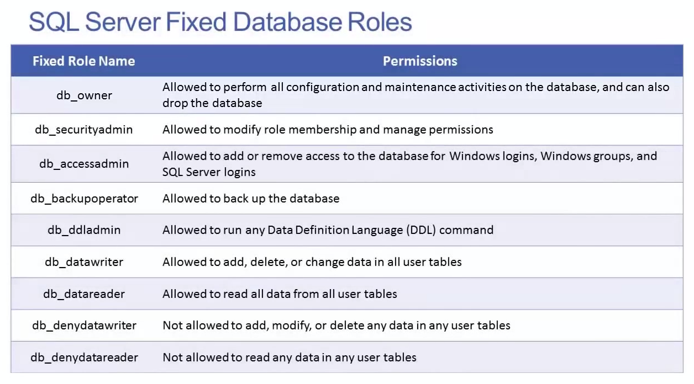

## Database Backup and Recovery
* Common causes of database failure
    + Hardware
    + Programming bugs
    + Human errors/mistakes
    + Malicious actions
* Since these issues are impossible to completely avoid, recovery procedures are essential

**Note:** Database needs to be backedup as often as possible

### Reprocessing (used in very small database implementations)
* In reprocessing, all activities since the last backup was performed are redone by humans
* This is a brute-force technique
* This procedure is costly in the effort involved in re-entering the data
* This procedure is risky in that human error is likely and in that paper record-keeping may not be accurate

### Recovery via Rollback and Rollforward (used in enterprises)
* Most databases management systems provide a mechanism to record activities into a log file
* The log file is used for recovery via rollback or rollforward
    + To undo a transaction (rollback) the log must contain a copy of every database record before it was changed
        - Such records are called before-images
        - A transaction is undone by applying before-images of all its changes to the database
    + To redo a transaction (rollforward) the log must contain a copy of every database record (or page) after it was changed
        - These records are called after-images
        - A transaction is redone by applying after-images of all its changes to the database

Here you can see a log file and all data that needs to be used for rollbacks/rollforwards. We can use either before-image or after-image.
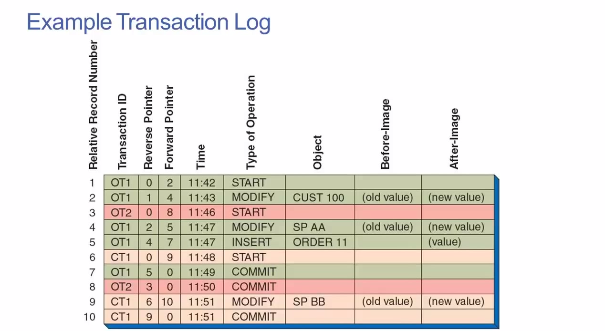

#### Rollback

* Log files save activities in sequence order
* It is possbile to undo activities by applying before-images to reverse database changes
* This is performed to correct/undo errorneous or malicious transaction(s) after a database is recovered from a full backup

#### Rollforward

The activities in the log file are recorded in sequence in order that which they were applied to the database.
* Activities recorded in the log files may be replayed
* In doing so, all activities are re-applied to the databse
* This procedure is used to restore database data by adding transactions to the last full backup

## Distributed Database Processing
* A database is distributed when it is
    + Partitioned
    + Replicated
    + Both partitioned and replicated
* This is fairly straightforward for read-only replicas, but it can be very difficult for other installations

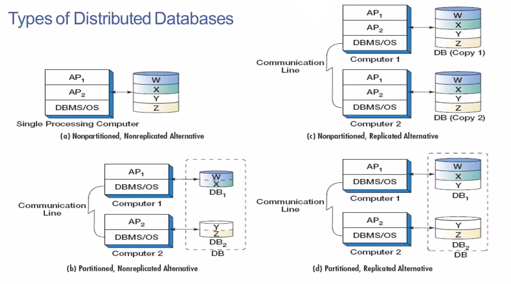

1. The database is stored on a single processing computer (Nonpartitioned, nonreplicated)

2. The database is partitioned across two different computers. Tables W, X are stored on the Computer 1 and tables Y, Z are stored on the computer 2

3. The database is replicated across two different computers. Computer 1 stores the whole DB (Copy 1) and computer 2 stores the whole DB (Copy 2)

4. The database is partitioned and replicated at the same time. We have a replica of the table Y on both computers and partition W, X on the 1st computer and Z on the second computer

## Object-Relational Database Management
* Object-oriented programming (OOP) is bases on objects, and OOP is now used as the basis of many computer languages
* Just like entities in the database, object classes have
    + identifiers
    + Properties: data items associated with the object
    + Methods: algorithms that allow the object to perform tasks
* The only substantive difference between entity classes and object classes is the presence of methods

**Note:** Since OOP is a so strong paradigm, developers have a need to save objects on a storage device.

* Object persistence (objects that can be retrieved for the future needs) means that values of object properties are stored and retrievable 
* Object persistence can be achieved by various techniques
    + A common technique is database technology
    + Relational database can e used, but require substantial programming
* In order to store objects in the database, there is a special Object-Oriented DBMSs (OODBMSs) have been developed, but have not achieved widespread commercial success
    + It would be too expensive to trnasfer ecisitng data from relational and other legacy databases
    + Therefore, OODBMSs are typically considered unjustifiable from cost perspective

* The current SQL standard includes several object-oriented features
    + User-defined structured types
    + Inheritance

```sql
CREATE TABLE policies (
   policy_id          int,
   date_issued        datetime,

   -- // other common attributes ...
);

CREATE TABLE policy_motor (
    policy_id         int,
    vehicle_reg_no    varchar(20),

   -- // other attributes specific to motor insurance ...

   FOREIGN KEY (policy_id) REFERENCES policies (policy_id)
);

CREATE TABLE policy_property (
    policy_id         int,
    property_address  varchar(20),

   -- // other attributes specific to property insurance ...

   FOREIGN KEY (policy_id) REFERENCES policies (policy_id)
);
``` 

* Any database that supports the SQL standard can therefore be considered an object-relational database

# Database Lesson #7 of 8 - Database Indexes

* Indexes are one of the most important and useful tools for achieving high performance in a relational database
    + Many database administrators consider indexes to be the SINGLE MOST CRITICAL TOOL for imporoving database performance
* An index is a data structure that contains an ORGANIZED copy of some of the data (one or more tables in the database) from one or more existing database tables
    + Like an index at the back of a textbook, a database index provides an organizational framework that the DBMS can use to quickly locate the information that it needs
    + This can vastly imporove the speed with which SQL queries can be answered


## Indexes - An Intutitive Overview

### Linear Search Strategy
* Consider the randomly ordered table of names shown to the right below
* If we start at the top and examine one row at a time, how many rows will we need to examine before we find a randomly selected name?
    + It depends on the name, if e.g. we would choose Mishra, we'll start at the top and find the name after inspecting only 1 name, if we would choose Ngo we need to inspect 16 names.
* What is the average search time if this process is repeated many times?
    + A metric to measure the the speed and performance of the database we can use to see the performance of the operations.
    + average = (n+1)/2 (n is the number of rows in the table) 
    + in this table (22 + 1)/2 = 11.5 rows to find a name we are interested in
* What is the maximum search time (linear search strategy)?
    + maximum = n (number of rows)
    + maximum = 22
    
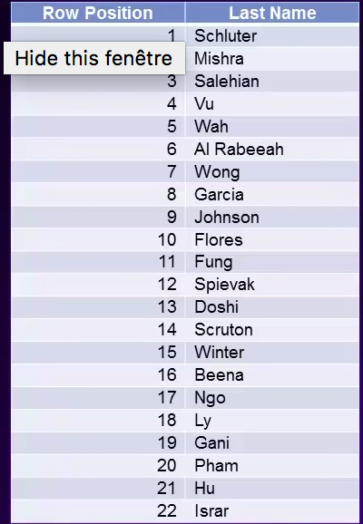

### A Binary Search Strategy
* Consider the aphabetically ordered table of names shown below
* If our objectivie is to minimize the number of rows that need to be examined in order to find a randomly chosen name, what search process could we use?
* What is the average search time if this process is repeated many times?
    + average = log2(n) - 1 (where n is the number of rows)
    + average = log2(22) - 1 = 3.5 rows
* What is the maximum search time?
    + maximum = log2(n)
    + maximum = log(22) = 4.5 maximum number of rows to locate the name we are looking for

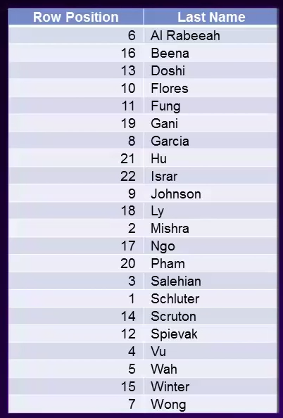

**Case:** Imagine we'll choose a name Salehian from the example above. The strategy involved in the binary search is described divide and conquer. The binary search starts to search in the middle of the table (beginning the search of row 12 - Mishra). Because we know the names are in alphabetical order, we now know that the row we are seeking is below row 12 in the table. After examining a single row we are able to aliminate a half of the possibilities, of where a randomly selected name may appear! We next repeat the process again, we choose a row that lies in the middle of our selected rows, we might look at the row that is at location row 6 among our remaining set of rows. The second location would be the row that contains the last name Spievak. Because the names are in alphabetical order we are now able to eliminate Spievak and all the rows that follow. 

After inspecting just two rows in the table we have been able to narrow down a set of possibilities to where our target name resides to just 5 rows. We then process with selecting again and choose a name in the middle and we would ask again the question `is this the row that we are seeking`? Yes this the row we are seeking, therefore we have completed the process.

In this example we just needed to explore 3 rows in the table to find the name in which we are interested.

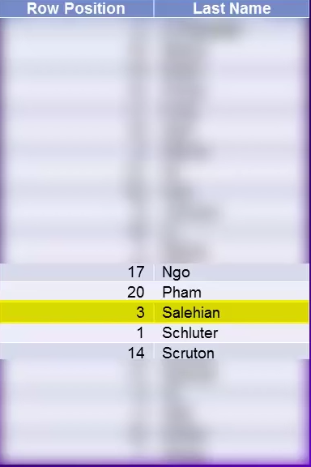

**Note:** The purpose of this exercise was to demonstrate the massive gain in search performance that we can achieve if we empose an organisational structure on a data through which we are searching. In this case the organisational data structure was alphabetizing the list of names.

## Index Concepts
* Indexes are created on one or more columns in a table
    * For Example:
        1. An index is created on a PK column
        2. The index will contain the PK value for each row in the table, along with each row's ordinal position (row number) within the table (the PKs are stored in a numerical order)
        3. When a query involving the PK is run, the DBMS will find the PK value within the index rather than the table itself to find the primary key value using the sort of binary search strategy. The DBMS will then know the position (ordinal position) of the row within the table > it's like looking at the index of the end of the textbook and there will be a pointer which will tell you at which page you should look for your desired information
        4. The DBMS can then quickly locate the row in the table that is associated with the PK value
* Without an index, the DBMS has to perform a table scan in order to locate the desired row(s)

* An index can be created on most, but not all columns
    + Whether an index can be created on a column depends on the column's data type
        * Columns with large object (LOB) data types cannot be indexed directly without employing additional mechanisms (such as a hash algorithm). These LOB data types include (in SQL server:
            + text
            + ntext (unicode text)
            + image
            + varchar(max)
            + narchar(max) (variable lenght character string - unicode)
            + varbinary(max) (store binary encoded data in the database)

* Creating an index increases the amount of storage space required by the database
    + This occurs because an index contains a copy of some of the data in a table
    + To estimate the storage space requirements of an index, use the following formula:
        Number of rows in table * Average number of bytes required per row for the indexed column(s)
    + For example:
        - We want to create an index on two columns, lastName and deptId, where:
            + Balues stored in lastName require an average of 16bytes/row
            + Values stored in deptid require an average of 2bytes/row
            + The table contains 98,000 rows
        - The index will require about 98000 * (16 +2) = 1764000 bytes of storage space


**Note:** We can see here that we are simply storing the copy of our actual table. But now we can use binary search to locate any name just to inspect 3.5 names and it will contain a pointer to a row name we've been seeking.

### Specific Type of Index Structure - B-Tree Index
* The commonest type of index uses a B-tree (balanced tree) structure
* B-trees use pointers and several layers of nodes in order to quickly locate desired data
    * Root node (less granular)
    * Intermediate nodes
    * Leaf nodes (more granular)
* When the DBMS processes a query which includes an indexed column, it starts at the root node of the B-tree and navigates downward until it finds the desired leaf

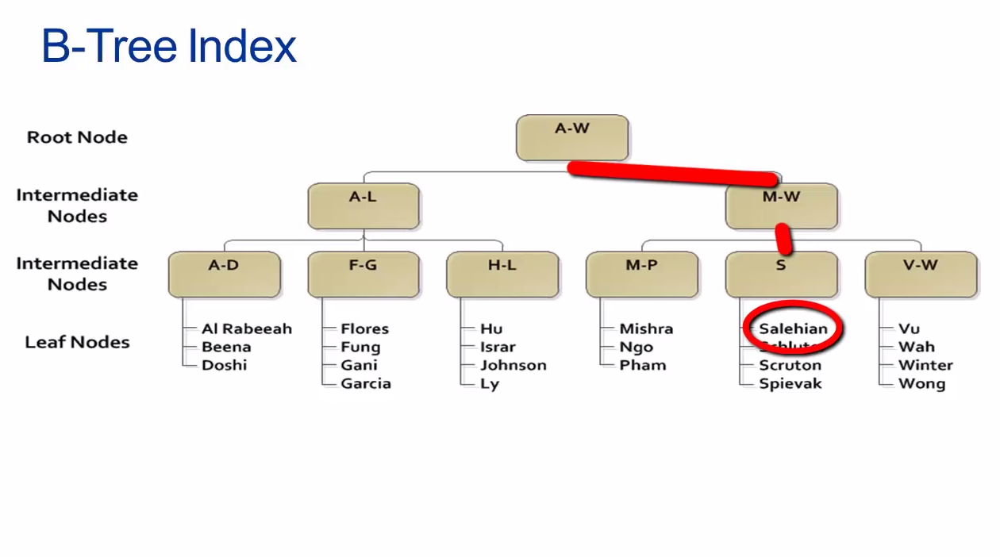

**Note:** B-tree is a balanced tree the term comes from the objective when constructing the b-tree index is to subdivided the data as evenly as possbile.

### Clustered vs. Non-Clustered Indexes
* In a clustered index, the actual data rows that comprise the table are stored in the leaf level of the index (it will improve the search time because the database don't need to follow the pointer)
* The indexed values are stored in a sorted order (either ascending or descending)
    + This means that there can be only `one clustered index per table`. PK columns are good candiates for clustered indexes

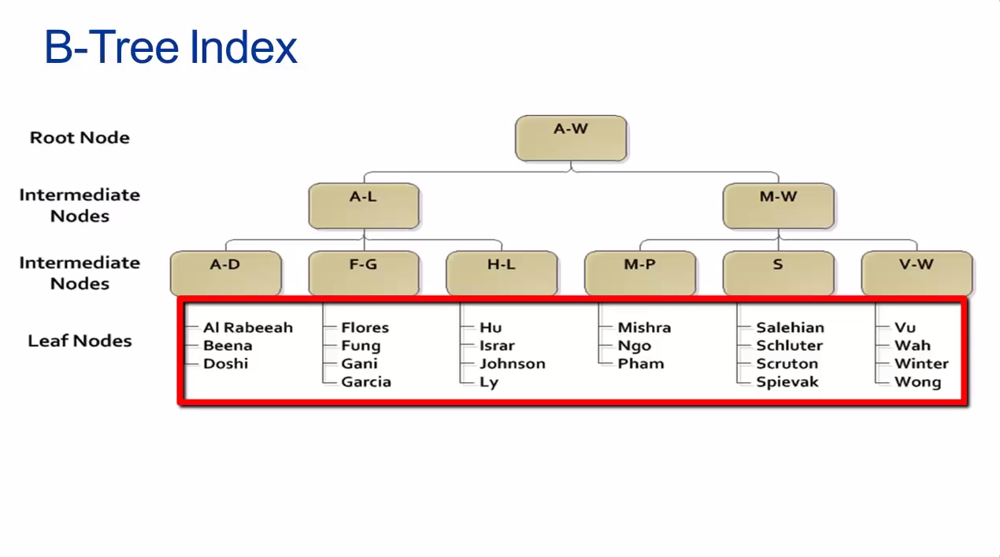

**Note:** At the leafs we are not only storing pointers to the rows within the database table, but instead we are storing the data rows itselfs. In a clustered index we are actually braking the table apart and storing it's rows in a specific way such as that we can maximise the search performance.


### Nonclustered Indexes
* In a nonclustered index, the leaf nodes contain the values from the indexed column(s), along with a row locator which points to the location of the actual data row
    + The actual data row might be stored in a leaf node of a clustered index or in a heap (a heap is just an ordinary table that does not use a clustered index)
* Nonclustered indexes are slower than clustered indexes because the DBMS must follow a pointer to retrieve the actual data row
**Advantages of Nonclustered Index**
* Unlike clustered indexes, a table can have more than one nunclustered index
* The leaf nodes of a nonclustered index can optionally contain values from non-indexed columns
    + Using this approach, the DBMS may be able to answer a query without ever needing to look at the actual data row itself! e.g. I have a product table where I have indexed the product name attribute, but imagine I have included also the product price as a part of nonclustered index. Now if I ran a query to find a price, the db can locate the product within the index and will know the price of the product without look into the db table itself. 

### Other Types of Indexes - Bitmap Index
* In a bitmap index, a table is created with the values of one attribute listed along the horizontal axis (student grade) and the values of another attribute along the vertical axis (student id). 
* A bit value (1 or 0) in each cell within the table indicates wheter the value of one attribute is associated with a value of the other attribute
* Bitmap indexes work best when one or both of the attributes has only a small number of unique values
* When used properly, a bitmap index can require only 25% of the disk space and can be 10 times faster than a tree-based index.

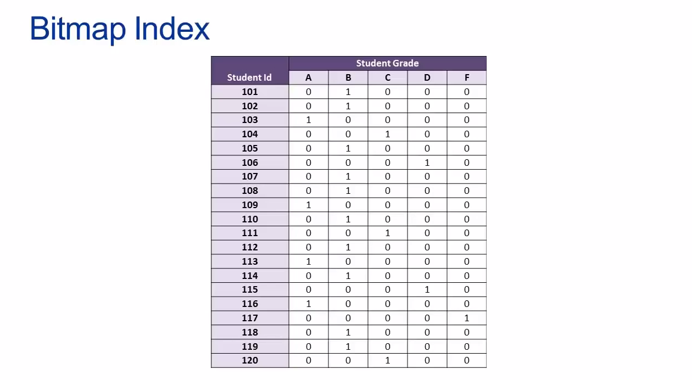

**Note:** If I write a query give me the student id of all of the students who received A, the database can use the Bitmap index such as one depicted (dargestellt) here in the example above and perform bitwise comparisons, which are computationally extremely fast.

### Other Types of Indexes - Hashed Index
* In a hashed index, a hashing algorithm is used in order to convert an input value (or input data) into a location within an index (such as a B-tree index), which in turn contains or points to the actual data row
* The hashing algorithms typically work by using prime numbers as input along with something called a modulo operation, which returns a remainder in order to generate a location within an index.
* Hashed indexes are useful in serveral situations, including:
    - In parallel processing or distributed database environment
    - When a need exists to index complect objects (such as images)


**Note:** We begin by running an image through the hash algorithm and the result of that operation is a location within an index. We run the hash algo and it gives us the location of an index of 5, we can then traverse our balance tree till we get down to index location 5, which then tells us to look at row 9 of the actual datatable in data we are interested.

### Index Considerations
* Since an index can consume a lot of storage space, indexes should only be created on columns that are involved in common queries
    + This means that a database designer must have knowledge of the queries that the DBMS will commonly process in order to design an indexing strategy
* Indexes should be used sparingly (sparsam) on tables that are updated frequently
    + Whenever an INSERT, UPDATE, or DELETE operation affects an indexed column, the index for the column must be rebuilt
    + Rebuilding an index takes time, and an index is rebuilt often can actually slow the overall performance of the database

### Indexing Guidelines
* If a table is heavily updated, index as few columns as possible
    + Do not over-index heavily updateed tables
* If a table is updated rarely, use as many indexed columns as necessary to achieve maximum query performance
* Clustered indexes are best used on columns that do not allow null values and whose values are uniuq
    + PK columns are therefore good targets for clustered indexes
* The performance benefits of an index are related to the uniquess of the values in the indexed column
    + Index performance is poor when an index column contains a large proportion of duplicate values
    + Index perfromance is best when an indexed column contains unique values

# Database Lesson #8 of 8 - Big Data, Data Warehouses, and Business Intelligence Systems

[Source - Final Video](https://www.youtube.com/watch?v=4WX2MZvmzho)


