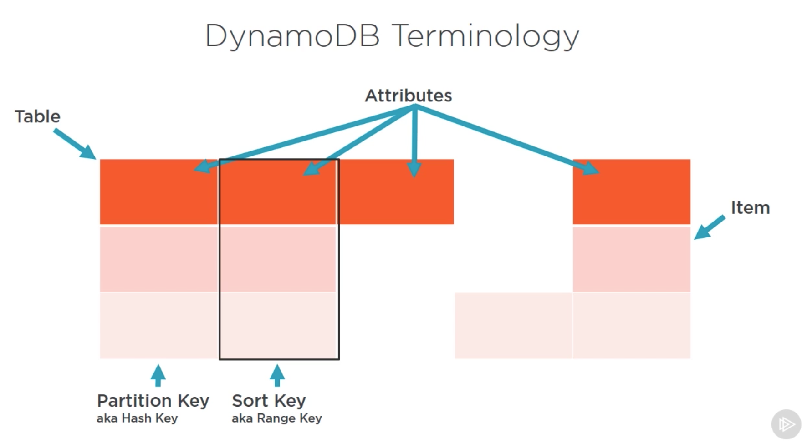

# AWS Developer: Getting Started with DynamoDB

[Source](https://app.pluralsight.com/library/courses/aws-dynamodb-getting-started/table-of-contents)

**Note:** Before you start working with DynamoDb don't forget to setup credentials or to change them. You can do it from [AWS CLI](https://docs.aws.amazon.com/cli/latest/userguide/cli-chap-getting-started.html)

## What is DynamoDb

... some marketing bullshit. 

* Fully managed: you don't need to manage architecture, but you still need to manage
    + Access
    + Encryption
    + Backups
    + Disaster recovery
* NoSQL dataservice: key-value store with document DB attributes
* Fast: designed to have < 10ms response time
* Predictable Performance: the service runs on SSD (solid state drives) 
* Seamless Scalability: the system can be scaled on a table basis

### DynamoDb Terminology

The highest level structure at DynamoDb is a table, data is stored within tables. A table is made up of rows, which are called items in DynamoDb. Each item contains attributes (typically these are columns in a relational model). DynamoDb is schemaless, which means each item can have different set of attributes. 

* The single primary key is known as a partition key (HASH): The attribute on which the data can be partioned. This is a mandatory key which needs to be defined at table creation time (cannot change later). If a table is designed with a composite partion key a table made with two attributes, you also have a sort key (RANGE).

* A sort key is the attribute which defines the way the data is sorted within the partition. If you have a sort key, the unique identifier are both keys. 

### SQL vs. DynamoDb Terminology

Table = Table 
Row = Item
Column = Attribute
Primary Key = Partition Key (single primary key) OR Partition and Sort Key (composite primary key)

### Tables

* DynamoDb  service is a set of tables
* Tables are the top level structure
* Performance is managed at the table level
* Table are schema-less (doesn't need to be predefined, apart from the primary key)
* Tables are scoped within a region

### Data Types in DynamoDB

* Scalar: can represent exactly one value
    + String: simple text
    + Numbers: positive, negative or zero
    + Binary: can store any binary data such as compressed encrypted data or images
    + Boolean: true or false
    + Null: unkown or undefined state
* Set: can represent multiple scalar values
    + String Set: ["White", "Black", "Yellow"]
    + Number Set: [124, 134, -19, 7.5]
    + Binary Set: ["V34ssdfi=", "sfEEskd=", "0sdfk="]
    + Rules: 
        * Sets can be used on one scalar type, all values within a set must be strings, numbers or binaries, they cannot be mixed together.
        * Empty sets cannot be supported by DynamoDb
        * Ordering within a set is not preserved (the application must not rely on ordering within a set)
        * Each value must be unique within a set
* Document: can represent a complex structure
    + List: can stored an ordered collection of values ["Cookies", "Coffee", 3.144354] = is similar to JSON array
    + Map: an unordered collection of name/value pairs {Day: "Monday", Emails: 42} = is similar to JSON object

## Capacity Units

Predefined the throughput at table level for reads and writes separately. Behind the scenes DynamoDb will use this information to reserver sufficient hardware resources to ensure it will make your requirements. Trorughput in DynamoDb is broken down into two controls:

* Read Capacity Units (RCUs)
* Write Capacity Units (WCUs)

**Note:** RCUs and WCUs can be updated anytime.