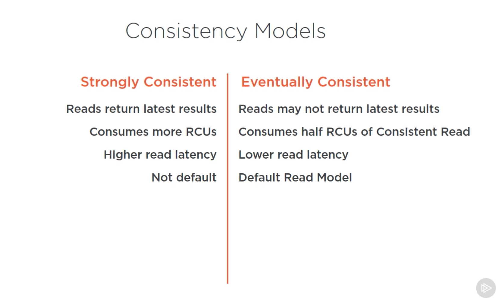
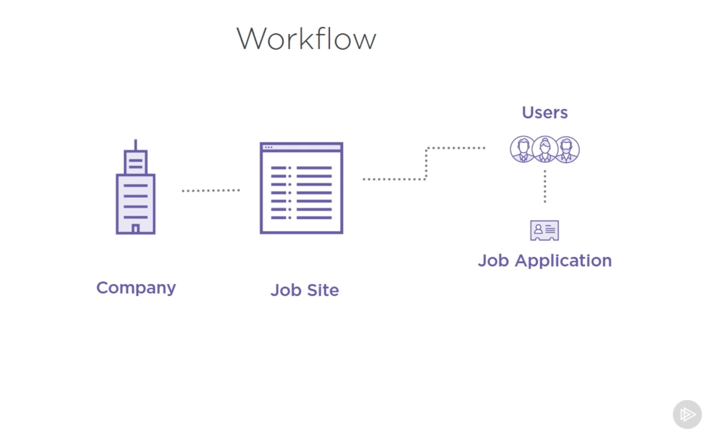
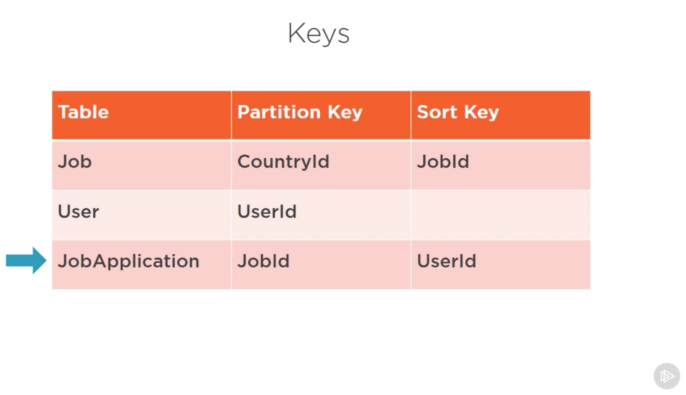
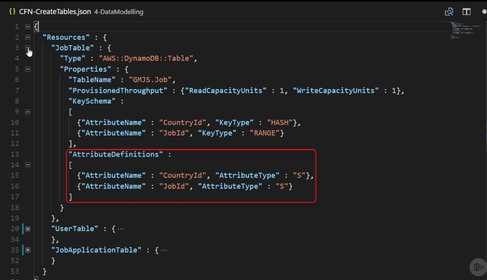
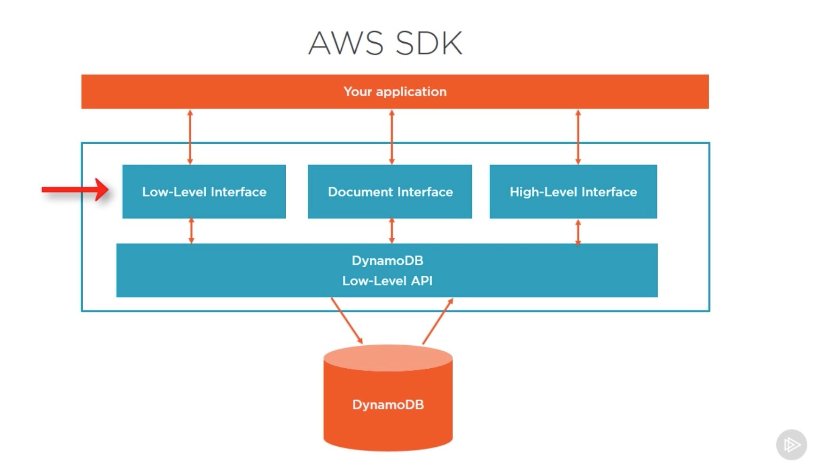
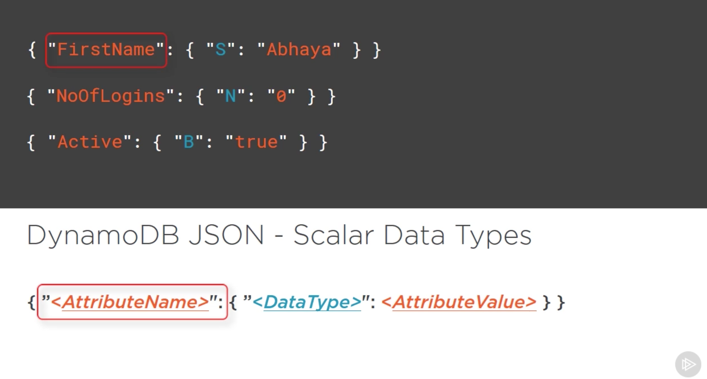
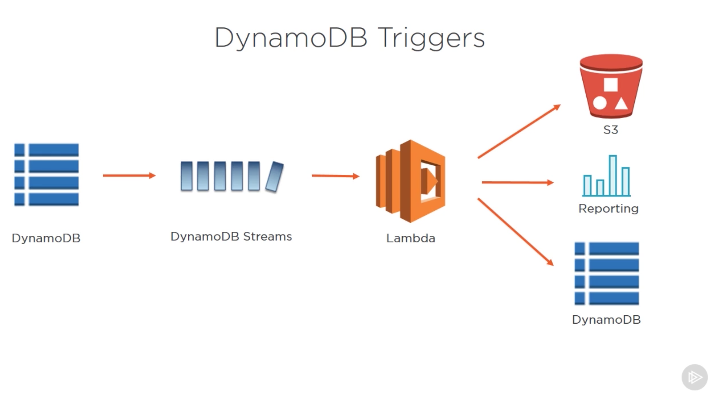

# AWS Developer: Getting Started with DynamoDB

[Source](https://app.pluralsight.com/library/courses/aws-dynamodb-getting-started/table-of-contents)

**Note:** Before you start working with DynamoDb don't forget to setup credentials or to change them. You can do it from [AWS CLI](https://docs.aws.amazon.com/cli/latest/userguide/cli-chap-getting-started.html)

## What is DynamoDb

... some marketing bullshit. 

* Fully managed: you don't need to manage architecture, but you still need to manage
    + Access
    + Encryption
    + Backups
    + Disaster recovery
* NoSQL dataservice: key-value store with document DB attributes
* Fast: designed to have < 10ms response time
* Predictable Performance: the service runs on SSD (solid state drives) 
* Seamless Scalability: the system can be scaled on a table basis

### DynamoDb Terminology

The highest level structure at DynamoDb is a table, data is stored within tables. A table is made up of rows, which are called items in DynamoDb. Each item contains attributes (typically these are columns in a relational model). DynamoDb is schemaless, which means each item can have different set of attributes. 

* The single primary key is known as a partition key (HASH): The attribute on which the data can be partioned. This is a mandatory key which needs to be defined at table creation time (cannot change later). If a table is designed with a composite partion key a table made with two attributes, you also have a sort key (RANGE).

* A sort key is the attribute which defines the way the data is sorted within the partition. If you have a sort key, the unique identifier are both keys. 


### SQL vs. DynamoDb Terminology

Table = Table 
Row = Item
Column = Attribute
Primary Key = Partition Key (single primary key) OR Partition and Sort Key (composite primary key)

### Tables

* DynamoDb  service is a set of tables
* Tables are the top level structure
* Performance is managed at the table level
* Table are schema-less (doesn't need to be predefined, apart from the primary key)
* Tables are scoped within a region

### Data Types in DynamoDB

* Scalar: can represent exactly one value
    + String: simple text
    + Numbers: positive, negative or zero
    + Binary: can store any binary data such as compressed encrypted data or images
    + Boolean: true or false
    + Null: unkown or undefined state
* Set: can represent multiple scalar values
    + String Set: ["White", "Black", "Yellow"]
    + Number Set: [124, 134, -19, 7.5]
    + Binary Set: ["V34ssdfi=", "sfEEskd=", "0sdfk="]
    + Rules: 
        * Sets can be used on one scalar type, all values within a set must be strings, numbers or binaries, they cannot be mixed together.
        * Empty sets cannot be supported by DynamoDb
        * Ordering within a set is not preserved (the application must not rely on ordering within a set)
        * Each value must be unique within a set
* Document: can represent a complex structure
    + List: can stored an ordered collection of values ["Cookies", "Coffee", 3.144354] = is similar to JSON array
    + Map: an unordered collection of name/value pairs {Day: "Monday", Emails: 42} = is similar to JSON object

**Note:** A document database, also called document store or document-oriented database, is a subset of a type of NoSQL database. Some document stores may also be key-value databases. The term "document" refer to a block of XML or JSON data. Instead of columns with names and data types that are used in relational database, a document contains a description of the data type and the value for that description. Each document can have the same or different structure. To add additional types of data to a document database, there is no need to modify the entire database schema as there is a with relational database. Data can simply added as objects to the database. [Source](http://basho.com/resources/document-databases/)

**Note:** The primary key uniquely identifies each item in the table, so that no two items can have the same key. In a table that has only a partition key, no two items can have the same partition key value. The partition key of an item is also known as its hash attribute. The term hash attribute derives from the use of an internal hash function in DynamoDB that evenly distributes data items across partitions, based on their partition key values. [Source](https://docs.aws.amazon.com/amazondynamodb/latest/developerguide/HowItWorks.CoreComponents.html)

### Capacity Units

Predefined the throughput at table level for reads and writes separately. Behind the scenes DynamoDb will use this information to reserver sufficient hardware resources to ensure it will make your requirements. Trorughput in DynamoDb is broken down into two controls:

* Read Capacity Units (RCUs)
* Write Capacity Units (WCUs)

**Note:** RCUs and WCUs can be updated anytime.

### What is a partition?

Partitions are the underlying storage mechanism in DynamoDb. It's critical to understand how data is partioned and stored. Partition is where the table is divided into multple smaller parts. By splitting a large table into smaller individual partitions, queries that access only a fraction of the data can run faster, cause there is less data to work with. It also makes it easier to manage smaller sets of data. 

![Partitions])(./images/dynamodb-partitions.png)

There are 3 drivers for database partitioning.

1. Manageability:
2. Performance:
3. Availability:

Partitioning can assist with one or more of these attrbiutes. There are couple of different types of database partitioning methods. 

* Vertical partitioning (by attributes): is where a table is split by columns. In this case the first 3 columns are in partition 1. And columns 4 and 5 are in partition 2. 

* Horizontal partitioning (by items): is where a table is split by rows. DynamoDb leverages this horizontal partitioning method. This is handled entirely by AWS. 

**Note:** DynamoDb doesn't partition until it needs to scale for performance or storage. 


We see here an example how the items can be stored in different partitions. ABC in partition 1, XYZ, XYZ in partition 2, DEF in partition 3. These partitioning impacts quering on the database.

#### There are 2 types of queries DynamoDb can perform

* Queries where we have a known partition key: DynamoDb knows which partition to access.
    + When the partition key is knows the request goes to Dynamodb and DynamoDb knows which partition to access to perform a read. This significantly optimizes the performnace on queries as it only needs to work on a subset of data.

* Queries where we have a unkonwn partition key: DynamoDb doesn't know which partition to access. 
    + When a partition key is unkonwn the request cannot target a specific partition and must scan all partions which is the entire table. This means performing a lot more work and consuming a lot more capacity units. 

#### Consistency Models

**Note:** A very important part of quering of DynamoDb is understanding the consistency model it provides. It can significantly impact your application and also costs. There are two models available when performing read operations on DynamoDb. This can be specified in the API call when performing the query. 

**Important:** For distributed databases such as DynamoDb (eventually consistent - reads may not return the latest results) to be highly available data needs to be replicated to multiple locations, this is done asynchronously and hence may take up to 1 second to reach all replicas. If the read operation is performed before the data is copied to all replicas, it may receive stale data. 



### Capacity Units

Capacity units are predefined throughput requirements for a Table. In the background DynamoDb will provision the required hardware to support our throughput. Throughput is specified in two ways:

* Read capacity units (RCUs): Two models of reads we can perform and each read is rounded of the closes 4kb
    + Strongly consistent (needs to be activated during the API call): 1 RCU = 4kb / second. Formula: item size / 4kb = round up. To read 20kb we need 5 RCUs. Another example 2kb / 4kb = 1 RCU (round up to 4kb)
    + Eventuelly consistent (default): 0.5 RCU = 4kb / second. Formula: (item size / 4kb) / 2 = round up. To read 20kb we need 2.5 RCUs. Another example (2kb / 4kb) / 2 = 0.5 RCU

* Write capacity units (WCUs): 1 WCU = up to 1kb of data / second (each write opertion is rounded up to closes 1kb). Formula: item size / 1 kb. This will gives us the amount of WCUs required to complete the operation. Example: 5kb of data 5kb / 1kb = 5 WCUs. To write 5kb of data we need to write 5 WCUs. If we want to write 500 bytes of data it means 0.5kb / 1kb = 1 WCU (round up). 


## Creation our Tables



We can simplify our logic and enhance our entities into 3 types:

1. Job: A vacant position that needs to be filled within a company. 
    + Job id: String (UUID) (DynamoDb doesn't support incremental unique identifier such as in RDB)
    + Country id: String
    + Job Title: String
    + Job Desc: String
    + Closing time: Number (epoch time)

**Important:** We are going to setup as a partition key the `Country Id`. Typically in relational databases we'll setup `Job Id` as a primary key as it is also an unique key. For DynamoDb the partition key is how the data will be partitioned. This is very important as we typically don't want to query across partition. A good separation for our data would be a separation by `Country Id` as we do not expect users to query jobs across countries at this stage. To ensure the uniques, we'll use `Job Id` as a sort key.

2. User: a person who can apply to fill a job - User cannot submit a job application before he hasn't created an account
    + User id: String (UUID)
    + Firstname: String
    + Lastname: String

**Important:** For users we'll use the `User Id`as a primary key which is the universal unique identifier. 

3. Jobs application: the application that represents the application for the job. Is a set of information the user can submit for open job vacancy. 
    + Job Id: String (UUID) - the application if for
    + User Id: String (UUID) - the user that's applying for the job
    + Job Title: String
    + Time Applied: Number (epoch time)
    + Applicaiton Form: String - set of questions the user must answer to apply for the job itself - typically in json format
    + Resume: String - simplify into a json format

**Important:** For job application we'll use as a partition key the `Job Id` and as a sort key the `User Id`. A typical case for querying will be seeing all job applications within a job, hence the `Job Id` as a partition makes sense.



**Note:** When we provision a new DynamoDb table we need to define the RANGE + SORT key, but also we need to define the data types. Under KeySchema you can define the keys and under AttributeDefinitions you can define the data types. Keep in mind that DynamoDb is schema-less and the AttributeDefenition section is only for key attributes.




### Administrative APIs

* ListTables: allows us to return available tables within account and a region
* DescribeTables: gives us information about specified table > key schema, RCUs/WCUs, data types for keys, items counts etc.
* UpdateTable: allows you to update the settings on a table. It allows to perform operations such as:
    + Updating the RCUs/WCUs
    + Enable/Disable Streams
    + Create/Remove Global Secondary Indexes

```js
console.log('Increasing RCUs/WCUs to 2: ')

const params = {
    ProvisionedThroughput: {
        ReadCapacityUnits: 2,
        WriteCapacityUnits: 2
    },
    TableName: 'PL.Job'
}

dynamoDb.updateTable(params).promise()
    .then(() => {
        const params = { TableName: 'PL.Job'}
        console.log('Waiting for update to finish...')
        return dynamoDb.waitFor('tableExists', params).promise()
    })
    .then(res => console.dir(res, {depth: null, colors: true}))
    .catch(err => console.error(err))
``` 
You can see here above an example how to update a table. We know that increasing RCUs/WCUs is an async function, which means it may take up to 30 seconds. In the example above we can see `dynamoDb.waitFor('talbeExists', params)` which enables us to encode wait until the table is in the final state. Once it is we simply print the output. 

**Note:** Conditional requests allows you perform a put operation based on certain conditions. 

### AWS SDK

**Note:** AWS SDK is an abstraction over low-level DynamoDb APIs. Which takes a lot of tidious work away, such a serializing requests, basic retry logic and generating signatures for each request. [Link to AWS SDK](https://docs.aws.amazon.com/AWSJavaScriptSDK/latest/AWS/DynamoDB.html)

Whithin SDK you can can have different level of interaction with the APIs. We'll focus on Low-level interface model rather than High-level or Document interface. The main reason for this is to make sure we learn how DynamoDb works. 



[Programmatic Interfaces](https://docs.aws.amazon.com/amazondynamodb/latest/developerguide/Programming.SDKs.Interfaces.html)

**Low-Level Interfaces:** Every language-specific AWS SDK provides a low-level interface for DynamoDB, with methods that closely resemble low-level DynamoDB API requests. In some cases, you will need to identify the data types of the attributes using Data Type Descriptors, such as S for string or N for number.

**Document Interfaces:** Many AWS SDKs provide a document interface, allowing you to perform data plane operations (create, read, update, delete) on tables and indexes. With a document interface, you do not need to specify Data Type Descriptors; the data types are implied by the semantics of the data itself. These AWS SDKs also provide methods to easily convert JSON documents to and from native DynamoDB data types.

**Object Persistence Interface:** Some AWS SDKs provide an object persistence interface where you do not directly perform data plane operations. Instead, you create objects that represent items in DynamoDB tables and indexes, and interact only with those objects. This allows you to write object-centric code, rather than database-centric code.

### DynamoDb JSON Item Schema

Typically when interacting with items we need to specify value of keys or attributes. This is done through a standard DynamoDb JSON format. Which follows the scheme:

```json
{
    "<AttributeName>": {
        "<DataType>": "<AttributeValue" }
}
``` 



**Note:** Numbers have also "" (double-quotes) similar to the strings. Also see the value of true in "" (double-quores). This is the standard JSON definition format.

**Lists Data Types**
```json
{
    "SampleList": {
        "L": ["Your Name", 5 ]
    }
}
``` 

Note: Lists can store any type of data in comparison to String set it's an unordered set of unique strings. 

**String Set Data Types**
```json
{
    "StringSetExample": {
        "SS": ["First Name", "Second Name" ]
    }
}
``` 
{"AttributeName": {"DataType": AttributeValue}}

**Map Data Types**
```json
{
    "MapExample": {
        "M": {
            "FirstName": "Name",
            "NoOfLogins": 0
        }
    }
}
```

**Note:** Elements in the map don't have to be of the same type. There are no restrictions how the elements are stored on a map

### Main API Methods

* PutItem: Creates a new item, or replaces an old item with a new item otherweise the item will be created. If you are trying to use the same partition key and just change some key/values, the old key/values will be replaced with the new ones.

* UpdateItem: Edit an existing item's attributes or add a new item to the table if it doesn't already exist.

```js
const params = {
    "TableName": "PL.User",
    "Key": {
        "UserId": {"S": "001"}
    },
    "ReturnConsumedCapacity": "TOTAL",
    "UpdateExpression": "SET #LN = :t, #NOL = :n",
    "ExpressionAttributeNames": {
        "#LN": "LastName",
        "#NOL": "NoOfLogins"

    },
    "ExpressionAttributeValues": {
        ":t": {"S": "Tyrson"},
        ":n": {"N": "1"}
    }
}
```

`UpdateExpression` is the expression which drives which attributes will be updated. It looks unsual simply because it's made up of keywords and tokens. In this case we use the keyword `SET` which allows us to create or update attributes. `ExpressionAttributeNames` and `ExpressionAttributeValues` are substitued for the tokens in the `UpdtaeExpression`. For example `#LN` will be replaced with `LastName` and `#NOL` will be replaced with number of `NoOfLogins`. The same will be happening with `:t and :n`. 

**Note:** An expression in a programming language is a combination of one or more explicit values, constants, variables, operators, and functions that the programming language interprets (according to its particular rules of precedence and of association) and computes to produce ("to return", in a stateful environment) another value. This process, as for mathematical expressions, is called evaluation. [Source](https://en.wikipedia.org/wiki/Expression_(computer_science))

**Important:** The following keywords are reserved for use by DynamoDB. Do not use any of these words as attribute names in expressions. [Source](https://docs.aws.amazon.com/amazondynamodb/latest/developerguide/ReservedWords.html)

Another keyword we can us in `UpdateExpression`is `ADD` which allows us to increment a number datatype by the number specified. We have here also a `ConditionExpression` which allows us to specify a condition that must be specified in order to perform an update. 

```js
const params = {
    "TableName": "PL.User",
    "Key": {
        "UserId": {"S": "001"}
    },
    "ReturnConsumedCapacity": "TOTAL",
    "UpdateExpression": "ADD #NOL :n",
    "ExpressionAttributeNames": {
        "#NOL": "NoOfLogins"

    },
    "ExpressionAttributeValues": {
        ":n": {"N": "1"},
        ":max": {"N": "5"}
    },
    "ConditionExpression": "#NOL < :max"
}
``` 

* DeletItem: Deletes a single item in a table by providing a primary key. The parameters for the API, are table name and primary key. This operation will not inform you if the item has not been found. If you want to be notified if the item has been found, please use conditional expression to check if the item exists. 

**Note:** More information [Working with Items can be found here](https://docs.aws.amazon.com/amazondynamodb/latest/developerguide/WorkingWithItems.html)

* GetItem: Enables you to retrieve a single item given the Primary Key. This enables us to solve use cases such as getting a specific job a specific user or a job application. The primary key would be the partition key and the sort key depending on the tables key schema. If you've got a sort key, you need to specify a sort key as well. 

* GetQuery: It's much more powerful API than the `GetItem` API, it allows you to retrieve items based on a primary key values. It allows you to query within a partition key, it allows you to scope down by filtering on a sort key. The filter on the sort key is very powerful. Range of comparison operators available on the Sort key. 

* Scan API: Allows you to return one or more items by accessing every item in the table. It scans every item. It's the least favorable way to access data in DynamoDb due to that expensive behaviour. It's typically used when your keys and indexes not allow you to use `getItem` or the `query` API's. This is why designing your keys and indexes is so important. 

Here is a good example why `Scan` operation is very bad and costly:

```js
   "Count": 5,
    "ScannedCount": 100,
    "ConsumedCapacity": {
        "TableName": "PL.Job",
        "CapacityUnits": 89
    }
}
"Size of data: 36.0 KB"
``` 
This small operation has consumed 89 Read Capacity Units and just found 5 items that we were looking for. The size of the data was only 36kb / 4kb /2 = 4,5 Read Capacity Units. So by using `scan` we literally overpaying by 20 times. If we would use `query` we would only consume 4,5 RCUs, but by using `scan` we have used `89` RCUs.

## DynamoDb Batch Operations

* BatchGetItem: Enables you to perform one or more GetItem calls in one request. The API returns the attributes of 1 or more items from 1 or more tables based on the primary key. Each operation can retrieve up to 16mb of data or 100 items. The batch call is not atomic: you may receive unprocessed keys in the response which indicates partial success. The batch operation works in parallel and hence results are not ordered. 

* BatchWriteItem: Enables you to perform multiple puts or deletes in one request. A single call can write up to 16mb, or up to 25 PUTs and DELETE requests. Cannot not update items (partial attribute operation). Batch call is not atomic each PUT or DELETE operation within the batch is atomic, it can return unprocessed items in the response, which means those needs to be resend. Works in parallel and only saves time (in terms of latency and roundtrips) but not WCUs. 

**Note:** Entire Batch API calls are not atomic

## Working with DynamoDb Streams & Triggers

* DynamoDb streams is a feature avialable at a table level and it allows us to track changes. It allows us to access the database transaction log for 24h period. Every successful put, delete or update request on the table is available. DynamoDb streams is a strem of ordered events which capture all data changes.

* DynamoDb triggers is code that is executed automatically when certain events occur. Communly these triggers are on insert, update or delete events on a table. It's used for auditing data changes. DynamoDb triggers are pieces of code that respond to events in DynamoDb Streams.



Some use cases for streams & triggers:

* Real-time analytics
* Build and update caches
* Run business processes on table based events
* Replication & Backups
* ETL for data warehousing
* Publishing events to a messsage bus

