# DynamoDb Design Patterns

[Source Video](https://www.youtube.com/watch?v=PDQ3jbDyTQ4&feature=youtu.be)
[Source Slides](https://www.slideshare.net/AmazonWebServices/design-patterns-using-amazon-dynamodb)

* Storage is cheap and CPU is costly. We are optimizing for the better CPU usage and not storage. This is where NoSQL plays huge role. If we take e.g. a key-value store database we are simply storing blob files with an identifier as a primary key or partion key, the data inside is not accessible for us (no operations on that data possible)

* Since data usage is growing really fast, SQL databases cannot scale. That's why we are looking into NoSQL databases. We have a data pressure. 

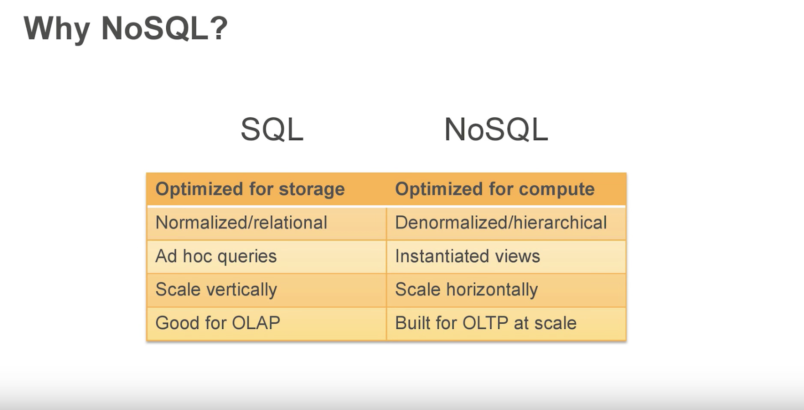

* SQL is good for OLAP I know what people want to see, which questions they are going to ask about getting data. But if you want to build OLTP NoSQL is perfect. When I write a query from SQL it joins data from multiple tables, when it does that it's actually burning a lot of CPU, it's going around multiple tables, lining up all the data and building up the relational view. 

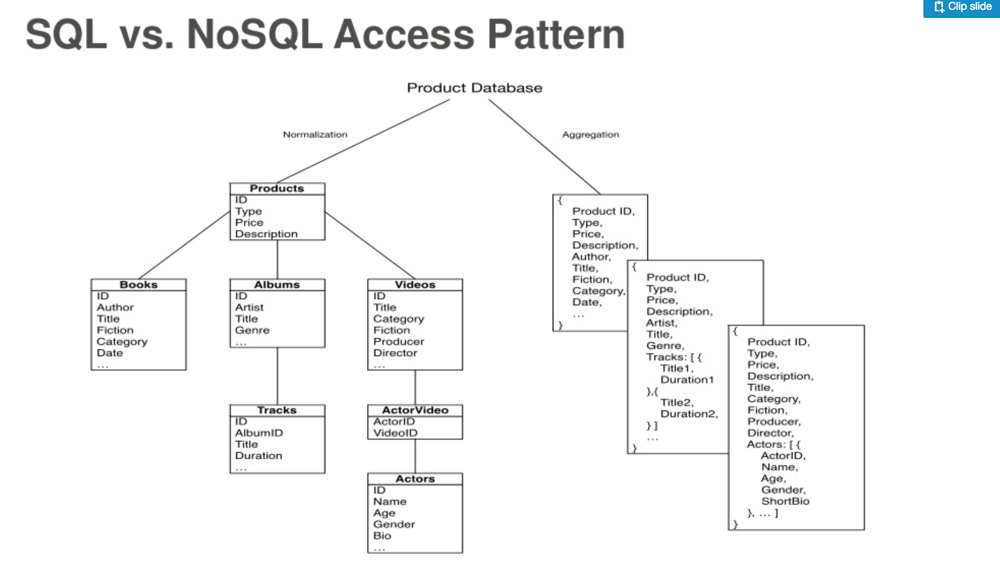

We have here 1 to 1 relationship between products, books, albums and videos. We have 1 to many between albums and tracks. We have many to many between videos and actors. Actors can be in many videos and videos can have many actors. These are the commonb ase relational structures we have seen. You can imagine what kind of videos you have to execute to pull all my videos or all my albums. For example if we want to produce a view of products, videos, actors we need to join 4 tables to produce the view we want.

We don't really want to do that in NoSQL. The power of NoSQL there is no join it's all about `select` and this is how we design a data and everything needs to be a table select item. 

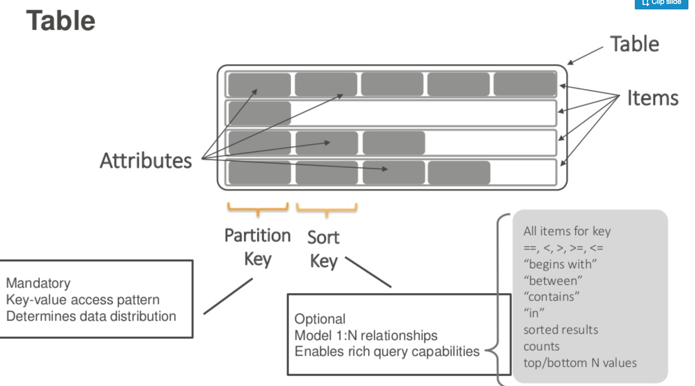

**Note:** NoSQL scales by partitioning. Every NoSQL has this construct. In MongoDb it's under Id, in Cassandra it's under similar to DynamoDb. 

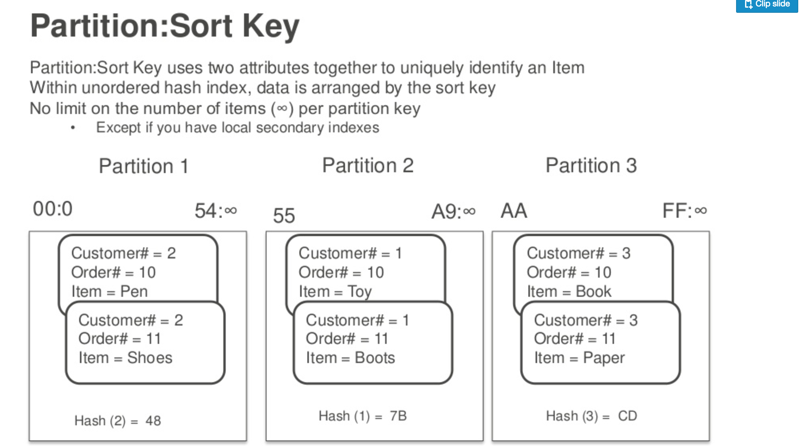

**Note:** If you initiate a consistent read you are reading from 2 nodes. If you initiate eventually consistent read you are reading from 1 node but you pay half of the price of the consistent read. 

Local secondary index is co-located on the same storage partition. And what it gives is the ability to be consistent when you update the table the local secondary index will be consistently updated. They are partitioned on the exact same key as the parent table, meaning it's the exact same aggregation. Why would i do this? Because I want to execute range queries on different dimensions. 

**Note:** You can query on the secondary index and get those attributes. But you can also do it by filtering the results. The main difference will be that you need to read the whole table, while here we just only return the values from the range. This saves us RCU (read capacity units). If I want to have a local secondary index I need to write data to it, everytime I write some data it will be written into two dimension, it's associated with the costs. Now you need to think about should I mantain an index or just filter the result set?

If your queries return 90% of the result set, than it makes sense to use a filter. But if your queries only return 10% of the result set then you should probably maintain a local secondary index. 

Global secondry index creates a total separate aggregation. These are secondary tables they are provisioned capacity is completely independent of the primary tables and they operate asynchronously, they are eventually consistent. Updates will hit the primary index, they will be registered and then they will be send to the secondary global index. GSI is partitioned on a totally different dimension. 

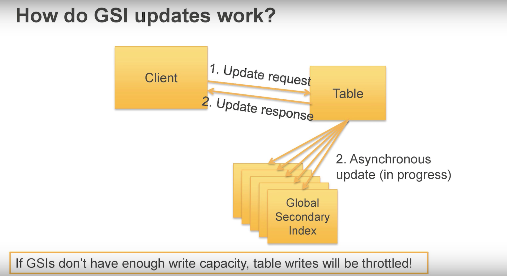

**Imporant:** If GSI's don't have enough WCUs they going to throttle (werden gedrosselt) YOUR PARENT TABLE. Inserting items at very high rate

### Throttling

* If sustained throughput goes beyond provisioned throughput per partition. 
* When I start to hit one single node in a cluster to hot (to hard), that's going to cause me to throttle. 
* Mixing hot data with cold data (when new data comes in and I'm only interested in it for a specific period of time, get the data of the table > archive or create another table and move the data to this table)

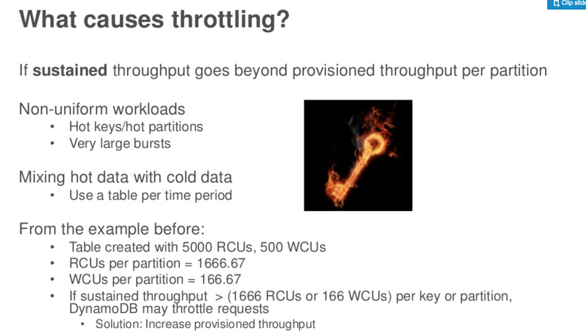 

### Data Modeling Examples

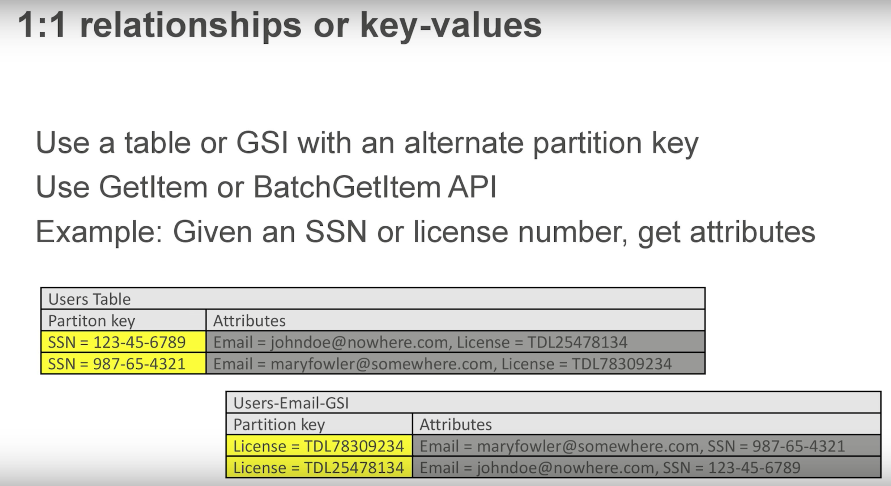

---

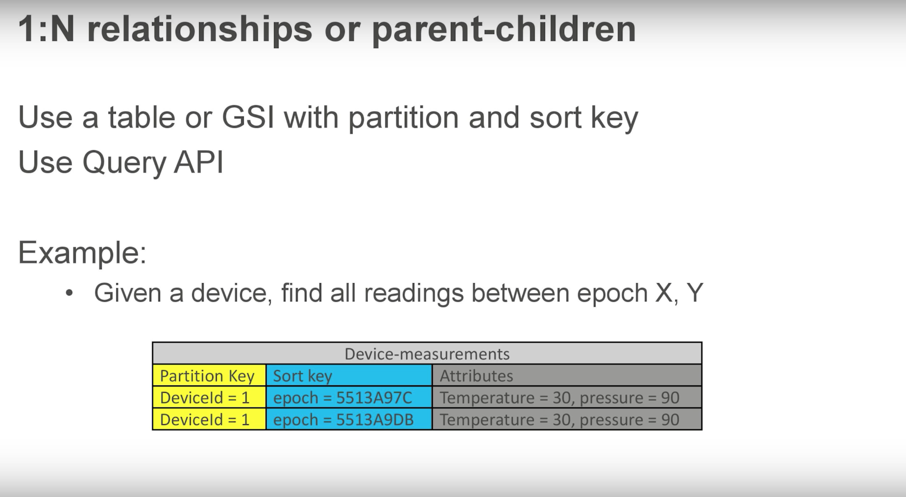

---

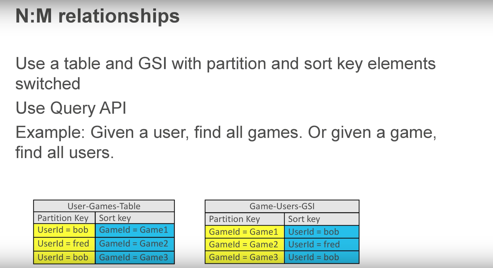

---

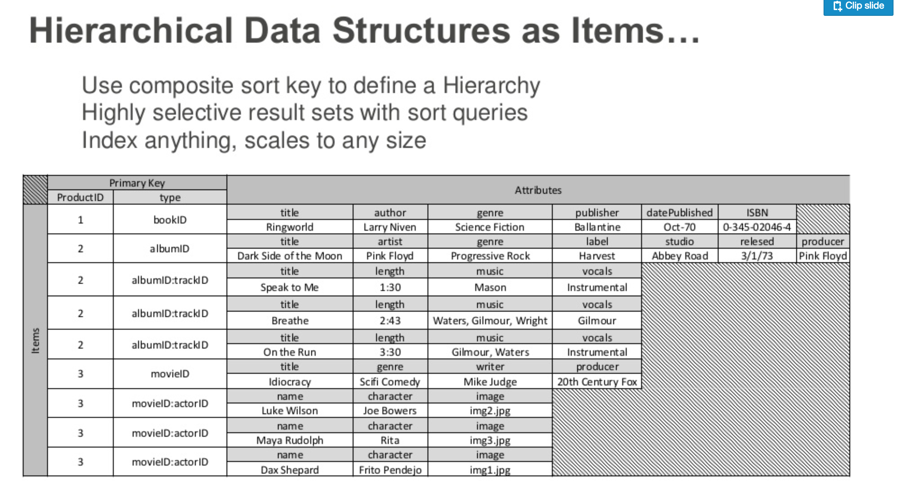

We have here the primary key which is the product id and the sort key which is the type of the product. On that type I build a hierarchy by using composite keys. They composite keys define the document path, where these documents live within the hierarchy by doing something like this:

bk_3034534 (book id)
trk_309435 (track id)
alb_0949345 (album id)
alb_0949345:trk_309435 (album and track id)

If I want to see all tracks I simply use `trk` for search. The same applies for other product types. I can combine both the e.g. the albums and tracks into a single sort key and build hierarchies. You can build a very hierarchical structure as a collection of items on the table. 

## Design Patterns

### Vertical Partitioning

Keep big data away from the small data

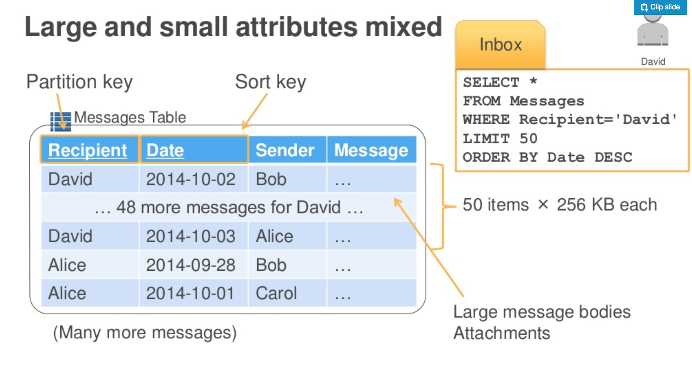
---

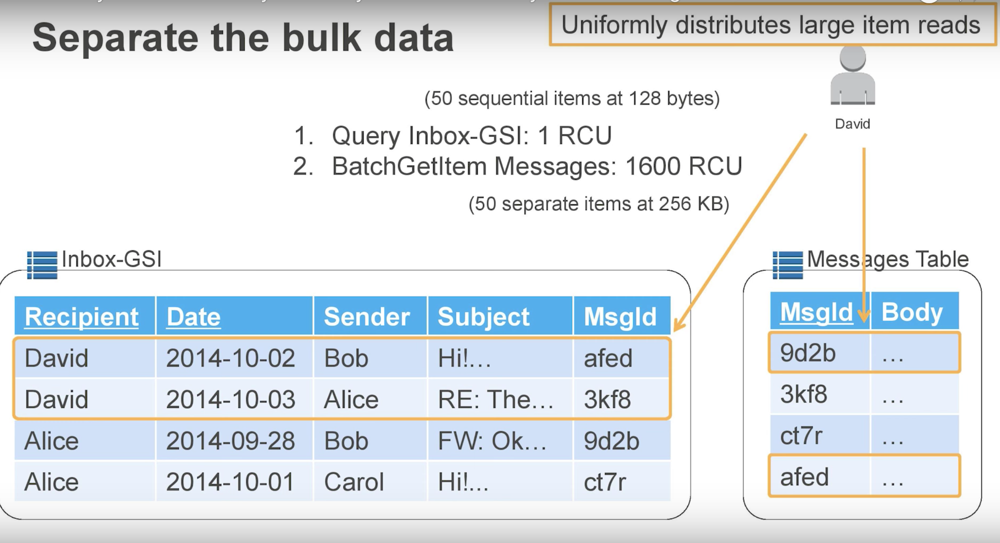
---

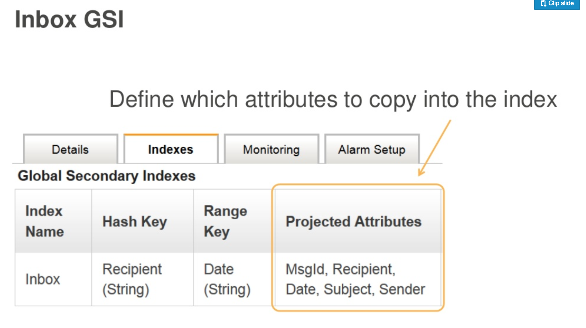
---

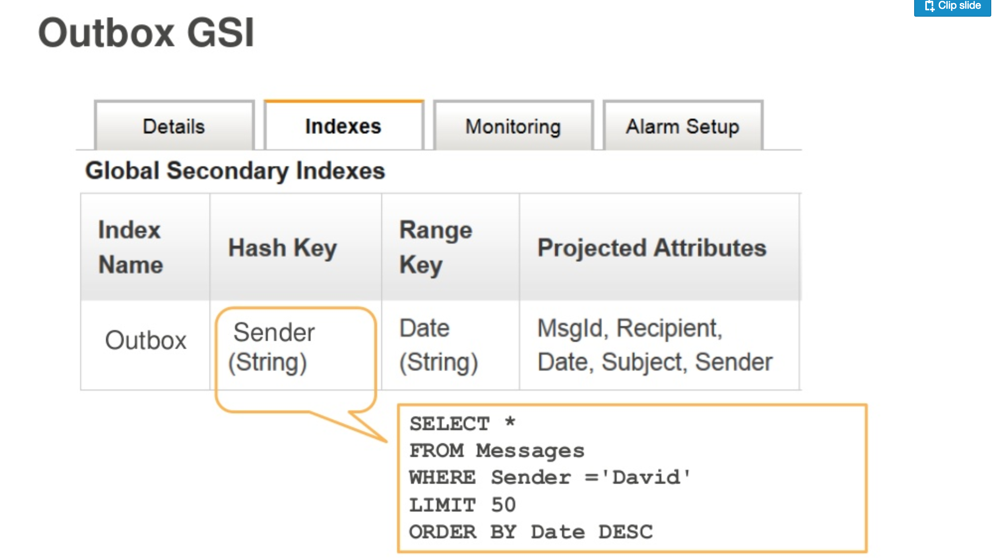
---

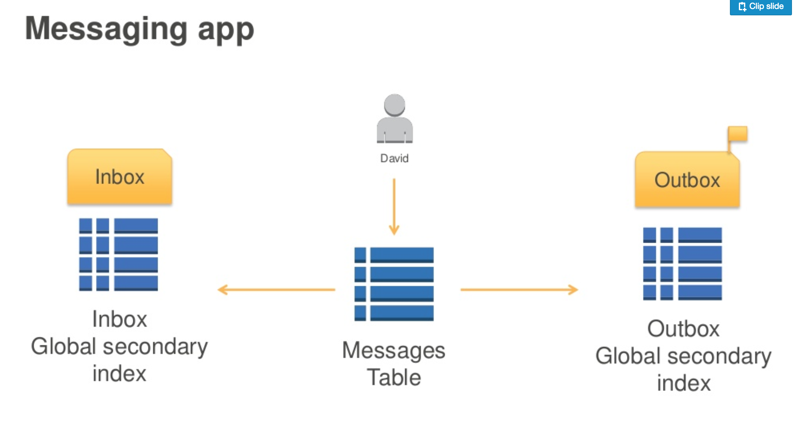

### Extended Composite Key

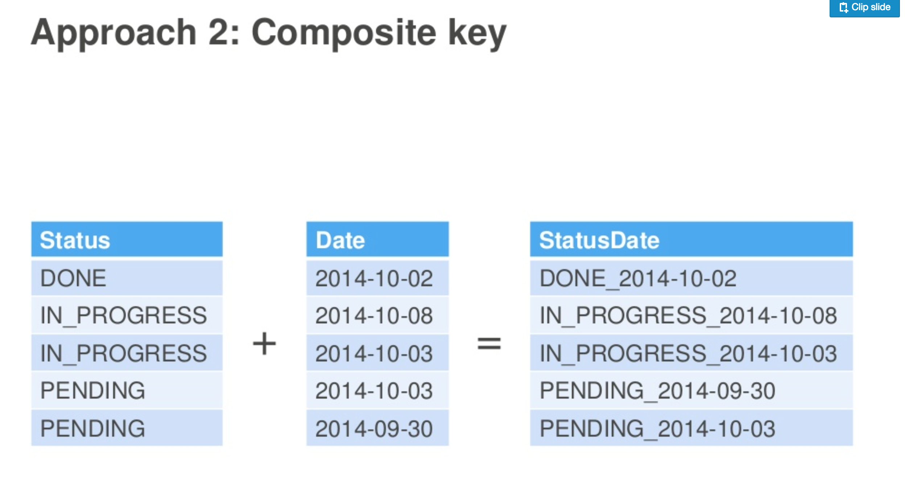
---

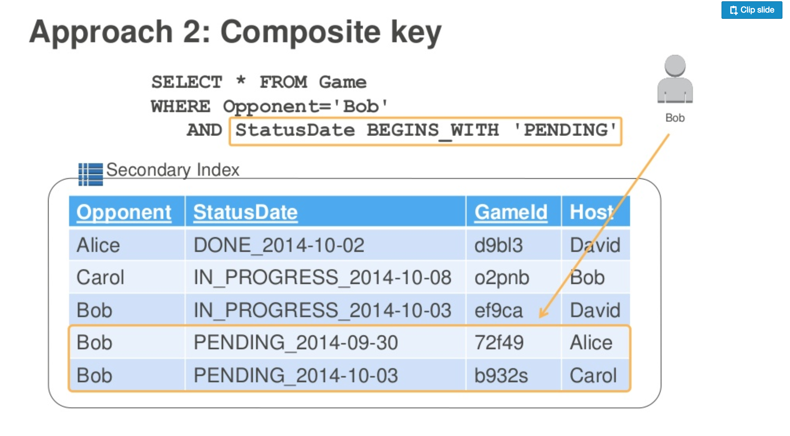

