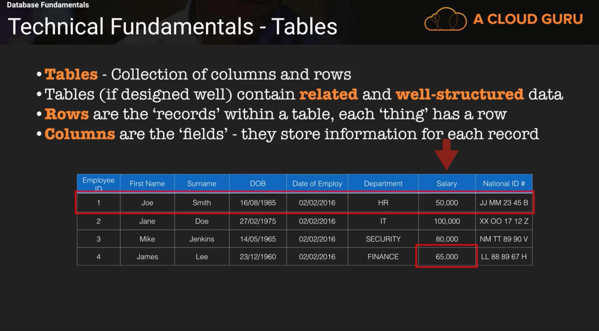

# Amazon DynamoDB - From Beginner to Pro

[Source](https://acloud.guru/course/aws-dynamodb/dashboard)

## Database Fundamentals

### What is a relational database?

At a very basic level it's a collection of components:
* We have a physical or virtual server (it has memory and locally attached network storage)
* Installed on a server there is an operating system (Linux, Windows etc.)
* Installed on that OS is a relational database system (Oracle, MySQL, MS SQL)
* Access to the database server is obtained via client application (e.g. MS Sequal Management Studio)
* The client is utilizing a library such as ODBC or API in some cases it provides an abstraction
* The special access to the databse you have with a special designed Language (SQL - Structured Query Language)
* Queries can be executed within the client or application code using SQL

### Relational Database - Tables

* Tables:  collection of collumns and rows
* Tables (if designed well) contain related and well-structured data
* Rows are the "records" (in DynamoDb they are called items) within a table, each "thing" has a row
* Columns are the "fields" - they store information for each record (called attributes in DynamoDb)

**Note:** In this example the "field" is part of the salary column 65.000

A core concept of relational database is the structure of the data in the table, the column names, restrictions on data and keys are defined when you create the table. And this is called a schema. = **SCHEMA**

### Relational Database - Keys

Keys are columns which have been designated special within a table. There are different types of keys:

* PRIMARY_KEYS, CANDIDATE_KEYS, FOREIGN_KEYS

* **Candidate Keys** - any column which can uniquely identify a row. In the example above Employee ID and National ID are the candidate keys. For a candiate key to be a candiate key a single value of that key needs to be used to substitute one and only one row. If I would provide national id number it would match zero or one row, not more than one, as the value for the raw in a given column has to be unique. 

* **Primary Keys** - ONE candidate key, selected to provide unique identification of every row in the table. In this case the options would be employee id or national id number. If you don't have a single column which uniquly identifies a single row you can choose two columns to be a composite key where both values together unique identify a row.

* **Foreign Key** - Uniquely identifies a row (primary key value) in another table. In the example above the Department column is a foreign key which maps another table where the primary key is department and is unique in that table. In the department table the database can store additional information such as address, phone number or amount of stuff. The foreign key doesn't need to be unique in the table that's in e.g. we could have 2 HR's or 100 IT's in the employee table. But in the department table there can be only 1 HR, 1 IT.  