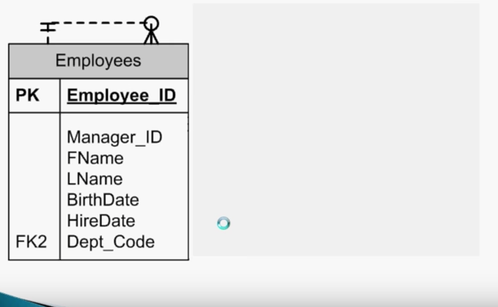
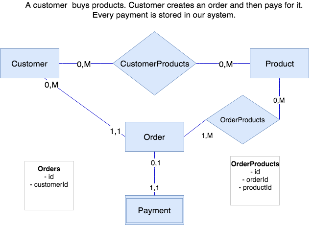
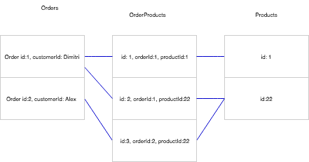
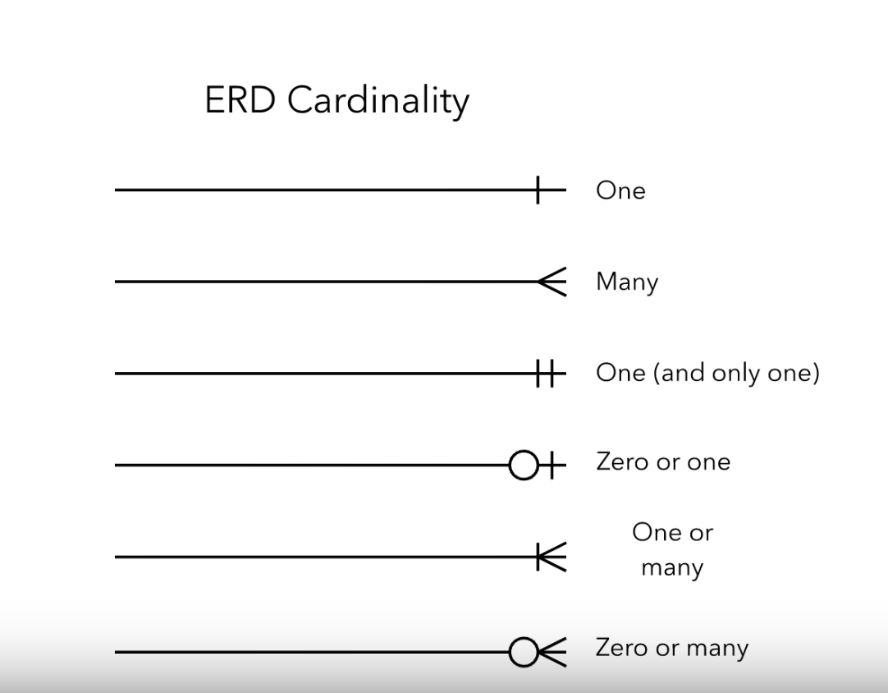

# Quick Summary of RDM Session w/ Alex

### Process of developing a database system consists of 3 stages:

1. Requirements Stage: interviews and observations; create a data model to represent what is needed; the content, relationships, and constraints of data
    + At this stage you do interview your users
    + At this stage you do create the ER model (Entity-Relaionship Diagram): the most important elements are entities, attributes (columns), identifiers (keys) and relationships
2. Design Stage: data model turned into database design; name tables and attributes and properties; including data constraints such as limits on data values, integrity constraints, and business rules
3. Implementation Stage: construct database and fill it with objects (data, forms, reports); users trained, write documentation, install system

[Source](https://www.youtube.com/watch?v=mQ4D0drMrYI)

**Note:** A recursive relationship is when e.g. we have an employee table with the attributes such as employee_id, manager_id, Fname, Lname. Since an employee can be also an manager, and each manager may supervise many other employees. So we can establish a recursive relationship within one table. 

In the case above an employee has one manager, but manager may manage several employees.
---

1. You should always start creating a database with a description of a system. 
2. Take a look at the description and highlights all nouns. The nouns can be divided into:
    + Tables: represent primary entities in the system: people, physical objects, events, transactions
    + Attributes: are properties associated with a primary entity. They will become columns
    + Examples: they help you to understand datatypes of certain attributes and they help you to understand relationship between different entities

3. Once your nouns are highlighted, identify the tables. Focus on core functionality of the system first (you don't have to model everything from the beginning)
4. When you have the tables figure out the relationships between the tables (verbs). This step might lead to new intermediate tables (aggregate/junction) tables.
    + What is the minimum amount of e.g. orders a customer can have?
    + What is the maximum amount of e.g. orders a customer can have? [Part 1](https://www.youtube.com/watch?v=QpdhBUYk7Kk), [Part 2](https://www.youtube.com/watch?v=-CuY5ADwn24)
5. Add the columns to the tables

**Note:** If you create a system for a university, you should talk about students. If you create a system for a company, start with employees. Creating a database model is an iterative process. Don't try to model everything at once. Start with the core entities of your system. You can add more details later. [Source](https://www.vertabelo.com/blog/technical-articles/how-to-create-a-database-model-from-scratch)
---

* If you are registering a customer, does this customer needs to have an address? No (we add 0). Does this customer can have multiple addresses, Yes (we add M) -> 0,M
* Does the address needs to have a customer? Yes. (we add 1) Can an address have multiple customers? (we add M) Yes -> 1,M

**Note:** If both entities have both X,M and X,M you can use as a pattern an aggregation table (bridge table). In the examples above it's `CustomerAddresses`. 

0 = is not required (minimum)
1 = is required
M = multiple (maximum)

---

---

---

**Note:** You design your relational data model in order to put constrains (limits) in terms of security, data type and business logic.

## What types of diagrams can we use to show data model?

- IDEF1x
- IDEF0
- ER diagrams (Entity Relationship (ER) Diagram)

### Entity Relationship Diagram 

It's a type of flowchart that illustrates how "entities" objects, people, or concepts relate to each other within a system. They are used to design and debug relational databases. There are several components and features of an ER diagram:

* Entity: A definable thing—such as a person, object, concept or event—that can have data stored about it. Think of entities as nouns. Examples: a customer, student, car or product. Typically shown as a rectangle. 

* Entity categories: Entities are categorized as strong, weak or associative. A strong entity can be defined solely by its own attributes, while a weak entity cannot. An associative entity associates entities (or elements) within an entity set. 

 

* Relationship: How entities act upon each other or are associated with each other. Think of relationships as verbs. For example, the named student might register for a course. The two entities would be the student and the course. Relationships are typically shown as diamonds or labels directly on the connecting lines.

* Attribute: A property or characteristic of an entity. Often shown as an oval or circle.

* Cardinality: Defines the numerical attributes of the relationship between two entities or entity sets. The three main cardinal relationships are one-to-one, one-to-many, and many-many. A one-to-one example would be one student associated with one mailing address. A one-to-many example (or many-to-one, depending on the relationship direction): One student registers for multiple courses, but all those courses have a single line back to that one student. Many-to-many example: Students as a group are associated with multiple faculty members, and faculty members in turn are associated with multiple students.

You can find here different ERD symbols and notations [Source](https://www.lucidchart.com/pages/er-diagrams)

You have weak and strong entities
strong entities = can exist by themselves without other stuff (customer and products table)
weak entities =  (order cannot exit without a customer, payments)
in NoSQL for document type the weak objects can be stored inside a strong objects

- Homework build your own database relations diagram for Claudia CRM
- Find patterns like 0,M and 0,M aggregation table
- marker nouns, marker verbs and draw a line if everything is all right, create the relationships
- there is another type of relationship like paid/free customer (do it as my homework)

Next session is on tuesday!

## Database Lesson #4 of 8 - Data Modeling and the ER Model

[Source](https://www.youtube.com/watch?v=IfaqkiHpIjo)

### The Stages of Database Development

1. Requirement Analysis Stage: understand the problem for the solution
    + Source of requirements:
        + User Interviews
        + Forms
        + Reports
        + Queries
        + Use Cases
        + Business Rules
        + Observation
        + JAD Sessions (managers, developers, customers, potential users)
2. Compoment Design Phase: we create a data models is  graphical representations of database system
    + After the requirements have been gathered, they are transformed into an Entity Relationship (E-R) Data Model. E-R Models consist of 
    1. Entities (tables)
    2. Attributes a) Indentifiers (Keys), b) Non-key attribues (columns)
    3. Relationships (between entities)

####Entity
-  An entity class is a description of the structure and form of the occurences of the entity. Similar to a recipe or architectural blueprints (class = is the table itself )

- An entity instance is a specific occurence of an entity class (instance = is a row in the table)
    + If this a generic recipe we can have basic instructions, put that in the oven cook and back the cake and we add glasure. The basic recipe gives us a guideline how to produce a cake. **The cake is that created is a unique individual item**. While the specific individual real-world cake is equal to an instance of an entity.
    + The same applies to architectural blueprints. We have basic template how to design a house, and homeowner wants to make some specific decisions what types of colors they want to have in a kitchen. All of those individual characteristics make that the resulting real-world house a unique specific item. In our analogy the architectural **blueprints are similar to an entity class and the house it the entity instance.**

- If we have an employee entity that is an employee entity class. We may define attributes that we want to track for all employees such as an employee id, name, department, when we add a new row of data to that table and we specify values to those attributes `employee_id: 1, name: "Dan", department: "marketing"`. We are describing a real-world entity, the new row of data is an instance of an employee. 

**Note:** By filling the values of the attributes we are defining a specific instance of the entity class. We are defining an employee or real-world project. Each attribute is as part of an entity as well as value properties such as Int, varchar(50) max length, additional propeties for each attribute such as attribute is allowed to store `null` values. 
 
#### Attributes
- Entities have attributes that together describe the entity
    + Examples for a project entity
        - projectName
        - startDate
        - projectType
        - projectDescription
- Each attribute has a data type and other properties
    
Attributes can be classified as:

- Identifiers (Keys)
    - Entity instances have identifiers (keys)
        + Keys are a type of attribute
    - A key will identify a specific instance in the entity class
        + socialSecurityNumber
        + studenId
        + employeeId
        + department Id
    - Uniqueness
        + Keys may be unique or non-unique
        + If the key is unique, the data value for the key must be unique among all instances of the entity
    - Composite
        + A composite key consists of two or more attribues
            + flight number & flight date
        

#### Relationships
- Entities can be connected to each other in relationships (a department can have many different employees, a customer can have many different orders)
- The **degree** of the relationship defines the number of entity classes that participate in the relationship
    + Degree 1 is unary relationship (entity is related to itself - recursive relationship - an entity that is related to itself)
    + Degree 2 is a binary relationship (one entity is related to another entity - the most common types of relationships in entity relationship modeling)
    + Degree 3 is a ternary relationship (3 entities envolved into relationship)

**Desc:** A person can be married to another person from the `Person` class.

**Desc:** An employee may park in the parking space OR a parking space can be assigned to an employee. 

**Desc:** We have 3 entities, the intersection of these 3 entities is `Prescription`. So, when a doctor writes a prescription which involves a patient and a specific drug, these 3 entities together are envovled into ternary relationship.

#### Examples of Relationships
- 1:1 (one-to-one)
    + A single entity instance in one entity class is related to a single entity instance in another entity class
        - An employee may have no more than one locker
        - A locker may only be used by one employee
- 1:N (one-to-many)
    + A signel entity instance in one entity class is related to many entity instances in another entity class
        - An employee works in one department
        - A department can have many employees
- N:M (coceptual many-to-many)
    + Many entity instances in one entity class are related to many entity instances in another entity class
        - A supplier may supply several items
        - A particular item may be supplied by several suppliers
**Important:** In realworld we cannot implement many to many relationships directly with two entities. We must always have a third entity a third table, which acts as a lookup table and provides us with the ability to link many instances of one entity with many instances of another.

## Maximum Cardinality
- Relationships are named and classified by their cardinalities, which is a word that means count (as in the number of items in a set)
- Each of the three types of binary relationships shows previously has a different maximum cardinality
- Maximum cardinality is the maximum number of entity instances that can participate in a relationshp instance
    + one, many, or some other positive fixed number
- Minimum cardinality is the minimum number of entity instances that MUST participate in a relationship instance (the relationship might be optional or mandatory)
- These values typically assume a value of zero (optional) or one (mandatory)    

**Desc:** The maximuma and minimum cardinalities respectivly allow us to specify the max. number of instances of one entity allowed to participate in a relationship and the minimum number of instances that must participate in relationship.

**The first symbol is the minimum cardinality and the second symbol is the maximum cardinality!**

#### There are only 4 specific types that may exists in an Entity-Relationship Model. See in the example above!
1. One and Only One
2. One to Many
3. Zero to One
4. Zero to Many

**Note:** Everything that we have described above we can call `HAS-A` relationships. The term is used because each entity instance has a relationship to a second entity instance e.g. en employee has a locker or locker has an employee.

### Strong and Weak Entities
- A weak entity is an entity whose instances cannot exist in the database whitout the existence of an instance of another entity
- An entity that is not a weak entity is called a strong entity
    + Instances of a strong entity can exist in the databae independently

We can add customers to the database without having any relationships to other entities. But orders cannot exist without existing customers. In this example a customer is a strong entity, where order is a weak entity. 

##### There are two weak entity types:
- An **ID-Dependent** (also known as identifying relationships) weak entity is a weak entity that coonot exist without its parent entity. In this way database will enforce the constrain that ids cannot exist without being associated with an instance of the parent entity. 
    + This requirement is enforced by using a composite key for the weak entity
        - The first part of the key is the key for the strong entity
        - The second part of the key is the key for the weak entity itself

**Note:** An identifying relationship can be seen graphically by the use of a solid relationship line connecting a strong entity with the weak entity

- The relationship between a strong and weak entity is termed a **non-identifying relationship** if the weak entity is non-ID-dependent
    + Represented by a dashed line
    + Also used between strong entities

- All ID-dependent entities are weak entities, but there are other entities that are wek but not ID-dependent
- A non-ID-dependent weak entity many have a sginel or composite key, but the key of th parent entity will be a foreign key within the weak entity. 

### Different Type of Relatinship between Entities

- Subtype Entities:
    + A subtype entity is a special case of another entity (which is called its supertype)
    + An attribute of the supertype may be used to indicate which of the subtypes is appropriate for a given instance - This attribute is called a discriminator
    + Subtypes can be exclusive or inclusive:
        + If exclusive, the supertype relates to at most one subtype: it means that each instance of a supertype can be related at most 1 of the subtypes. A `vehicle` can be a car or a track or motorcycle, but it cannot simultaniously be a car, truck a motorcycle.
        + If inclusive, the supertype can relate to one or more subtypes: The supertype can be related one or more subtypes as an example consider a university, where we have a supertype `person` and we might have a subtype which we call `student` and another subtype which we call `employee`. In inclusive relationship a given person could simultaniouly be a stundent and an employee of an university. 
    + The identifiers of a supertype and all of its subtypes is the same attribute
    + The relationships that connect supertypes and subtypes can be **IS-A** relationships if a subtype is the same entity as the supertype. (if the subtype is a specific case of the supertype then we call it a IS-A RELATIONSHIP - a car is a vehicle, a truck is a vehicle - each of these individual subtypes have individual characteristics which make them unique, but all three can be broadly classified as a types of vehicles)
        + **REMEMBER:** An instance of the subtype inherits all of the properties of its supertype

 

**Desc:** We have a super type `vehicle` and a subtypes can be car, truck or motorcycle. There maybe unique attributes about subtypes that we want to track in additional to set of attributes we want to track to every `vehicle`regardless of specific type of `vehicle`. 

**Desc:** `isGradStudent` the value can be true or false. The value tells us which of the relationships path follow in order to get information about that specific student. Also note that each of the stubtypes undergrad and grad contains attributs that apply to that specific type of student. Remember when the subtype is a specific type of supertype, then the subtype inherits all the attributs of the supertype. We use `StudentID` in order to link supertype to the subtypes.

We are using here the circular symbol

### Recursive Relationships

- It's possbile for an entity to have a (unary) relationship to itself - this is called a recursive relationship
- Recursion can be used to implement heirarchical relationships

In the example we need to remember that the mamagerId is the employeeId it just have a different key here in order to allows a specific type of relationship between employees. This types of relationships can be very useful for tracking e.g. customer referrals, another great use is to implement hierarchies

Another example shows we have here an `employeeId: 1` we have the value of `managerId: null` it tells us that the employee 1 has no manager e.g. it's the CEO of the company. 

In the next layer of the hierarchy we see employees with a managerId 1, they all are direct reports of the CEO. In the next layer we see employees 5, 6 and they are all managed by the employee 3. 

3. Implementation of database design: as a real world functioning database