# NoSQL Design Patterns - Summary

[An Introduction to NoSQL Patterns](https://dzone.com/articles/introduction-nosql-patterns)

The all have some common characteristics
* Key value store
* Run on large number of commodity machines
* Data are replicated an partitioning among these machines
* They relax the data consistency requirements ([CAP theorem](http://www.julianbrowne.com/article/brewers-cap-theorem))

## API Model

* The underlayign data model can be considered as a large Hashtable (key/value store)
* The basic form of API access is:
    + get(key) - extract the value given a key
    + put(key) - create or update the value given it's key
    + delete(key) - remove the key and its associated value

## Machines Layout

The underlying infrastructure is composed of large number (hundreds of thousands) of cheap, commoditized, unreliable machines connected through a network. Each machine is a physical node (PN). Each PN has the same set of software configuration but may have varying hardware capacity in terms of CPU, memory and disk storage. Whitin each PN there will be a variable number of virual nodes (NV) running according to the available hardware capacity of the PN


## Data Distribution

The overall hashtable is distributed across many VNs, we need to way to map each key to the corresponding VN. In order to do so, we use partitions.

Data is distributed across many virual nodes. In order to be fault-tolerant virual nodes can be assigned in a random manner to physical nodes. Also we need to make sure that a physical node doesn't contain replicas of the same key ranges.

## Client Consistency

Once we have multiple copies of the same data, we need to worry about how to sync them such as that the client has a consistent view of data.

There is a number of client consistency models
* strict consistency: this provides the semantics as if there is only one copy of data. Any update is observed instaneously
* read your write consistency
* session consistency
* monotonic read consistency
* eventuall consistency: this provides the weakness form of guarantee. The client can see an inconsistent view as the update is in progress. 

# Data Model Design

[Data Model Design](https://docs.mongodb.com/manual/core/data-model-design/)

The key considiration for the structure of your documents is the decision to embed or to use references 

### Denormalized Data Models (Embedded Data Models)

* You can embed related data in a single structure or document. These schemas are generally known as "denormalization" models.


Embedded data models allows applications to store related pieces of information in the same database record. As a result, applications may need to issue fewer queries and updates to complete common operations.

Use embedded data models when:
* If you have "contains" relationships between entities. (one to one relationships with embedded documents)
* you have one-to-many relationsships between entities. In these relationships the many o child documents always appear with or are viewed in the context of the one or parent document

Embedded document provide better performance for read operations, also they make possible to update related data in a single atomic write operation. But it can also lead later to problems where documents grow after creation. Also you have to be aware of the limits of each single document in the database. In DynamoDb these are 400kb per item.

### Normalized Data Models

Normalized data models describe relationships using references between documents.


In general use normalized data models:
* When embedding would result in duplication of data but would not provide sufficient read performance advantages to outweight the implications of the duplication
* to represent more complex many to many relationships
* to model large hierarchical data sets

**References provides more flexibility than embedding. However, the client-side applications must issue follow-up queries to resolve the references. In order words normalized data models can require more round trip s to the server. 

Here is an example how it would work in relational database


Here is an example how you can do it as a document model

```js
{
    first_name: “Paul”,
    surname: “Miller”,
    city: “London”,
    location: [45.123,47.232],
    cars: [
       { model: “Bentley”,
        year: 1973,
        value: 100000, ….},
       { model: “Rolls Royce”,
        year: 1965,
        value: 330000, ….},
    ]
    }
``` 

Here is an another example relational database vs. document database


* An aggregated document can be accessed with a single call to the database, rather than having to JOIN multiple tables to respond to a query. 
* As documents are self-contained, distributing the database across multiple nodes (a process called sharding) becomes simpler and makes it possible to achieve massive horizontal scalability on commodity hardware. 

### Data Model Design and Patterns

[Data Model Examples and Patterns](https://docs.mongodb.com/manual/applications/data-models/)

#### Model One-to-Many Relationships with Document References

```js
{
   _id: "oreilly",
   name: "O'Reilly Media",
   founded: 1980,
   location: "CA"
}

{
   _id: 123456789,
   title: "MongoDB: The Definitive Guide",
   author: [ "Kristina Chodorow", "Mike Dirolf" ],
   published_date: ISODate("2010-09-24"),
   pages: 216,
   language: "English",
   publisher_id: "oreilly"
}

{
   _id: 234567890,
   title: "50 Tips and Tricks for MongoDB Developer",
   author: "Kristina Chodorow",
   published_date: ISODate("2011-05-06"),
   pages: 68,
   language: "English",
   publisher_id: "oreilly"
}
``` 

## General Notes on NoSQL Data Modeling

[Source](https://highlyscalable.wordpress.com/2012/03/01/nosql-data-modeling-techniques/)

NoSQL data modeling often starts from the application-specific queries as opposed to relational modeling:

* Relational modeling is typically driven by the structure of available data. The main design theme is  “What answers do I have?”

* NoSQL data modeling is typically driven by application-specific access patterns, i.e. the types of queries to be supported. The main design theme is “What questions do I have?”  

## The basic principles of NoSQL data modeling.

### Denormalization

Denormalization can be defined as the copying of the same data into multiple documents or tables in order to simplify query processing or to fit the user's data into a particular data model. Denormalization allow one to store data in a query-friendly structure to simplify query processing.

### Aggregates

* Key-value stores typically do not place constraints on values. It is also possible to vary a number of records for one business entity by using composite key. For example, a user account can be modeled as a set of entries with composite keys like `UserID_name`, `UserID_email`, `UserID_messages` and so on. 

* Document databases are inherently schema-less, although some of them allow to validate incoming data using a user-defined schema (mostly on the application layer -> MongoDb)

Soft schema allows one to form classes of entities with complex internal structures (nested entities) and to vary the structure of particular entities. This feature provides two major facilities:

* Minimization of one-to-many relationships by means of nested entities, and, consequently reducing of joins
* Masking of "technical" differences between business entities and modeling of heterogeneous business entities **using one collection of documents or one table.**

The figure below depicts modeling of a product entity for an ecommmerce business domain. Initially, we can say that all products have an ID, Price and Description. Next we discover that different types of products have different attributes like Author for Book or Length for Jeans. Some of these attributes have one-to-many or many-to-many nature like Tracks in Music Albums. Next, it's possible that some entitties cannot be modeled using fixed types at all. For example jeans attributes are not consistent across brands.  It is possible to overcome all these issues in a relational normalized data model, but solutions are far from elegant. Soft schema allows one to use a single Aggregate (product) that can model all types of products and their attributes:


**Note:** Embedding with denormalization can greatly impact updates both in performance and consistency, so special attention should be paid to update flows. 

### Application Side-Joins

Joins are rarely supported in NoSQL Solutions. Joins are often handled at the design time as opposed to relational data models where joins are handled at query execution time. Query time joins are always mean a performance penalty, but in many cases once can avoid joins using Denormalization and Aggregates, i.e. embedding nested entities. **In many cases joins are inevitable and should be handled by an application** The major use cases:

* Many to many relationships are often modeled by links and require application joins
* Aggregates are often inapplicable when entity internals are the subject of frequent changes. It is usually better to keep a record that something happened and join the records at query time as opposed to changing a value. For example, a messaging system can be modeled as a User entity that contains nested Message entities. But if messages are often appended, it may be better to extract Messages as independent entities and join them to the User at query time: 


### Atomic Aggregates

Many, although not all, NoSQL solutions have limited transaction support. It's common to model data using an Aggregates technique to guarantee some of the ACID properties. One of the reasons why powerful transactional machinery is an inevitable part of the relational databases is that normalized data typically require multi-place updates. On the other hand, Aggregates allow one to store a single business entity as one document, row or key-value pair and update it atomically:


### Enumerable Keys

Perhaps the greates benefit of an unordered Key-Value data model is that entries can be partitioned across multiple servers by just hashing the key. Sorting make things more complex, but sometimes an application is able to take some advantages of ordered keys even if storage doesn#t offer such as feature. Let's consider modeling of email messages as an example:

* Some NoSQL stores provide atomic counters that allow one to generate squential ID's. In this case one can store messages using `UserID_messageID` as a composite key. If the last message id known it's possible to traverse previous messages. It is also possible to traverse preceding and succeeding messages for any gives message ID.
* Messages can be grouped into buckets e.g. daily bucket. This allows one to traverse the mailbox backward or forward starting from any specific date or the current date. 

**Note:** Data access patterns are patterns that can be used to access data efficiently.

### Index Tables

The idea is to create and maintain a special table with keys that follow the access pattern. For example, there is a master table that stores user accounts that can be accessed by user ID. A query that retrieves all users by a specific city can be supported by means of an additional table where city is key.


**Note:** An index table can be updated for each update of the master table or in batch mode. Either way, it results in an additional performance penalty and become a consistency issue. Index tables can be considered as analog of the materialized view. 

### Composite Key Index

Composite key is a very generic technique, but it's extremely beneficial when a store with ordered keys is used. Composite key in conjunction with secondary sorting allows one to build a kind of multidimensional index. For example, let’s take a set of records where each record is a user statistic. If we are going to aggregate these statistics by a region the user came from, we can use keys in a format (State:City:UserID) that allow us to iterate over records for a particular state or city if that store supports the selection of key ranges by a partial key match (as BigTable-style systems do):

```sql
SELECT Values WHERE state="CA:*"
SELECT Values WHERE city="CA:San Francisco*"
``` 


**Note:** A list stores objects in ordered sequence. A dictionary stores objects in an unordered collection. 

### Aggregation with Composite Key

Composite keys may be used not only for indexing, but for different types of grouping. Let's consider an example, there is a huge array of log records with information about the users and their visits from different sites (click stream). The goal is to count the number of unique users for each site. This is similar to the following SQL query:

```sql
SELECT count(distinct(user_id)) FROM clicks GROUP BY site
``` 
We can model this situation using composite keys with a UserID prefix:


### Inverted Search – Direct Aggregation

[Read more](https://highlyscalable.wordpress.com/2012/03/01/nosql-data-modeling-techniques/)


## Rules for Relations in NoSQL

[Source - NoSQL for Mere Mortals](https://github.com/tarasowski/serverless/blob/master/dynamodb/009_nosql-for-mere-mortals.md)

### One-to-Many

* One-to-Many Relations in Document Databases One-to-many relations are the simplest of the three relations. This relation occurs when an instance of an entity has one or more related instances of another entity. The following are some examples: • One order can have many order items. • One apartment building can have many apartments. • One organization can have many departments. • One product can have many parts.

* In the case of a one-to-many relation, both entities are modeled using a document embedded within another document.

```js
{    customer_id: 76123,    name: 'Acme Data Modeling Services',    person_or_business: 'business',    address : [                      { street: '276 North Amber St',                         city: 'Vancouver',                         state: 'WA',                         zip: 99076} ,                      { street: '89 Morton St',                         city: 'Salem',…
``` 

* The basic pattern is that the one entity in a one-to-many relation is the primary document, and the many entities are represented…

### Many-to-Many Relations

* Many-to-Many Relations in Document Databases A many-to-many relation occurs when instances of two entities can both be related to multiple instances of another entity. The following are some examples: • Doctors can have many patients and patients can have many doctors. • Operating system user groups can have many users and users can be in many operating system user groups. • Students can be enrolled in many courses…

* Many-to-many relations are modeled using two collections—one for each type of entity. Each collection maintains a list of identifiers that reference related entities. For example, a document with course data would include an array of student IDs, and a student document would include a list of course IDs, as in the following:

* The pattern minimizes duplicate data by referencing related documents with identifiers…

* Care must be taken when updating many-to-many relationships so that both entities…


### Hierarchies in NoSQL

* Modeling Hierarchies in Document Databases Hierarchies describe instances of entities in some kind of parent-child or part-subpart relation. The product_category attribute introduced earlier is an example where a hierarchy could help represent relations between different product categories (see Figure…

More Information here: [MongoDb Tutorial](https://docs.mongodb.com/manual/tutorial/model-tree-structures/)


* One-to-many, many-to-many, and hierarchies are common patterns in document databases. The patterns described here are useful in many situations, but you should always evaluate the utility of a pattern with reference to the kinds of queries you will execute and the expected changes that will occur over the lives of the documents. Patterns should support the way you will query and maintain documents by making those operations faster or less complicated than other options.

* You will have to balance benefits of faster query response with the cost of slower inserts and updates when indexes are in place.

## Design Pattern for DynamoDb

[Source - AWS Presentation](https://github.com/tarasowski/serverless/blob/master/dynamodb/007_dynamodb-data-models.md)

* Space: access is evently spread over the key-space
* Time: requests arrive evenly spaced in time

## Data Modeling

* Use table or GSI with alternative partition key
* Use `GetItem` or `BatchGetItem` API
* Example: Given an SSN or licence number, get attributes

### 1:1 Relationship

* If we want to maintain a relationship 1:1 or key-values. This is how we can do that in DynamoDb. Users by licence and you can look up your attributes by the social security number (SSN)


### 1:N Relationships

* Use a table or GSI with partition and sort key. Use Query API. Example given a device, find all readings between epoch X, Y

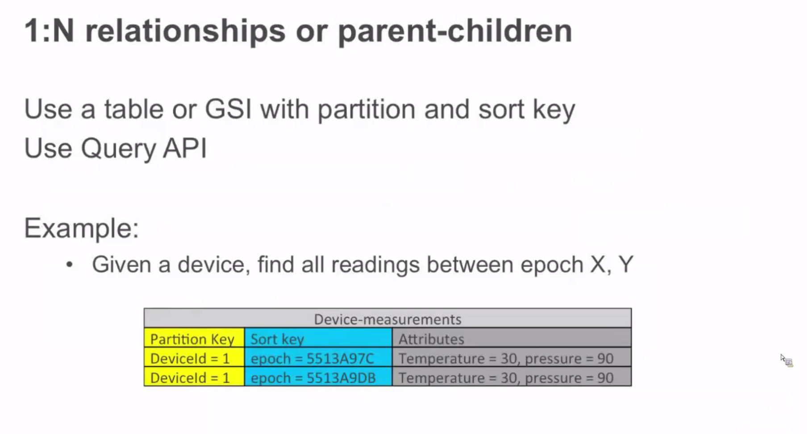

* We want data structures in NoSQL that can be gathered and built into the application tier by doing a simple table select. If I have to start doing multiple selects and maintaining relational structure in the application tier, I'm defeating purpose of NoSQL. In NoSQL we want to put the data that it's already mapped to the way how our query looks like (our apps needs it)

### N:M Relationships

* Use a table and GSI with partition key and sort key elements switched (it's just only about flipping the partition and sort key)
* Use Query API
* Example: Given a user, find all games. Or given a game, find all users. 


## Hierarchical Data (Tiered relational data structures)

A lot of what we see in application development is a hierarchical data. If we look at the application layer object, they have properties and properties can be base types, properties might be sets of those base types, but those properties might also be complex types,which have their own properties. 

In order to represent hiararchial data you use the sort key to define the hierarchy. We have the productID and the type, which is going to be our sort key and the type is actually, defines a hierarchical structure, which we can load our product catalog. We use here the sort key in order to maintain the hierarchy. And we can query it easily by using a conditional expression `begins with` on the sort key.


### or as Document (JSON)

Another way to do it with JSON documents. In this particular example, I will structure the table. You can use here filter expressions to navigate, you'll get a lot of flexibility. It's up to developer to put a hierarchy on the table or JSON. The only one problem with JSON is that you are limited to hierarchical structure of 400KB.


**Note:** You can do here a combination of the data. There is no reason only to use JSON, you can use both JSON and primary + sort key. 

### Time series tables

* Don't mix hot and cold data; archive cold data to Amazon S3

* DynamoDb doesn't want you to grow the tables infinetely, as we start to grow in size we will start to partition the table and it's also expensive to store data.

* What we would like to do is to migrate cold data to another table and don't store it with the high velocity table. We speak about cold data = data that is e.g. 3 days old. 

* We would like to see you to roll the tables over, at some period of time the workflow says I create a new table and I make that hot table and my existing hot table becomes cold table and we deprovision that table (remove WCU/RCUs)

* And at some point the data is so cold that we archive it, store it to s3 or drop it entirely. 

**Note:** By offloading cold data you are going to save a lot of money, since you don't pay for it as for the hot data. It's lifecycle you are managing your data in a lifecycle. 


* Use a table per time period
* Pre-create weekly, monthly tables
* Provision required throughput for current table
* Writes go to the current table
* Turn off or reduce througput for older tables

**Note:** Only when dealing with time series table

### Messaging App

* Large items
* Filters vs. indexes
* M:N Modeling - inbox and outbox


**Note:** In the example above we'll have problems since the data is too big and will be loaded all the time because of the attachments. We'll pay a lot of RCUs since each email is on avaerage 256kb big. Since we don't need to read all the data at once, we can create a reference from one table to another.


The example above will even support the MVC data, the model contains that the view needs and the controller interacts with the data, while the view switches, when I change from summary to the detail view, and this is ok for the application to make a roundtrip and get that data.

 

In the example above we have 2 GSI that give us the inbox and outbox view and we don't have to have the heavy RCU hit, we save a lot of money. We get the big data away from the small data and only read the data that you need. 

* Reduce one-to-many item sizes
* Configure secondary index projections
* Use GSIs to model M:N relationship between sender and recepient

**Note:** Important when: Querying many large items at once

### Multiplayer Online Gaming

In this particular example we have a partition key that's a gameId, games have status.


---


---

In this example you pay for the read capacity and then filter out the results.


But there is a much better way to do it, when we create a composite key where status and date are combined together. You can call it compoud query.


---


#### Sparse Indexes

* There are some attributes that not every has. So I can define a sparse index with much less read capacity on this GSI. And I can actually `Scan` that GSI to get all the users that have awards. It's a good way to get results you need without spending a lot of money.


### DynamoDb Streams

* Think of that as a change log
* Stream updates to a table
* Asynchronous
* Exactly once
* Strictly ordered
    + Per item
* Highly durable
    + Scale with Table
* 24 hours lifetime
* Sub-second latency

**Note:** You can use Streams to do backups and replication of tables. 


---


# Best Practices for DynamoDB 

[Source - AWS Documentation](https://docs.aws.amazon.com/amazondynamodb/latest/developerguide/best-practices.html)

* **Overloading Global Secondary Indexes** Although Amazon DynamoDB has a limit of five global secondary indexes per table, in practice, you can index across far more than five data fields. As opposed to a table in a relational database management system (RDBMS), in which the schema is uniform, a table in DynamoDB can hold many different types of data items at one time. In addition, the same attribute in different items can contain entirely different types of information. Consider the following example of a DynamoDB table layout that saves a variety of different kinds of data:
    + The Data attribute, which is common to all the items, has different content depending on its parent item. If you create a global secondary index for the table that uses the table's sort key as its partition key and the Data attribute as its sort key, you can make a variety of different queries using that single global secondary index.
    + These queries might include the following: Look up an employee by name in the global secondary index, by searching on the Employee_Name attribute value. Use the global secondary index to find all employees working in a particular warehouse by searching on a warehouse ID (such as Warehouse_01). Get a list of recent hires, querying the global secondary index on HR_confidential as a partition-key value and Data as the sort key value.

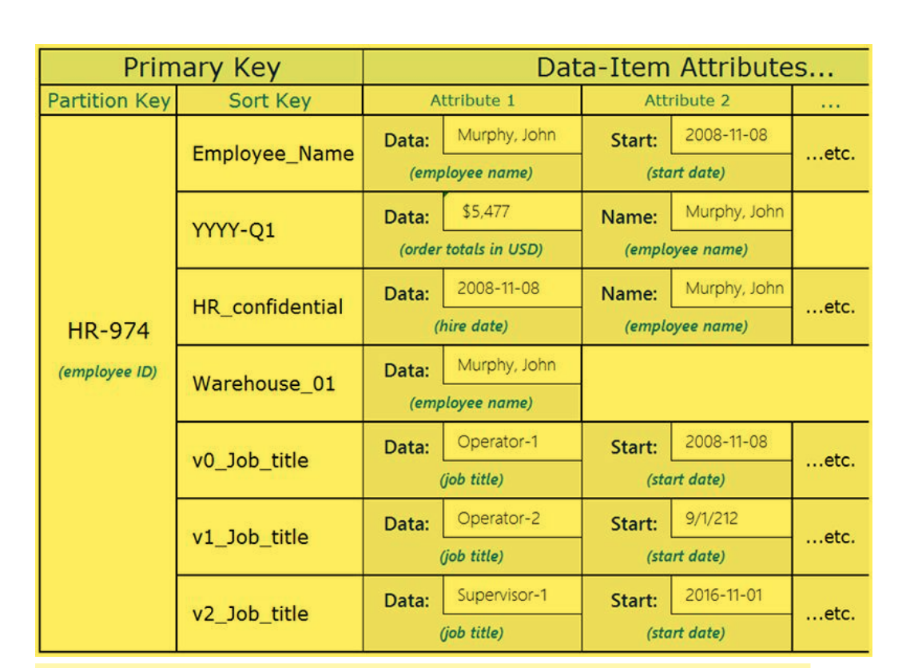

* To enable selective queries across the entire key space, you can use write sharding by adding an attribute containing a (0-N) value to every item that you will use for the global secondary index partition key. The following is an example of a schema that uses this in a Critical-Event workflow: Using this schema design, the event items are distributed across 0-N partitions on the GSI, allowing a scatter read using a sort condition on the composite key to retrieve all items with a given state during a specified time period.

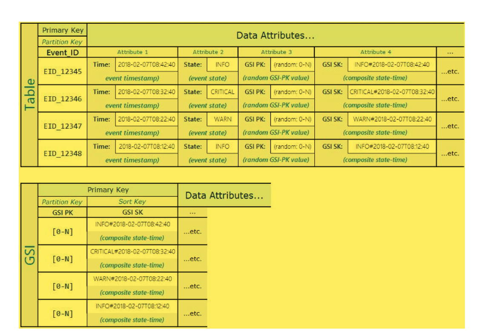

* This schema pattern delivers a highly selective result set at minimal cost, without requiring a table scan.

* There is always a short propagation delay between a write to the parent table and the time when the written data appears in the index. In other words, your applications should take into account that the global secondary index replica is only eventually consistent with the parent table.

* Amazon DynamoDB currently limits the size of each item that you store in a table (see Limits in DynamoDB. If your application needs to store more data in an item than the DynamoDB size limit permits, you can try compressing one or more large attributes, or you can store them as an object in Amazon Simple Storage Service (Amazon S3) and store the Amazon S3 object identifier in your DynamoDB item.

* If you wanted to store an image of each product that was too large to fit in an item, you could store the images in Amazon S3 instead of in DynamoDB.

* There are two key numbers to keep in mind for this design. First, a physical partition can support only 1,000 WCUs (writes per second, each of up to 1 KB in size). Second, it can hold only 10 GB of total data. If either of these limits is exceeded, the partition will be split.

* For example, if you anticipate an average event frequency around 5,000 events per second with a maximum of 6,000 per second, your application can append to the partition key a sharding suffix that rotates from _1 through _6 and back again. This creates six physical partitions across which incoming events are evenly distributed as they arrive, and you can provision your table with 6,000 WCUs.

* **Adjacency List Design Pattern** When different entities of an application have a many-to-many relationship between them, the relationship can be modeled as an adjacency list. In this pattern, all top-level entities (synonymous to nodes in the graph model) are represented using the partition key. Any relationship with other entities (edges in a graph) are represented as an item within the partition by setting the value of the sort key to the target entity ID (target node). The advantages of this pattern include minimal data duplication and simplified query patterns to find all entities (nodes) related to a target entity (having an edge to a target node).

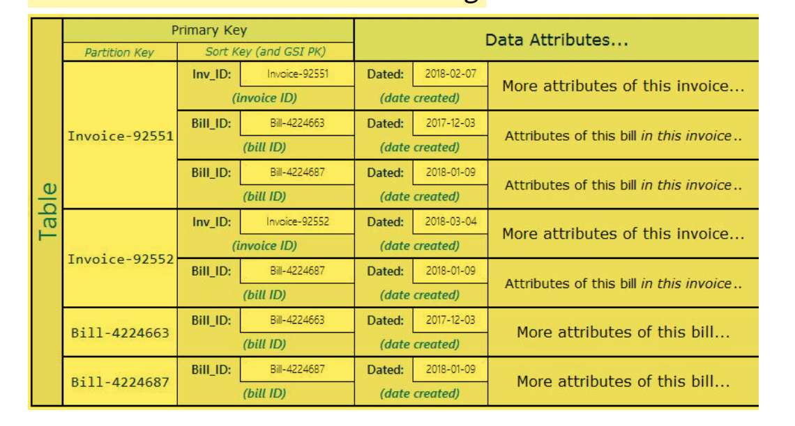

* A real-world example where this pattern has been useful is an invoicing system where invoices contain multiple bills. One bill can belong in multiple invoices. The partition key in this example is either an InvoiceID or a BillID. BillID partitions have all attributes specific to bills. InvoiceID partitions have an item storing invoice-specific attributes, and an item for each BillID that rolls up to the invoice. The schema looks like the following:

* Using the preceding schema, you can see that all bills for an invoice can be queried using the primary key on the table. To look up all invoices that contain a part of a bill, create a global secondary index on the table's sort key. The projections for the global secondary index look like the following:

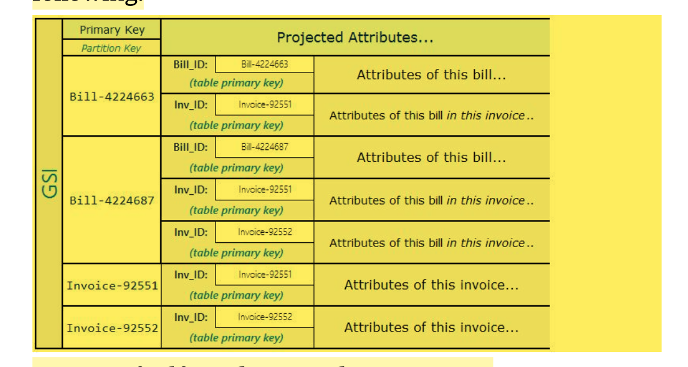

* Materialized Graph Pattern Many applications are built around understanding rankings across peers, common relationships between entities, neighbor entity state, and other types of graph style workflows. For these types of applications, consider the following schema design pattern:

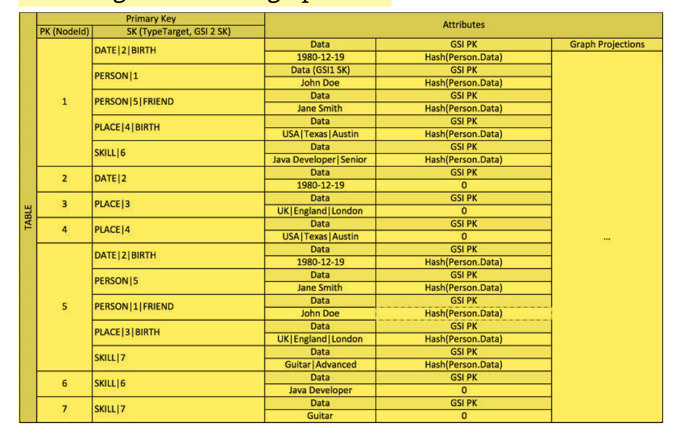

* The precending schema shows a graph data structure that is defined by a set of data partitions containing the items that define the edges and nodes of the graph. Edge items contain a Target and a Type attribute. These attributes are used as part of a composite key name "TypeTarget" to identify the item in a partition in the primary table or in a second global secondary index. The first global secondary index is built on the Data attribute. This attribute uses global secondary index-overloading as described earlier to index several different attribute types, namely Dates, Names, Places, and Skills. Here, one global secondary index is effectively indexing four different attributes.

* However, the same organizations may now find that their operations depend on high-traffic customer-facing websites, where millisecond response is essential. Relational systems can't scale to meet this requirement except at huge (and often unacceptable) expense.

* In these situations, the answer might be to create a hybrid system, in which DynamoDB creates a materialized view of data stored in one or more relational systems and handles high-traffic requests against this view.

* DynamoDb can take advantage of DynamoDb streams and AWS Lambda to integrate with one or more existing relational database systems. 

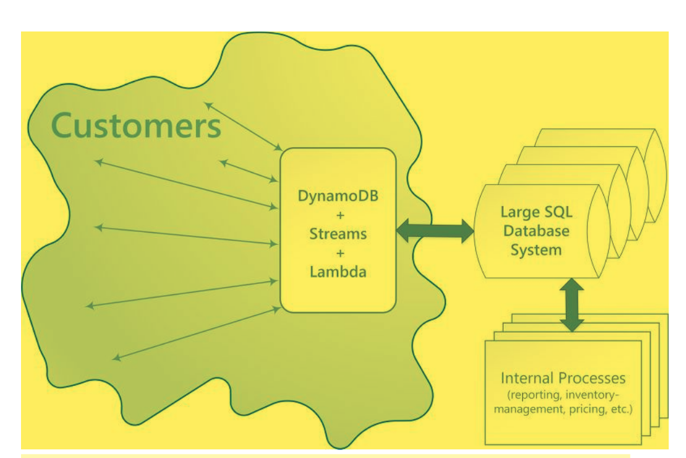

* A system that integrates DynamoDb streams and AWS Lambda can provide several advantages:
    + It can operate as persistent cache of materialized view
    + It can be setup to fill gradually with data as that data is queried for, and and as data is modified in the SQL system. This means that the entire view doesn't need to be pre-populated, which in turn means that provisioned throughput capacity is more likely to be utilized efficiently. 
    + It has low administrative costs and is highly available

* For this kind of integration to be implemented, essentially three kinds of interoperation must be provided: 

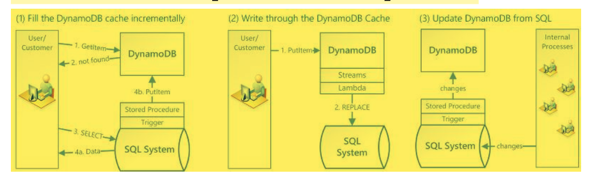

1. Fill the DynamoDB cache incrementally. When an item is queried, look for it first in DynamoDB. If it is not there, look for it in the SQL system, and load it into DynamoDB. 

2. Write through a DynamoDB cache. When a customer changes a value in DynamoDB, a Lambda function is triggered to write the new data back to the SQL system. 

3. Update DynamoDB from the SQL system. When internal processes such as inventory management or pricing change a value in the SQL system, a stored procedures is triggered to propagate the change to the DynamoDB materialized view. 

* These operations are straightforward, and not all of them are needed for every scenario.

* RDBMS platforms use an ad hoc query language (generally a flavor of SQL) to generate or materialize views of the normalized data to support application-layer access patterns.

* One-time queries of this kind provide a flexible API for accessing data, but they require a significant amount of processing. You must often query the data from multiple locations, and the results must be assembled for presentation. The preceding query initiates complex queries across a number of tables and then sorts and integrates the resulting data.

* Another factor that can slow down RDBMS systems is the need to support an ACID-compliant transaction framework. The hierarchical data structures used by most online transaction processing (OLTP) applications must be broken down and distributed across multiple logical tables when they are stored in an RDBMS. Therefore, an ACID-compliant transaction framework is necessary to avoid race conditions that could occur if an application tries to read an object that is in the process of being written. Such a transaction framework necessarily adds significant overhead to the write process.

* These two factors are the primary barriers to scale for traditional RDBMS platforms. It remains to be seen whether the NewSQL community can be successful in delivering a distributed RDBMS solution. But it is unlikely that even that would resolve the two limitations described earlier. No matter how the solution is delivered the processing costs of normalization and ACID transactions must remain significant. 

* A relational database system does not scale well for the following reasons: It normalizes data and stores it on multiple tables that require multiple queries to write to disk. It generally incurs the performance costs of an ACID-compliant transaction system. It uses expensive joins to reassemble required views of query results. DynamoDB scales well for these reasons: Schema flexibility lets DynamoDB store complex hierarchical data within a single item. Composite key design lets it store related items close together on the same table. Queries against the data store become much simpler, often in the following form: `SELECT * FROM Table_X WHERE Attribute_Y = "somevalue"`. DynamoDb does far less work to return requested data. 

## Modeling Relational Data in DynamoDb

* NoSQL design requires a different mindset than RDBMS design. For an RDBMS, you can create a normalized data model without thinking about access patterns. You can then extend it later when new questions and query requirements arise. For DynamoDB, by contrast, you shouldn't start designing your schema until you know the questions it needs to answer. Understanding the business problems and the application use cases upfront is absolutely essential. 

* To start designing a DynamoDb that will scale efficiently, you must take several steps first to identify the access patterns that are required by the operations and business support systems (OSS/BSS) that it needs to support:
    + For a new applications, review user stories about the activities and objectives. Document the various use cases that you identify, and analyze the access patterns that require.
    + For existing applications, analyze query logs to find out how people are currently using the system and what the key access patterns are. 

After completing this process, you should end up with a list that might look something like that:

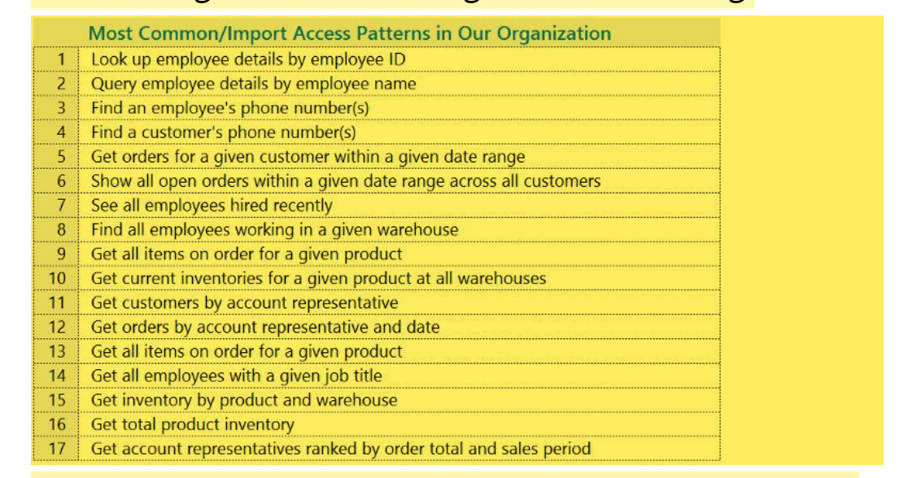

* In a real applicaiton that, your list might be much longer. But this collection represents the range of query pattern complexity that you might find in a production environment. 

> A common approach to DynamoDb schema design is to identify application layer entities and use denormalization and composite key aggregation to reduce query complexity. 

* In DynamoDb, this means using composite sort keys, overloaded global secondary indexes, partitioned tables/indexes, and other design patterns. You can use these elements to structure the data so that an application can retrieve whatever it needs for a given access pattern using a single query on a table or an index.

* The primary pattern that you can use to model the normalized schema shown in Relational Modeling is the adjacency pattern. Other pattern used in this design can include global secondary index write sharding, global secondary index overloading, composite key, and materialized aggregations. 

**Important:** In general you should maintain as few tables as possible in DynamoDb application. Most-well designed applications require only one table. Exceptions include cases where high-volume time series data are involved, or datasets that have very different access pattern. A single table with inverted indexes can enable simple queries to create and retrieve the complex hierarchical data structures required by your application. 

**Relational Modeling Example**
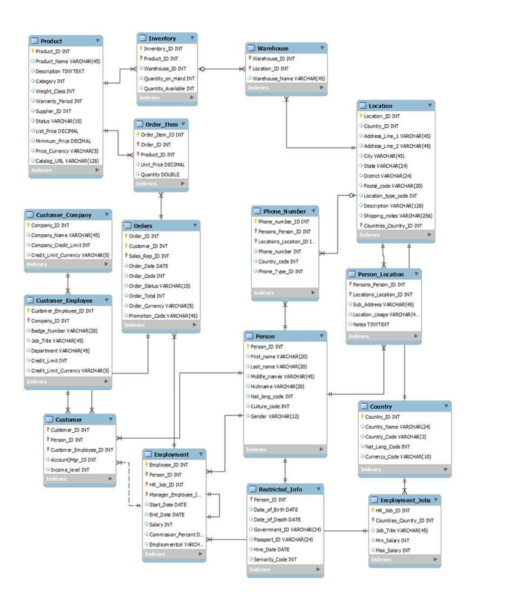


* **Example of Modeling Relational Data in DynamoDB:** This example describes how to model relational data in Amazon DynamoDB. A DynamoDB table design corresponds to the relational order entry schema that is shown in Relational Modeling. It follows the Adjacency List Design Pattern, which is a common way to represent relational data structures in DynamoDB. The design pattern requires you to define a set of entity types that usually correlate to the various tables in the relational schema. Entity items are then added to the table using a compound (partition and sort) primary key. The partition key of these entity items is the attribute that uniquely identifies the item and is referred to generically on all items as PK. The sort key attribute contains an attribute value that you can use for an inverted index or global secondary index. It is generically referred to as SK. You define the following entities, which support the relational order entry schema:          

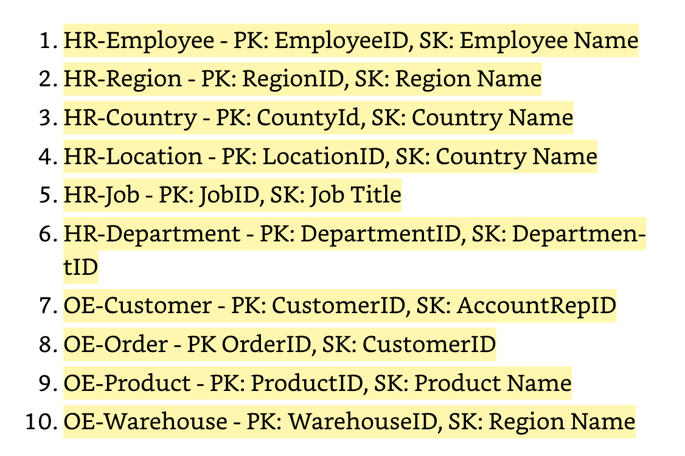

* After adding these entity items to the table, you can define the relationships between them by adding edge items to the entity item partitions. The following table demonstrates this step: In this example, the Employee, Order and Product Entity partitions on the table have additional edge items that contain pointers to other entity items on the table. [Here is the Link how to do it](https://docs.aws.amazon.com/amazondynamodb/latest/developerguide/bp-modeling-nosql-B.html)


* Next, define a few global secondary indexes (GSIs) to support all the access patterns defined previously. The entity items don't all use the same type of value for the primary key or the sort key attribute. All that is required is to have the primary key and sort key attributes present to be inserted on the table.

* The fact that some of these entities use proper names and others use other entity IDs as sort key values allows the same global secondary index to support multiple types of queries. This technique is called GSI overloading. It effectively eliminates the limit of five global secondary indexes for tables that contain multiple item types. This is shown in the following diagram as GSI 1:


GSI 2 is designed to support a fairly common application access pattern, which is to get all the items on the table that have a certain state. For a large table with an uneven distribution of items across available states, this access pattern can result in a hot key, unless the items are distributed across more than one logical partition that can be queried in parallel. This design pattern is called write sharding.

To accomplish this for GSI 2, the application adds the GSI 2 primary key attribute to every Order item. It populates that with a random number in a range of 0–N, where N can generically be calculated using the following formula, unless there is a specific reason to do otherwise:

```
ItemsPerRCU = 4KB / AvgItemSize

PartitionMaxReadRate = 3K * ItemsPerRCU

N = MaxRequiredIO / PartitionMaxReadRate
```

* For example, assume that you expect the following:

* Up to 2 million orders will be in the system, growing to 3 million in 5 years.
* Up to 20 percent of these orders will be in an OPEN state at any given time.

The average order record is around 100 bytes, with three OrderItem records in the order partition that are around 50 bytes each, giving you an average order entity size of 250 bytes.

For that table, the N factor calculation would look like the following:

```
ItemsPerRCU = 4KB / 250B = 16

PartitionMaxReadRate = 3K * 16 = 48K

N = (0.2 * 3M) / 48K = 13
``` 

* In this case, you need to distribute all the orders across at least 13 logical partitions on GSI 2 to ensure that a read of all Order items with an OPEN status doesn't cause a hot partition on the physical storage layer. It is a good practice to pad this number to allow for anomalies in the dataset. So a model using N = 15 is probably fine. As mentioned earlier, you do this by adding the random 0–N value to the GSI 2 PK attribute of each Order and OrderItem record that is inserted on the table.

* This breakdown assumes that the access pattern that requires gathering all OPEN invoices occurs relatively infrequently so that you can use burst capacity to fulfill the request. You can query the following global secondary index using a State and Date Range Sort Key condition to produce a subset or all Orders in a given state as needed. In this example, the items are randomly distributed across the 15 logical partitions.


Finally, you can revisit the access patterns that were defined earlier. Following is the list of access patterns and the query conditions that you will use with the new DynamoDB version of the application to accommodate them:


