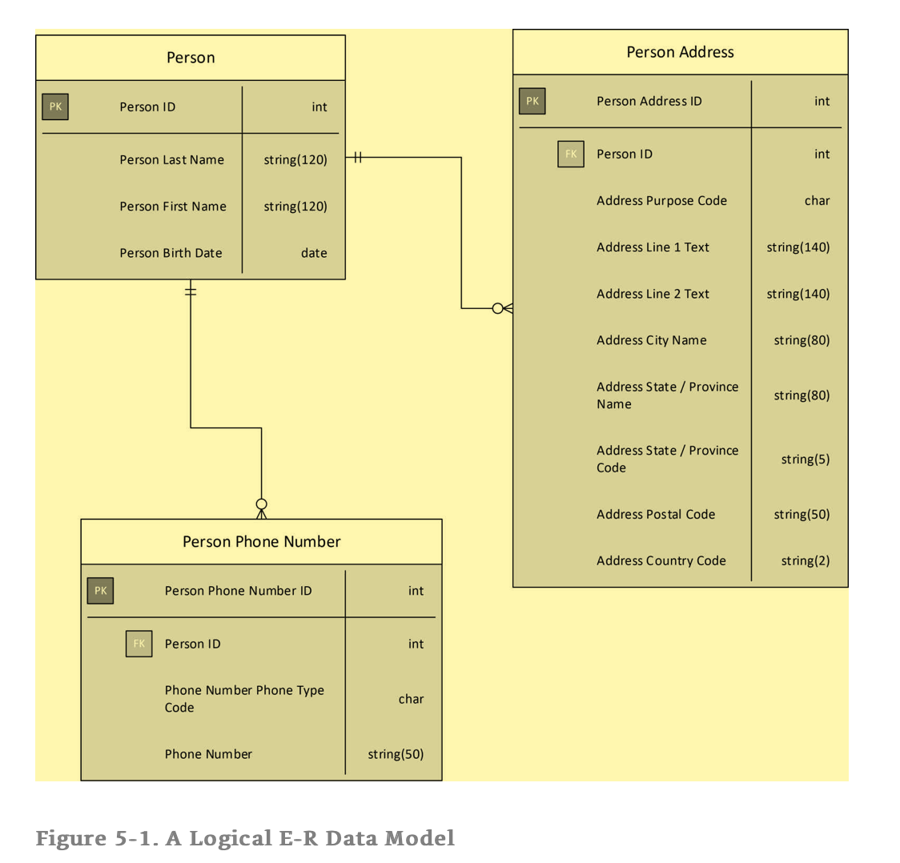
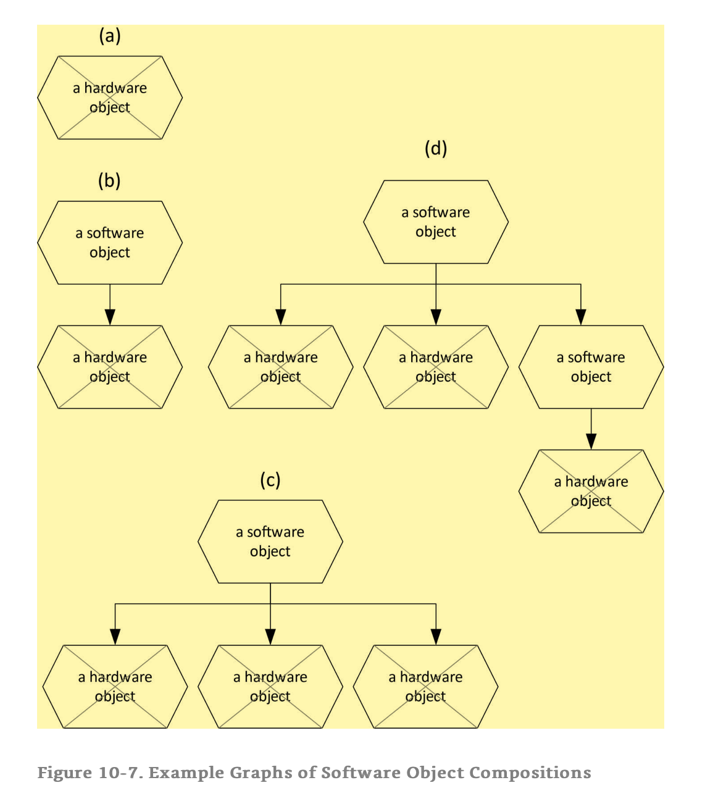
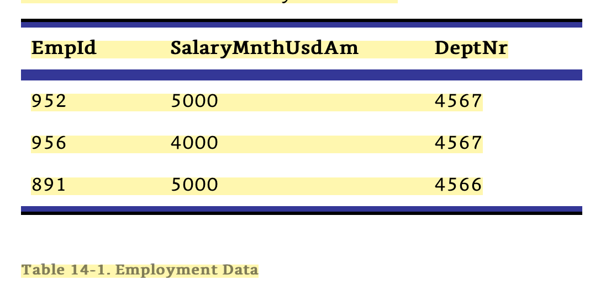
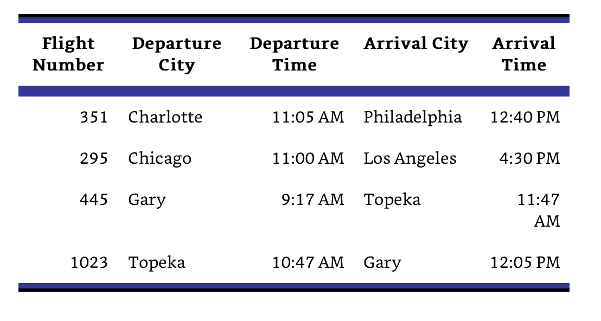
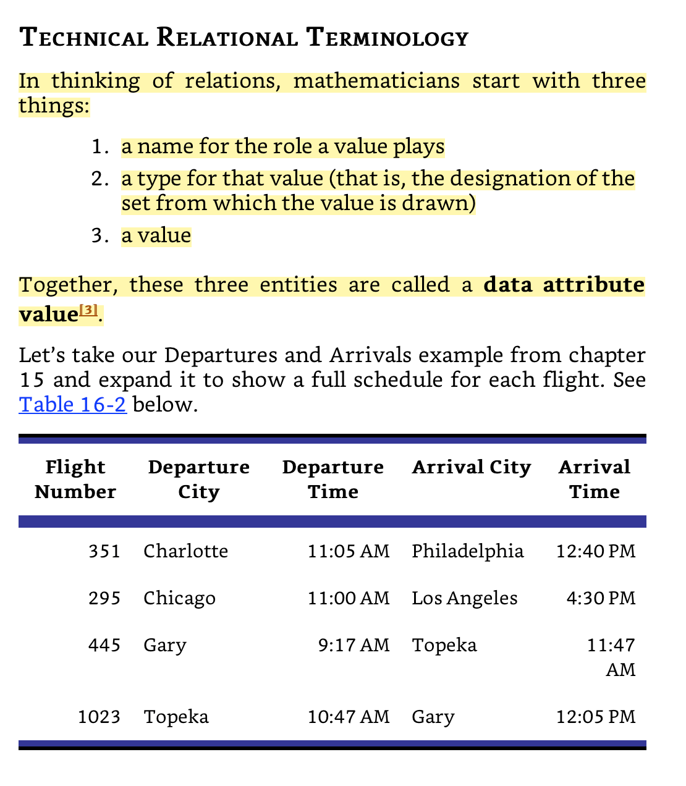

# NoSQL and SQL Data Modeling: Bringing Together Data, Semantics, and Software

[NoSQL and SQL Data Modeling: Bringing Together Data](https://www.amazon.com/NoSQL-SQL-Data-Modeling-Semantics/dp/1634621093)

* Developing a data model is just like developing a blueprint for a building.

* You might be surprised to find that the most difficult problems to solve in database design are logical and not physical.

* **Thing:** a separate and distinct individual quality, fact, idea, or usually entity

* **Components:** This inductive definition reflects the reality that all objects, except the elementary particles, are built from other, simpler objects. We say that they are composite objects, composed of other objects called components.

* The interesting thing about widely shared concepts is that, unlike objects, they have no place or time:

* We therefore treat the number one, and similar shared concepts, as if they have no time or place, and if we are wise we recognize that the names of concepts are just symbols that are quite separate from the concepts they represent.

* In summary, then, **an entity** is a thing that exists either objectively or conceptually. An object is an objective entity that is either an elementary particle of matter or is composed of other objects in relatively fixed spatial relationships. A conceptual entity is a concept; essentially, an idea.

* **An object** (whose existence can be objectively verified) or a concept (whose existence is merely as an idea). 

* The word object will also be used in exactly the sense of the definition quoted above, to mean a material entity, in contrast to concept, which is a conceptual entity.

* The word “entity” is the technical term for “thing”. Entities come in two flavors, conceptual and objective. Objective entities include material things called objects. All objects, except the elementary particles, are composed of other objects. Conceptual entities are concepts or ideas. Unlike objects, widely shared concepts have no time or place.

> All material objects, except the elementary particles, are composed of other material objects.

* **Container & Contents:** Each egg is an object—a material thing—and the carton is an object, but they are different kinds of objects. The carton was specially designed to hold up to twelve eggs. The carton is a container and the eggs are its contents. When I brought the carton home it was full. As soon as I took the first egg out of the carton it was no longer full. Once I took the last egg out of the carton it was empty. So the state of the container—full, partially full, empty—varied over the course of the week. 

* In general, a container is designed so that contents can easily be added and removed. These operations change the state of the container, but do not change its composition—that is, what it is made of.

* Unlike the egg carton, the cake is **composed** of eggs, and flour and milk and sugar and other ingredients, blended together.

* Remember that an object is composed of other objects in some kind of relatively static spatial relationship. Certainly a cake is an object, because it is composed of eggs, milk, flour, sugar, and other objects in a relatively static spatial relationship: they are all blended together and will remain that way until the cake is consumed.

* Now let’s think about a frosted cake. Frosting is applied to the top of the cake and between the layers. This isn’t quite blending, because the integrity of the cake and the frosting is still preserved. You can still see the difference between them, though it would be difficult to separate them once again. This kind of object composition is called **aggregation**. An object is formed from other objects in a way that the components keep their integrity, but it would be difficult to extract the components after they’ve been joined together.

* For those who are familiar with dimensional modeling, please note that what is called aggregation in that discipline is blending in ordinary English and in COMN.

* In contrast to aggregation, we can have assembly. This is a mode of composition where components retain their integrity and can even be removed from the object which they compose, if so desired. A real-world example of an assembly is an engine.

* Components of a (blended) cake are its ingredients, the components of a layer cake are alternating layers of cake and frosting, the components of an engine include pistons, spark plugs, valves, the block, etc., and the components of a place setting include dishes, silverware, and glasses.

* Four modes of composition important to us are: 
    + juxtaposition 
    + blending 
    + aggregation 
    + assembly

* Art museums usually contain paintings. Based on the previous chapter, we can recognize that a museum is a container, and the paintings are its contents. Also we know that  collection can exist inside or outside any particular container.

* We can see from this example that the objects belonging to a collection may or may not be in the same container at any one time. Although a container, being an object, always has but one location at any one time, a collection of objects is not necessarily localized. This gives us a clue that, while a container is an object a collection is not an object; a collection is merely a concept.

* We have seen that a collection is conceptual, even when the members of the collection are objects. It is also possible to have a collection of concepts. In such a case, both the collection and its members are conceptual. However, we don’t usually use the word “collection” in connection with concepts. We will usually say that we have a set of concepts. We know that numbers are concepts. Mathematicians have a special notation that they’ve developed just so that they can talk about sets of numbers (and other things). It is called set notation. Very simply, a list of numbers is enclosed in curly braces, as in {1, 2, 3}

* Long before computers were invented, we humans recognized similarities between things, categorized those things by their similar characteristics, and named those categories. For example, humans observing a herd of elephants roaming the African plains would recognize that all the individual animals in the herd shared common characteristics, including that they were gray in color, had long snouts, and grew to enormous size. These humans developed a shared concept of the common characteristics, and in order to be able to communicate about that shared concept would give that shared concept a name; in English, the name of the shared concept is “elephant”. Once the category of animals was named, every time such an animal was seen, instead of describing the animal’s characteristics, a reference to the category (“an elephant”) was sufficient to communicate about it. Other animals were similarly categorized based on common characteristics, and the categories were given names; for example, lion, tiger, zebra, etc. There is a rich set of words in English related to this innate human activity of classification, and these words are synonyms of each other. Some of these words are: 
    + category 
    + class 
    + classification 
    + division 
    + family 
    + genus 
    + kind 
    + order 
    + species 
    + type

* We will use the word **type** to mean something that designates a set, usually a set of concepts but also possibly a set of objects. We will use the word **class** to mean a description of the structural and/or behavioral characteristics of potential or actual objects.

* There is some means by which we can identify the members of the set, and distinguish those from things that are not in the set.

* Above we said that a class is a description of the structural and/or behavioral characteristics of potential or actual objects. In our refined terminology, we would say that the word “elephant” is a class, because it references a structural description of the animals in question. Another example of a class is a set of drawings and blueprints describing a house or houses that are built or to be built.

* A class, therefore, is a kind of type. It differs from other types in that a class can only designate sets of objects. One cannot have a class of concepts, in this restricted sense of the term.

> Our thinking is dominated by words. When those words have become overloaded with multiple ill-defined and contradictory meanings, we cannot think clearly.

* E-R modeling defines three stages of data modeling: conceptual, logical, and physical.

* Is customary to use E-R data models at three levels of abstraction: conceptual (the highest level) logical physical (the lowest level)

* Logical and physical E-R notation assumes that database implementation will be in a DBMS, such as a SQL DBMS, that stores data in tables. It does not, therefore, have any way of expressing two modes of data storage that NoSQL databases make possible: **arrays nested data structures (often called “nested documents” by NoSQL DBMSs)**

* Both arrays and nested data structures are modeled in E-R notation in a way that corresponds to their necessary implementation in a SQL database. This is what is shown earlier in Figure 5-1. The array or nested data structure is split out into its own table. That table has a foreign key back to the table from which it was split. Additionally, that table must have its own primary key.

> **Note:** Probably it's possbile to use ER for data modeling. Just instead of using tables and separating them. There could be another entity such as nest or array that holds the relationships. a) One-to-many: nested, b) Many to many: referenceId (foreign key)

* NoSQL DBMSs support the direct aggregation of arrays and nested data structures in enclosing data structures, without the use of keys. E-R notation has no way to show data structures that are related to each other without keys. As a result, E-R notation cannot be used for NoSQL database design.

* One of the main goals of relational database design is to eliminate redundancy in data, which is where the same data is stored in several places in the database. Redundancy leads to the possibility of inconsistent data, where an update of certain data in the database changes the logically identical data items in one physical place but leaves them out of date in another. Inconsistent data is devilishly hard to deal with, reduces the quality of data, and can lead to costly operational mistakes as fundamental as shipping a package to the wrong address.

* Data exists both as concepts (at the logical level of abstraction) and as objects (at the physical level of abstraction).

* Data type defines/elaborate the type of data i.e integer, float (real number - with decimal representation), string etc.

* Data Structure defines how the data will be (efficiently) contained. Data can be stored serially - Stack/Queue/Array.  Data can be arranged in tree like structure where the left branch contains The data with value less than that of the parent's & right one is opposite of the left - BST.

* Different types of data (such as int, float, string etc.) can be arranged/stored in various logical ways called data structures.

* In an object-oriented software system, the methods of a class are ordinarily the only routines that have direct access to the attributes of objects of that class. This kind of restriction is called encapsulation.

* The UML does not have a notation for identifying key attributes, and therefore cannot represent foreign keys. This means that the UML cannot fully specify a database design. There are workarounds for this deficiency.

* Entity types (concepts and real-world objects).

* It defines a class as “the descriptor for a set of objects.” [ibid., p. 185] This is all well and good, but the UML lacks any ability to describe entities that do not have state or behavior; that is, concepts.

* The UML lacks the concept of a key, which is essential to data modeling. It can only express the identification of objects by their physically distinct existence.

* Chapter 4 in part I explained the type/class split, where types designate sets and classes describe objects.

* COMN separates the designation of a set of values from the description of computer object structure and behavior. Types designate sets without specifying memory structure. Classes describe computer objects in terms of their structure in memory and the routines (methods) exclusively authorized to operate on them.

* Entity 2 : something that has separate and distinct existence and objective or conceptual reality object 1a : something material that may be perceived by the senses concept 1 : something conceived in the mind : thought, notion

* Figure 10-1 below shows a fundamental example of an object in the ordinary English sense of the word “object. The object pictured is a rock. It is certainly material, and it can certainly be perceived by the senses.

* From this point onwards, unless it is already clear from the context, I will qualify the word “object” with the adjective “material” to mean an object in the natural language sense.

* Let us consider the flashlight’s characteristics. It is an object in the same sense that a rock is an object, because it can be perceived by the senses: you can see it—even when it’s off—and touch it. However, a flashlight is interesting for more than its capability to be seen and touched. A flashlight can be turned on and off. We describe this capability by saying that the flashlight can hold a state. A flashlight has a built-in mechanism for changing its state from off to on and back to off: it’s a switch.

* In the commonly accepted terminology of computer science, mechanisms built into an object to change its state are called methods.

* In contrast to the flashlight, the rock has no states—at least not in the sense that the flashlight has states. More precisely, the rock is in a single state (solid), and offers no mechanisms of its own for changing that state. We call objects like the flashlight stateful, while we call objects like the rock stateless.

* A material object is an object in the natural-language sense of the word; in other words, something you can see and touch. Some objects have states and methods to change those states (for example, a flashlight), and some do not (for example, a rock). Objects capable of having more than one state are called stateful. Objects having only one state are called stateless.

* The states of some objects have intrinsic meaning, while the states of other objects have no intrinsic meaning. It is not always necessary to assign meanings to the states of an object in order for the object to be useful.

* Thus, on the evening of April 18, 1776, the tower of the Old North Church was used as a stateful object, with the following states and meanings: no lanterns: information unavailable one lantern: the soldiers were coming by land two lanterns: the soldiers were coming by sea The advantage of this system of signaling was that, although anyone could observe the state of the church tower (no lanterns, one lantern, two lanterns), only those who knew the values assigned to each state could interpret and act upon the signal.

* Object-oriented technologists talk much about methods, which, in terms of material objects, are mechanisms that are part of those objects that enable one to change their states. Let us consider the methods that are part of the material objects we have considered so far. rock: no methods (which makes sense, since it has but one state) flashlight: one method, the on-off switch lighted sign: a method to turn the sign on or off Old North Church: a method to light either lantern.

* But it is important to remember that those abstract values zero and one are represented by the meaningless physical states of material objects; specifically, the high- and low-voltage states of R-S flip-flops.

* In fact, computers usually make memory available only in groups of eight flip-flops called bytes. Each of the eight flip-flops has two states, so a byte has 2 x 2 x 2 x 2 x 2 x 2 x 2 x 2, or 28, or 256, states.

* The bit (a portmanteau of binary digit) is a basic unit of information used in computing and digital communications. A binary digit can have only one of two values, and may be physically represented with a two-state device.

* we look at each of the eight flip-flops in a byte as representing a binary digit or bit, then we can think of a byte as representing an 8-digit binary number. Eight binary digits can represent numbers in the range from zero to 255. Now we can refer to each of the 256 states of a byte with a number.

* Objects are often combined into a composite object. In general, the composite object has a number of states which is the product of the number of states of its component objects.

* Computer object: a stateful material object whose state can be read and/or modified by the execution of computer instructions.

* A computer object is a material object that has two distinct qualities beyond those possessed by most material objects: A computer object is a stateful mechanism. This means that it has two or more possible states and means for changing those states. A computer object’s state may be read by a computer, or modified by a computer, or both.

* We have two kinds of computer objects: hardware objects and software objects. hardware object: a computer object which is part of the physical composition of a computer software object: an object composed of hardware objects and/or other software objects by exclusively authorizing only certain routines to access the component objects.

* The graphs in this figure show the following: 
    + a hardware object a software object composed of a single hardware object, where access to the hardware object is restricted to only certain routines.
    + a software object composed of three hardware objects, where access to those hardware objects is restricted a software object composed of two hardware objects and one other software object, which in turn is composed of a hardware object.

* It’s really important to understand that at the bottom of every software object are hardware objects—material things having meaningless physical states to which we assign meaning.

* Class : a description of the structural and/or behavioral characteristics of potential and/or actual objects

* Hardware object has a fixed built-in set of mechanisms, accessible by computer instructions, for accessing and/or changing its state. Similarly, a software object has a fixed set of routines for accessing and/or changing its state.

* A hardware object may be composed of other hardware objects not directly accessible by computer instructions. Similarly, a software object may be composed of other (hardware or software) objects not directly accessible by its routines, if those objects are encapsulated within higher-level software objects that are part of the software object.

* In general, the meanings of an object’s states must be supplied from some source outside the object itself.

* A material object—that is, an object in the natural-language sense of the word—is something you can see and touch. A stateful material object is an object that has more than one state. A stateful material object may have mechanisms to change its state. The states of material objects may or may not have any meaning. Their states may be assigned meaning. Their states might be useful apart from any meaning. Computers are composed of stateful material objects which we call hardware objects. Software objects are composed of hardware objects and/or other software objects, in a tree. In general, the states of software objects have no more meaning than the states of the hardware objects of which they are composed. In general, meaning must be assigned to states by something other than the objects having those states.

+ Hardware object : a computer object which is part of the physical composition of a computer 
+ Software object : an object composed of hardware objects and/or other software objects by exclusively authorizing only certain routines to access the component objects
+ Method : a routine authorized to operate on the components of software objects of the class of which it is a part

* “Type” was used as a way for a programmer to inform a compiler that a variable could take on any value in the set designated by the type, and simultaneously that a variable needed a certain amount of memory so that it could represent all the values of that set.
    + logical purpose: A traditional type specifies the possible values a variable or field can take on. This is extremely valuable in helping to ensure the correctness of programs and data through a process called type checking.
    + a physical purpose: A traditional type specifies the memory or storage required for a variable or data item. A compiler or DBMS ensures that the proper amount of computer memory is allocated so that it can represent all of the values in the type’s range.

* Thus, while the English word “type” can mean a classification, in DBMS and high-level programming language terminology the word “type” means a constraint on values and a specification of the storage required for any variable declared to be using that type.

* “Type” for the most part retained its early meaning of set of values plus storage specification. Additionally, because the term “type” was adopted early in the history of programming language development, types were generally quite simple or “primitive”, specifying little more than sets of letters and/or numbers.

* In contrast, the “class” of object-oriented programming is associated with the enablement of programmers to define structures of arbitrary complexity, leading to a terminology that considers “classes” to be more powerful in their descriptive capabilities than mere “[primitive/data] types”.

* We have seen how hardware objects are simple objects, having no components (from the point of view of software), and how we will rarely deal with hardware objects directly. We leave that difficult and tedious work to compilers and DBMSs.

* An enumeration is a type that is specified by listing the names of the members of the set it designates. Here are some example enumerations: account status: open, closed, suspended, abandoned organization type: corporation, government entity, non-profit order status: ordered, shipped, back-ordered, canceled

* Classification is an innate human activity. When stripped of their technical meanings, the English words “type” and “class” are synonyms, and are used to designate sets of things with similar characteristics. We say that types designate sets. The word “type” was co-opted by the information technology industry to express both a potential set of values and memory storage requirements for representations of those values. The word “class” grew up later to describe more complex structures than those that could be described directly by the types of the previous earlier decade. “Type” alone took on the connotation of being simple or “primitive”; data types were also considered primitive.

* **Simple type**: a type that designates a set whose members have no components 

* **Composite type**: a type that designates a set whose members have components

* **Array**: a collection of some integral number of variables or objects of the same type or class

* **Proposition**: an expression in language or signs of something that can be believed, doubted, or denied or is either true or false For example, the statement, “It is raining outside right now,” is a proposition, because at this very moment the statement is either true or false—or at least one may argue about whether it is true or false. (Perhaps it is only drizzling.) A proposition is the most fundamental piece of information. A collection of propositions constitutes information.

* The above definition of information, as a collection of propositions, allows for the possibility that information is false, since a proposition may be true or false.

* **Fact**: a piece of information presented as having objective reality— in fact : in truth (Merriam-Webster) ,we can say that a fact is a proposition (a piece of information) that is true.

* Here is a proposition in the context of employment: Employee #952 works in Department 4567 and earns a salary of $5000 per month.

* Clearly these propositions, being of the same form, repeat a lot of text. By separating the unique parts of each proposition from the common parts, we can simplify the expression of this information.

* We will take the common parts of these propositions and place variables where the unique parts fit, as follows. Employee #EmpId works in Department DeptNr and earns a salary of $SalaryMnthUsdAm per month.

* The values in Table 14-1 are called data, which is a plural word. Each value individually is a datum.

* **Datum**: something given or admitted especially as a basis for reasoning or inference In this context, a datum is given to a predicate as a value for one of its variables. Observe that a datum may have some intrinsic meaning, but its full meaning in context is known only after it is substituted into its related predicate. For example, the number 5000 could indicate many different things, including a monthly salary, the number of people attending a concert, or the cost of a computer. We wouldn’t know which unless we knew the predicate with which it is associated.

* It is also important to understand that a value is not a datum unless it is intended to be bound to a predicate’s variable. For instance, the value 39 is just a number. If, however, the value 39 is associated with some predicate variable (for example, 39 is the x in “I just bought x apples”; or 39 is the y in “I am y years old”), then in that context 39 is a datum. This is important, because it reveals that the terms datum and data connote roles that values play.

* We need to accept both the singular and plural usages of the word “data”, reserving the plural usage for more technical contexts where we are paying attention to the fact that data is composed of multiple atoms, each of which is a datum.

* In order to deal with data en masse, we separate data from information. That is, we reduce a number of propositions of the same form to a single predicate and a set of data per proposition. We then store the data in a database management system, which is a computer system specifically designed to manage large quantities of data. 

* A proposition is the fundamental piece of information; to put it another way, one or more propositions = information. A predicate + data (as values for the predicate’s variables) = a proposition. I like to say that data is dehydrated information; just add predicates.

* Given “information” as defined above, the results of analyses are certainly a kind of information. However, if we use the term “information” solely to mean the results of analyses, we lose the more fundamental capability to reason about information as a collection of propositions. Therefore we will keep the definition of “information” a tight one. We will use the term “analytics” or “insight” for the data or information obtained by analyzing data.

* That which is referred to as “just data” might really be data in the strict sense, in which case a context is definitely needed (more precisely, a predicate) in order to understand what the data indicates. By the definition above, data is separate from the context (a predicate) which gives it meaning.

* Consider this progression from data to information to analytics. 
    + just a number: 39 
    + probably data: 39 degrees 
    + probably data: 39 degrees Celsius 
    + information: The patient’s temperature is 39 degrees Celsius. 
    + information: The outdoor temperature is 39 degrees Celsius. 
    + analytics (a kind of information): The average high temperature in Tucson, Arizona in the month of July for the last twenty years has been <data: list of monthly average temperatures> 
    + insight (a kind of information): It sure is hot in Tucson in July!

* The pure number “39”, without any other context, cannot be assumed to be data: it’s just a number. When the pure number “39” is combined with units of measure—degrees (of something unspecified) or degrees Celsius—we can begin to suspect that the values are data, because it would be unlikely that temperatures would be presented apart from some context. But without further information, such as a predicate for which the values were suited, even these measurement values are just values. When a proposition is made—that is, when an assertion is made that can be agreed or disagreed with, or believed, doubted, or denied—then we have information. Before that line is crossed, the values presented do not form any kind of proposition, and therefore there is no information, nor can we confidently assert that the values are data. Analytics are information derived from other information or data, and insights are information derived from analytics.

* Table 14-1 above provides a structure for data. It is clear from the context surrounding the table that the EmpId column should only contain employee IDs, the DeptNr column should only contain department numbers, and the SalaryMnthUsdAm column should only contain monthly salaries. To a limited extent, database systems can enforce these requirements by preventing the insertion of data that violates certain rules. For example, given a second table of department numbers, a database system can ensure that the DeptNr column of Table 14-1 only contains values found in the table of department numbers.

* In contrast, the software that is used to create and maintain text documents, audio recordings, etc., does not impose any structure on those artifacts other than the structure necessary to ensure that they are in fact text documents, audio recordings, etc. This is why they are called unstructured.

* Additionally, unstructured data can contain what is potentially data. For example, consider residential mortgage agreements. Such agreements are often 40 pages long, and contain many statements (which are propositions) that give information about the responsibilities of mortgagor and mortgagee, the term of the loan, the schedule of payments, etc. If one had a pile of, say, 100 such mortgage agreements, all issued by the same lender in a month’s time, one would discover that the bulk of the 40 pages were identical. If one separated out the customer-specific variable parts of the agreements from the non-varying parts, and put placeholder variables where the customer-specific variable parts should be inserted, one would have customer-specific data plus (mostly) non-customer-specific predicates: we would have given structure to the otherwise unstructured data.

* a “relation” is not the same as a “relationship”!

* What is a Relation? In overly simplistic terms, a relation is a table. So why do we use this fancy word “relation”, instead of the more easily understood term “table”? 
    + Because there are some important differences, namely: The order of rows in a relation has no significance whatsoever, while the order of rows in a table may carry information. 
    + The repetition of rows in a relation has no significance whatsoever, while the repetition of rows in a table may carry information.

* As soon as we take any data and write it down, we have a table, which has order to its rows. However, we want the freedom to establish that order differently for different uses. That is why it is so important to ensure that we represent data as relations—without order to their rows—while storing data as tables, which have order to their rows. Database systems that store information in the order of rows have a significant disadvantage, in that they cannot re-order rows for faster access without losing information. One of the main advantages of relational database systems over other kinds of database systems is this so-called data independence, where the physical order of data storage can be changed to speed up various styles of access without changing the information stored.

* By definition, each column in a relation can only carry one type of data; that is, data drawn from only one set of values. For instance, values in the Price column of a cash register receipt can only be drawn from a set of numbers that represent prices, with two digits to the right of the decimal point. Further, the values in each column carry a significance which is usually indicated by the column heading. For instance, we expect that values in the Item Description column describe the items purchased.

`Table 16.2`

* This table shows many data attribute values. Here are a few examples: <Departure City, FK(City Names), Charlotte> <Departure City, FK(City Names), Chicago> <Arrival Time, Time of Day Type, 4:30 PM> <Flight Number, FK(Flight Numbers), 445> The angle brackets (< >) indicate that the order of terms inside them is significant.

* A set of data attribute values, taken together, is called a tuple value, or, more simply, a tuple. This strange name comes from the names we use for sets of particular numbers of things: single, double, triple, quadruple, quintuple, sextuple, septuple, . . . . (You can pronounce “tuple” to rhyme with “couple” or to rhyme with “scruple”; both are acceptable.) Table 16-2 shows four tuples, each one as a row of the table. Here is the tuple represented by the first row of the table. {   <Flight Number, FK(Flight Numbers), 351>,   <Departure City, FK(City Names), Charlotte>,   <Departure Time, Time of Day Type, 11:05 AM>,   <Arrival City, FK(City Names), Philadelphia>,   <Arrival Time, Time of Day Type, 12:40 PM> } The outer braces around this list of data attributes indicate that they are members of a set, and therefore the order of items in the list is insignificant.

* If we store many, usually related, relations in one place, we have what is called a relational database. In relational theory, a database is a collection of relation variables, where each relation variable can take on the value of some relation.

* There are nine relational operators that return relations as results: select (or restrict), join, project, union, intersection, difference, extend, rename, and divide. These relational operators show up directly or indirectly in SQL, and are often present in NoSQL DBMSs as well, of necessity. For instance, an operation that selects documents from a document database based on the value of a particular document element is performing the relational operation of restriction.

* if you have a data structure of any sort—document, graph, key/value, whatever—where each data attribute has a name that corresponds to its role and a type that limits its possible values, you have a tuple scheme, and relational theory applies.

* A database definition in SQL always starts with a CREATE TABLE statement. There is no CREATE RELATION statement in SQL. It follows from this that the SQL language describes physical tables, which have the characteristics of order and repetition explained above.

+  attribute: an inherent characteristic (Merriam-Webster) 
+  data attribute: a <name, type> pair. The name gives the role of a value of the given type in the context of a tuple scheme or relation scheme. 
+  data attribute value: a <name, type, value> 
+ triple tuple : a tuple value 
+ tuple value : a set of data attribute values 
+ tuple scheme : the specification of the data attributes of a tuple, together with any constraints referencing a tuple value as a whole 
+ relation : a relation value relation 
+ value : a set of tuple values all having the same tuple scheme; informally, a table without significance to the order of or repetition of the values of its rows 
+ relation scheme : the specification of the data attributes of a relation, together with other information such as keys and other constraints on a relation value as a whole tuple 
+ variable : a symbol which can be bound to a tuple value 
+ relation variable : a symbol which can be bound to a relation value data 
+ independence : the ability to re-order data without losing any information

* Physical design is all about performance, and there are several critical factors to keep in mind when striving for top performance: 
    + scalability: Make the right tradeoffs between ACID and BASE, consulting the CAP theorem as a guide. Know how large things could get—that is, how much data and how many users. You will need to know how much of each type of data you will accumulate, so that you can choose the right data organization for each type. 
    + indexing: Indexing overcomes what amounts to the limitations of the laws of physics on data. If a field is not indexed, you will have to scan for it sequentially, which can take a very long time. Add indexes to most fields which you want to be able to search rapidly, and consider the various kinds of indexes the DBMS offers you. But be aware of the tradeoffs that come with indexes. 
    + correctness: Make sure the logical design is robust before you embark on the physical design. There’s nothing worse than an implementation that is fast but does the wrong thing. In this context, “robust” means complete enough that we don’t expect that evolving requirements will require much more than extension of the logical design.

* Almost all SQL DBMSs, plus a few NoSQL DBMSs, implement the four characteristics that are indicated by the acronym ACID: atomicity, consistency, isolation, durability. These four characteristics taken together enable SQL databases to be used in applications where the correctness of each database transaction is absolutely essential, such as financial transactions (think purchases, payments, and bank account deposits and withdrawals). In those kind of applications, getting just one transaction wrong is not acceptable.
    + Atomicity A DBMS transaction that is atomic will act as though it is indivisible. An update operation that might update a dozen tables will either…
    + Consistency A DBMS can enforce many constraints on data given to it to store. The most fundamental constraints are built-in type constraints: string fields can only contain strings, date fields can only…
    + Consistency is the characteristic that a DBMS exhibits where it will not allow a transaction to succeed unless all of the applicable constraints are satisfied. If, at any point in a transaction, a constraint is found which is not met by data in the transaction, the transaction will fail, and atomicity will ensure that all…
    + Isolation is the guarantee given by a DBMS that one transaction will not see the partial results of another transaction. It’s strongly related to atomicity. Isolation ensures that the final state of the data in a database only reflects the results of successful transactions; isolation ensures that, if a DBMS is processing multiple transactions simultaneously,…
    + Durability is the guarantee that, once a transaction has successfully completed, its results will be permanently visible in the database,…

> ACID sounds great, and it really is great if one has an application where preserving the result of every transaction is critical. But ACID comes at a cost. It is difficult to build DBMSs that can leverage large farms of parallel…

* These large databases are designed to scale horizontally, meaning that greater performance is achieved by putting many computers side-by-side to process transactions in parallel, and the data is replicated many times over so that multiple copies may be accessed simultaneously for retrieving requested data. 

* Horizontal scaling is great, but the CAP theorem, put forward by Eric Brewer in 2000 [Brewer 2012], proves that, in a distributed DBMS, one may only have two of the following three attributes: 
    + consistency: This is a specialized form of the consistency of ACID. It does not refer to the enforcement of consistency constraints. Rather, it is the requirement that, in a DBMS that has many copies of the same data, all of the copies match each other. In a horizontally scaled database, one can guarantee that all the copies match each other, but only if either availability or partition tolerance is sacrificed. + availability: With lots of computers accessing lots of storage over many network connections, there are bound to be failures at various points. That much hardware just has to have some pinpoint failures from time to time. But the motivation for having so many computers and so many copies of the same data is that, for any data request, there’s a good likelihood that some working computer can access some copy of the data and satisfy the request, even if some of the computers are down or some of the storage is unavailable. 100% availability can be achieved, even in a network with some failures, but only if either consistency or partition tolerance is sacrificed. 
    + partition tolerance: Partition tolerance in CAP means tolerance to a network partition. An example of a network partition is when two nodes can't talk to each other, but there are clients able to talk to either one or both of those nodes. If you've ever used IRC and experienced a netsplit, this is a great example of that.

* Most NoSQL databases are designed to scale horizontally, and so because of CAP they can’t offer ACID. They are described as achieving BASE (cute acronym): 
    + Basic Availability: Most of the data is available most of the time. 
    + Soft state: Unlike ACID, a “commit” of an update to a database might not always succeed. Some updates will be lost. 
    + Eventual consistency: After some internal failure, out of sync copies of data will eventually catch up with the current copies.

> BASE sounds a little scary, but sometimes it’s all that’s needed. For example, Facebook serves hundreds of millions of users, and probably couldn’t do so effectively with ACID-strength guarantees. So they allow user to post with only a soft state guarantee. Every now and then, a user's post gets lost. The downside is minimal: a few users are occasionally slightly annoyed by having to re-type a short update. As long as it doesn't happen to often, Facebook is able to fulfill its mission of enabling hundreds of millions of users to share their persona lives and thoughts. This would not be possible with a traditional ACID approach.

* A particular application might use both an ACID DBMS and a BASE DBMS, in combination, to achieve a certain mission. For example, a retail Web site might deliver product information and user reviews using a BASE DBMS, but run purchases and financial transactions on an ACID DBMS. A user would probably tolerate a review being lost, but not a purchase being lost or an account double-charged for one purchase. 

* Under the covers, NoSQL and SQL DBMSs all use the same set of data structures that were worked out decades ago for organizing data for fast access. These structures include things called trees, linked lists, queues, arrays, hashes and those venerable data structure, tables. What distingueshes DBMS types from each other is how they present this varied data storage structures to the DBMS user. NoSQL can be organized into 4 types of data organization:
    + key/value
    + document
    + columnar
    + graph

* As explained under document DBMSs, an index is a projection of the table data into another table.

* 

* 

