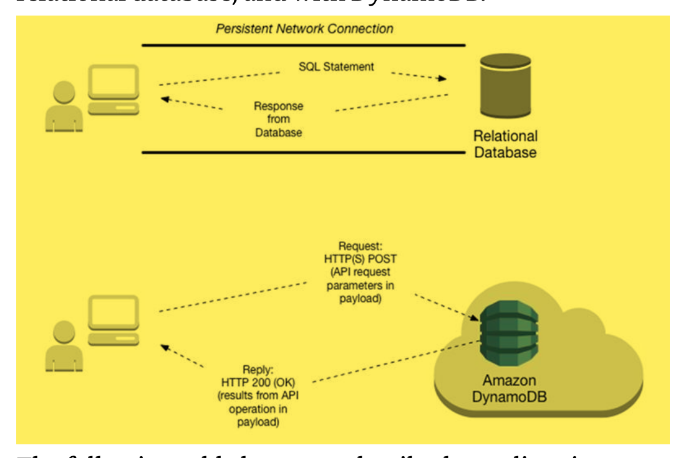
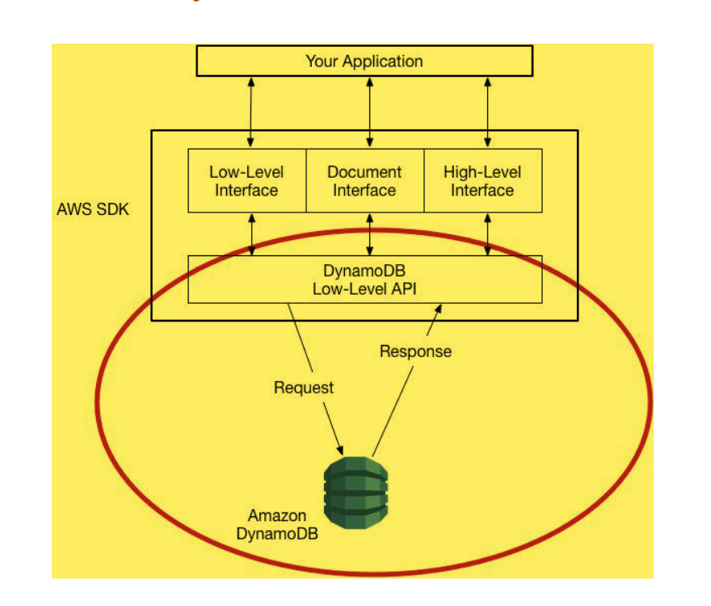
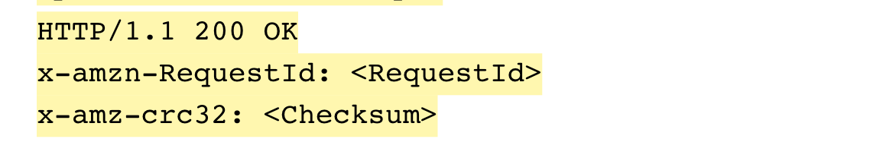
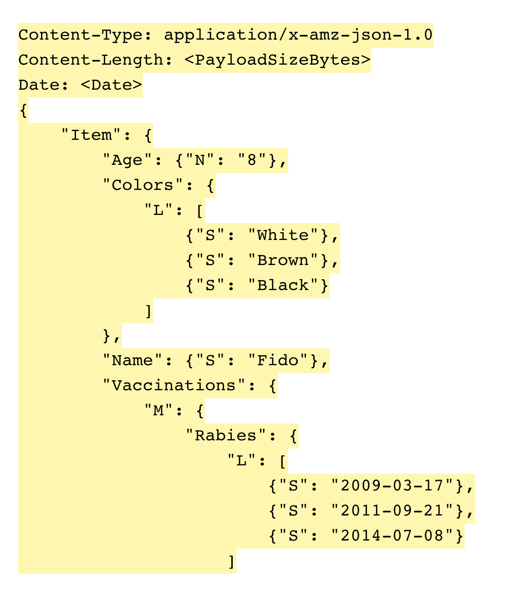
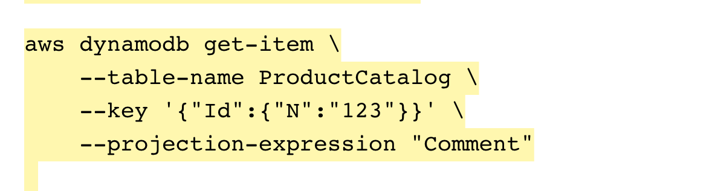
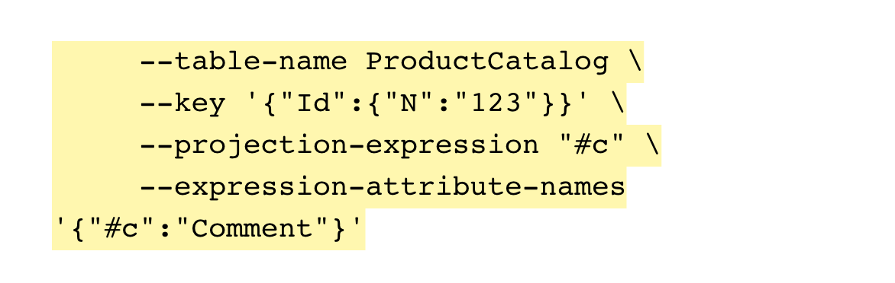
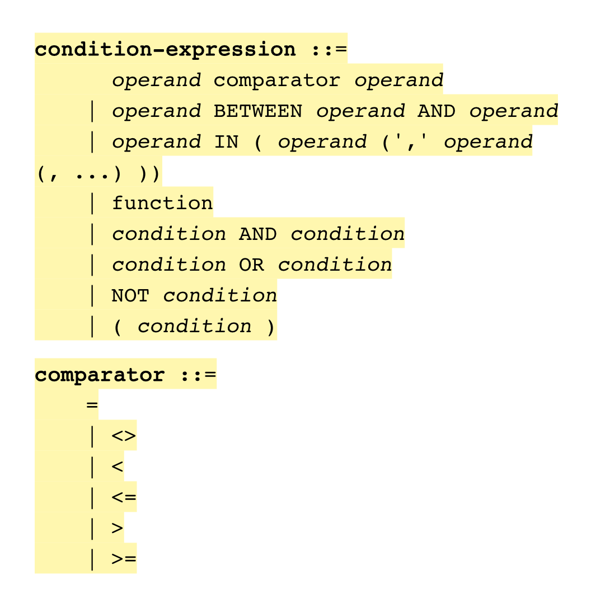
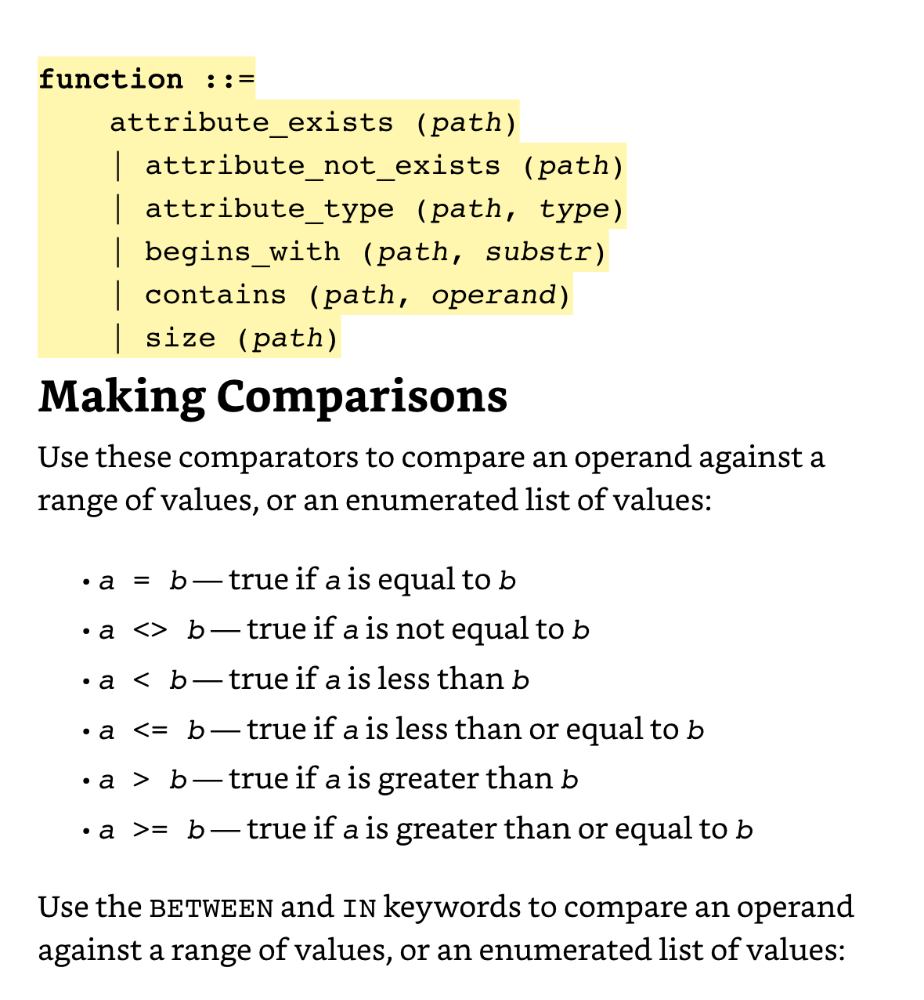

# Amazon DynamoDB: Developer Guide

[Source - HTML Version](https://docs.aws.amazon.com/amazondynamodb/latest/developerguide/Introduction.html)

* Partition key – A simple primary key, composed of one attribute known as the partition key. DynamoDB uses the partition key's value as input to an internal hash function. The output from the hash function determines the partition (physical storage internal to DynamoDB) in which the item will be stored.

* All items with the same partition key are stored together, in sorted order by sort key value.

* Each primary key attribute must be a scalar (meaning that it can hold only a single value). The only data types allowed for primary key attributes are string, number, or binary. There are no such restrictions for other, non-key attributes.

* Every index belongs to a table, which is called the base table for the index. In the preceding example, Music is the base table for the GenreAlbumTitle index.

* For example, consider a Customers table that contains customer information for a company. Suppose that you want to send a "welcome" email to each new customer. You could enable a stream on that table, and then associate the stream with a Lambda function. The Lambda function would execute whenever a new stream record appears, but only process new items added to the Customers table.

* In addition to triggers, DynamoDB Streams enables powerful solutions such as data replication within and across AWS regions, **materialized views of data in DynamoDB tables**, data analysis using Kinesis materialized views, and much more.

* When your application writes data to a DynamoDB table and receives an HTTP 200 response (OK), all copies of the data are updated. The data is eventually consistent across all storage locations, usually within one second or less.

* One read capacity unit represents one strongly consistent read per second, or two eventually consistent reads per second, for an item up to 4 KB in size.

* One write capacity unit represents one write per second for an item up to 1 KB in size.

* If your read or write requests exceed the throughput settings for a table, DynamoDB can throttle that request.


1. You write an application using an AWS SDK for your programming language.
2. Each AWS SDK provides one or more programmatic interfaces for working with DynamoDB. The specific interfaces available depend on which programming language and AWS SDK you use.
3. The AWS SDK constructs HTTP(S) requests for use with the low-level DynamoDB API.
4. The AWS SDK sends the request to the DynamoDB endpoint.
5. DynamoDB executes the request. If the request is successful, DynamoDB returns an HTTP 200 response code (OK). If the request is unsuccessful, DynamoDB returns an HTTP error code and an error message.
6. The AWS SDK processes the response and propagates it back to your application.

* Each of the AWS SDKs provides important services to your application, including the following:
    + Formatting HTTP(S) requests and serializing request parameters.
    + Generating a cryptographic signature for each request.
    + Forwarding request to a DynamoDB endpoint and receiving responses from DynamoDB.
    + Extracting the results from those responses.
    + Implementing basic retry logic in case of errors.
    + You do not need to write code for any of these tasks.

* Throttling prevents your application from consuming too many capacity units. When a request is throttled, it fails with an HTTP 400 code (Bad Request) and a ProvisionedThroughputExceededException. The AWS SDKs have built-in support for retrying throttled requests (see Error Retries and Exponential Backoff), so you do not need to write this logic yourself.

* If you use the AWS Management Console to create a table or a global secondary index, DynamoDB auto scaling is enabled by default.

* By reserving your read and write capacity units ahead of time, you realize significant cost savings compared to on-demand provisioned throughput settings.

* DynamoDB stores data in partitions. A partition is an allocation of storage for a table, backed by solid-state drives (SSDs) and automatically replicated across multiple Availability Zones within an AWS Region.

* Before your application can access a database, it must be authenticated to ensure that the application is allowed to use the database, and authorized so that the application can only perform actions for which it has permissions.



* Most SQL databases are transaction-oriented. When you issue an INSERT statement, the data modifications are not permanent until you issue a COMMIT statement. With Amazon DynamoDB, the effects of a PutItem action are permanent when DynamoDB replies with an HTTP 200 status code (OK).

* GetItem – Retrieves a single item from a table. This is the most efficient way to read a single item, because it provides direct access to the physical location of the item.

* Query – Retrieves all of the items that have a specific partition key. Within those items, you can apply a condition to the sort key and retrieve only a subset of the data. Query provides quick, efficient access to the partitions where the data is stored.

* You can add a ProjectionExpression parameter to return only some of the attributes: 

```js
{     TableName: "Music",     Key: {         "Artist": "No One You Know",         "SongTitle": "Call Me Today"     },     "ProjectionExpression": "AlbumTitle, Year, Price" } 
```
* The DynamoDB GetItem action is very efficient: It uses the primary key value(s) to determine the exact storage location of the item in question, and retrieves it directly from there. The SQL SELECT statement is similarly efficient, in the case of retrieving items by primary key values.

> DynamoDB is a non-relational database. As such, it does not support table joins. If you are migrating an existing application from a relational database to DynamoDB, you need to denormalize your data model to eliminate the need for joins.

* You can use Query with any table that has a composite primary key (partition key and sort key). You must specify an equality condition for the partition key, and you can optionally provide another condition for the sort key.

* The KeyConditionExpression parameter specifies the key values that you want to query. You can use an optional FilterExpression to remove certain items from the results before they are returned to you.

* In DynamoDB, you must use ExpressionAttributeValues as placeholders in expression parameters (such as KeyConditionExpression and FilterExpression). This is analogous to the use of bind variables in relational databases, where you substitute the actual values into the SELECT statement at runtime.

* A FilterExpression is applied after the entire table is scanned, but before the results are returned to you. (This is not recommended with large tables: You are still charged for the entire Scan, even if only a few matching items are returned.)

* Whether you are using a relational database or DynamoDB, you should be judicious with index creation. Whenever a write occurs on a table, all of the table's indexes must be updated. In a write-heavy environment with large tables, this can consume large amounts of system resources. In a read-only or read-mostly environment, this is not as much of a concern—however, you should ensure that the indexes are actually being used by your application, and not simply taking up space.

* In a relational database, an index is a data structure that lets you perform fast queries on different columns in a table.

* After the index has been created, you can query the data in the table as usual, but now the database can use the index to quickly find the specified rows in the table instead of scanning the entire table.

* DynamoDB does not have a query optimizer, so a secondary index is only used when you Query it or Scan it.

* A query optimizer is a critical database management system (DBMS) component that analyzes Structured Query Language (SQL) queries and determines efficient execution mechanisms. A query optimizer generates one or more query plans for each query, each of which may be a mechanism used to run a query. The most efficient query plan is selected and used to run the query. Database users do not typically interact with a query optimizer, which works in the background. [Source](https://www.techopedia.com/definition/26224/query-optimizer)

* DynamoDB ensures that the data in a secondary index is eventually consistent with its table. You can request strongly consistent Query or Scan actions on a table or a local secondary index. However, global secondary indexes only support eventual consistency.

* Projection – Attributes from the table that are copied to the index. In this case, ALL means that all of the attributes are copied.

* Part of this operation involves backfilling data from the table into the new index. During backfilling, the table remains available. However, the index is not ready until its Backfilling attribute changes from true to false. You can use the DescribeTable action to view this attribute.

* In a relational database, you do not work directly with indexes. Instead, you query tables by issuing SELECT statements, and the query optimizer can make use of any indexes.

* A query optimizer is a relational database management system (RDBMS) component that evaluates the available indexes, and determines whether they can be used to speed up a query. If the indexes can be used to speed up a query, the RDBMS accesses the index first and then uses it to locate the data in the table.

* This example uses a ProjectionExpression to indicate that we only want some of the attributes, rather than all of them, to appear in the results.

* You must specify the Key attributes of the item to be modified, and an UpdateExpression to specify attribute values.

* UpdateItem replaces the entire item, rather than replacing individual attributes.

* UpdateItem behaves like an "upsert" operation: The item is updated if it exists in the table, but if not, a new item is added (inserted).

* UpdateItem supports conditional writes, where the operation succeeds only if a specific ConditionExpression evaluates to true.

* UpdateItem also supports atomic counters, or attributes of type Number that can be incremented or decremented. Atomic counters are similar in many ways to sequence generators, identity columns, or auto-increment fields in SQL databases.

* In addition to DeleteItem, Amazon DynamoDB supports a BatchWriteItem action for deleting multiple items at the same time.

* The AWS SDK constructs HTTP(S) requests for use with the low-level DynamoDB API.



* The DynamoDB low-level API is the protocol-level interface for Amazon DynamoDB. At this level, every HTTP(S) request must be correctly formatted and carry a valid digital signature. The AWS SDKs construct low-level DynamoDB API requests on your behalf and process the responses from DynamoDB. This lets you focus on your application logic, instead of low-level details. However, you can still benefit from a basic knowledge of how the low-level DynamoDB API works.

* The low-level DynamoDB API uses JavaScript Object Notation (JSON) as a wire protocol format. JSON presents data in a hierarchy, so that both data values and data structure are conveyed simultaneously. Name-value pairs are defined in the format name:value. The data hierarchy is defined by nested brackets of name-value pairs.

* DynamoDB uses JSON only as a transport protocol, not as a storage format. The AWS SDKs use JSON to send data to DynamoDB, and DynamoDB responds with JSON, but DynamoDB does not store data persistently in JSON format.

* The DynamoDB low-level API accepts HTTP(S) POST requests as input. The AWS SDKs construct these requests for you.

* Suppose that you have a table named Pets, with a key schema consisting of AnimalType (partition key) and Name (sort key). Both of these attributes are of type string. To retrieve an item from Pets, the AWS SDK constructs a request as shown following:


* The Authorization header contains information required for DynamoDB to authenticate the request. 
* The X-Amz-Target header contains the name of a DynamoDB operation: GetItem.
* The payload (body) of the request contains the parameters for the operation, in JSON format.

* Response Format Upon receipt of the request, DynamoDB processes it and returns a response. For the request shown above, the HTTP(S) response payload contains the results from the operation, as in this example:




* Data Type Descriptors The low-level DynamoDB API protocol requires each attribute to be accompanied by a data type descriptor. Data type descriptors are tokens that tell DynamoDB how to interpret each attribute.

* If number precision is important to your application, you should convert numeric values to strings before you pass them to DynamoDB.

* To send binary data in a request, you will need to encode it in Base64 format. Upon receiving the request, DynamoDB decodes the Base64 data back to binary.

* The AWS SDKs take care of propagating errors to your application, so that you can take appropriate action. For example, in a Java program, you can write try-catch logic to handle a ResourceNotFoundException

* If you are not using an AWS SDK, you will need to parse the content of the low-level response from DynamoDB.

* AccessDeniedException Message: Access denied. The client did not correctly sign the request. If you are using an AWS SDK, requests are signed for you automatically; otherwise, go to the Signature Version 4 Signing Process in the AWS General Reference.

* Message: The request signature does not conform to AWS standards. The request signature did not include all of the required components. If you are using an AWS SDK, requests are signed for you automatically; otherwise, go to the Signature Version 4 Signing Process in the AWS General Reference.

* You should also see a Request ID in the response. The Request ID can be helpful if you need to work with AWS Support to diagnose an issue.

* **Exponential Backoff:** Numerous components on a network, such as DNS servers, switches, load balancers, and others can generate errors anywhere in the life of a given request. The usual technique for dealing with these error responses in a networked environment is to implement retries in the client application. This technique increases the reliability of the application and reduces operational costs for the developer. Each AWS SDK implements retry logic, automatically. You can modify the retry parameters to your needs.

* In addition to simple retries, each AWS SDK implements exponential backoff algorithm for better flow control. The concept behind exponential backoff is to use progressively longer waits between retries for consecutive error responses. For example, up to 50 milliseconds before the first retry, up to 100 milliseconds before the second, up to 200 milliseconds before third, and so on. However, after a minute, if the request has not succeeded, the problem might be the request size exceeding your provisioned throughput, and not the request rate.

* Most exponential backoff algorithms use jitter (randomized delay) to prevent successive collisions. Because you aren't trying to avoid such collisions in these cases, you do not need to use this random number. However, if you use concurrent clients, jitter can help your requests succeed faster.

* For BatchGetItem, the tables and primary keys in question are returned in the UnprocessedKeys parameter of the request. For BatchWriteItem, similar information is returned in UnprocessedItems.

* The most likely cause of a failed read or a failed write is throttling. For BatchGetItem, one or more of the tables in the batch request does not have enough provisioned read capacity to support the operation.

* If DynamoDB returns any unprocessed items, you should retry the batch operation on those items. However, we strongly recommend that you use an exponential backoff algorithm. If you retry the batch operation immediately, the underlying read or write requests can still fail due to throttling on the individual tables. If you delay the batch operation using exponential backoff, the individual requests in the batch are much more likely to succeed.

* An expression attribute name is a placeholder that you use in an expression, as an alternative to an actual attribute name. An expression attribute name must begin with a #, and be followed by one or more alphanumeric characters.

* On some occasions, you might need to write an expression containing an attribute name that conflicts with a DynamoDB reserved word. (For a complete list of reserved words, see Reserved Words in DynamoDB.) For example, the following AWS CLI example would fail because COMMENT is a reserved word:



* To work around this, you can replace Comment with an expression attribute name such as #c. The # (pound sign) is required and indicates that this is a placeholder for an attribute name. The AWS CLI example would now look like this: 



* In an expression, a dot (".") is interpreted as a separator character in a document path. However, DynamoDB also allows you to use a dot character as part of an attribute name. This can be ambiguous in some cases. Suppose that you wanted to access the nested attribute `ProductReviews.OneStar`, using the following projection expression:

* Suppose that you wanted to access the nested attribute ProductReviews.OneStar, using the following projection expression: 
```js
aws dynamodb get-item \     --table-name ProductCatalog \     --key '{"Id":{"N":"123"}}' \     --projection-expression "ProductReviews.OneStar"    
```

The result would contain all of the one-star product reviews, which is expected. But what if you decided to use an expression attribute name instead? For example, what would happen if you were to define `#pr1star` as a substitute for ProductReviews.OneStar? 

```js
aws dynamodb get-item \     --table-name ProductCatalog \     --key '{"Id":{"N":"123"}}' \     --projection-expression "#pr1star"  \     --expression-attribute-names '{"#pr1star":"ProductReviews.OneStar"}'
```

* The correct approach would be to define an expression attribute name for each element in the document path:

`#pr — ProductReviews #1star — OneStar`

You could then use `#pr.#1star? for the projection expression: 

```js
aws dynamodb get-item \     --table-name ProductCatalog \     --key '{"Id":{"N":"123"}}' \     --projection-expression "#pr.#1star"  \     --expression-attribute-names '{"#pr":"ProductReviews", "#1star":"OneStar"}'
```

* If you need to compare an attribute with a value, define an expression attribute value as a placeholder. Expression attribute values are substitutes for the actual values that you want to compare — values that you might not know until runtime. An expression attribute value must begin with a :, and be followed by one or more alphanumeric characters. For example, suppose you wanted to return all of the ProductCatalog items that are available in Black and cost 500 or less. You could use a Scan operation with a filter expression, as in this AWS CLI example: 

```js
aws dynamodb scan \     --table-name ProductCatalog \     --filter-expression "contains(Color, :c) and Price <= :p" \     --expression-attribute-values file://values.json    The arguments for --expression-attribute-values are stored in the file values.json: {     ":c": { "S": "Black" },     ":p": { "N": "500" } } 
``` 

* **Note:** A Scan operation reads every item in a table; therefore, you should avoid using Scan with large tables. The filter expression is applied to the Scan results, and items that do not match the filter expression are discarded. If you define an expression attribute value, you must use it consistently throughout the entire expression. Also, you cannot omit the : symbol. Expression attribute values are used with condition expressions,update expressions, and filter expressions.

* To manipulate data in a DynamoDB table, you use the PutItem, UpdateItem and DeleteItem operations. (You can also use BatchWriteItem to perform multiple PutItem or DeleteItem operations in a single call.) For these data manipulation operations, you can specify a condition expression to determine which items should be modified. If the condition expression evaluates to true, the operation succeeds; otherwise, the operation fails.

* To perform a conditional delete, you use a DeleteItem operation with a condition expression. The condition expression must evaluate to true in order for the operation to succeed; otherwise, the operation fails.

* In the condition expression, the : (colon character) indicates an expression attribute value— placeholder for an actual value.

* Syntax for Condition Expressions In the following syntax summary, an operand can be the following: A top-level attribute name, such as Id, Title, Description or ProductCategory.




* Use parentheses to change the precedence of a logical evaluation. For example, suppose that conditions a and b are true, and that condition c is false. The following expression evaluates to true: a OR b AND c However, if you enclose a condition in parentheses, it is evaluated first. For example, the following evaluates to false: (a OR b) AND c Note You can nest parentheses in an expression. The innermost ones are evaluated first.

* DynamoDB evaluates conditions from left to right using the following precedence rules: = <> < <= > >= IN BETWEEN attribute_exists attribute_not_exists begins_with contains Parentheses NOT AND OR

* To update an existing item in a table, you use the UpdateItem operation. You must provide the key of the item you want to update. You must also provide an update expression, indicating the attributes you want to modify and the values you want to assign to them. An update expression specifies how UpdateItem will modify the attributes of an item—for example, setting a scalar value, or removing elements from a list or a map. The following is a syntax summary for update expressions: update-expression ::=     [ SET action [, action] ... ]     [ REMOVE action [, action] ...]     [ ADD action [, action] ... ]     [ DELETE action [, action] ...] An update expression consists of one or more clauses. Each clause begins with a SET, REMOVE, ADD or DELETE keyword. You can include any of these clauses in an update expression, in any order. However, each action keyword can appear only once. Within each clause are one or more actions, separated by commas. Each action represents a data modification.

* Use the SET action in an update expression to add one or more attributes to an item. If any of these attribute already exist, they are overwritten by the new values. You can also use SET to add or subtract from an attribute that is of type Number. To perform multiple SET actions, separate them by commas.

* Adding Nested Map Attributes Example Add some nested map attributes:

```js
aws dynamodb update-item \     --table-name ProductCatalog \     --key '{"Id":{"N":"789"}}' \     --update-expression "SET #pr.#5star[1] = :r5, #pr.#3star = :r3" \     --expression-attribute-names file://names.json \     --expression-attribute-values file://values.json \     --return-values ALL_NEW
``` 
* The arguments for --expression-attribute-names are stored in the file names.json: {     "#pr": "ProductReviews",     "#5star": "FiveStar",     "#3star": "ThreeStar" } The arguments for --expression-attribute-values are stored in the file values.json: {     ":r5": { "S": "Very happy with my purchase" },     ":r3": {         "L": [             { "S": "Just OK - not that great" }         ]     } }

* (Remember that list_append takes two lists as input, and appends the second list to the first.)

* If you want to avoid overwriting an existing attribute, you can use SET with the if_not_exists function. (The function name is case-sensitive.) The if_not_exists function is specific to the SET action, and can only be used in an update expression. 

* In general, we recommend using SET rather than ADD. Use the ADD action in an update expression to add a new attribute and its value(s) to an item. If the attribute already exists, then the behavior of ADD depends on the attribute's data type: If the attribute is a number, and the value you are adding is also a number, then the value is mathematically added to the existing attribute. (If the value is a negative number, then it is subtracted from the existing attribute.) If the attribute is a set, and the value you are adding is also a set, then the value is appended to the existing set. Note The ADD action only supports number and set data types.

* Time To Live (TTL) for DynamoDB allows you to define when items in a table expire so that they can be automatically deleted from the database

* **Overloading Global Secondary Indexes** Although Amazon DynamoDB has a limit of five global secondary indexes per table, in practice, you can index across far more than five data fields. As opposed to a table in a relational database management system (RDBMS), in which the schema is uniform, a table in DynamoDB can hold many different types of data items at one time. In addition, the same attribute in different items can contain entirely different types of information. Consider the following example of a DynamoDB table layout that saves a variety of different kinds of data:
    + The Data attribute, which is common to all the items, has different content depending on its parent item. If you create a global secondary index for the table that uses the table's sort key as its partition key and the Data attribute as its sort key, you can make a variety of different queries using that single global secondary index.
    + These queries might include the following: Look up an employee by name in the global secondary index, by searching on the Employee_Name attribute value. Use the global secondary index to find all employees working in a particular warehouse by searching on a warehouse ID (such as Warehouse_01). Get a list of recent hires, querying the global secondary index on HR_confidential as a partition-key value and Data as the sort key value.


* To enable selective queries across the entire key space, you can use write sharding by adding an attribute containing a (0-N) value to every item that you will use for the global secondary index partition key. The following is an example of a schema that uses this in a Critical-Event workflow: Using this schema design, the event items are distributed across 0-N partitions on the GSI, allowing a scatter read using a sort condition on the composite key to retrieve all items with a given state during a specified time period.


* This schema pattern delivers a highly selective result set at minimal cost, without requiring a table scan.

* There is always a short propagation delay between a write to the parent table and the time when the written data appears in the index. In other words, your applications should take into account that the global secondary index replica is only eventually consistent with the parent table.

* Amazon DynamoDB currently limits the size of each item that you store in a table (see Limits in DynamoDB. If your application needs to store more data in an item than the DynamoDB size limit permits, you can try compressing one or more large attributes, or you can store them as an object in Amazon Simple Storage Service (Amazon S3) and store the Amazon S3 object identifier in your DynamoDB item.

* If you wanted to store an image of each product that was too large to fit in an item, you could store the images in Amazon S3 instead of in DynamoDB.

* There are two key numbers to keep in mind for this design. First, a physical partition can support only 1,000 WCUs (writes per second, each of up to 1 KB in size). Second, it can hold only 10 GB of total data. If either of these limits is exceeded, the partition will be split.

* For example, if you anticipate an average event frequency around 5,000 events per second with a maximum of 6,000 per second, your application can append to the partition key a sharding suffix that rotates from _1 through _6 and back again. This creates six physical partitions across which incoming events are evenly distributed as they arrive, and you can provision your table with 6,000 WCUs.

* **Adjacency List Design Pattern** When different entities of an application have a many-to-many relationship between them, the relationship can be modeled as an adjacency list. In this pattern, all top-level entities (synonymous to nodes in the graph model) are represented using the partition key. Any relationship with other entities (edges in a graph) are represented as an item within the partition by setting the value of the sort key to the target entity ID (target node). The advantages of this pattern include minimal data duplication and simplified query patterns to find all entities (nodes) related to a target entity (having an edge to a target node).


* A real-world example where this pattern has been useful is an invoicing system where invoices contain multiple bills. One bill can belong in multiple invoices. The partition key in this example is either an InvoiceID or a BillID. BillID partitions have all attributes specific to bills. InvoiceID partitions have an item storing invoice-specific attributes, and an item for each BillID that rolls up to the invoice. The schema looks like the following:

* Using the preceding schema, you can see that all bills for an invoice can be queried using the primary key on the table. To look up all invoices that contain a part of a bill, create a global secondary index on the table's sort key. The projections for the global secondary index look like the following:


* Materialized Graph Pattern Many applications are built around understanding rankings across peers, common relationships between entities, neighbor entity state, and other types of graph style workflows. For these types of applications, consider the following schema design pattern:


* The precending schema shows a graph data structure that is defined by a set of data partitions containing the items that define the edges and nodes of the graph. Edge items contain a Target and a Type attribute. These attributes are used as part of a composite key name "TypeTarget" to identify the item in a partition in the primary table or in a second global secondary index. The first global secondary index is built on the Data attribute. This attribute uses global secondary index-overloading as described earlier to index several different attribute types, namely Dates, Names, Places, and Skills. Here, one global secondary index is effectively indexing four different attributes.

* However, the same organizations may now find that their operations depend on high-traffic customer-facing websites, where millisecond response is essential. Relational systems can't scale to meet this requirement except at huge (and often unacceptable) expense.

* In these situations, the answer might be to create a hybrid system, in which DynamoDB creates a materialized view of data stored in one or more relational systems and handles high-traffic requests against this view.

* DynamoDb can take advantage of DynamoDb streams and AWS Lambda to integrate with one or more existing relational database systems. 


* A system that integrates DynamoDb streams and AWS Lambda can provide several advantages:
    + It can operate as persistent cache of materialized view
    + It can be setup to fill gradually with data as that data is queried for, and and as data is modified in the SQL system. This means that the entire view doesn't need to be pre-populated, which in turn means that provisioned throughput capacity is more likely to be utilized efficiently. 
    + It has low administrative costs and is highly available

* For this kind of integration to be implemented, essentially three kinds of interoperation must be provided: 


1. Fill the DynamoDB cache incrementally. When an item is queried, look for it first in DynamoDB. If it is not there, look for it in the SQL system, and load it into DynamoDB. 

2. Write through a DynamoDB cache. When a customer changes a value in DynamoDB, a Lambda function is triggered to write the new data back to the SQL system. 

3. Update DynamoDB from the SQL system. When internal processes such as inventory management or pricing change a value in the SQL system, a stored procedures is triggered to propagate the change to the DynamoDB materialized view. 

* These operations are straightforward, and not all of them are needed for every scenario.

* RDBMS platforms use an ad hoc query language (generally a flavor of SQL) to generate or materialize views of the normalized data to support application-layer access patterns.

* One-time queries of this kind provide a flexible API for accessing data, but they require a significant amount of processing. You must often query the data from multiple locations, and the results must be assembled for presentation. The preceding query initiates complex queries across a number of tables and then sorts and integrates the resulting data.

* Another factor that can slow down RDBMS systems is the need to support an ACID-compliant transaction framework. The hierarchical data structures used by most online transaction processing (OLTP) applications must be broken down and distributed across multiple logical tables when they are stored in an RDBMS. Therefore, an ACID-compliant transaction framework is necessary to avoid race conditions that could occur if an application tries to read an object that is in the process of being written. Such a transaction framework necessarily adds significant overhead to the write process.

* These two factors are the primary barriers to scale for traditional RDBMS platforms. It remains to be seen whether the NewSQL community can be successful in delivering a distributed RDBMS solution. But it is unlikely that even that would resolve the two limitations described earlier. No matter how the solution is delivered the processing costs of normalization and ACID transactions must remain significant. 

* A relational database system does not scale well for the following reasons: It normalizes data and stores it on multiple tables that require multiple queries to write to disk. It generally incurs the performance costs of an ACID-compliant transaction system. It uses expensive joins to reassemble required views of query results. DynamoDB scales well for these reasons: Schema flexibility lets DynamoDB store complex hierarchical data within a single item. Composite key design lets it store related items close together on the same table. Queries against the data store become much simpler, often in the following form: `SELECT * FROM Table_X WHERE Attribute_Y = "somevalue"`. DynamoDb does far less work to return requested data. 

## Modeling Relational Data in DynamoDb

* NoSQL design requires a different mindset than RDBMS design. For an RDBMS, you can create a normalized data model without thinking about access patterns. You can then extend it later when new questions and query requirements arise. For DynamoDB, by contrast, you shouldn't start designing your schema until you know the questions it needs to answer. Understanding the business problems and the application use cases upfront is absolutely essential. 

* To start designing a DynamoDb that will scale efficiently, you must take several steps first to identify the access patterns that are required by the operations and business support systems (OSS/BSS) that it needs to support:
    + For a new applications, review user stories about the activities and objectives. Document the various use cases that you identify, and analyze the access patterns that require.
    + For existing applications, analyze query logs to find out how people are currently using the system and what the key access patterns are. 

After completing this process, you should end up with a list that might look something like that:


* In a real applicaiton that, your list might be much longer. But this collection represents the range of query pattern complexity that you might find in a production environment. 

> A common approach to DynamoDb schema design is to identify application layer entities and use denormalization and composite key aggregation to reduce query complexity. 

* In DynamoDb, this means using composite sort keys, overloaded global secondary indexes, partitioned tables/indexes, and other design patterns. You can use these elements to structure the data so that an application can retrieve whatever it needs for a given access pattern using a single query on a table or an index.

* The primary pattern that you can use to model the normalized schema shown in Relational Modeling is the adjacency pattern. Other pattern used in this design can include global secondary index write sharding, global secondary index overloading, composite key, and materialized aggregations. 

**Important:** In general you should maintain as few tables as possible in DynamoDb application. Most-well designed applications require only one table. Exceptions include cases where high-volume time series data are involved, or datasets that have very different access pattern. A single table with inverted indexes can enable simple queries to create and retrieve the complex hierarchical data structures required by your application. 

**Relational Modeling Example**


* **Example of Modeling Relational Data in DynamoDB:** This example describes how to model relational data in Amazon DynamoDB. A DynamoDB table design corresponds to the relational order entry schema that is shown in Relational Modeling. It follows the Adjacency List Design Pattern, which is a common way to represent relational data structures in DynamoDB. The design pattern requires you to define a set of entity types that usually correlate to the various tables in the relational schema. Entity items are then added to the table using a compound (partition and sort) primary key. The partition key of these entity items is the attribute that uniquely identifies the item and is referred to generically on all items as PK. The sort key attribute contains an attribute value that you can use for an inverted index or global secondary index. It is generically referred to as SK. You define the following entities, which support the relational order entry schema:          


* After adding these entity items to the table, you can define the relationships between them by adding edge items to the entity item partitions. The following table demonstrates this step: In this example, the Employee, Order and Product Entity partitions on the table have additional edge items that contain pointers to other entity items on the table. [Here is the Link how to do it](https://docs.aws.amazon.com/amazondynamodb/latest/developerguide/bp-modeling-nosql-B.html)


* Next, define a few global secondary indexes (GSIs) to support all the access patterns defined previously. The entity items don't all use the same type of value for the primary key or the sort key attribute. All that is required is to have the primary key and sort key attributes present to be inserted on the table.

* The fact that some of these entities use proper names and others use other entity IDs as sort key values allows the same global secondary index to support multiple types of queries. This technique is called GSI overloading. It effectively eliminates the limit of five global secondary indexes for tables that contain multiple item types. This is shown in the following diagram as GSI 1:


GSI 2 is designed to support a fairly common application access pattern, which is to get all the items on the table that have a certain state. For a large table with an uneven distribution of items across available states, this access pattern can result in a hot key, unless the items are distributed across more than one logical partition that can be queried in parallel. This design pattern is called write sharding.

To accomplish this for GSI 2, the application adds the GSI 2 primary key attribute to every Order item. It populates that with a random number in a range of 0–N, where N can generically be calculated using the following formula, unless there is a specific reason to do otherwise:

```
ItemsPerRCU = 4KB / AvgItemSize

PartitionMaxReadRate = 3K * ItemsPerRCU

N = MaxRequiredIO / PartitionMaxReadRate
```

* For example, assume that you expect the following:

* Up to 2 million orders will be in the system, growing to 3 million in 5 years.
* Up to 20 percent of these orders will be in an OPEN state at any given time.

The average order record is around 100 bytes, with three OrderItem records in the order partition that are around 50 bytes each, giving you an average order entity size of 250 bytes.

For that table, the N factor calculation would look like the following:

```
ItemsPerRCU = 4KB / 250B = 16

PartitionMaxReadRate = 3K * 16 = 48K

N = (0.2 * 3M) / 48K = 13
``` 

* In this case, you need to distribute all the orders across at least 13 logical partitions on GSI 2 to ensure that a read of all Order items with an OPEN status doesn't cause a hot partition on the physical storage layer. It is a good practice to pad this number to allow for anomalies in the dataset. So a model using N = 15 is probably fine. As mentioned earlier, you do this by adding the random 0–N value to the GSI 2 PK attribute of each Order and OrderItem record that is inserted on the table.

* This breakdown assumes that the access pattern that requires gathering all OPEN invoices occurs relatively infrequently so that you can use burst capacity to fulfill the request. You can query the following global secondary index using a State and Date Range Sort Key condition to produce a subset or all Orders in a given state as needed. In this example, the items are randomly distributed across the 15 logical partitions.


Finally, you can revisit the access patterns that were defined earlier. Following is the list of access patterns and the query conditions that you will use with the new DynamoDB version of the application to accommodate them:


* In general, Scan operations are less efficient than other operations in DynamoDB. A Scan operation always scans the entire table or secondary index. It then filters out values to provide the result you want, essentially adding the extra step of removing data from the result set.

* Isolate scan operations DynamoDB is designed for easy scalability. As a result, an application can create tables for distinct purposes, possibly even duplicating content across several tables. You want to perform scans on a table that is not taking "mission-critical" traffic. Some applications handle this load by rotating traffic hourly between two tables—one for critical traffic, and one for bookkeeping. Other applications can do this by performing every write on two tables: a "mission-critical" table, and a "shadow" table.

* For security reasons, many AWS customers run their applications within an Amazon Virtual Private Cloud environment (Amazon VPC). With Amazon VPC, you can launch Amazon EC2 instances into a virtual private cloud, which is logically isolated from other networks—including the public Internet.

> Amazon Cognito uses IAM roles to generate temporary credentials for your application's authenticated and unauthenticated users.

* Before you can load data from a DynamoDB table, you must first create an Amazon Redshift table to serve as the destination for the data. Keep in mind that you are copying data from a NoSQL environment into a SQL environment.

* DynamoDB table names can contain up to 255 characters, including '.' (dot) and '-' (dash) characters, and are case-sensitive. Amazon Redshift table names are limited to 127 characters, cannot contain dots or dashes and are not case-sensitive. In addition, table names cannot conflict with any Amazon Redshift reserved words.

* Hadoop is a distributed application that implements the MapReduce algorithm, where a task is mapped to multiple nodes in the cluster. Each node processes its designated work, in parallel with the other nodes. Finally, the outputs are reduced on a single node, yielding the final result.

* When you launch an Amazon EMR cluster, you specify the initial number and type of Amazon EC2 instances. You also specify other distributed applications (in addition to Hadoop itself) that you want to run on the cluster. These applications include Hue, Mahout, Pig, Spark, and more.

* Hive is a data warehouse application for Hadoop that allows you to process and analyze data from multiple sources. Hive provides a SQL-like language, HiveQL, that lets you work with data stored locally in the Amazon EMR cluster or in an external data source (such as Amazon DynamoDB).

* In Tutorial: Working with Amazon DynamoDB and Apache Hive, you created an external Hive table that mapped to a DynamoDB table. When you issued HiveQL statements against the external table, the read and write operations were passed through to the DynamoDB table. You can think of an external table as a pointer to a data source that is managed and stored elsewhere. In this case, the underlying data source is a DynamoDB table. (The table must already exist. You cannot create, update, or delete a DynamoDB table from within Hive.)

* You use the CREATE EXTERNAL TABLE statement to create the external table. After that, you can use HiveQL to work with data in DynamoDB, as if that data were stored locally within Hive.

* You can use AWS Data Pipeline to export data from a DynamoDB table to a file in an Amazon S3 bucket. You can also use the console to import data from Amazon S3 into a DynamoDB table, in the same AWS region or in a different region. The ability to export and import data is useful in many scenarios. For example, suppose you want to maintain a baseline set of data, for testing purposes. You could put the baseline data into a DynamoDB table and export it to Amazon S3. Then, after you run an application that modifies the test data, you could "reset" the data set by importing the baseline from Amazon S3 back into the DynamoDB table. Another example involves accidental deletion of data, or even an accidental DeleteTable operation. In these cases, you could restore the data from a previous export file in Amazon S3. You can even copy data from a DynamoDB table in one AWS region, store the data in Amazon S3, and then import the data from Amazon S3 to an identical DynamoDB table in a second region. Applications in the second region could then access their nearest DynamoDB endpoint and work with their own copy of the data, with reduced network latency. The following diagram shows an overview of exporting and importing DynamoDB data using AWS Data Pipeline.

* To export a DynamoDB table, you use the AWS Data Pipeline console to create a new pipeline. The pipeline launches an Amazon EMR cluster to perform the actual export. Amazon EMR reads the data from DynamoDB, and writes the data to an export file in an Amazon S3 bucket.

* Table and GSI decrease limits are decoupled, so any GSI(s) for a particular table have their own decrease limits. However, if a single request decreases the throughput for a table and a GSI, it will be rejected if either exceeds the current limits. A request will not be partially processed.

* Projected Secondary Index Attributes Per Table You can project a total of up to 20 attributes into all of a table's local and global secondary indexes. This only applies to user-specified projected attributes. In a CreateTable operation, if you specify a ProjectionType of INCLUDE, the total count of attributes specified in NonKeyAttributes, summed across all of the secondary indexes, must not exceed 20. If you project the same attribute name into two different indexes, this counts as two distinct attributes when determining the total. This limit does not apply for secondary indexes with a ProjectionType of KEYS_ONLY or ALL. Partition Keys

* The exception is for tables with local secondary indexes. With a local secondary index, there is a limit on item collection sizes: For every distinct partition key value, the total sizes of all table and index items cannot exceed 10 GB. This might constrain the number of sort keys per partition key value.

* Expression parameters include ProjectionExpression, ConditionExpression, UpdateExpression, and FilterExpression.

* US East (N. Virginia) Region: Per table – 40,000 write capacity units All Other Regions: Per table – 10,000 write capacity units


