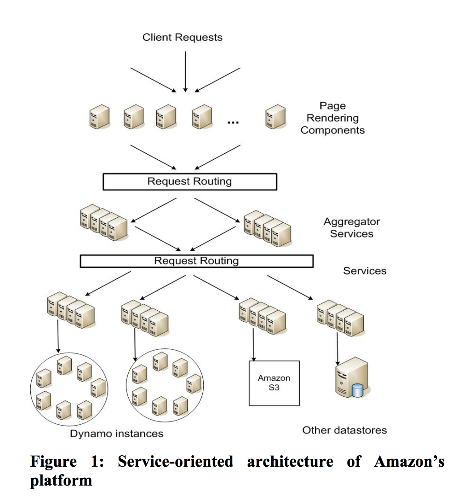

# Amazon's Original DynamoDb Paper

* Only some of the Amazon's services use DynamoDb
* It's highly available key/value storage (not document)
* Since some of the Amazon's services need to be highly available, DynamoDb sacrifices consistency under certain failure scenario
* The reliability and scalability of a system is dependent on how its application state is managed

**Note:** State management refers to the management of the state of one or more user interface controls such as text fields, OK buttons, radio buttons, etc. in a graphical user interface. In this user interface programming technique, the state of one UI control depends on the state of other UI controls.

* E.g a service responsible for managing shopping carts requires that it can always write to and from its data store, and that its data needs to be available across **multiple data centers**

* Dynamo is used to manage the state of services that have very high reliability requirements and need tight control over the tradeoffs between availability, consistency, cost-effectiveness and performance.

* There are many services on Amazon's platform that only need primary key access to a data store. Services such as best seller lists, shopping carts, customer preferences, session management, sales rank, and product catalog, **the common pattern of using relational database would lead to inefficiencies and limit scale and availability. DynamoDb provides simple primary-key only interface to meet the requirement of these applications.

**Note:** Quorum Reads and Writes: In replicated distributed databases, strong replica consistency can be provided by configuring both reads and writes to require access to a quorum of replicas in order to succeed. In Amazon DynamoDB, settings to specify quorum for reads and writes are in the client. 

* Amazon has many services hosted across the globe. Some of the services are stateless (i.e. services which aggreage responses from other services) and some are stateful (i.e. service the generate its response by executing business logic on its state stored in persistent store)

* Traditionally production applications store their state in relational databases. 

* Each service that uses DynamoDb runs on its own DynamoDb instance

**Note:** In context of database a transaction is a single logical operation on a data

* Query Model: simple read and write operations to a data item that uniquly identified by key. State is stored as binary objects (i.e. blob). No operation span multiple data items and there is no need for relational schema.

* ACID: DynamoDb targets applications that operate with weaker consistency (the "C" in ACID) if this result is highly available. DynamoDb doesn't provide any isolation guarantees and permits only single key updates.

* Efficiency: The system needs to funciton on a comodity hardware infrastructure and be highly available 99,9999%

* Figure 1 from above shows an abstract view of the architecture of Amazon's platform, where dynamic web content is generated by page rendering components which in turn query many other services. A service can use many different data stores to manage its state and these data stores are only accessible within it's service boundaries. Some services act as aggregators by using several other services to produce a composite response. Typically the aggregator services are stateless, athough they use extensive caching. 

**Note:** Synchronous Operations > API Gateway / AppSync. Asynchronous Operations > SNS, SQS and other queue solutions.

* In Amazon's decentralized service oriented infrastructure, SLA's play an important role. For example a page request to one of the ecommerce sites typically requires the rendering engine to construct it's reponse by sending requests to over 150 services. To ensure that the page rendering engine can maintain a clear bound on page delivery each service within the call chain must obey it's performance contract.

**Note:** Percentile: The p99 latency is a good representative of practically the worst case. Let say you have a web app that its data is stored in a persistent DB and is also partly cached in memory. If you answer 90% of the requests from the cache, but 10% from the persistent DB, the p99 latency is determined by the DB's latency. At this stage, you need to work on your DB design and caching strategy to improve p99, otherwise you'll get lots of complaints from your customers. [https://www.quora.com/What-is-p99-latency] OR The 99th percentile, by definition, is the latency below which 99% of the observations may be found. 

* Amazon's engineering and optimization efforts are not focused on averages. Mostly they are purely targeted at controlling performance at the 99,9th percentile. 

* A common approach for forming a performance oriented SLA is to describe it using averages, median and expected variance. At Amazon we have found that these metrics are not good enough if the goal is to build the system where all customers have good experience, rather than just the majority. For example if extensive personalization techniques are used then customer with longer histories require more processing which impacts perfromance at the high-end of the distribution. An SLA stated in terms of mean or median response times will not address the performance of this important customer segment. To address this issue, at Amazon, SLAs are expressed and measured at the 99.9th percentile of the distribution. 

**Note:** Horizontal scaling refers to adding or removing databases in order to adjust capacity or overall performance. This is also called “scaling out”.

* Data repliation algorithms used in traditional systems usually perform synchronous replica coordination in order to provide strong consistency. To achieve this level of consistency, these algorithms are forced to tradeoff the availability of the data under certain failure scenarios. For instance, rather than dealing with the uncertainty of the correctness of the answer, the data is made unavailable until it is absolutly certain that its correct. 

* For systems prone to server and network failures, availability can be increased by using optimistic replication technique, where changes are allowed to propagate to replicas in the background, and concurrent, disconnected work is tolerated. The challenge with this approach that it can lead to conflicting changes which must be detected and resolved (**last write wins**).

* DynamoDb is designed to be an eventually consistent data store; that is all updates reach all replicas eventually. 

* Summetry: Every node in DynamoDb should have the same set of repsonsitiblities as its peers. There should be no distingueshed nodes that take special role or extra set of responsibilities. In our experience, symmetry simplifies the process of system provisioning and maintenance. 

* Decentralization: An extenstion of symmetry, the design should favor decentralized peer-to-peer technique over centralized control. In the past centralized control has resulted in outages and the goal is to avoid it as much as possible. 

* Compared to BigTable (Google), Dynamo targets application that require only key/value access with primary focus on high availability where updates are not rejected or even in the wake of network partitions or server failures. 

* DynamoDb differs:
    + **Always writable data store** is the core of DynamoDb, no rejections during network failure or concurrent writes
    + **All nodes are trusted** is the central design approach of DynamoDb
    + **No complex relational schema** is needed for applications that use DynamoDb
    + **99,9% of reads/writes** needs to be performed within a few hundreds of milliseconds
    + **Zero-hop distributed hash table**, where each node maintains enough routing information locally to route a request to the appropriate node directly.

