# Building Microservices
## Designing Fine-Grained Systemsf

[Source](http://shop.oreilly.com/product/0636920033158.do)

* When services are loosely coupled, a change to one service should not require a change to another. The whole point of a microservice is being able to make a change to one service and deploy it, without needing to change any other part of the system. This is really quite important.

* A loosely coupled service knows as little as it needs to about the services with which it collaborates. This also means we probably want to limit the number of different types of calls from one service to another, because beyond the potential performance prob‐ lem, chatty communication can lead to tight coupling.

* **High Cohesion:** We want related behavior to sit together, and unrelated behavior to sit elsewhere. Why? Well, if we want to change behavior, we want to be able to change it in one place, and release that change as soon as possible. If we have to change that behavior in lots of different places, we’ll have to release lots of different services (perhaps at the same time) to deliver that change. Making changes in lots of different places is slower, and deploying lots of services at once is risky—both of which we want to avoid.

* **Loose Coupling** When services are loosely coupled, a change to one service should not require a change to another. The whole point of a microservice is being able to make a change to one service and deploy it, without needing to change any other part of the system. This is really quite important.

* A loosely coupled service knows as little as it needs to about the services with which it collaborates. This also means we probably want to limit the number of different types of calls from one service to another, because beyond the potential performance prob‐ lem, chatty communication can lead to tight coupling.

* By thinking clearly about what models should be shared, and not sharing our internal representations, we avoid one of the potential pitfalls that can result in tight coupling (the opposite of what we want).

**Important:** Premature Decomposition At ThoughtWorks, we ourselves experienced the challenges of splitting out microser‐ vices too quickly. Prematurely decomposing a system into microservices can be costly, especially if you are new to the domain. In many ways, having an exist‐ ing codebase you want to decompose into microservices is much easier than trying to go to microservices from the beginning.

* After a few months, though, it became clear that the use cases of SnapCI were subtly different enough that the initial take on the service boundaries wasn’t quite right. This led to lots of changes being made across services, and an associated high cost of change. Eventually the team merged the services back into one monolithic system, giving them time to better understand where the boundaries should exist.

* At the start, you will probably identify a number of coarse-grained bounded contexts. But these bounded contexts can in turn contain further bounded contexts. For exam‐ ple, you could decompose the warehouse into capabilities associated with order ful‐ fillment, inventory management, or goods receiving. When considering the boundaries of your microservices, first think in terms of the larger, coarser-grained contexts, and then subdivide along these nested contexts when you’re looking for the benefits of splitting out these seams.

* The changes we implement to our system are often about changes the business wants to make to how the system behaves. We are changing functionality—capabilities— that are exposed to our customers. If our systems are decomposed along the bounded contexts that represent our domain, the changes we want to make are more likely to be isolated to one, single microservice boundary. This reduces the number of places we need to make a change, and allows us to deploy that change quickly.

**Important:** Getting integration right is the single most important aspect of the technology associ‐ ated with microservices in my opinion.

* I think it is very important to ensure that you keep the APIs used for communication between microservices technology-agnostic. This means avoiding integration technology that dictates what technology stacks we can use to implement our microservices.

* We don’t want our consumers to be bound to our internal implementation. This leads to increased coupling. This means that if we want to change something inside our microservice, we can break our consumers by requiring them to also change.

* So any technology that pushes us to expose internal is BAD!

* The Shared Database By far the most common form of integration that I or any of my colleagues see in the industry is database (DB) integration. In this world, if other services want informa‐ tion from a service, they reach into the database. And if they want to change it, they reach into the database!

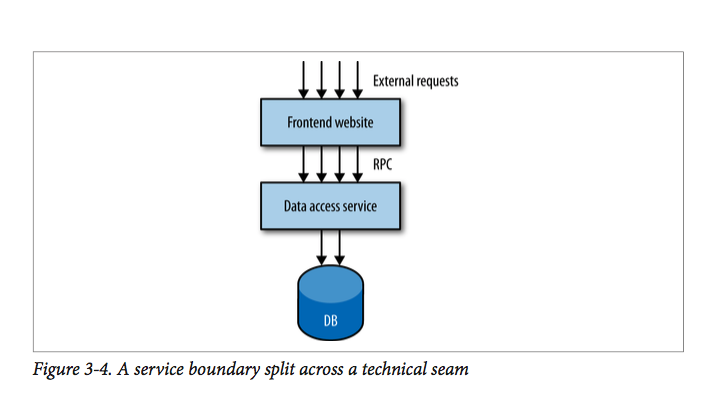

* The DB is effectively a very large, shared API that is also quite brittle. If I want to change the logic associated with, say, how the helpdesk manages customers and this requires a change to the database, I have to be extremely careful that I don’t break parts of the schema used by other services.

* Second, my consumers are tied to a specific technology choice. Perhaps right now it makes sense to store customers in a relational database, so my consumers use an appropriate (potentially DB-specific) driver to talk to it. What if over time we realize we would be better off storing data in a nonrelational database? Can it make that decision? So consumers are intimately tied to the implementation of the customer service.

* Finally, let’s think about behavior for a moment. There is going to be logic associated with how a customer is changed. Where is that logic? If consumers are directly manipulating the DB, then they have to own the associated logic. The logic to per‐ form the same sorts of manipulation to a customer may now be spread among multi‐ ple consumers. If the warehouse, registration UI, and call center UI all need to edit customer information, I need to fix a bug or change the behavior in three different places, and deploy those changes too.

**Note:** One of the most important decisions we can make in terms of how services collaborate. Should communication be synchronous or asynchronous? This funda‐ mental choice inevitably guides us toward certain implementation detail.

* There are two different modes of communication that enable two different idiomatic styles of collaboration: request/response or event-based. With request/response, a cli‐ ent initiates a request and waits for the response.

* With an event-based collaboration, we invert things. Instead of a client initiating requests asking for things to be done, it instead says this thing happened and expects other parties to know what to do. We never tell anyone else what to do. Event-based systems by their nature are asynchronous. The smarts are more evenly distributed— that is, the business logic is not centralized into core brains, but instead pushed out more evenly to the various collaborators.

* Event-based collaboration is also highly decoupled. The client that emits an event doesn’t have any way of knowing who or what will react to it, which also means that you can add new subscribers to these events without the client ever needing to know.

* With orchestration, we rely on a central brain to guide and drive the process, much like the conductor in an orchestra. With choreography, we inform each part of the system of its job, and let it work out the details, like dancers all find‐ ing their way and reacting to others around them in a ballet.

* An orchestration solution would look like for this flow. Here, probably the simplest thing to do would be to have our customer service act as the central brain. On creation, it talks to the loyalty points bank, email service, and postal service.

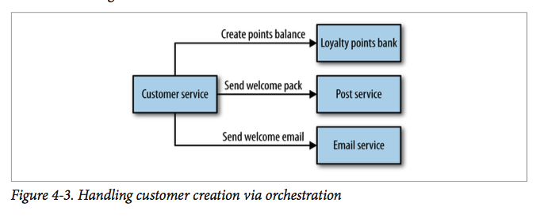

* With a choreographed approach, we could instead just have the customer service emit an event in an asynchronous manner, saying Customer created. The email ser‐ vice, postal service, and loyalty points bank then just subscribe to these events and react accordingly.

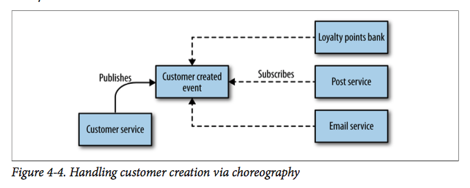

* This means additional work is needed to ensure that you can monitor and track that the right things have happened. For example, would you know if the loyalty points bank had a bug and for some reason didn’t set up the correct account?

* One approach I like for dealing with this is to build a monitoring system that explicitly matches the view of the business process.

* In general, I have found that systems that tend more toward the choreographed approach are more loosely coupled, and are more flexible and amenable to change.

* Remote procedure call refers to the technique of making a local call and having it exe‐ cute on a remote service somewhere.

* Synchronous calls are simpler, and we get to know if things worked straightaway. If we like the semantics of request/ response but are dealing with longer-lived processes, we could just initiate asynchro‐ nous requests and wait for callbacks. On the other hand, asynchronous event collabo‐ ration helps us adopt a choreographed approach, which can yield significantly more decoupled services—something.

* To start with, let’s look at two technologies that fit well when we are considering request/response: remote procedure call (RPC) and REpresentational State Transfer (REST). Remote Procedure Calls Remote procedure call refers to the technique of making a local call and having it exe‐ cute on a remote service somewhere.

**Note:** The first of the fallacies of dis‐ tributed computing is “The network is reliable”. Networks aren’t reliable. They can and will fail, even if your client and the server you are speaking to are fine. They can fail fast, they can fail slow, and they can even malform your packets.

* If the server implementation removes age from its definition of this type, and we don’t do the same to all the consumers, then even though they never used the field, the code associated with deserializing the Customer object on the consumer side will break. To roll out this change, I would have to deploy both a new server and clients at the same time. This is a key challenge with any RPC mechanism.

* Just be aware of some of the potential pitfalls associated with RPC if you’re going to pick this model. Don’t abstract your remote calls to the point where the network is completely hidden, and ensure that you can evolve the server interface without hav‐ ing to insist on lock-step upgrades for clients.

* Make sure your clients aren’t oblivious to the fact that a network call is going to be made. Client libraries are often used in the context of RPC, and if not structured right they can be problematic.

* Compared to database integration, RPC is certainly an improvement when we think about options for request/response collaboration.

* There are many principles and constraints behind the REST style, but we are going to focus on those that really help us when we face integration challenges in a microservi‐ ces world, and when we’re looking for an alternative style to RPC for our service interfaces.

**Note:** Most important is the concept of resources. You can think of a resource as a thing that the service itself knows about, like a Customer. The server creates different repre‐ sentations of this Customer on request. How a resource is shown externally is completely decoupled from how it is stored internally. [Richardson Maturity Model](https://martinfowler.com/articles/richardsonMaturityModel.html)

* HTTP can be used to implement RPC too. SOAP, for example, gets routed over HTTP, but unfortunately uses very little of the specification. Verbs are ignored, as are simple things like HTTP error codes. All too often, it seems, the existing, wellunderstood standards and technology are ignored in favor of new standards that can only be implemented using brand-new technology—conveniently provided by the same companies that help design the new standards in the first place!

* Personally, I am a fan of using links to allow consumers to navigate API endpoints. The benefits of progressive discovery of the API and reduced coupling can be signifi‐ cant.

* We can send pretty much anything over HTTP if we want, even binary. I am seeing more and more people just using HTML as a format instead of XML

* How we decide to store our data, and how we expose it to our consumers, can easily dominate our thinking. One pattern I saw used effectively by one of our teams was to delay the implementation of proper persistence for the microservice, until the interface had stabilized enough. For an interim period, entities were just persisted in a file on local disk, which is obviously not a suitable long-term solution. This ensured that how the consumers wanted to use the service drove the design and implementation decisions.

* Downsides to REST Over HTTP In terms of ease of consumption, you cannot easily generate a client stub for your REST over HTTP application protocol like you can with RPC.

* HTTP, while it can be suited well to large volumes of traffic, isn’t great for low-latency communications when compared to alternative protocols that are built on top of Transmission Control Protocol (TCP) or other networking technology.

**Note:** Despite the name, WebSockets, for example, has very little to do with the Web. After the initial HTTP handshake, it’s just a TCP connection between client and server, but it can be a much more efficient way for you to stream data for a browser. If this is something you’re interested in, note that you aren’t really using much of HTTP, let alone any‐ thing to do with REST.

* For server-to-server communications, if extremely low latency or small message size is important, HTTP communications in general may not be a good idea. You may need to pick different underlying protocols, like User Datagram Protocol (UDP), to achieve the performance you want, and many RPC frameworks will quite happily run on top of networking protocols other than TCP.

* What about event-based, asynchronous communication? Technology Choices There are two main parts we need to consider here: a way for our microservices to emit events, and a way for our consumers to find out those events have happened.

* Traditionally, message brokers like RabbitMQ try to handle both problems. Produc‐ ers use an API to publish an event to the broker. The broker handles subscriptions. 

**Important:** Keep your middleware dumb, and keep the smarts in the endpoints.

* Do be wary, though, about the world of middleware, of which the message broker is just a small part.

* HTTP is not good at low latency (where some message brokers excel), and we still need to deal with the fact that the consumers need to keep track of what messages they have seen and manage their own polling schedule.

* If you already have a good, resilient message broker available to you, consider using it to handle publishing and subscribing to events. But if you don’t already have one, give ATOM a look, but be aware of the sunk-cost fallacy.

* In terms of what we actually send over these asynchronous protocols, the same con‐ siderations apply as with synchronous communication. If you are currently happy with encoding requests and responses using JSON, stick with it.

> Eventually, we tracked down the problem. A bug had crept in whereby a certain type of pricing request would cause a worker to crash. We were using a transacted queue: as the worker died, its lock on the request timed out, and the pricing request was put back on the queue—only for another worker to pick it up and die. This was a classic example of what Martin Fowler calls a catastrophic failover. Aside from the bug itself, we’d failed to specify a maximum retry limit for the job on the queue. We fixed the bug itself, and also configured a maximum retry. But we also realized we needed a way to view, and potentially replay, these bad messages. We ended up having to implement a message hospital (or dead letter queue), where mes‐ sages got sent if they failed.

* The associated complexity with event-driven architectures and asynchronous pro‐ gramming in general leads me to believe that you should be cautious in how eagerly you start adopting these ideas. Ensure you have good monitoring in place, and strongly consider the use of correlation IDs, which allow you to trace requests across process boundaries.

* The service as a state machine is powerful. We’ve spoken before (probably ad nauseum by this point) about our services being fash‐ ioned around bounded contexts. Our customer microservice owns all logic associated with behavior in this context.

**Note:** We want to avoid dumb, anemic services that are little more than CRUD wrappers.

* If the decision about what changes are allowed to be made to a cus‐ tomer leak out of the customer service itself, we are losing cohesion.

* Rx inverts traditional flows. Rather than asking for some data, then performing operations on it, you observe the outcome of an operation (or set of operations) and react when something changes. As you find yourself making more service calls, especailly when making multiple calls to perform a single operation, take a look at the reactive extensions for your chosen technology stack. You may be surprised how much simpler your life can become.

* Having lots of lines of code that do the same thing makes your codebase larger than needed, and therefore harder to reason about.

* When you want to change behavior, and that behavior is duplicated in many parts of your system, it is easy to forget everywhere you need to make a change, which can lead to bugs.

* DRY is what leads us to create code that can be reused. We pull duplicated code into abstractions that we can then call from multiple places. Perhaps we go as far as mak‐ ing a shared library that we can use everywhere!

* One of the things we want to avoid at all costs is overly coupling a microservice and consumers such that any small change to the microservice itself can cause unneces‐ sary changes to the consumer. Sometimes, however, the use of shared code can create this very coupling.

* If your use of shared code ever leaks outside your service boundary, you have intro‐ duced a potential form of coupling. Using common code like logging libraries is fine, as they are internal concepts that are invisible to the outside world.

* My general rule of thumb: don’t violate DRY within a microservice, but be relaxed about violating DRY across all services.

* The evils of too much coupling between serv‐ ices are far worse than the problems caused by code duplication.

* A model for client libraries I like is the one for Amazon Web Services (AWS). The underlying SOAP or REST web service calls can be made directly, but everyone ends up using just one of the various software development kits (SDKs) that exist, which provide abstractions over the underlying API.

* One consideration I want to touch on is how we pass around information about our domain entities. We need to embrace the idea that a microservice will encompass the lifecycle of our core domain entities, like the Customer.

* When we retrieve a given Customer resource from the customer service, we get to see what that resource looked like when we made the request.

* So whether you decide to pass around a memory of what an entity once looked like, make sure you also include a reference to the original resource so that the new state can be retrieved.

* Let’s consider the example where we ask the email service to send an email when an order has been shipped. Now we could send in the request to the email service with the customer’s email address, name, and order details. However, if the email service is actually queuing up these requests, or pulling them from a queue, things could change in the meantime. It might make more sense to just send a URI for the Customer and Order resources, and let the email server go look them up when it is time to send the email.

* Great counterpoint to this emerges when we consider event-based collaboration. With events, we’re saying this happened, but we need to know what happened. If we’re receiving updates due to a Customer resource changing, for example, it could be val‐ uable to us to know what the Customer looked like when the event occurred. As long as we also get a reference to the entity itself so we can look up its current state, then we can get the best of both worlds.

* There are other trade-offs to be made here, of course, when we’re accessing by refer‐ ence. If we always go to the customer service to look at the information associated with a given Customer, the load on the customer service can be too great. If we pro‐ vide additional information when the resource is retrieved, letting us know at what time the resource was in the given state and perhaps how long we can consider this information to be fresh, then we can do a lot with caching to reduce load.

**Note:** Defer It for as Long as Possible The best way to reduce the impact of making breaking changes is to avoid making them in the first place.

* Database integration is a great example of technology that can make it very hard to avoid breaking changes. REST, on the other hand, helps because changes to internal implementation detail are less likely to result in a change to the service interface.

*“Be conservative in what you do, be liberal in what you accept from others.”*

* “Be conservative in what you do, be liberal in what you accept from others.” The orig‐ inal context for this piece of wisdom was the interaction of devices over networks, where you should expect all sorts of odd things to happen. In the context of our request/response interaction, it can lead us to try our best to allow the service being consumed to change without requiring us to change.

* **Semantic Versioning:** Wouldn’t it be great if as a client you could look just at the version number of a ser‐ vice and know if you can integrate with it? Semantic versioning is a specification that allows just that. With semantic versioning, each version number is in the form MAJOR.MINOR.PATCH. When the MAJOR number increments, it means that backward incompatible changes have been made. When MINOR increments, new functionality has been added that should be backward compatible. Finally, a change to PATCH states that bug fixes have been made to existing functionality.

* **Coexist Different Endpoints:** If we’ve done all we can to avoid introducing a breaking interface change, our next job is to limit the impact. The thing we want to avoid is forcing consumers to upgrade in lock-step with us, as we always want to maintain the ability to release microservi‐ ces independently of each other. One approach I have used successfully to handle this is to coexist both the old and new interfaces in the same running service. So if we want to release a breaking change, we deploy a new version of the service that exposes both the old and new versions of the endpoint.

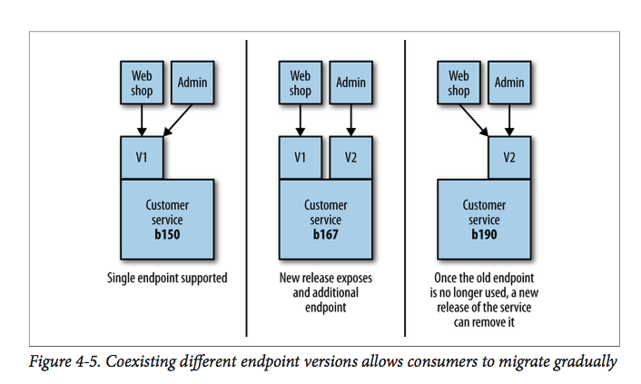

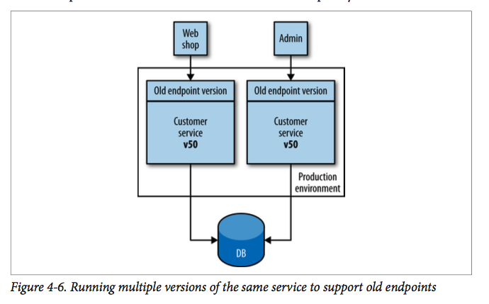

* Keeping all the code around and the associated testing required to ensure they all worked was absolutely an additional burden. To make this more manageable, we internally transformed all requests to the V1 end‐ point to a V2 request, and then V2 requests to the V3 endpoint. This meant we could clearly delineate what code was going to be retired when the old endpoint(s) died. This is in effect an example of the expand and **contract pattern.** For systems making use of HTTP, I have seen this done with both version numbers in request headers and also in the URI itself—for example, /v1/ customer/ or /v2/customer/.

* Coexisting concurrent service versions for a short period of time can make perfect sense, especially when you’re doing things like blue/green deployments or canary releases.

* We started thinking of our UIs as being thin instead, with more logic on the server side. In the beginning, our server-side programs rendered the entire page and sent it to the client browser, which did very little. Any interactions were handled on the server side, via GETs and POSTs triggered by the user clicking on links or filling in forms. Over time, JavaScript became a more popular option to add dynamic behavior to the browser-based UI, and some applications could now be argued to be as fat as the old desktop clients.

* Assuming that our services already speak XML or JSON to each other via HTTP, an obvious option available to us is to have our user interface interact directly with these APIs, as in Figure 4-7.

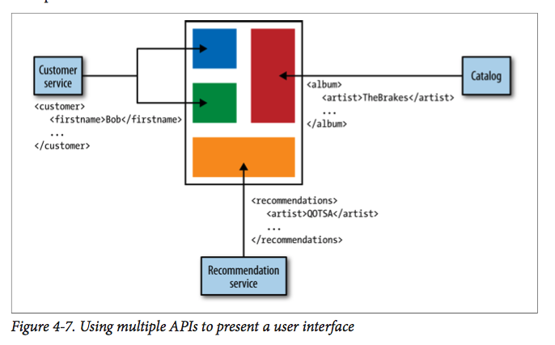

* Rather than having our UI make API calls and map everything back to UI controls, we could have our services provide parts of the UI directly, and then just pull these fragments in to create a UI.

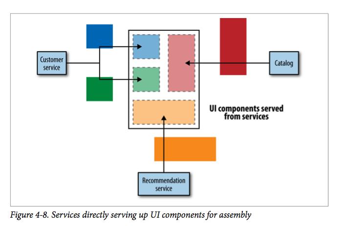

* These coarser-grained fragments are served up from server-side apps that are in turn making the appropriate API calls. This model works best when the fragments align well to team ownership. For example, perhaps the team that looks after order man‐ agement in the music shop serves up all the pages associated with order management.

* Backends for Frontends A common solution to the problem of chatty interfaces with backend services, or the need to vary content for different types of devices, is to have a server-side aggregation endpoint, or API gateway. This can marshal multiple backend calls, vary and aggre‐ gate content if needed for different devices, and serve it up, as we see in Figure 4-9. I’ve seen this approach lead to disaster when these server-side endpoints become thick layers with too much behavior.

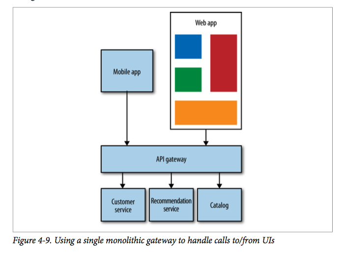

* Figure 4-9. Using a single monolithic gateway to handle calls to/from UIs The problem that can occur is that normally we’ll have one giant layer for all our services. This leads to everything being thrown in together, and suddenly we start to lose isolation of our various user interfaces, limiting our ability to release them inde‐ pendently. A model I prefer and that I’ve seen work well is to restrict the use of these backends to one specific user interface or application, as we see in Figure 4-10.

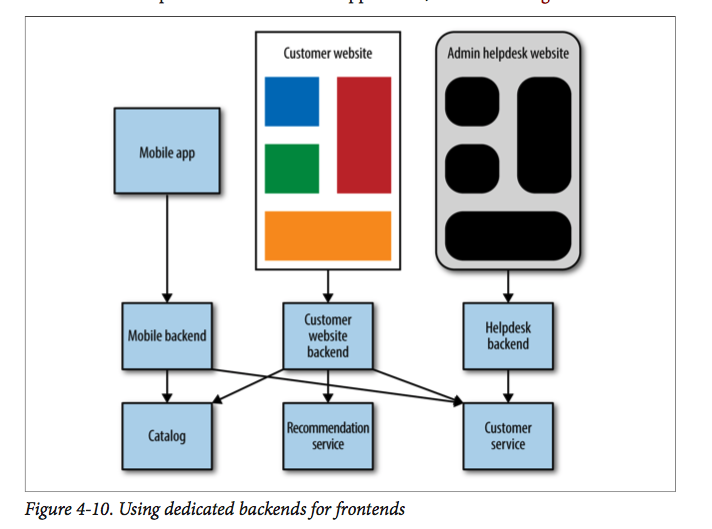

* This pattern is sometimes referred to as backends for frontends (BFFs). It allows the team focusing on any given UI to also handle its own server-side components.

* A Hybrid Approach Many of the aforementioned options don’t need to be one-size-fits-all. I could see an organization adopting the approach of fragment-based assembly to create a website, but using a backends-for-frontends approach when it comes to its mobile application.

* Avoiding the trap of putting too much behavior into any intermediate layers is a tricky balancing act.

* My clients often struggle with the question “Should I build, or should I buy?” In gen‐ eral, the advice I and my colleagues give when having this conversation with the aver‐ age enterprise organization boils down to **“Build if it is unique to what you do, and can be considered a strategic asset; buy if your use of the tool isn’t that special.”** For example, the average organization would not consider its payroll system to be a strategic asset.

* I was involved early on in rebuilding the Guardian’s website, and there the decision was made to build a bespoke content management system, as it was core to the newspaper’s business.

## Splitting the Monolith

* When it comes to microservices, rather than having a single monolithic application intercepting all calls to the existing legacy system, you may instead use a series of microservices to perform this interception. Capturing and redirecting the original calls can become more complex in this situation, and you may require the use of a proxy to do this for you.

* In his book Working Effectively with Legacy Code (Prentice-Hall), Michael Feathers defines the concept of a seam—that is, a portion of the code that can be treated in isolation and worked on without impacting the rest of the codebase. We also want to identify seams.

* But rather than finding them for the purpose of cleaning up our code‐ base, we want to identify seams that can become service boundaries.

* So what makes a good seam? Well, as we discussed previously, bounded contexts make excellent seams, because by definition they represent cohesive and yet loosely coupled boundaries in an organization. So the first step is to start identifying these boundaries in our code.

* Breaking Apart MusicCorp Imagine we have a large backend monolithic service that represents a substantial amount of the behavior of MusicCorp’s online systems.

* Let’s imagine that initially we identify four contexts we think our monolithic backend covers: Catalog Everything to do with metadata about the items we offer for sale Finance Reporting for accounts, payments, refunds, etc. Warehouse Dispatching and returning of customer orders, managing inventory levels, etc. Recommendation Our patent-pending, revolutionary recommendation system, which is highly complex code written by a team with more PhDs than the average science lab.

* The first thing to do is to create packages representing these contexts, and then move the existing code into them.

* If we spot things that look wrong—for example, the warehouse package depends on code in the finance package when no such dependency exists in the real organization—then we can investigate this problem and try to resolve it.

* You may not need to sort all code into domain-oriented packages before splitting out your first service, and indeed it can be more valuable to concentrate your effort in one place. **There is no need for this to be a big-bang approach.**

* Think of our monolith as a block of marble. We could blow the whole thing up, but that rarely ends well. It makes much more sense to just chip away at it incrementally. When you’ve identified a couple of seams to separate is how entangled that code is with the rest of the system. We want to pull out the seam that is least depended on if we can.

* We need to find seams in our databases too so we can split them out cleanly. Databases, however, are tricky beasts.

* The first step is to take a look at the code itself and see which parts of it read to and write from the database. A common practice is to have a repository layer. 

* If you have been fol‐ lowing along so far, you’ll have grouped our code into packages representing our bounded contexts; we want to do the same for our database access code. To see these database-level constraints, which may be a stumbling block, we need to use another tool to visualize the data. A great place to start is to use a tool like the freely available SchemaSpy, which can gen‐ erate graphical representations of the relationships between tables.

Figure 5-2. Foreign key relationship

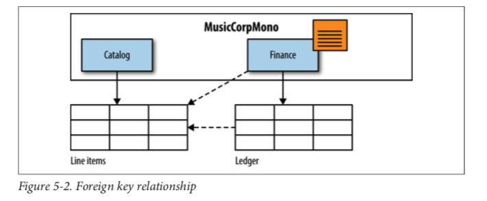

* First, we need to stop the finance code from reaching into the line item table, as this table really belongs to the catalog code, and we don’t want database integration happening once catalog and finance are services in their own rights. The quickest way to address this is rather than having the code in finance reach into the line item table, we’ll expose the data via an API call in the catalog package that the finance code can call.

* At this point it becomes clear that we may well end up having to make two database calls to generate the report. This is correct. And the same thing will happen if these are two separate services. Typically concerns around performance are now raised. I have a fairly easy answer to those: how fast does your system need to be?

* **Example: Shared Static Data** I have seen perhaps as many country codes stored in databases. A second option is to instead treat this shared, static data as code. Perhaps it could be in a property file deployed as part of the service, or perhaps just as an enumeration. The problems around the consistency of data remain, although experience has shown that it is far easier to push out changes to configuration files than alter live database tables. Personally, in most situations I’d try to push for keeping this data in configuration files or directly in code.

[Split](./images/service-separation.png)

* Transactions are useful things. They allow us to say these events either all happen together, or none of them happen. They are very useful when we’re inserting data into a database; they let us update multiple tables at once, knowing that if anything fails, everything gets rolled back, ensuring our data doesn’t get into an inconsistent state.

* But what happens if our compensating transaction fails? It’s certainly possible. Then we’d have an order in the order table with no matching pick instruction. In this situa‐ tion, you’d either need to retry the compensating transaction, or allow some backend process to clean up the inconsistency later on.

* An alternative to manually orchestrating compensating transactions is to use a dis‐ tributed transaction. Distributed transactions try to span multiple transactions within them, using some overall governing process called a transaction manager to orches‐ trate the various transactions being done by underlying systems.

* The most common algorithm for handling distributed transactions—especially shortlived transactions, as in the case of handling our customer order—is to use a twophase commit.

* This is where each participant (also called a cohort in this context) in the distributed transaction tells the transaction manager whether it thinks its local transaction can go ahead.

* This approach relies on all parties halting until the central coordinating process tells them to proceed. This means we are vulnerable to outages. If the transaction manager goes down, the pending transactions never complete. This coordination process also mean locks; that is, pending transactions can hold locks on resources.

**Note:** you do encounter state that really, really wants to be kept consistent, do everything you can to avoid splitting it up in the first place. Try really hard. If you really need to go ahead with the split, think about moving from a purely technical view of the pro‐ cess (e.g., a database transaction) and actually create a concrete concept to represent the transaction itself.

* In a standard, monolithic service architecture, all our data is stored in one big data‐ base. This means all the data is in one place, so reporting across all the information is actually pretty easy, as we can simply join across the data via SQL queries or the like. Typically we won’t run these reports on the main database for fear of the load gener‐ ated by our queries impacting the performance of the main system, so often these reporting systems hang on a read replica.

Figure 5-12. Standard read replication

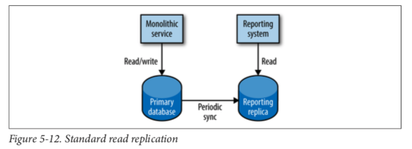

* First, the schema of the database is now effectively a shared API between the running monolithic services and any reporting system.

* Now if our information is stored in multiple different systems, what do we do? Is there a way for us to bring all the data together to run our reports?

* **Data Retrieval:** via Service Calls There are many variants of this model, but they all rely on pulling the required data from the source systems via API calls. For a very simple reporting system, like a dash‐ board that might just want to show the number of orders placed in the last 15 minutes.

* To report across data from two or more systems, you need to make multiple calls to assemble this data.

* The calling system would POST a BatchRequest, perhaps passing in a location where a file can be placed with all the data. The customer service would return an HTTP 202 response code, indicating that the request was accepted but has not yet been processed. The calling system could then poll the resource waiting until it retrieves a 201 Created status, indicating that the request has been fulfilled, and then the calling system could go and fetch the data.

* This would allow potentially large data files to be exported without the overhead of being sent over HTTP; instead, the system could simply save a CSV file to a shared location.

* **Data Pumps** Rather than have the reporting system pull the data, we could instead have the data pushed to the reporting system. One of the downsides of retrieving the data by stan‐ dard HTTP calls is the overhead of HTTP when we’re making a large number of calls. In Chapter 4, we touched on the idea of microservices emitting events based on the state change of entities that they manage. For example, our customer service may emit an event when a given customer is created, or updated, or deleted. For those microservices that expose such event feeds, we have the option of writing our own event subscriber that pumps data into the reporting database. The coupling on the underlying database of the source microservice is now avoided. Instead, we are just binding to the events emitted by the service, which are designed to be exposed to external consumers.

* We have dashboards, alerting, financial reports, user analytics—all of these use cases have different tolerances for accuracy and timeliness, which may result in different technical options coming to bear.

> There are many reasons why, throughout the book, I promote the need to make small, incremental changes. This allows us to better miti‐ gate the cost of mistakes, but doesn’t remove the chance of mistakes entirely. **We can—and will—make mistakes, and we should embrace that.**

* As we have seen, the cost involved in moving code around within a codebase is pretty small. We have lots of tools that support us, and if we cause a problem, the fix is gen‐ erally quick. Splitting apart a database, however, is much more work, and rolling back a database change is just as complex.

* Likewise, untangling an overly coupled integra‐ tion between services, or having to completely rewrite an API that is used by multiple consumers, can be a sizeable undertaking.

## Deployments

> Do you see two services that are overly chatty, which might indicate they should be one thing? The first thing to understand is that growing a service to the point that it needs to be split is completely OK. We want the architecture of our system to change over time in an incremental fashion. The key is knowing it needs to be split before the split becomes too expensive.

* Microservices, with their interdependence, are a different kettle of fish altogether. If you don’t approach deployment right, it’s one of those areas where the complexity can make your life a misery.

* With CI, the core goal is to keep everyone in sync with each other, which we achieve by making sure that newly checked-in code properly integrates with existing code. To do this, a CI server detects that the code has been committed, checks it out, and car‐ ries out some verification like making sure the code compiles and that tests pass.

**I really like Jez Humble’s three questions he asks people to test if they really under‐ stand what CI is about:**

1) **Do you check in to mainline once per day?** 
- You need to make sure your code integrates.

2) **Do you have a suite of tests to validate your changes?** 
- Without tests, we just know that syntactically our integration has worked.

3) **When the build is broken, is it the #1 priority of the team to fix it?**
A passing green build means our changes have safely been integrated. A passing green build means our changes have safely been integrated. A red build means the last change possibly did not integrate. You need to stop all further check-ins that aren’t involved in fixing the builds to get it passing again. If you let more changes pile up, the time it takes to fix the build will increase drastically.

**Note:** Lock-step releases, where you don’t mind deploying multiple services at once. In general, this is abso‐ lutely a pattern to avoid, but very early on in a project, especially if only one team is working on everything, this might make sense for short periods of time.

* The approach I prefer is to have a single CI build per microservice, to allow us to quickly make and validate a change prior to deployment into production, as shown in Figure 6-3. Here each microservice has its own source code repository, mapped to its own CI build. When making a change, I run only the build and tests I need.

* The tests for a given microservice should live in source control with the microservi‐ ce’s source code too, to ensure we always know what tests should be run against a given service.

* To get fast feed‐ back when our fast tests fail if we’re waiting for our long-scoped slow tests to finally finish. And if the fast tests fail, there probably isn’t much sense in running the slower tests anyway! A solution to this problem is to have different stages in our build, creat‐ ing what is known as a build pipeline. One stage for the faster tests, one for the slower tests.

* Continuous delivery (CD) builds on this concept, and then some. As outlined in Jez Humble and Dave Farley’s book of the same name, continuous delivery is the approach whereby we get constant feedback on the production readiness of each and every check-in, and furthermore treat each and every check-in as a release candidate. Figure 6-4. A standard release process modeled as a build pipeline

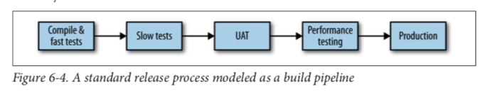 

* By modeling the entire path to production for our software, we greatly improve visi‐ bility of the quality of our software, and can also greatly reduce the time taken between releases, as we have one place to observe our build and release process, and an obvious focal point for introducing improvements.

* In a microservices world, where we want to ensure we can release our services inde‐ pendently of each other, it follows that as with CI, we’ll want one pipeline per service.

* When a team is starting out with a new project, especially a greenfield one where they are working with a blank sheet of paper, it is quite likely that there will be a large amount of churn in terms of working out where the service boundaries lie. This is a good reason, in fact, for keeping your initial services on the larger side until your understanding of the domain stabilizes.

* Packer is a tool designed to make creation of images much easier. Using configuration scripts of your choice (Chef, Ansible, Puppet, and more are supported), it allows us to create images for different platforms from the same configuration. At the time of writing, it has support for VMWare, AWS, Rackspace Cloud, Digital Ocean, and Vagrant, and I’ve seen teams use it successfully for building Linux and Windows images. This means you could create an image for deployment on your production AWS environment and a matching Vagrant image for local development and test

* **Immutable Servers:** By storing all our configuration in source control, we are trying to ensure that we can automatically reproduce services and hopefully entire environments at will.

* **Environments:** As our software moves through our CD pipeline stages, it will also be deployed into different types of environments. One environment where we run our slow tests, another for UAT, another for performance, and a final one for production.

* You move from your laptop to build server to UAT environment all the way to production, you’ll want to ensure that your environments are more and more production-like to catch any problems associated with these environmental differ‐ ences sooner.

* Remember the concept of continuous delivery. We want to create an artifact that represents our release candi‐ date, and move it through our pipeline, confirming that it is good enough to go into production.

> Gilt’s monolithic Rails application was starting to become difficult to scale, and the company decided in 2009 to start decomposing the system into microservices. Again automation, especially tooling to help developers, was given as a key reason to drive Gilt’s explosion in the use of microservices. A year later, Gilt had around 10 microservices live; by 2012, over 100; and in 2014, over 450 microservices by Gilt’s own count

**Note:** After many years of working in this space, I am convinced that the most sensible way to trigger any deployment is via a single, parameterizable command-line call. This can be triggered by scripts, launched by your CI tool, or typed in by hand.

## Testing

* Tests can be important to support refactoring of code, allowing us to restructure our code as we go, knowing that our small-scoped tests will catch us if we make a mistake.

* **Unit tests:** These are tests that typically test a single function or method call. The tests generated as a side effect of test-driven design (TDD) will fall into this category, as do the sorts of tests generated by techniques such as property-based testing. We’re not launching services here, and are limiting the use of external files or network connections. In general, you want a large number of these sorts of tests. Done right, they are very, very fast, and on modern hardware you could expect to run many thousands of these in less than a minute.

Figure 7-4. Scope of unit tests on our example system

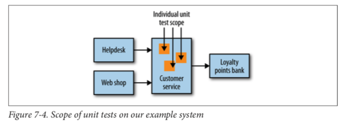

* For a system comprising a number of services, a service test would test an individual service’s capabilities.

* For a system comprising a number of services, a service test would test an individual service’s capabilities. The reason we want to test a single service by itself is to improve the isolation of the test to make finding and fixing problems faster. To achieve this isolation, we need to stub out all external collaborators so only the service itself is in scope, as Figure 7-5 shows.

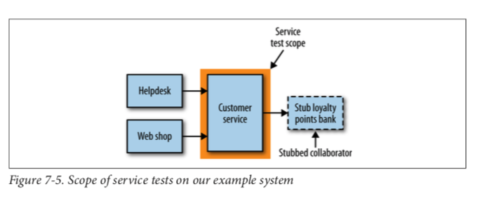

* **Service tests** are designed to bypass the user interface and test services directly. In a monolithic application, we might just be testing a collection of classes that provide a service to the UI. For a system comprising a number of services, a service test would test an individual service’s capabilities. The reason we want to test a single service by itself is to improve the isolation of the test to make finding and fixing problems faster. To achieve this isolation, we need to stub out all external collaborators so only the service itself is in scope, as Figure 7-5 shows.

* Some of these tests could be as fast as small tests, but if you decide to test against a real database, or go over networks to stubbed downstream collaborators, test times can increase.

* **End-to-end tests** are tests run against your entire system. Often they will be driving a GUI through a browser, but could easily be mimicking other sorts of user interaction, like uploading a file.

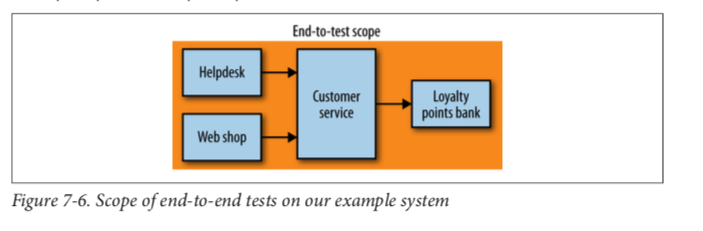

* When you’re reading the pyramid, the key thing to take away is that as you go up the pyramid, the test scope increases, as does our confidence that the functionality being tested works. On the other hand, the feedback cycle time increases as the tests take longer to run, and when a test fails it can be harder to determine which functionality has broken. As you go down the pyramid, in general the tests become much faster, so we get much faster feedback cycles.

* I worked on one monolithic system, for example, where we had 4,000 unit tests, 1,000 service tests, and 60 end-to-end tests. We decided that from a feedback point of view we had way too many service and end-to-end tests (the latter of which were the worst offenders in impacting feedback loops), so we worked hard to replace the test cover‐ age with smaller-scoped tests.

* A common anti-pattern is what is often referred to as a test snow cone, or inverted pyramid. Here, there are little to no small-scoped tests, with all the coverage in largescoped tests. These projects often have glacially slow test runs, and very long feed‐ back cycles. If these tests are run as part of continuous integration, you won’t get many builds, and the nature of the build times means that the build can stay broken for a long period when something does break.

* Our service tests want to test a slice of functionality across the whole service, but to isolate ourselves from other services we need to find some way to stub out all of our collaborators. We would want to stub out any downstream services. Our service test suite needs to launch stub services for any downstream collaborators (or ensure they are running), and configure the service under test to connect to the stub services. We then need to configure the stubs to send responses back to mimic the real-world services. For example, we might configure the stub for the loyalty points bank to return known points balances for certain customers. When I talk about stubbing downstream collaborators, I mean that we create a stub service that responds with canned responses to known requests from the service under test. For example, I might tell my stub points bank that when asked for the bal‐ ance of customer 123, it should return 15,000. The test doesn’t care if the stub is called 0, 1, or 100 times.

* When using a mock, I actually go further and make sure the call was made. If the expected call is not made, the test fails. Implementing this approach requires more smarts in the fake collaborators that we create, and if overused can cause tests to become brittle.

* Sometimes, though, mocks can be very useful to ensure that the expected side effects happen. For example, I might want to check that when I create a customer, a new points balance is set up for that customer. The balance between stubbing and mock‐ ing calls is a delicate one, and is just as fraught in service tests as in unit tests. In gen‐ eral, though, I use stubs far more than mocks for service tests.

* [Mountebank](https://github.com/bbyars/mountebank) as a small software appliance that is programmable via HTTP. The fact that it happens to be written in NodeJS is completely opaque to any calling service. When it launches, you send it commands telling it what port to stub on, what protocol to handle (currently TCP, HTTP, and HTTPS are supported, with more planned), and what responses it should send when requests are sent.

* So, if we want to run our service tests for just our customer service we can launch the customer service, and a Mountebank instance that acts as our loyalty points bank. And if those tests pass, I can deploy the customer service straightaway!

* To implement an end-to-end test we need to deploy multiple services together, then run a test against all of them. Obviously, this test has much more scope, result‐ ing in more confidence that our system works! On the other hand, these tests are lia‐ ble to be slower and make it harder to diagnose failure.

* The more moving parts, the more brittle our tests may be, and the less deterministic they are. If you have tests that sometimes fail, but everyone just re-runs them because they may pass again later, then you have flaky tests. **When we detect flaky tests, it is essential that we do our best to remove them. Other‐ wise, we start to lose faith in a test suite that “always fails like that.”** The idea that over time we can become so accustomed to things being wrong that we start to accept them as being normal and not a problem.

* Sometimes organizations react by having a dedicated team write these tests. This can be disastrous. The team developing the software becomes increasingly distant from the tests for its code. Cycle times increase, as service owners end up waiting for the test team to write end-to-end tests for the functionality they just wrote. Although it is unfortunately still a common organizational pattern, I see significant harm done whenever a team is distanced from writing tests for the code it wrote in the first place.

**Note:** Understanding what needs to be tested and actively removing tests that are no longer needed. 

* The larger the scope of a deployment and the higher the risk of a release, the more likely we are to break something. A key driver to ensuring we can release our soft‐ ware frequently is based on the idea that we release small changes as soon as they are ready.

* There are, unfortunately, many disadvantages to end-to-end testing. End-to-end tests have a large number of disadvantages that grow significantly as you add more moving parts under test. From speaking to people who have been implementing microservices at scale for a while now, I have learned that most of them over time remove the need entirely for end-toend tests in favor of tools like CDCs (consumer-driven-contact) and improved monitoring.

* Consumer Driven Contract approach is nothing more than an agreement between the Consumer and Provider about the format of data that they transfer between each other. Normally, the format of the contract is defined by the Consumer and shared with the corresponding Provider. Afterwards, tests are being implemented in order to verify that the contract is being kept. One of the prerequisites of CDC Testing is the possibility to have a good, at best case close communication with the Provider service team (for example when you are the owner of the Consumer and Provider). Sharing those contracts and communication on test results is important part of implementing proper CDC tests. [Source](https://blog.novatec-gmbh.de/introduction-microservices-testing-consumer-driven-contract-testing-pact/)

* With blue/green, we have two copies of our software deployed at a time, but only one version of it is receiving real requests.

* In production, we have v123 of the customer service live. We want to deploy a new version, v456. We deploy this alongside v123, but do not direct any traffic to it. Instead, we perform some testing in siut against the newly deployed version. Once the tests have worked, we direct the production load to the new v456 version of the customer service. It is common to keep the old version around for a short period of time, allowing for a fast fallback if you detect any errors.

* Using blue/green deployments allows you to reduce the risk of deployment, as well as gives you the chance to revert should you encounter a problem.

* With canary releasing, we are verifying our newly deployed software by directing amounts of production traffic against the system to see if it performs as expected. “Performing as expected” can cover a number of things, both functional and non‐ functional.

* If the new release is bad, you get to revert quickly. If it is good, you can push increas‐ ing amounts of traffic through the new version. Canary releasing differs from blue/ green in that you can expect versions to coexist for longer, and you’ll often vary the amounts of traffic. Netflix uses this approach extensively.

* If you are trying to work out if anyone will actually use your software, it may make much more sense to get something out now, to prove the idea or the business model before building robust software. In an environment where this is the case, testing may be overkill, as the impact of not knowing if your idea works is much higher than having a defect in pro‐ duction. In these situations, it can be quite sensible to avoid testing prior to produc‐ tion altogether.

* **Performance tests** are worth calling out explicitly as a way of ensuring that some of our cross-functional requirements can be met. When decomposing systems into smaller microservices, we increase the number of calls that will be made across net‐ work boundaries. Where previously an operation might have involved one database call, it may now involve three or four calls across network boundaries to other serv‐ ices, with a matching number of database calls. All of this can decrease the speed at which our systems operate. Tracking down sources of latency is especially important. When you have a call chain of multiple synchronous calls, if any part of the chain starts acting slowly, everything is affected, potentially leading to a significant impact. This makes having some way to performance test your applications even more important than it might be with a more monolithic system.

* Due to the time it takes to run performance tests, it isn’t always feasible to run them on every check-in. It is a common practice to run a subset every day, and a larger set every week.

* Make sure you run them as regularly as you can. The longer you go without running performance tests, the harder it can be to track down the culprit. Performance problems are especially difficult to resolve, so if you can reduce the number of commits you need to look at in order to see a newly introduced problem, your life will be much easier.

* Having a single point of failure also makes failure investigation somewhat simpler!

## Monitoring

* The capabilities we offer our users are served from multiple small services, some of which communicate with yet more services to accomplish their tasks.

* We now have multiple servers to monitor, multiple logfiles to sift through, and multi‐ ple places where network latency could cause problems.

* The answer here is pretty straightforward: monitor the small things, and use aggrega‐ tion to see the bigger picture.

* At a bare minimum, moni‐ toring the response time of the service is a good idea.

* We’re looking to use specialized subsystems to grab our logs and make them available centrally. One example of this is logstash, which can parse multiple logfile formats and can send them to downstream systems for further investigation. Kibana is an ElasticSearch-backed system for viewing logs, illustrated in Figure 8-4. You can use a query syntax to search through logs, allowing you to do things like restrict time and date ranges or use regular expressions to find matching strings.

* Our website is seeing nearly 50 4XX HTTP error codes per second. Is that bad? The CPU load on the cata‐ log service has increased by 20% since lunch; has something gone wrong? The secret to knowing when to panic and when to relax is to gather metrics about how your sys‐ tem behaves over a long-enough period of time that clear patterns emerge.

* Graphite is one such system that makes this very easy. It exposes a very simple API and allows you to send metrics in real time. It then allows you to query those metrics to produce charts and other displays to see what is happening.

* I would strongly suggest having your services expose basic metrics themselves. At a bare minimum, for a web service you should probably expose metrics like response times and error rates. For example, our accounts service may want to expose the number of times customers view their past orders, or your web shop might want to capture how much money has been made during the last day.

> There is an old adage that 80% of software features are never used. Now I can’t comment on how accurate that figure is, but as someone who has been developing software for nearly 20 years, I know that I have spent a lot of time on features that never actually get used.

* A friend told me a story about an ecommerce company that accidentally ran its tests against its production ordering systems. It didn’t realize its mistake until a large num‐ ber of washing machines arrived at the head office. 

* Correlation IDs With a large number of services interacting to provide any given end-user capability, a single initiating call can end up generating multiple more downstream service calls.

* One approach that can be useful here is to use correlation IDs. When the first call is made, you generate a GUID for the call. This is then passed along to all subsequent calls, as seen in Figure 8-5, and can be put into your logs in a structured way, much as you’ll already do with components like the log level or date.

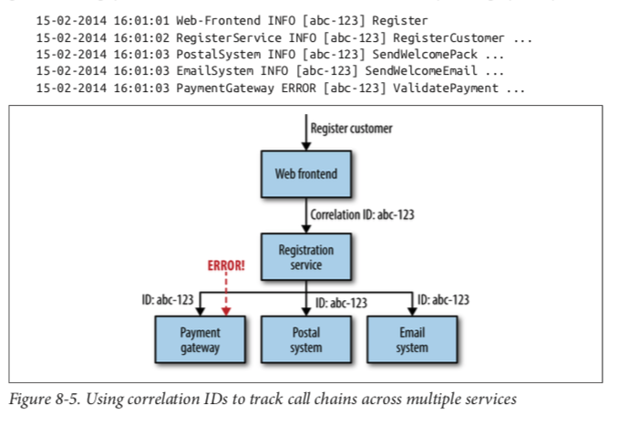

* Software such as Zipkin can also trace calls across multiple system boundaries. Based on the ideas from Google’s own tracing system, Dapper, Zipkin can provide very detailed tracing of interservice calls, along with a UI to help present the data.

* Needing to handle tasks like consistently passing through correlation IDs can be a strong argument for the use of thin shared client wrapper libraries. **You are using HTTP as the underlying protocol for communica‐ tion, just wrap a standard HTTP client library, adding in code to make sure you propogate the correlation IDs in the headers.**

* Monitoring the integration points between systems is key. Each service instance should track and expose the health of its downstream dependencies, from the database to other collaborating services.

* You should try to write your logs out in a standard format. You definitely want to have all your metrics in one place, and you may want to have a list of standard names for your metrics too;

* One of the ongoing balancing acts you’ll need to pull off is where to allow for decisions to be made narrowly for a single service versus where you need to standardize across your system. In my opinion, monitoring is one area where standardization is incredibly important.

* Historically, the idea that we can find out about key business metrics a day or two later was fine, as typically we were unable to react fast enough to this data to do any‐ thing about it anyway. Now, though, we operate in a world in which many of us can and do push out multiple releases per day. Teams now measure themselves not in terms of how many points they complete, but instead optimize for how long it takes for code to get from laptop to live.

> So, if we can unify the systems we use to gather, aggregate, and store these events, and make them available for reporting, we end up with a much simpler architecture.

* Suro is Netflix’s data pipeline and oper‐ ates in a similar space. Suro is explicitly used to handle both metrics associated with user behavior, and more operational data like application logs. This data can then be dispatched to a variety of systems, like Storm for real-time analysis, Hadoop for off‐ line batch processing, or Kibana for log analysis.

* Monitoring is moving: away from systems specialized to do just one thing, and toward generic event processing systems that allow you to look at your system in a more holistic way.

## Security

* We need to think about what protection our data needs while in transit from one point to another, and what protection it needs at rest.

* The terms used here are from SAML. When a principal tries to access a resource (like a web-based interface), she is direc‐ ted to authenticate with an identity provider. This may ask her to provide a username and password, or might use something more advanced like two-factor authentication. Once the identity provider is satisfied that the principal has been authenticated, it gives information to the service provider, allowing it to decide whether to grant her access to the resource.

* OpenID Connect is a standard that has emerged as a specific implementation of OAuth 2.0, based on the way Google and others handle SSO. It uses simpler REST calls, and in my opinion is likely to make inroads into enterprises due to its improved ease of use. Its biggest stumbling block right now is the lack of identity providers that support it.

* This identity provider could be an externally hosted system, or something inside your own organization. Google, for example, provides an OpenID Connect identity pro‐ vider. (Cognito is identity provider and federated identites are giving IAM permissions to principals to access specific resources. The permissions can be also given to principals that are not authorizer, means no identity / password etc.)

* Data lying about is a liability, especially if it is sensitive. Hopefully we’ve done every‐ thing we can to ensure attackers cannot breach our network, and also that they can‐ not breach our applications or operating systems to get access to the underlying close up

* The easiest way you can mess up data encryption is to try to implement your own encryption algorithms, or even try to implement someone else’s. Whatever program‐ ming language you use, you’ll have access to reviewed, regularly patched implementa‐ tions of well-regarded encryption algorithms. Use those!

* For encryption at rest, unless you have a very good reason for picking something else, pick a well-known implementation of AES-128 or AES-256 for your platform.

* **Encrypt Backups:** Backups are good. We want to back up our important data, and almost by definition data we are worried enough about that we want to encrypt it is important enough to back up!

* External Verification With security, I think there is great value in having an external assessment done. Exercises like penetration testing, when done by an outside party, really do mimic real-world attempts. They also sidestep the issue that teams aren’t always able to see the mistakes they have made themselves, as they are too close to the problem.

# Conway's Law and System Design

* One law that I have found to be almost universally true, and far more useful in my day-to-day work, is Conway’s law.

* Any organization that designs a system (defined more broadly here than just informa‐ tion systems) will inevitably produce a design whose structure is a copy of the organi‐ zation’s communication structure. This statement is often quoted, in various forms, as Conway’s law. Eric S. Raymond summarized this phenomenon in The New Hacker’s Dictionary (MIT Press) by stating “If you have four groups working on a compiler, you’ll get a 4-pass compiler.”

* The authors found that the more loosely coupled organizations actually created more modular, less coupled systems, whereas the more tightly focused organization’s software was less modularized.

* Probably the two poster children for the idea that organizations and architecture should be aligned are Amazon and Netflix. Early on, Amazon started to understand the benefits of teams owning the whole lifecycle of the systems they managed. It wanted teams to own and operate the systems they looked after, managing the entire lifecycle. But Amazon also knew that small teams can work faster than large teams. This led famously to its two-pizza teams, where no team should be so big that it could not be fed with two pizzas. This driver for small teams owning the whole lifecycle of their services is a major reason why Amazon developed Amazon Web Services.

* Netflix learned from this example, and ensured that from the beginning it structured itself around small, independent teams, so that the services they created would also be independent from each other. This ensured that the architecture of the system was optimized for speed of change. Effectively, Netflix designed the organizational struc‐ ture for the system architecture it wanted.

* Now let’s imagine a different scenario. Instead of a single, geolocated team owning our catalog service, suppose that teams in the UK and India both are actively involved in changing a service—effectively having joint ownership of the service. Geographical and time zone boundaries here make fine-grained communication between those teams difficult. Instead, they rely on more coarse-grained communication via video conferencing and email. How easy is it for a team member in the UK to make a sim‐ ple refactoring with confidence? The cost of communications in a geographically dis‐ tributed team is higher, and therefore the cost of coordinating changes is higher. When the cost of coordinating change increases, one of two things happen. Either people find ways to reduce the coordination/communication costs, or they stop mak‐ ing changes. The latter is exactly how we end up with large, hard-to-maintain codebases.

* I would suggest that geographical boundaries between people involved with the development of a system can be a great way to drive when services should be decom‐ posed, and that in general, you should look to assign ownership of a service to a sin‐ gle, colocated team who can keep the cost of change low.

* If the organization building the system is more loosely coupled (e.g., consisting of geographically distributed teams), the systems being built tend toward the more modular, and therefore hopefully less coupled. The tendency of a single team that owns many services to lean toward tighter integration is very hard to maintain in a more distributed organization.

* **Service Ownership** What do I mean by service ownership? In general, it means that the team owning a service is responsible for making changes to that service. The team should feel free to restructure the code however it wants, as long as that change doesn’t break consum‐ ing services. For many teams, ownership extends to all aspects of the service, from sourcing requirements to building, deploying, and maintaining the application. This increased level of ownership leads to increased autonomy and speed of delivery. Having one team responsible for deploying and maintaining the application means it has an incentive to create services that are easy to deploy; This model is certainly one I favor. It pushes the decisions to the people best able to make them, giving the team both increased power and autonomy, but also making it accountable for its work. I’ve seen far too many developers hand their system over for testing or deployment phases and think that their work is done at that point.

**Note:** Microservices are: services modeled after a business domain, not a technical one.

* Internal Open Source So what if we’ve tried our hardest, but we just can’t find a way past having a few shared services? At this point, properly embracing the internal open source model can make a lot of sense. With normal open source, a small group of people are considered core committers. They are the custodians of the code. If you want a change to an open source project, you either ask one of the committers to make the change for you, or else you make the change yourself and send them a pull request. The core committers are still in charge of the codebase; they are the owners.

* As we move toward finer-grained architectures, the services themselves become smaller. One of the goals of smaller services, as we have discussed, is the fact that they are simpler. Simpler services with less functionality may not need to change for a while.

* Consider the humble cart service, which provides some fairly modest capabilities: Add to Cart, Remove from Cart, and so on. It is quite conceivable that this service may not have to change for months after first being written, even if active development is still going on. What happens here?

* Each squad inside a line of business is expected to own the entire lifecycle of the serv‐ ices it creates, including building, testing and releasing, supporting, and even decom‐ missioning.

> No matter how it looks at first, it’s always a people problem. —Gerry Weinberg, The Second Law of Consulting

* Likewise, pushing power into development teams to increase autonomy can be fraught. People who have in the past thrown work over the wall to someone else are accustomed to having someone else to blame, and may not feel comfortable being fully accountable for their work. You may even find contractual barriers to having your developers carry support pagers for the systems they support!

* Although this book has mostly been about technology, people are not just a side issue to be considered; they are the people who built what you have now, and will build what happens next.

**Note:** Each organization has its own set of dynamics around this topic. Understand your staff ’s appetite to change. Don’t push them too fast! For many people, this will be a pretty scary journey. Just remember that without people on board, any change you might want to make could be doomed from the start.

## Microservices at Scale (Failure is everywhere)

> Baking in the assumption that everything can and will fail leads you to think differ‐ ently about how you solve problems.

* Everything will go wrong, hard disks will fail, our software will crash, the network is unreliable [Understanding the 8 Fallacies of Distributed Systems](https://dzone.com/articles/understanding-the-8-fallacies-of-distributed-syste)

* **Degrading Functionality:** An essential part of building a resilient system, especially when your functionality is spread over a number of different microservices that may be up or down, is the ability to safely degrade functionality.

* What we need to do is understand the impact of each outage, and work out how to properly degrade functionality. If the shopping cart service is unavailable, we’re prob‐ ably in a lot of trouble, but we could still show the web page with the listing. Perhaps we just hide the shopping cart or replace it with an icon saying “Be Back Soon!”

* With a single, monolithic application, we don’t have many decisions to make. System health is binary. But with a microservice architecture, we need to consider a much more nuanced situation.

* But for every customer-facing interface that uses multiple microservices, or every microservice that depends on multiple downstream collaborators, you need to ask yourself, “What happens if this is down?” and know what to do.

* There are a few patterns, which collectively I refer to as architectural safety measures, that we can make use of to ensure that if something does go wrong.

* Responding very slowly is one of the worst failure modes you can experience. If a system is just not there, you find out pretty quickly. When it’s just slow, you end up waiting around for a while before giving up.

* Downstream service, over which we had little control, was able to take down our whole system. When you get down to it, we discovered the hard way that systems that just act slow are much harder to deal with than systems that just fail fast. In a distributed system, latency kills.

* One of the patterns is to implement a circuit breaker to avoid sending calls to an unhealthy system in the first place. 

* The scale at which Netflix operates is well known, as is the fact that Netflix is based entirely on the AWS infrastructure. These two factors mean that it has to embrace failure well. Netflix goes beyond that by actually inciting failure to ensure that its sys‐ tems are tolerant of failure.

* During my time at Google, this was a fairly common occurrence for various systems, and I certainly think that many organizations could benefit from having these sorts of exercises reg‐ ularly. Google goes beyond simple tests to mimic server failure, and as part of its annual DiRT (Disaster Recovery Test) exercises it has simulated large-scale disasters such as earthquakes.

* Netflix also takes a more aggressive approach, by writing pro‐ grams that cause failure and running them in production on a daily basis. The most famous of these programs is the Chaos Monkey, which during certain hours of the day will turn off random machines. Knowing that this can and will hap‐ pen in production means that the developers who create the systems really have to be prepared for it. The Chaos Monkey is just one part of Netflix’s Simian Army of failure bots. The Chaos Gorilla is used to take out an entire availability center (the AWS equivalent of a data center), whereas the Latency Monkey simulates slow network connectivity between machines.

* **Embracing and inciting failure through software, and building systems that can han‐ dle it,** is only part of what Netflix does. It also understands the importance of learning from the failure when it occurs, and adopting a blameless culture when mistakes do happen. Developers are further empowered to be part of this learning and evolving process, as each developer is also responsible for managing his or her production services.

* Not everyone needs to go to the sorts of extremes that Google or Netflix do, but it is important to understand the mindset shift that is required with distributed systems. **Things will fail.**

* **Circuit Breakers** In your own home, circuit breakers exist to protect your electrical devices from spikes in the power. If a spike occurs, the circuit breaker gets blown, protecting your expen‐ sive home appliances. You can also manually disable a circuit breaker to cut the power to part of your home, allowing you to work safely on the electrics. Michael Nygard’s book Release It! (Pragmatic Programmers) shows how the same idea can work wonders as a protection mechanism for our software.

* Consider the story I shared just a moment ago. The downstream legacy ad applica‐ tion was responding very slowly, before eventually returning an error. Even if we’d got the timeouts right, we’d be waiting a long time before we got the error. And then we’d try it again the next time a request came in, and wait. It’s bad enough that the down‐ stream service is malfunctioning, but it’s making us go slow too. With a circuit breaker, after a certain number of requests to the downstream resource have failed, the circuit breaker is blown. All further requests fail fast while the circuit breaker is in its blown state. After a certain period of time, the client sends a few requests through to see if the downstream service has recovered, and if it gets enough healthy responses it resets the circuit breaker.

* I’ve implemented them for HTTP connections I’ve taken failure to mean either a timeout or a 5XX HTTP return code. In this way, when a downstream resource is down, or timing out, or returning errors, after a certain threshold is reached we auto‐ matically stop sending traffic and start failing fast. And we can automatically start again when things are healthy.

* **Spreading Your Risk:** One way to scale for resilience is to ensure that you don’t put all your eggs in one basket. A simplistic example of this is making sure that you don’t have multiple serv‐ ices on one host, where an outage would impact multiple services. But let’s consider what host means. In most situations nowadays, a host is actually a virtual concept. So what if I have all of my services on different hosts, but all those hosts are actually vir‐ tual hosts, running on the same physical box? If that box goes down, I could lose mul‐ tiple services. Some virtualization platforms enable you to ensure that your hosts are distributed across multiple different physical boxes to reduce this chance.

* AWS, for example, is split into regions, which you can think of as distinct clouds. Each region is in turn split into two or more availability zones (AZs). AZs are AWS’s equivalent of a data center. It is essential to have services distributed across multiple availability zones, as AWS does not offer any guarantees about the availability of a single node, or even an entire availability zone. Distribute your workloads across multiple availability zones inside a single region.

* When you need your service to be resilient, you want to avoid single points of failure. For a typical microservice that exposes a synchronous HTTP endpoint, the easiest way to achieve this is to have multiple hosts running your microservice instance, sit‐ ting behind a load balancer, as shown in Figure 11-4.

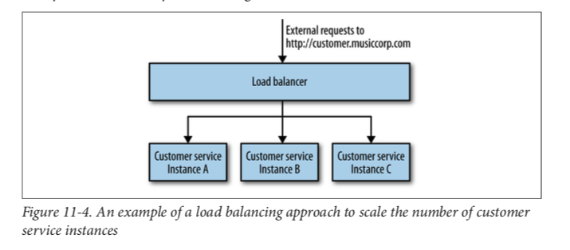

