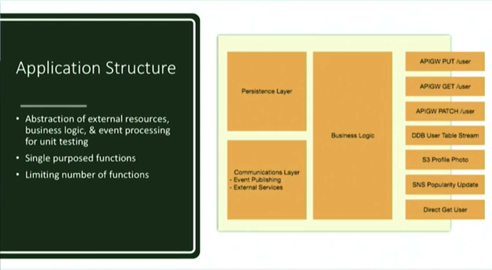

# Serverless Microservices at Fender Digital

[Source](https://acloud.guru/series/serverlessconf-sf-2018/view/fc2c6f62-a8c1-5365-8d9e-8a72df3fe023)

* Before going serverless, they had services running on EC2 instances such as CMS, Authentication, Product Catalog etc. 

* They think that using VLT for CRUD operations is a great way to do it. They are looking to expand them. [Read more](https://docs.aws.amazon.com/appsync/latest/devguide/resolver-mapping-template-reference-programming-guide.html)

## What is a Serverless Microservice?

* When they decided to develop new microservices, they stopped to do it in the old-fashioned way. They simply started to develp everything on Lambda.

> They view a serverless microservice as a collection of functions that operate on a given business domain that respond to synchronous and asynchronous events. 

* Synchronous event is when users are waiting for a response (request/response cycle) (frontend)

* Asynchronous event is when there is no user waiting on a response (backend)

* They took the approach to do the bear minimum possible in the synchronous events and let asynchronous events complete everything up. It makes the whole system eventually consistent. 

- An example: when they user creates a Fender Play subscription, API call comes up and the item is written to the DynamoDb table and the response comes back to the user and they can start their instructural path. The stream on that table then invokes the lambda function that sees we got the new subscription here and raises subscription change event on SNS that event is picked up by two separate Lamba functions: 1) that keeps our email service provider up to date, 2) that keeps our datawarehouse up to date. They are planning to add more consumers to this events as business needs require.

* With the shared business logic all the function are deployed as a unit.

## Application Structure

* The application structure is not much different as if you would run the service in the containers or EC2 instances. You have abstraction layers between your request handling and business logic in between your business logic and presistence layer. **The principal difference is in the unit of deployment!** Rather then deploying binary into EC2 instance or a container, you are deploying multiple Lambda functions. Each function should exist and have **one single purpose for existence**

* They found out limiting the number of functions works very well. If you end up with say 35-40 functions in a service. It might be time to revaluate how many functions your are using in that service. You may possibly break it up into multiple services. They take the approach of taking **one function per route/method** on their API. HTTP GET and POST will have two different functions. 

## Build & Deployments

* With the compiled language such as GO, the more functions you have the more time it will take to build and deploy. To counter this they have 1 service with 35 functions it end uup taking 20-25 minutes to build (which is not acceptable). They came up with a solution: concurrent distributed build process. 

## Event Driven Thinking & Service Coupling

* When looking at Lambda based service you really need to think in terms of events. Everything is an event and you need to react to events rather than calling other services for information. 

* The Hollywood principle: In terms of services that means don't call us we call you. A good example of this is just using SNS to broadcast changes to other services. 

* Step functions to decouple services when handling asynchronous events. You can use state machine to control flow by using step functions. 

## Security

* Encrypt env variables with KMS
* Least privilege access rights
* Scan your dependencies with [Snyk](https://www.npmjs.com/package/snyk)

## Event Loss & Stability

* Why happens if you have asynchronously controlled function that calls an external 3rd party and they are having an outtage. On an SNS triggered Lambda it will try 2 more times after that first failure, after that the event is dropped. What you need to do is to define a dead letter queue to collect those messages so you don't end up loosing data. You can monitor the queue to see if something goes wrong, or when everything is recovered you can replay that messages from the queue. 

* Concurrency control are also necessary the resources you are accessing. In a traditional service you have a database connection pool that is limited to 20 connections, so you can limit the amount of traffic that is hitting your database. With Lambda you have as many connections pools as container that are firing up to handle those requests. However you can apply concurrency controls to Lambda to go ahead and limit, so you can say you have only 20 or 30 concurrent executions of this given functions to protect those resources. You can also use [A module for managing MySQL connections at SERVERLESS scale](https://github.com/jeremydaly/serverless-mysql)

## Performance Optimization

* They use caching with API Gateway, they have 90% hit ratio for cache. Sometimes even a Lambda function has it's own local cache in the `/temp` directory. 

* Optimizition of price performance can take a little bit of time. There is an approach on Github [Step Functions state machine generator for AWS Lambda Power Tuning](https://github.com/alexcasalboni/aws-lambda-power-tuning). This is a step function which will invoke your Lambda function at different settings and give you report, so you can see what the performance was at different settings.

* Profiling is another way if you stop seeing gains.

## Logging

* When it comes to  logging you want to see the exact same things as you have done in the past. You should use good structured logging so you can search your logs to find relevant information. They use [Logrus](https://github.com/sirupsen/logrus) to create structured logs. There are couple of other alternatives for Node.js, Python etc.

* They do stadartized logging with a simple middleware. It sits between where the event comes in from AWS and their handler logic. It takes most of the data from the incoming event and add it to fields in the logger and creates an invocation scoped logger that is then dropped into the Go context.

* The logs from Lambda gets shipped to CloudWatch. A better practise to take all the CloudWatch and put them into the Kinesis stream, then you can have 1 or multiple consumers of that stream. They do 2 things with their logs: 1) ELK stack (takes everything API G, Lambda, Nginx logs etc.) 2) From the Lambda logs they sample it into Honeycomb.io (they just sample a lot of events, if this is 200 they send only every 10th, if there is an error, they don't sample away any errors, they send every error for analysis). E.g. in case of 400 API G request, they store the request body in the specific field so they can investigate at a later time what caused the problem.

* You can use [Datadog](https://www.datadoghq.com/pricing/) for Dashboarding of data from CloudWatch.

