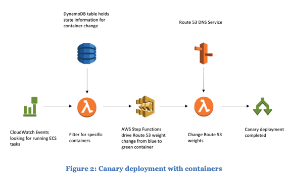

# Running Containerized Microservices on AWS

[Source](https://d1.awsstatic.com/whitepapers/DevOps/running-containerized-microservices-on-aws.pdf)

> “Everything fails all the time.” – Werner Vogels

* Codebase (one codebase tracked in revision control, many deploys) – Each microservice owns its own codebase in a separate repository and throughout the lifecycle of the code change.

* Build, release, run (strictly separate build and run stages) – Each microservice has its own deployment pipeline and deployment frequency.

* Processes (execute the app as one or more stateless processes) – Each microservice does one thing and does that one thing really well.

* Continuous Build and Delivery – The process of building code that’s been checked in and delivering it to production should be automated so that engineers can release code without manual intervention.

* Request/Response – One service explicitly invokes another service by making a request to either store data in it or retrieve data from it. For example, when a new user creates an account, the user service makes a request to the billing service to pass off the billing address from the user’s profile so that that billing service can store it.

* Publish/Subscribe – Event-based architecture where one service implicitly invokes another service that was watching for an event. For example, when a new user creates an account, the user service publishes this new user signup event and the email service that was watching for it is triggered to email the user asking them to verify their email.

* Use a message broker such as Kafka, or Amazon Simple Notification Service (Amazon SNS) and Amazon Simple Queue Service (Amazon SQS). Microservices architectures favor these tools because they enable a decentralized approach in which the endpoints that produce and consume messages are smart, but the pipe between the endpoints is dumb. In other words, concentrate the logic in the containers and refrain from leveraging (and coupling to) sophisticated buses and messaging services.

* One goal of microservices is to enable parallel work on different edges of the architecture that will not conflict with each other. Building dumb pipes enables each microservice to encapsulate its own logic for formatting its outgoing responses or supplementing its incoming requests.

* Port Binding – Services bind to a port to watch for incoming requests and send requests to the port of another service. The pipe in between is just a dumb network protocol such as HTTP.

* Concurrency – A properly designed communication pipeline between microservices allows multiple microservices to work concurrently. For example, several observer microservices may respond and begin work in parallel in response to a single event produced by another microservice.

* Dependencies – Decentralized governance allows teams to choose their own dependencies, so dependency isolation is critical to make this work properly.

* Containers solve these problems by allowing the deliverable for each individual team to be a common format: a Docker image that contains their component. The contents of the container can be any type of runtime written in any language. However, the build process will be uniform because all containers are built using the common Dockerfile format.

* A service-based approach mandates that each service get its own data storage and doesn’t share that data directly with anybody else.

* Continuous integration and continuous delivery are important for monoliths, but they are indispensable for microservices. Each service needs its own pipeline, one that can accommodate the various and diverse technology choices made by the team.

* Dev/prod parity – Keep development, staging, and production as similar as possible.

* A microservice should do one thing and do it well. This implies that when you build a full application, there will potentially be a large number of services. Each of these need their own integration and deployment pipeline.

* Disposability (maximize robustness with fast startup and graceful shutdown) – Produce lean container images and strive for processes that can start and stop in a matter of seconds.

* Containers offer an abstraction from operating system management. You can treat container instances as immutable servers. Containers will behave identically on a developer’s laptop or on a fleet of virtual machines in the cloud.

* One very useful container pattern for hardening an application’s resiliency is the circuit breaker. In this approach, an application container is proxied by a container in charge of monitoring connection attempts from the application container. If connections are successful, the circuit breaker container remains in closed status, letting communication happen. When connections start failing, the circuit breaker logic triggers. If a pre-defined threshold for failure/success ratio is breached, the container enters an open status that prevents more connections. This mechanism offers a predictable and clean breaking point, a departure from partially failing situations that can render recovery difficult. The application container can move on and switch to a backup service or enter a degraded state.

* Using deployment techniques such as a canary release,9 a new feature can be tested in an accelerated fashion against its target audience. This provides early feedback to the development team.

* As a result of the evolutionary design principle, a service team can build the minimum viable set of features needed to stand up the stack and roll it out to users. The development team doesn’t need to cover edge cases to roll out features. Instead, the team can focus on the needed pieces and evolve the design as customer feedback comes in. At a later stage, the team can decide to refactor after they feel confident that they have enough feedback.

* In the diagram that follows, a canary release can easily be implemented with containers using AWS primitives. As a container announces its health via a health check API, the canary directs more traffic to it. The state of the canary and the execution is maintained -using Amazon DynamoDB, Amazon Route 53, Amazon CloudWatch, Amazon Elastic Container Service (Amazon ECS), and AWS Step Functions. Figure 2: Canary deployment with containers Finally, usage monitoring mechanisms ensure that development teams can evolve the design as the usage patterns change with variables.

