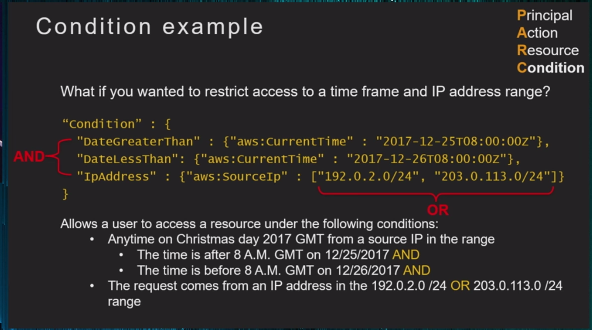
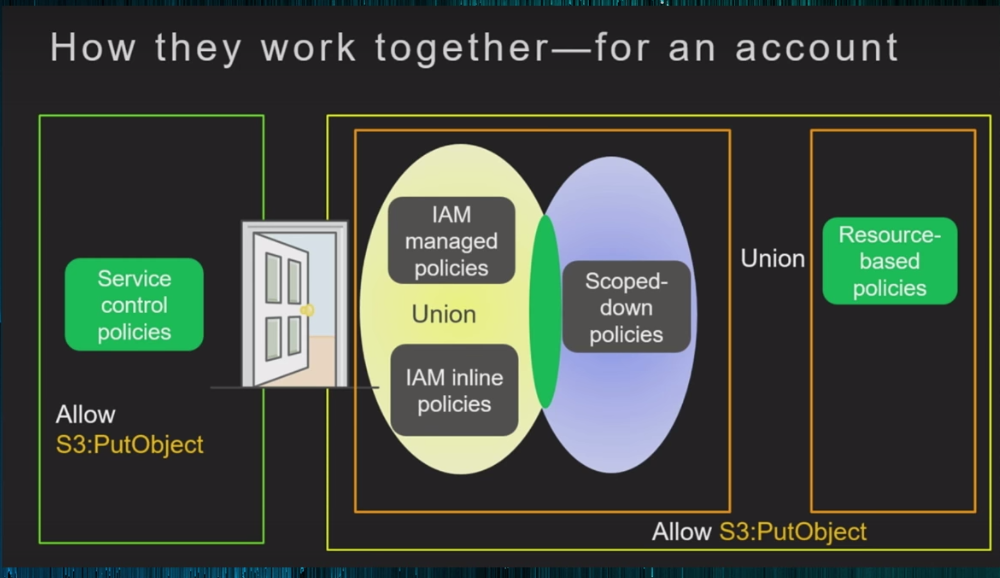
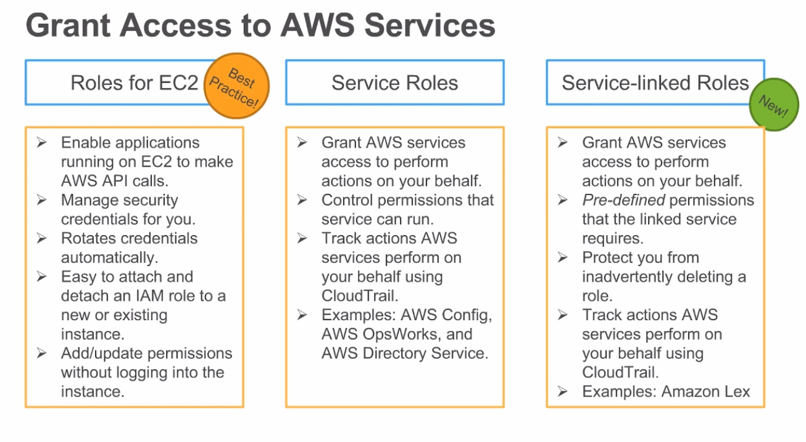
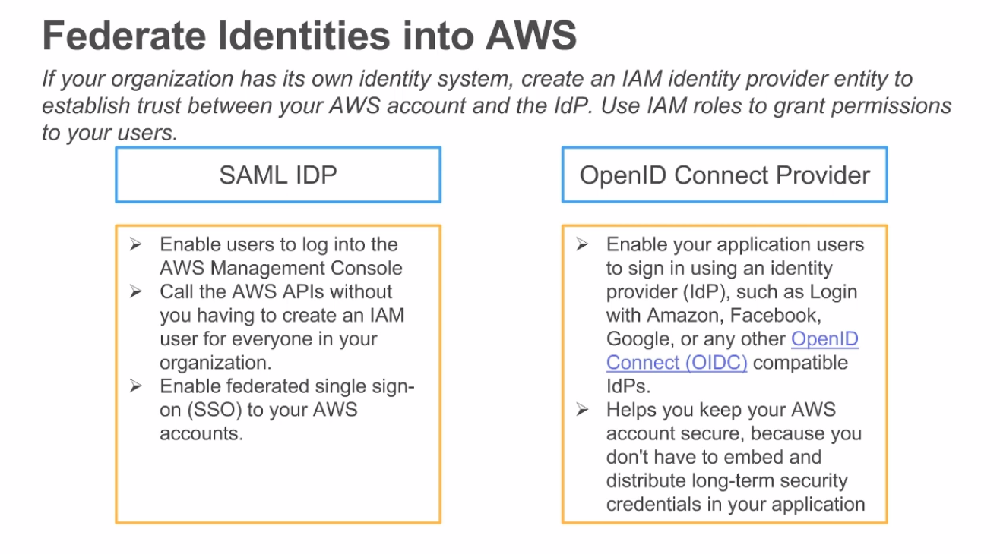
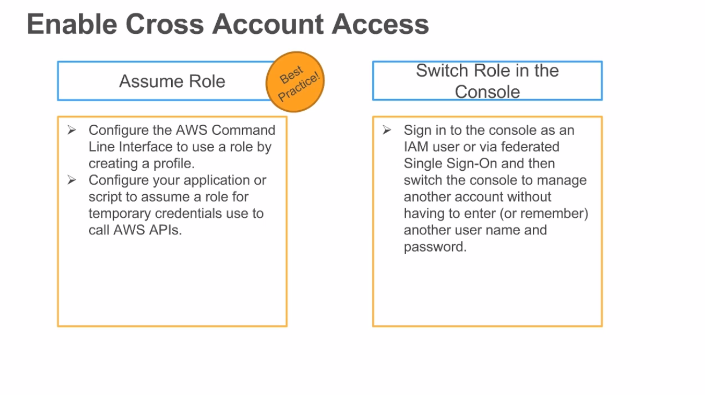
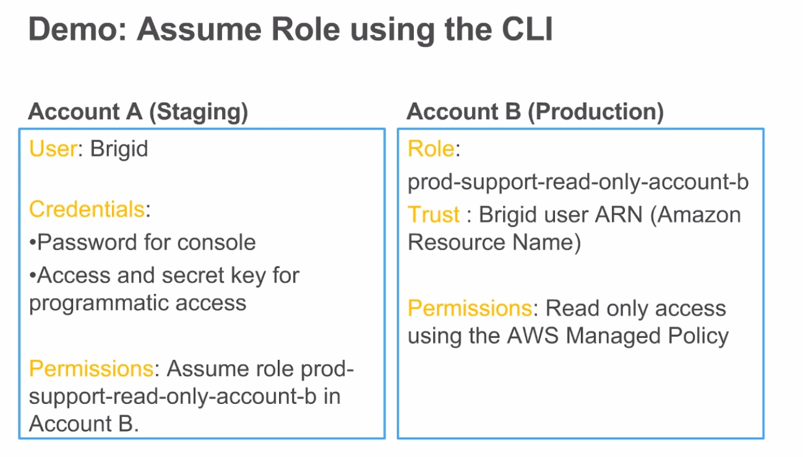
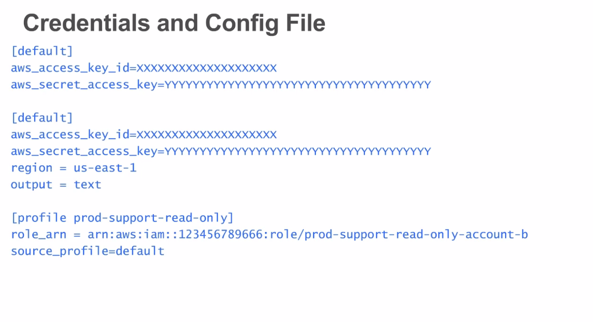

# IAM Identity Introduction

## AWS re:Invent 2017: IAM Policy Ninja (SID314)

[Source](https://www.youtube.com/watch?v=aISWoPf_XNE&t=624s)

Identity management, also known as identity and access management (IAM) is, in computer security, the security and business discipline that "enables the right individuals to access the right resources at the right times and for the right reasons". [Source](https://en.wikipedia.org/wiki/Identity_management)

### Limits Amazon EC2 instances types

* Goal: Limit a user from starting an instance unless the instance is t2.*
* Let's try to:
    + Crate a managed policy that attempts to limit starting an EC2 instance except fro these instance types
    + Attach that policy to an IAM user.

### How to start?

1. We always start with "deny". You just give an IAM user without any rights to do anything. 
2. Now you are going to create policies to create instances of a certain type. You log in into IAM and click on create policy:
    + Use the visual editor, choose the Service e.g. EC2
    + Next you go to actions and can allow the users to `list/read` he cannot do to much damage with this settings.
    + Next I want to allow him to launch instances, so you give the right `RunInstances`
    + Recourses that are checked by EC2 when you something whats to launch.
    + If you want only to allow to launch `t2.*` you need to add it under `Request Condition`.


**Note:** Now he is able to: see everything and launch t2.*

## The Policy Language
* Provides authorization
* Two parts:
    - Specification: Defining access policies (and attach them)
    - Enforcement: Evaluating policies (that's the job of amazon - every API call will give yes/no)

### Policy specification basics

* JSON-formatted document contains of 4 parts (PARC model)
    + Principal
    + Action
    + Resource
    + Condition
* Contain a statement (permissions) that specifies:
    + Which actions a principal can perform
    + Which resources can abe accessed

**Note:** A principal in computer security is an entity that can be authenticated by a computer system or network. It is referred to as a security principal in Java and Microsoft literature.

#### Principal: Examples
* An entity that is allowed or denied access to action, a resource and a condition that you have
* Indicated by an Amazon Recourse Name (ARN)
* With IAM policies, the principal element is implicit (i.e. the user, group, or role attached)

When you are working with an IAM policy the principal is implicit because you attach the policies to the user or role, you don't need to specify a principle when you are working with policies. 

You will use principals when you are working with policies that are attached to resources, the most common is a bucket policy e.g. I'm a this bucket and a person (principal) is allowed to write objects to it. 

**A policy for an anonymous user if you put this in your bucket policy, anyone can access your bucket.**

```json
<!-- Everyone (anonymous users) -->
"Principal":"AWS":"*.*"
``` 

You can specify an account, you trust any entity in this account, you give access to this resource

```json
<!-- Specific account or accounts>
"Principal": {"AWS":"arn:aws:iam:123456789012:root"}
"Principal":{"AWS":"123456789012}
``` 

And for an individual user

```json
<!-- Individual IAM user -->
"Principal":"AWS":"arn:aws:iam::123456789012:user/username"
``` 

And also for a federated user (using web identity federation) e.g. cognito

```json
<!-- Federated user (using web identity federation) -->
"Principal":{"Federated":"accounts.google.com"}
```

Or for a specific role. If you launch an instance you have a role.

```json
<!-- Specific role -->
"Principal":{"AWS":"arn:aws:iam::123456789012:/role/rolename}
``` 

When you launch an instance you have a role, EC2 assumes that role and this is the principal, so if you want to grant access an EC2 instance to a certain bucket.

```json
<!-- Specific service -->
"Principal":{"Service":"ec2.amazonaws.com"}
``` 

**Note:** An IAM role is similar to a user, in that it is an AWS identity with permission policies that determine what the identity can and cannot do in AWS. However, instead of being uniquely associated with one person, a role is intended to be assumable (annehmbar) by anyone who needs it. Also, a role does not have standard long-term credentials (password or access keys) associated with it. Instead, if a user assumes a role, temporary security credentials are created dynamically and provided to the user.

### Action: Examples

* Describes the type of access that should be allowed or denied
* You can find actions in the docs or use the policy editor to get a drop-down list
* Statements must include either an `Action` or `NotAction` (everything but) element

**Note:** Each service at amazon has many different actions, this is where visual editor comes in place.

```json
<!-- EC2 action -->
"Action":"ec2:StartIntances"
``` 

```json
<!-- IAM action -->
"Action":"iam:ChangePassword"
``` 

**Note:** Typically there is one-to-one mapping between the API call you are making and the action you are granting.

```json
<!-- Amazon S3 action -->
"Action":"s3:GetObject"
``` 

```json
<!-- Specify multiple values for the action element-->
"Action":"sqs:SendMessage"."sqs:REceiveMessage"
``` 

```json
<!-- Wildcards (* or ?) in the action name. Below covers create/delete/list/update -->
"Action":"iam:AccessKey*"
``` 

### Resources: Examples
* The object or objects being requested (run against)
* Statements must include either a `Resource` or a `NotResource`element

```json
<!-- S3 bucket -->
"Resource":"arn:aws:s3:::mycorporate_bucket/*"
``` 

```json
<!-- All s3 buckets, except this one -->
"NotResource":"arn:aws:s3:::security_logging_bucket/*"
``` 

```json

<!-- Amazon SQS Queue>
"Resource":"arn:aws:sqs:us-west-2:123456789012:queue1"

<!-- Multiple Amazon DynamoDb tables -->
"Resource":["arn:aws:dynamodb:us-west-2:123456789012:table/books_table", "arn:aws:dynamodb:us-west-2:123456789012:table/books_manager" ]

<!-- All EC2 instances for an account in a region -->
"Resource":"arn:aws:ec2:us-east-1:123456789012:instance/*"
``` 

### Condition example

What if you wanted to restrict access to a time frame and IP address range?

```json
"Condition": {
    "DateGraterThan": {"aws:CurrentTime": "207-12-25T08:00:00Z"},
    "DateLessThan": {"aws:CurrentTime": "2017-12-26T08:00:00Z"},
    "IpAddress": {"aws:SourceIp": ["192.0.2.0/24", "203.0.113.0/24"]}
}
```



**Note:** All of these conditions must be met for the statement to evaluate to TRUE


## Policy Enforcement

1. Decision starts at Deny (Casey with no policies) has zero permission in AWS.
    + AWs retrieves all policies associated with the user and resource (IAM, groups, resources, organization policies)
    + Only policies that match the action and conditions are evaluated (only if allow that matches we say yes)

2. Evaluate all applicable policies

3. Is there an explicit deny? (deny always trumps allow - deny will win)
    + If yes - no access
    + If there is an allow - grant access

4. If there is no explicit allow - deny no access


## 4 IAM types of policies

They all use the same policy language

1. AWS Organizations (allow to have multiple accounts and group these accounts into organizational units)
    + Service control policies (SCPs) - which services that account can use and actions
2. AWS Identity and Access Management
    + Inline policies (they stay with the user or role, they are part of that entity - you cannot go and attach this policy to another)
    + Managed policies (you can create a managed policy and attach it to users and groups and roles)
3. AWS Security Token Service (STS)
    + Scoped-down policies (temporary credential service, you can request temp credentials)
4. Specific AWS services
    + Resource-based policies (S3 bucket policies, SQS) it's a policy on a resource


### When to use each type of permission policy

* AWS Organizations - guardrails on the account to disable access to services. 
* AWS IAM - set granular permissions based on functions that users or applications need to perform
* AWS STS - reduce general shared permissions further
* AWS Specific services - cross-account access and to control access from the resource



---

# Best Practices for Using AWS Identity and Access Management (IAM) Roles

[Source](https://www.youtube.com/watch?v=DyHrppoArKQ)

## What are IAM Roles?
* IAM entities used to delegtate access to users, applications, and AWS services

* Intended to be assumed by trusted entities. Once assumed they have the persmissions attached to the IAM role

* IAM roles do not have credentials (password or access keys) associated with it. Credentials are associated dynamically. 

## Why use IAM Roles?
* Roles are a secure way to delegate access to users applications, and AWS sercies because they use **temporary credentials.**

* Roles have a many to one relationship, therefore you can enable many users and applications to assume the same role to grant the same set of permissions.

**Note:** Best Practice: Use templorary credentials when possible.

## Breakdown of IAM Role use cases
* Grant access to AWS services
* Federate identities into AWS
* Enable cross account access

### Grant Access to AWS Services


* **Service Role:** you can use this role to give AWS services to perform action on your behalf, with service role you control the permissions that services can run. You control the permissions you create them and can deletem them. 

* **Service-linked Roles:** The same as service roles but pre-defined permissions that the linked service requires. You cannot change the permission unless the service allows you to do that and you cannot delete this role unless there are not linked-resources to that role. It prevents you from deleting the role and impact the service. 

### Federate Identities into AWS

It's a way to delegate access to your AWS account!



### Enable Cross Account Access

* Assume role creates credetials dynamically and on the fly and they are temporary. It's the best practice even if you have an IAM user, even an IAM user would have the only permission to assume a role and they would be exchanging the long-term credentials of an IAM user with short-term credentials using the assumed role call.

* Amazon doesn't want to have your creds in your scripts, people having creds that have a lot of access on their computers. Even if we have IAM users configurated at the end of the day we want still use roles. 

* Also for programmatic access in our scripts just call assume role and it will work with temporary credentials

* Switch role: allows you to specify 5 roles that you want to switch between accounts, helpful for admins that administrating multiple accounts such as prod, staging, dev account. 



### How do you access an IAM role?

* Secure Token Service (STS)
    + A web service that enables you to request remporary limited-privilege credentails for AWS Identity and Access managemend users or for users that you authenticate (federated users).
    + Example APIs: AssumeRole, AssumeRoleWithSAML, AssumeRoleWithWebIdentity, GetSessionToken


## Best Practises for using IAM Roles
* Trust: Validate your trust policies to ensure only appropriate entities can assume the role
    + Every role has a trust policy (principles)

* Permissions: Set granular permissions on your IAM roles an use scope down policies to futher control access.

* Tracking and Monitoring: Track cross account access using AWS CloudTrail

### Trust Policy for AWS Service

* The most important part if you validate a policy you need to look at the principal. In this case it's `ec2` service, this means you don't need to know the account number, you don't need to know anything about `ec2` can assume this role and perform actions on your behalf, by the action we mean the action that the application is running. 

```json
{
    "Version": "2012-10-17",
    "Statement": [{
        "Sid": "",
        "Effect": "Allow",
        "Principal": {
            "Service":"ec2.amazonaws.com"
        },
        "Action": "sts:AssumeRole"
    }]
}
``` 

### Trust Policy for another account

* If you see `root` instead the `Brigid` it means that everyone can assume the role in that account and the best practise it to spell out the entities that would be allowed to assume the role

```json
{
    "Version": "2012-10-17",
    "Statement": [{
        "Effect": "Allow",
        "Principal": {
            "AWS":"arn:aws:iam::123456789012:/user/Brigid"
        },
        "Action": "stsAssumeRole"
    }]
}
``` 



### Assume Role Policy for Brigid

```json
{
    "Version": "2012-10-17",
    "Statement": [{
        "Sid": "Stmt1503507543000",
        "Effect": "Allow",
        "Action": [
            "sts:AssumeRole"
        ],
        "Resource": [
            "arn:aws:iam::12345678910:role/prod-support-read-only-account-b"
        ]
    }]
}
``` 

**Note:** The Sid (statement ID) is an optional identifier that you provide for the policy statement. You can assign a Sid value to each statement in a statement array. In services that let you specify an ID element, such as SQS and SNS, the Sid value is just a sub-ID of the policy document's ID. In IAM, the Sid value must be unique within a JSON policy.



* [default] these are long-term creds and by calling the [profile prod-support-read-only] I'll be changing the [default] for short-term credentials

## Permissions - Many to one relationship

* Separate your roles based on types of access. Examples: ReadOnly, ProductionSupport, Auditor, S3BucketAccessA, Billing

* Fact: IAM roles are intended that multiple users assume the role

* Best Practice: Logically separate your roles based on types of access required


