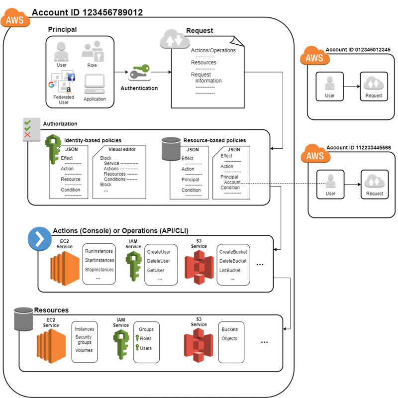
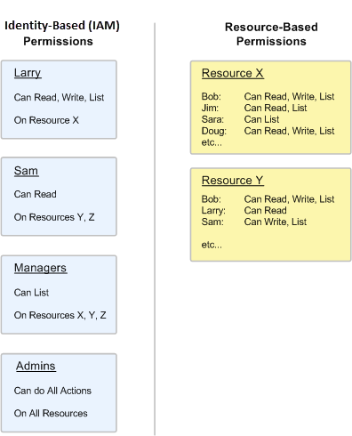

# Understanding How IAM Works

* Identity and access management (IAM) provides the infrastructure necessary to control authentication and authorization for your account.

* The identity and access management infrastructure includes following elements:

    + **Principal:** A principal is an entity (IAM User, IAM Role, Federated Identity, Application) that can take an action on an AWS resource.
    + **Request:** When a principal tries to use the AWS Management Console, the AWS API, or the AWS CLI, that principal sends a request to AWS. Request specifies following information:
        - Actions (or operations) that the principal wants to perform
        - Resources upon which the actions are performed
        - Principal information, including the environment from which the request was made
        **Note:** AWS gathers this information into a request context, which is used to evaluate and authorize the request.
    + **Authentication:** As principal you must be authenticated (singed into AWS) to send a request to AWS
    + **Authorization:** During authorization, IAM uses values from the request context to check for matching policies and determine whether to allow or to deny request. Policies are stored in IAM as JSON documents and specify the permission that are allowed or denied for principals (identity-based policies) or resources (resource-based policies)
    + **Actions:** Actions are defined by a service, and are things that you can do to a resource, such as viewing, creating, editing, and deleting the resource
    + **Resources:** After AWS approves the actions in your request, those actions can be performed on the related resources within your account.

## Identity-Based Policies and Resource-Based Policies

When you create a policy to restrict access to a resource, you can choose an identity-based policy or a resource-based policy

* Identity-based IAM policies are attached to an IAM user, role or group. These policies let you specify what that user, group or role can do. For example, you can attach policy to the IAM user named Bob, stating that he has permissions to use the Amazon Elastic Compute Cloud (EC2) RunInstances action. Identity-based permissions can be managed or inline:
    + Managed: An AWS managed policy is a standalone policy that is created and managed by AWS. Standalone policy means that the policy has its own Amazon Resource Name (ARN - Amazon Resource Names (ARNs) uniquely identify AWS resources) that includes the policy.
    + Inline: Inline policy is embedded in a principal entity (a user, group or role), that is the policy is an inherent part of the principal entity. You can create a policy and embed it in a principal entity, either when you create the principal entity or later. [Source](https://docs.aws.amazon.com/IAM/latest/UserGuide/access_policies_managed-vs-inline.html)

* Resource-based policies are attached to a resource. For example you can attach resource-based polies to Amazon S3 buckets, Amazon SQS queues etc. The whole list that support resource-based policies you can see [here](https://docs.aws.amazon.com/IAM/latest/UserGuide/reference_aws-services-that-work-with-iam.html). With resource-based policy you can specify who has access to the resource and what actions they can perform on it. Resource-based policies are inline only not managed.

The following figure illustrates both types of policies. The first lines shows policies attached to identities (two users and two groups). The second column shows policies attached to resources.

* **Policy:** A policy is an entity in AWS that, when attached to an identity or resource, defines their permissions. AWS evaluates these policies when a principal, such as a user, makes a request. Permissions in the policies determine whenever the request is allowed or denied. Policies are stored in AWS as JSON documents that are attached to principals as identity-based policies or to resources as resource-based policies. 

**Note:** For some AWS services, you can grant cross-account access to your resource. To do this, you attach a policy directly to the resource that you want to share, instead of using a role as a proxy. The resource that you want to share must support resource-based policies [you can find the list here](https://docs.aws.amazon.com/IAM/latest/UserGuide/reference_aws-services-that-work-with-iam.html). Cross-account access with a resource-based policy has an advantage over a role. With a resource that is accessed through a resource-based policy, the user still works in the trusted account and doesn't have to give up his permissions in place of the role permissions. **The disadvantage is that not all services support resource-based policies.**

# Access Management

[Source](https://docs.aws.amazon.com/IAM/latest/UserGuide/access.html)

* IAM: identity and access management

* When a principal makes a request in AWS, the IAM service checks whether the principal is authenticated (sign-in) and authorized (has permissions)

* Principal: A principal is an entity that can take an action on an AWS resource. Your administrative IAM user is your first principal. Over time, you can allow users and services to assume a role. You can support federated users or programmatic access to allow an application to access your AWS account. Users, roles, federated users, and applications are all AWS principals.

