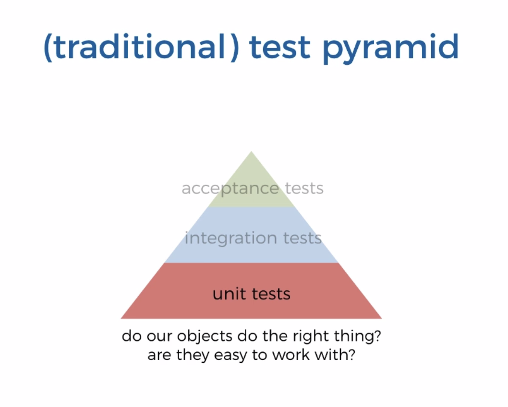
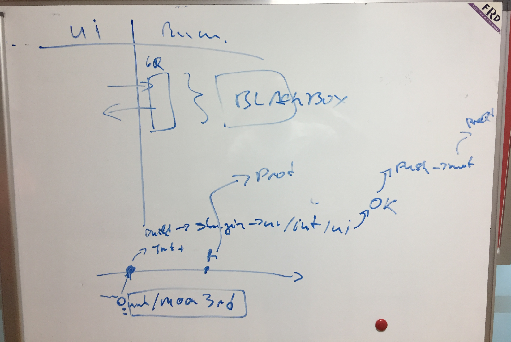
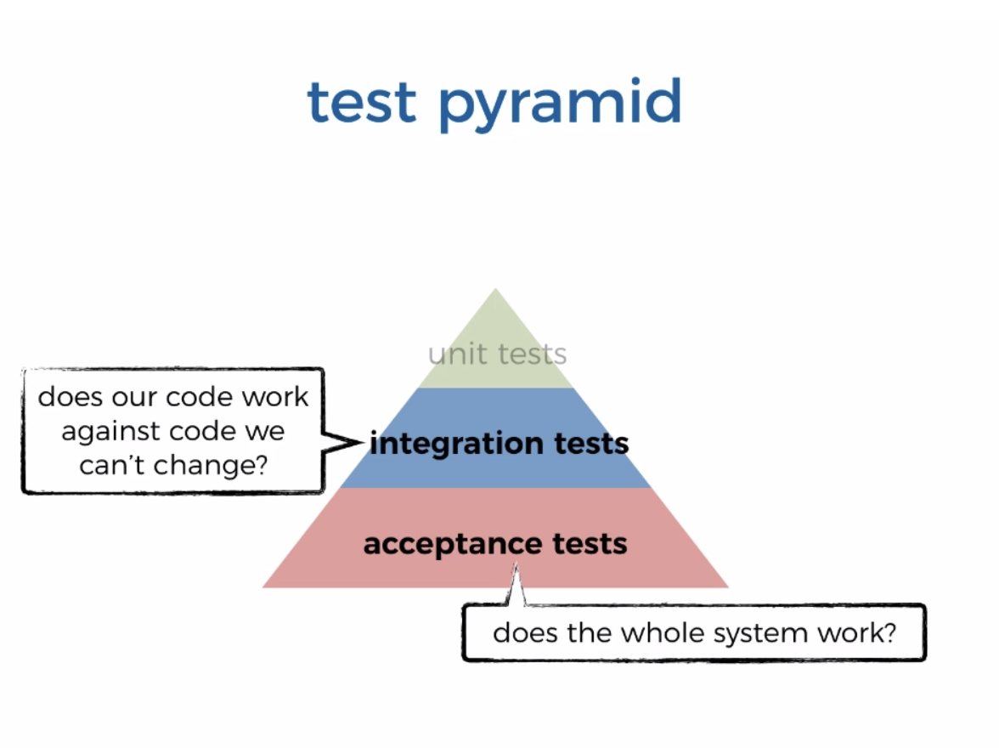
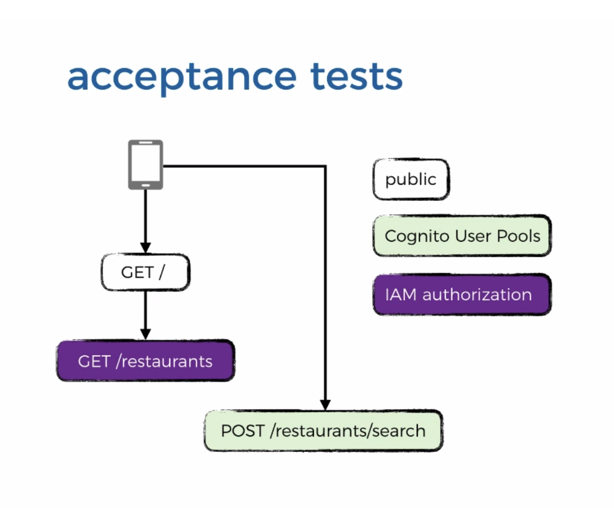

# Lambda & Co. Testing - Serverless 

[Source - Yan Chui](https://livevideo.manning.com/module/38_3_1/production-ready-serverless/testing/aws-lambda-requires-a-different-approach-to-testing)

## Why do we write code?
We are doing it to deliver working software that deliver some value to our users. And tests are an important part of the process that maximises the likelyhood that our software works and continuous to work even when we evolve it over time.

## What is our goal?
To continiously deliver working software even as the software evolves

**Note:** The test pyramid is a way of thinking about different kinds of automated tests should be used to create a balanced portfolio. Its essential point is that you should have many more low-level UnitTests than high level BroadStackTests running through a GUI. [Source](https://martinfowler.com/bliki/TestPyramid.html)

* **Unit tests:** UNIT TESTING is a level of software testing where individual units/ components of a software are tested. The purpose is to validate that each unit of the software performs as designed. A unit is the smallest testable part of any software. It usually has one or a few inputs and usually a single output.

* **Integration tests:** Integration testing (sometimes called integration and testing, abbreviated I&T) is the phase in software testing in which individual software modules are combined and tested as a group. It occurs after unit testing and before validation testing.

**Note:** The purpose of the integration tests is to exercise the integration point with other systems. So when you are running those integration tests the functions should be configured to talk to the real downstream systems that is the real DynamoDb tables not mocks or stubs or even simulated environments like DynamoDB local.

* **Acceptance Tests:** Where your functions are deployed to AWS environment and your test the system end-to-end. To make sure that everything is working as you expect for this end-to-end tests you need to exercise a system from the **outside** through user interfaces. It means exercising a system through HTTP requests to API Gateway to get feedback loops.

### Serverless Test Pyramide

1. Observation #1: you use more managed services (DynamoDb, Kinesis, Cognito, Cloudsearch) when working with Lambda 
2. Observation #2: most Lambda functions are very simple and have a single purpose (single responsibility principle)

**Conclusion #1:** The **RISK** of shipping broken software has largely shifted to how your Lambda functions integrate with external services

3. Observation #3: smaller units of deployment means finer grained control of access, and more things to secure (permissions needs to be set per function level)
4. Observation #4: smaller units of deployment also means more application configuration in general

**Conclusion #2:** The **RISK** of misconfiguration (both application & IAM) has exploded (which results that the software is not working as in production). We are dealing with a very different risk profile for serverless application.

Therefore the focus should be shifted to end-to-end testing instead of unit testing

**Important:** The difference between Intergration Test and Acceptance Tests is how our code is invoked. Integration tests differ from acceptance tests only in HOW the Lambda functions are invoked. By our test runner mocha or by API Gateway. So we can use the same test cases we have created during the integration tests and call it by the API endpoint in the `when` step instead. 

