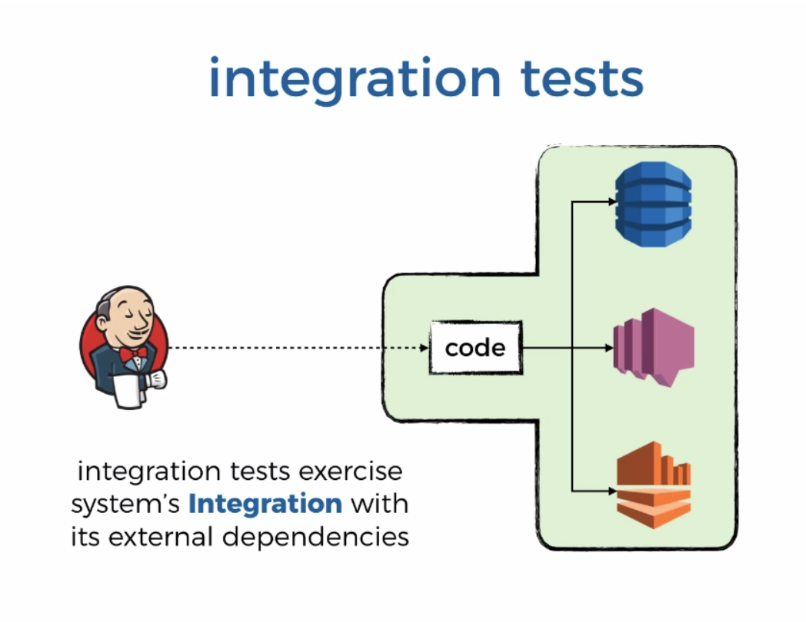

# Integration Tests

[Source](https://livevideo.manning.com/module/38_3_2/production-ready-serverless/testing/writing-integration-tests?)

* Integration tests exercise our code agains intended downstream systems so we can test multiple components in one go.

> Integration tests exercise system's **Integration** with its external dependencies.



* **Important**: The purpose of this test is to test the integration points with other systems, so when we are running these integration tests, the function should be configured to talk to **the real thing**. 

* When we are testing functions that should do something with DynamoDB tables, than during the integration tests they should scan **the real** DynamoDB table. **Not mock or stub or even DynamoDB local**

```js
'use strict';

const co = require('co');
const expect = require('chai').expect;
const init = require('../steps/init').init;
const when = require('../steps/when');
const cheerio = require('cheerio');

describe(`When we invoke the GET / endpoint`, co.wrap(function* () {
  before(co.wrap(function* () {
    yield init();
  }));

  it(`Should return the index page with 8 restaurants`, co.wrap(function* () {
    let res = yield when.we_invoke_get_index();

    expect(res.statusCode).to.equal(200);
    expect(res.headers['Content-Type']).to.equal('text/html; charset=UTF-8');
    expect(res.body).to.not.be.null;

    const $ = cheerio.load(res.body);
    let restaurants = $('.restaurant', '#restaurantsUl');  
    expect(restaurants.length).to.equal(8);

  }));
}));
```
* You can run your tests with environemnt variables. You can create the init file for the tests that looks like:

* init.js - the init.js function is called before the scripts are run
```js
process.env.restaurants_api = 'http://3303495sdkfsdsdfsdf.execute-api.us-east-1.amazonaws.com/dev/restaurants'
process.env.restaurants_table = 'restaurants'
process.env.AWS_REGION = 'us-east-1'
process.env.cognito_client_id = 'test_cognito_client_id'
process.env.cognito_user_pool_id = 'tst_cognito_user_pool_id'
```
